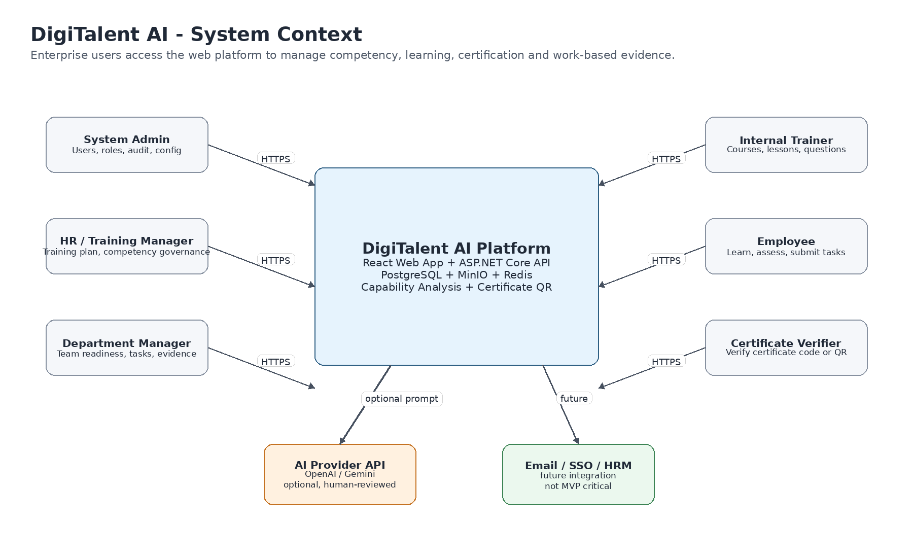
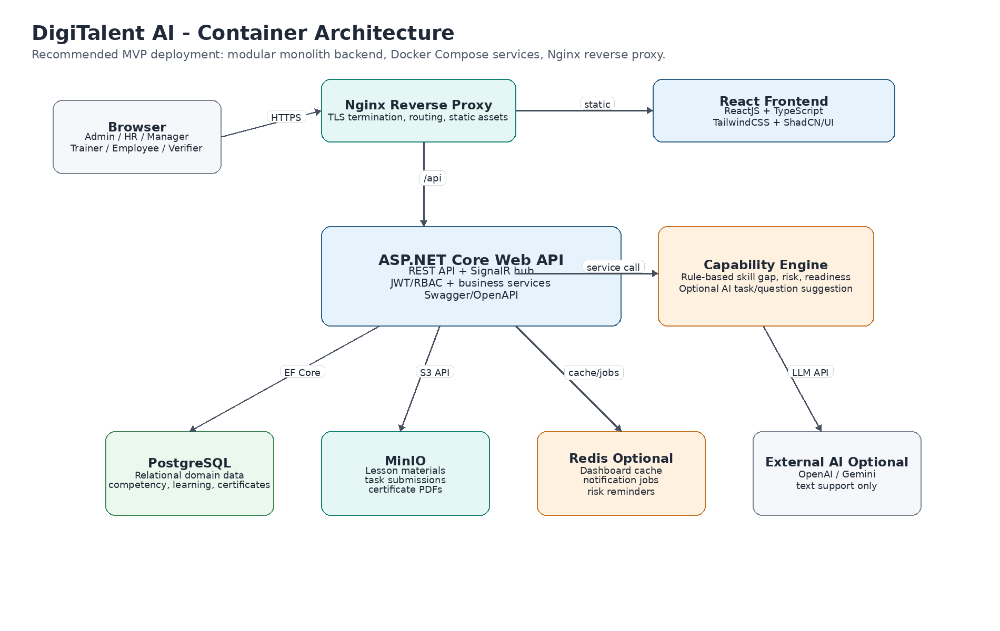
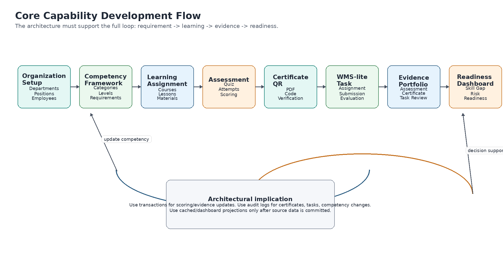
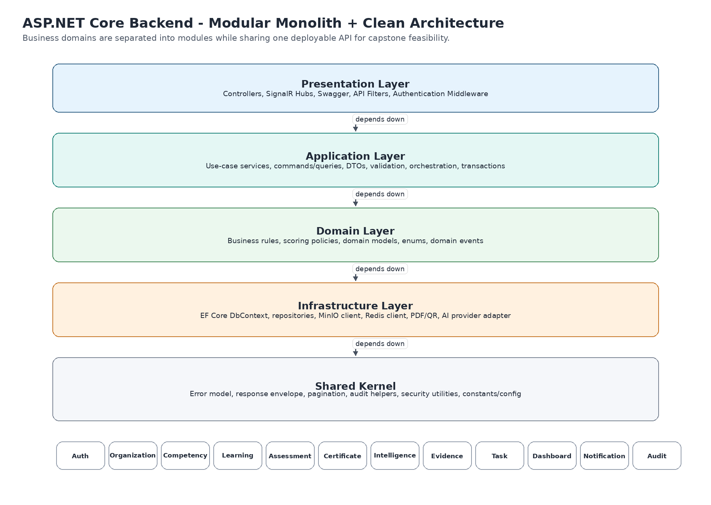
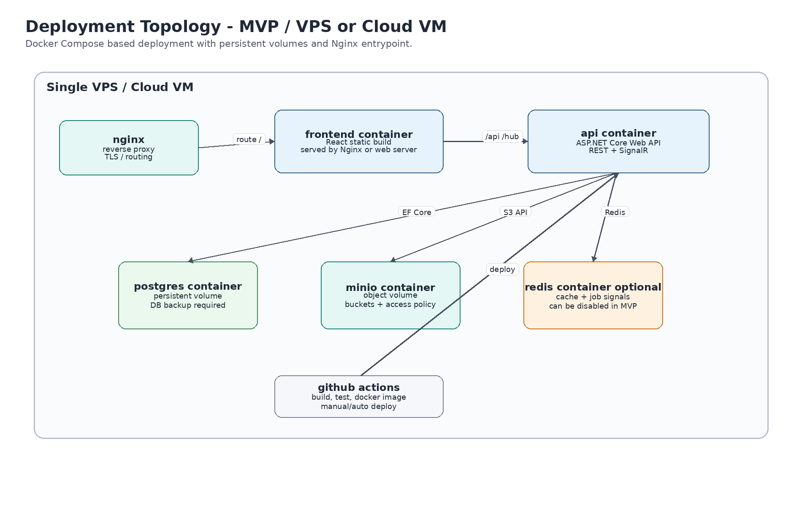

**  
  
DigiTalent AI  
System Architecture Document  
**Web-based Digital Competency Training, Internal Certification and Work-Based Assessment Platform  

|     |     |
| --- | --- |
| **Document Item** | **Value** |
| Document Code | 06\_System\_Architecture\_Document\_DigiTalent\_AI |
| Project | DigiTalent AI |
| Architecture Style | Modular Monolith, Clean Architecture at practical MVP level, RESTful API, event-ready notifications |
| Frontend Stack | ReactJS, TypeScript, TailwindCSS, ShadCN/UI |
| Backend Stack | ASP.NET Core / C# |
| Database | PostgreSQL |
| File Storage | MinIO or S3-compatible object storage |
| Optional Infrastructure | Redis for cache/background jobs; SignalR for real-time notifications |
| Deployment Stack | Docker, Docker Compose, Nginx, GitHub Actions |
| Version | 1.0 |
| Prepared For | Capstone Project implementation and technical alignment before coding |

# Table of Contents

1.  1\. Purpose and Architecture Scope
2.  2\. Source Baseline and Design Drivers
3.  3\. Architecture Principles
4.  4\. Architecture Decision Summary
5.  5\. C4 Level 1 - System Context Architecture
6.  6\. C4 Level 2 - Container Architecture
7.  7\. Logical Application Architecture
8.  8\. Backend Architecture - ASP.NET Core Modular Monolith
9.  9\. Frontend Architecture - React Enterprise Web App
10.  10\. Data Architecture
11.  11\. File Storage Architecture with MinIO
12.  12\. Security Architecture
13.  13\. API Architecture and Contracts
14.  14\. Real-time Notification Architecture with SignalR
15.  15\. Capability Intelligence and AI Integration Architecture
16.  16\. Certificate PDF and QR Verification Architecture
17.  17\. WMS-lite Task and Evidence Architecture
18.  18\. Dashboard and Reporting Architecture
19.  19\. Deployment Architecture
20.  20\. CI/CD Architecture
21.  21\. Observability, Logging and Audit Architecture
22.  22\. Performance and Scalability Design
23.  23\. Backup, Recovery and Operational Design
24.  24\. Environment and Configuration Strategy
25.  25\. Implementation Roadmap
26.  26\. Architecture Risks and Mitigation
27.  27\. Architecture Checklist Before Coding
28.  28\. Appendix A - Proposed Repository Structure
29.  29\. Appendix B - Mermaid Diagram Sources
30.  30\. Appendix C - Architecture Decision Records

# 1\. Purpose and Architecture Scope

This System Architecture Document defines the target architecture for DigiTalent AI before implementation. It translates the approved business scope into a practical technical blueprint that the team can use to design code structure, APIs, database boundaries, deployment, security controls and development responsibilities.

The document is intentionally implementation-oriented. It does not only describe technologies; it explains how the selected technologies should be organized so the capstone team can build a maintainable, demo-ready and extensible enterprise-style web application.

## 1.1 Architecture Scope

*   Define the system context, main actors, external dependencies and technical boundaries.
*   Define the recommended deployment style for the MVP using Docker Compose and Nginx.
*   Define backend modular boundaries for ASP.NET Core and the rule for keeping business logic out of controllers.
*   Define frontend structure for a role-based React application using TypeScript, TailwindCSS and ShadCN/UI.
*   Define database, file storage, authentication, authorization, notification, scoring and certificate verification architecture.
*   Define architecture decisions, constraints, risks and implementation checklist before coding starts.

## 1.2 Out of Architecture Scope

*   This document does not replace the ERD or API specification documents; it provides architecture boundaries for them.
*   This document does not commit the team to a full microservices architecture. Microservices are explicitly excluded from MVP to keep implementation feasible.
*   This document does not require custom machine learning models. Core scoring is rule-based and explainable; LLM APIs are optional support services.
*   This document does not include full production cloud hardening such as Kubernetes, service mesh, distributed tracing or enterprise SSO. These are future extensions.

# 2\. Source Baseline and Design Drivers

The architecture is based on the approved Revised Scope of DigiTalent AI and the team-confirmed technology stack. The system must support internal digital competency management, learning and assessment, certificate verification, capability analysis, WMS-lite practical task evidence and role-based dashboards.

## 2.1 Approved Technology Stack

|     |     |     |
| --- | --- | --- |
| **Layer** | **Approved Technology** | **Architecture Implication** |
| Frontend | ReactJS, TypeScript, TailwindCSS, ShadCN/UI | Use a feature-based SPA with reusable UI components, route guards and role-specific dashboards. |
| Backend | ASP.NET Core / C# | Use a modular monolith Web API with clear application services, DTOs, validation and authorization policies. |
| Database | PostgreSQL | Use relational schema, foreign keys, indexes and transactional integrity for training, assessment, certificate and evidence data. |
| File Storage | MinIO or S3-compatible object storage | Store lesson materials, task submissions and generated certificate PDFs outside the relational database. |
| Cache / Jobs | Redis optional | Use Redis for dashboard cache, notification/risk reminders and later background processing when needed. |
| Real-time | SignalR | Use SignalR for in-app notifications, task updates, deadline reminders and training risk alerts. |
| Deployment | Docker, Docker Compose, Nginx | Deploy services consistently on local, demo server or VPS without manual environment drift. |
| CI/CD | GitHub Actions | Automate build, test and deployment checks to protect main/develop branches. |

## 2.2 Main Architecture Drivers

*   Capstone feasibility: the team has 5 members, so the architecture must be structured but not over-engineered.
*   Enterprise-style maintainability: code must be organized by domain modules and clean boundaries, not by random technical files only.
*   Role-based security: different actors see different data and actions; Department Manager data access must be department-scoped.
*   Traceability: certificates, task evaluations, competency updates and scoring outputs must be auditable.
*   Explainability: skill gap, risk and readiness scores must be explainable using stored input snapshots or formula components.
*   Demo value: the architecture must support a complete end-to-end demo from position requirement to learning, assessment, certificate, task evidence and dashboard readiness.

# 3\. Architecture Principles

|     |     |     |
| --- | --- | --- |
| **Principle** | **Meaning** | **Practical Rule** |
| Modular Monolith First | Use one deployable backend but separate business domains internally. | Create modules such as Auth, Organization, Competency, Learning, Assessment, Certificate, Intelligence, Task, Evidence and Dashboard. |
| Clean Architecture Pragmatism | Apply clean separation without making the project unnecessarily complex. | Controllers call application services; business rules stay in services/domain policies; infrastructure is injected behind interfaces where useful. |
| API Contract First | Frontend and backend should agree on DTOs before coding features. | Define request/response shape, error format, pagination and permissions for each endpoint. |
| Security by Design | Security is part of design, not an afterthought. | Use JWT, refresh token, RBAC policies, data scope checks, file validation and audit logs. |
| Data Integrity over UI Convenience | Critical business updates must be controlled by backend transactions. | Assessment scoring, certificate issuing, task evaluation and readiness recalculation happen in backend services. |
| Explainable Scoring | Important scores must be understandable and reproducible. | Store formula inputs, weights, output score, reason summary and related evidence. |
| Human-in-the-loop AI | AI supports but does not make official decisions. | AI-generated questions, task suggestions and explanations require trainer/manager/HR review before official use. |
| Configuration over Hard-code | Thresholds and weights may change. | Store risk thresholds, readiness weights, certificate expiry rules and pass scores in system settings. |
| Cloud-ready, not cloud-dependent | MVP should run locally and on VPS/cloud VM. | Use Docker Compose, environment variables and S3-compatible MinIO. |

# 4\. Architecture Decision Summary

|     |     |     |     |
| --- | --- | --- | --- |
| **Decision ID** | **Decision** | **Reason** | **Consequence** |
| ADR-01 | Use Modular Monolith instead of Microservices | The scope is large but team size and capstone timeline require simplicity. | Clear internal modules now; can split services later if needed. |
| ADR-02 | Use ASP.NET Core Web API as the main backend | Chosen stack fits enterprise API, RBAC, EF Core and Docker deployment. | Backend code should be organized with controllers, services, DTOs, validators and infrastructure. |
| ADR-03 | Use PostgreSQL as primary database | Relational integrity is important for employees, positions, competencies, courses, assessments and certificates. | Dashboard queries need indexes and optimized aggregation. |
| ADR-04 | Use MinIO/S3-compatible storage for files | Files should not be stored as binary blobs in PostgreSQL. | Database stores metadata and object keys; object storage stores actual files. |
| ADR-05 | Use rule-based core scoring | MVP cannot depend on unstable black-box AI decisions. | Skill gap, risk and readiness formulas are deterministic and auditable. |
| ADR-06 | Use SignalR for in-app notifications | System benefits from real-time task, training and certificate alerts. | Can start with database notifications and add SignalR push when stable. |
| ADR-07 | Use Docker Compose for MVP deployment | Consistent setup for frontend, backend, database, MinIO, Redis and Nginx. | Good for demo and VPS deployment; Kubernetes is future scope. |

# 5\. C4 Level 1 - System Context Architecture

At system context level, DigiTalent AI is a web platform used by enterprise roles. The architecture must isolate internal sensitive data while still allowing limited certificate verification through a public or semi-public certificate verification endpoint.

_Figure 1. System context architecture for DigiTalent AI_

## 5.1 Actors and Interaction Boundaries

|     |     |     |
| --- | --- | --- |
| **Actor** | **Primary Interactions** | **Security Boundary** |
| System Admin | Manage users, roles, permissions, master data, system settings and audit logs. | Full administrative permissions, but actions must still be audited. |
| HR / Training Manager | Manage organization training, assign courses, monitor certificates and capability dashboards. | Company-wide training and competency view. Cannot bypass system audit rules. |
| Department Manager | View team progress, assign/evaluate practical tasks and monitor readiness. | Department-scoped data access only. Cannot view unrelated employees. |
| Internal Trainer | Create courses, lessons, questions, assessments and review AI-generated drafts. | Content management scope. Cannot manage employee salary or unrelated HR data. |
| Employee | Study assigned courses, take assessments, view certificates, submit tasks and read feedback. | Own-data scope. Cannot modify scores, certificates or competency levels directly. |
| Certificate Verifier | Check certificate validity using code or QR URL. | Limited verification response only; no access to internal profile or score details. |

# 6\. C4 Level 2 - Container Architecture

The MVP should be deployed as a small set of containers. The frontend is a React single-page application, the backend is an ASP.NET Core Web API, PostgreSQL stores relational data, MinIO stores files, Redis is optional for cache/jobs and Nginx is the public entrypoint.

_Figure 2. Container architecture for MVP deployment_

## 6.1 Container Responsibilities

|     |     |     |
| --- | --- | --- |
| **Container** | **Responsibility** | **Notes** |
| Browser | Runs the React SPA and calls backend APIs over HTTPS. | No business-critical scoring or permission logic should live only in the browser. |
| Nginx | Reverse proxy, TLS termination, static file routing, API routing and request size limits. | Can serve React static assets or route to frontend container. |
| React Frontend | Role-based screens, forms, tables, dashboards, learning portal and user interactions. | Uses route guards and API authorization handling. |
| ASP.NET Core API | Business workflows, RBAC, scoring, certificate issuing, task evaluation, dashboard aggregation and SignalR hub. | Central business logic layer. |
| PostgreSQL | Primary relational data store. | Use EF Core migrations and indexing strategy. |
| MinIO | Object storage for lesson materials, submissions and certificate PDFs. | Access through backend-generated signed URLs or controlled download endpoints. |
| Redis Optional | Dashboard cache, notification jobs, reminder signals and rate-limit support. | Can be disabled in early MVP. |
| External AI Provider Optional | Supports task ideas, question drafts and explanation text. | Never used as the source of official scoring decisions. |

# 7\. Logical Application Architecture

The logical architecture follows a domain-oriented modular monolith. It should not be a single large folder of controllers. Each domain module owns its controllers, services, DTOs, validators and related data access rules where practical.

_Figure 3. Core business flow that the architecture must support_

## 7.1 Logical Layers

|     |     |     |
| --- | --- | --- |
| **Layer** | **Responsibility** | **Examples** |
| Presentation Layer | Expose HTTP endpoints and real-time hubs. Validate authentication and basic request shape. | AuthController, CourseController, CertificateController, NotificationHub. |
| Application Layer | Coordinate use cases, transactions and cross-module operations. | IssueCertificateService, EvaluateTaskService, CalculateReadinessService. |
| Domain / Business Layer | Contain business rules, formulas, policies and validation that should not depend on UI. | RiskFormulaPolicy, CertificateEligibilityPolicy, CompetencyUpdatePolicy. |
| Infrastructure Layer | Integrate with database, MinIO, Redis, PDF/QR generator and AI provider. | AppDbContext, MinioFileStorageService, PdfCertificateService, GeminiAdapter. |
| Shared Kernel | Reusable technical utilities and cross-cutting contracts. | ApiResponse, ErrorCodes, Pagination, AuditContext, CurrentUserAccessor. |

# 8\. Backend Architecture - ASP.NET Core Modular Monolith

_Figure 4. Backend layers and domain modules_

## 8.1 Backend Module Map

|     |     |     |
| --- | --- | --- |
| **Module** | **Main Responsibility** | **Main Data Ownership** |
| Auth | Login, logout, refresh token, password management, current user session. | users, refresh\_tokens, login\_audit\_logs |
| User & RBAC | Users, roles, permissions and policy mapping. | users, roles, permissions, user\_roles, role\_permissions |
| Organization | Departments, job positions, employees and manager assignments. | departments, job\_positions, employees |
| Competency | Competency categories, competencies, levels, position requirements and employee competency profile. | competency\_categories, competencies, competency\_levels, position\_competency\_requirements, employee\_competency\_profiles |
| Learning | Courses, modules, lessons, materials, enrollments and learning progress. | courses, course\_modules, lessons, learning\_materials, enrollments, lesson\_progress |
| Assessment | Question bank, assessments, attempts, scoring and answer history. | questions, question\_options, assessments, assessment\_attempts, assessment\_answers |
| Certificate | Certificate template, issuing, PDF generation, QR verification and status management. | certificate\_templates, certificates, certificate\_verification\_logs |
| Intelligence | Skill gap, learning recommendation, risk score, readiness score and AI explanation logs. | skill\_gap\_results, learning\_recommendations, training\_risk\_scores, readiness\_scores, ai\_explanation\_logs |
| Task / WMS-lite | Practical task creation, assignment, submission, evaluation and feedback. | practical\_tasks, task\_assignments, task\_submissions, task\_evaluations |
| Evidence | Competency evidence portfolio from assessments, certificates, tasks and manual reviews. | competency\_evidences |
| Dashboard | Read models and aggregation queries for HR, manager, trainer and employee dashboards. | No single table required; uses optimized queries and optional cached projections. |
| Notification | In-app notifications, reminders, deadline alerts and SignalR push. | notifications, notification\_reads |
| Audit | Audit trail for security-sensitive and business-critical actions. | audit\_logs |

## 8.2 Backend Dependency Rules

1.  Controllers must not contain business rules. They validate route access, call application services and return standardized responses.
2.  Application services orchestrate use cases and should be the main place for transaction boundaries.
3.  Domain policies and formula services implement reusable business rules such as certificate eligibility, skill gap and readiness calculation.
4.  Infrastructure services implement database, MinIO, Redis, PDF/QR and AI provider communication.
5.  Modules may communicate through application services or domain events; avoid direct database manipulation across unrelated modules unless necessary for transactional use cases.
6.  Critical updates such as assessment submission, certificate issuing, task evaluation and competency update must be wrapped in database transactions.
7.  Every module must use the same response format, error format, current user context and audit helper.

## 8.3 Recommended ASP.NET Core Project Structure

src/  
DigiTalent.Api/  
Controllers/  
Hubs/  
Middlewares/  
Filters/  
Program.cs  
DigiTalent.Application/  
Auth/  
Organization/  
Competency/  
Learning/  
Assessment/  
Certificate/  
Intelligence/  
Task/  
Evidence/  
Dashboard/  
Notification/  
Common/  
DigiTalent.Domain/  
Entities/  
Enums/  
Policies/  
Events/  
ValueObjects/  
DigiTalent.Infrastructure/  
Persistence/  
AppDbContext.cs  
Configurations/  
Migrations/  
FileStorage/  
Cache/  
PdfQr/  
AiProviders/  
EmailFuture/  
DigiTalent.Shared/  
ApiResponse/  
Errors/  
Pagination/  
Security/  
Constants/  
tests/  
DigiTalent.UnitTests/  
DigiTalent.IntegrationTests/

## 8.4 Transaction Boundaries

|     |     |     |
| --- | --- | --- |
| **Use Case** | **Transaction Boundary** | **Reason** |
| Submit Assessment Attempt | Save attempt, answers, score, completion status and possible progress update in one transaction. | Avoid score being saved without related answers or progress. |
| Issue Certificate | Check eligibility, create certificate record, generate code/QR metadata, save PDF metadata and audit log. | Avoid invalid or duplicate certificates. |
| Evaluate Practical Task | Save evaluation, update task status, create competency evidence and trigger readiness recalculation. | Task evaluation affects multiple business records. |
| Update Position Requirement | Save requirement changes and optionally invalidate related cached skill-gap/readiness results. | Skill-gap outputs may become stale after requirement change. |
| Recalculate Readiness | Store new score with input snapshot and explanation after source data is committed. | Score must be reproducible and auditable. |

# 9\. Frontend Architecture - React Enterprise Web App

The frontend should be feature-based and role-aware. It should not duplicate backend security logic, but it should improve user experience by hiding unavailable menus, enforcing route guards and displaying permission-friendly states.

## 9.1 Frontend Layer Structure

|     |     |     |
| --- | --- | --- |
| **Layer** | **Responsibility** | **Implementation Guidance** |
| Routing Layer | Define public routes, protected routes and role-specific dashboard routes. | Use route guards; redirect unauthorized users to a friendly forbidden page. |
| Feature Pages | Implement business screens by module. | auth, organization, competency, learning, assessment, certificate, task, dashboard, admin. |
| Shared UI Components | Reusable UI building blocks. | Tables, forms, dialogs, badges, cards, sidebar, topbar, page header, empty state, error state. |
| API Client Layer | Centralize API requests, token attachment and error handling. | Separate API services by feature; do not call fetch/axios randomly inside components. |
| State and Server Cache | Manage authenticated user, permissions and server data. | Use React Query or a simple service/cache strategy; avoid unnecessary global state. |
| Validation and Forms | Handle form validation consistently. | Use schema validation where possible; display backend validation errors near fields. |
| Design System | Maintain enterprise dashboard consistency. | TailwindCSS tokens, ShadCN/UI components, consistent spacing, status badges and table actions. |

## 9.2 Recommended Frontend Repository Structure

frontend/  
src/  
app/  
router.tsx  
providers.tsx  
features/  
auth/  
admin/  
organization/  
competency/  
learning/  
assessment/  
certificate/  
intelligence/  
task/  
dashboard/  
notification/  
components/  
ui/ # ShadCN/UI generated components  
layout/  
data-table/  
forms/  
feedback/  
services/  
api-client.ts  
auth.service.ts  
file.service.ts  
hooks/  
use-current-user.ts  
use-permission.ts  
lib/  
constants.ts  
permissions.ts  
formatters.ts  
validators.ts  
types/  
api.ts  
auth.ts  
common.ts  
assets/

## 9.3 Frontend Security Rules

*   Store access tokens carefully. If using localStorage for MVP, document the limitation; for stronger production use HTTP-only cookies if feasible.
*   Never trust frontend permission checks as final security. Backend must enforce every sensitive permission.
*   Do not expose internal certificate, score or evidence data on the public certificate verification page.
*   Use centralized error handling for 401, 403, 404 and validation errors.
*   Use role-based menu generation from a single permission configuration to avoid inconsistent sidebar behavior.

# 10\. Data Architecture

PostgreSQL is the source of truth for business data. The architecture should favor strong relational integrity because core workflows rely on relationships between employees, positions, competencies, learning records, assessments, certificates, tasks and evidence.

## 10.1 Database Schema Groups

|     |     |     |
| --- | --- | --- |
| **Schema / Group** | **Main Tables** | **Architecture Notes** |
| Identity & Access | users, roles, permissions, user\_roles, role\_permissions, refresh\_tokens | Keep authentication and authorization auditable. Refresh tokens should be revocable. |
| Organization | departments, job\_positions, employees, manager\_assignments | Department-scoped access depends on correct organization relationships. |
| Competency | competency\_categories, competencies, competency\_levels, position\_competency\_requirements, employee\_competency\_profiles | Competency profile should be updated only by trusted events and reviews. |
| Learning | courses, course\_modules, lessons, learning\_materials, enrollments, lesson\_progress | Course content links to competencies and materials in MinIO. |
| Assessment | question\_banks, questions, options, assessments, assessment\_attempts, answers | Assessment attempts must be immutable after submission except admin correction with audit. |
| Certificate | certificate\_templates, certificates, certificate\_verification\_logs | Certificate code must be unique; QR URL points to verification endpoint. |
| Task & Evidence | practical\_tasks, task\_assignments, task\_submissions, task\_evaluations, competency\_evidences | Task evaluation can produce competency evidence and readiness impact. |
| Intelligence | skill\_gap\_results, learning\_recommendations, training\_risk\_scores, readiness\_scores, ai\_explanation\_logs | Store input snapshots and explanations for reproducibility. |
| System | notifications, audit\_logs, system\_settings | System settings should store configurable thresholds and score weights. |

## 10.2 Common Data Rules

*   Use UUID or long integer IDs consistently. UUIDs are useful for public identifiers; integer IDs are simpler for MVP. Choose one and stay consistent.
*   Use created\_at, updated\_at, created\_by, updated\_by for important entities.
*   Use status fields instead of deleting important business records. Examples: ACTIVE, INACTIVE, ARCHIVED, DRAFT, PUBLISHED, VALID, EXPIRED, REVOKED.
*   Avoid hard-deleting certificates, assessment attempts, task evaluations, evidence and audit logs.
*   Use unique indexes for certificate\_code, email and role/permission codes.
*   Use database indexes for dashboard filters: employee\_id, department\_id, course\_id, competency\_id, status, deadline and created\_at.
*   Use EF Core migrations as the source of schema changes. Do not update production schema manually without migration history.

## 10.3 Dashboard Read Strategy

Dashboards should not be calculated entirely in the frontend. The backend should expose dashboard endpoints that aggregate and prepare data according to role and permission scope. For MVP, direct optimized SQL/EF Core queries are acceptable. If dashboard queries become slow, Redis cache or materialized projections can be introduced.

|     |     |     |
| --- | --- | --- |
| **Dashboard** | **Data Source** | **Read Optimization** |
| HR Dashboard | Enrollments, certificates, risk scores, readiness scores, departments, competencies. | Aggregate by department, course, certificate status and risk level. Cache short-lived summaries if needed. |
| Manager Dashboard | Department employees, assigned courses, task status, risk and readiness. | Apply department scope filter first. Do not fetch company-wide data then filter in memory. |
| Trainer Dashboard | Course enrollments, lesson completion, assessment attempts and question performance. | Index course\_id and assessment\_id. |
| Employee Dashboard | Own enrollments, progress, certificates, tasks and recommendations. | Query by current employee\_id. |

# 11\. File Storage Architecture with MinIO

Files must be stored in MinIO or another S3-compatible object storage. PostgreSQL should store only file metadata such as object key, file name, MIME type, size, owner, entity reference and access policy. This keeps the database clean and improves deployment portability.

|     |     |     |
| --- | --- | --- |
| **Bucket** | **Stored Files** | **Access Rule** |
| learning-materials | PDF, slide, document, video link metadata or uploaded training resources. | Accessible to trainers/admins for management and enrolled employees for learning. |
| task-submissions | Employee task attachments, reports, evidence files and images. | Accessible to task owner, manager, HR and authorized reviewers. |
| certificate-pdfs | Generated certificate PDF files. | Accessible to certificate owner and verifier through controlled endpoint. |
| avatars-or-public-assets optional | User avatar or public images if needed. | Access depends on privacy decision. |

## 11.1 File Upload Flow

1.  Frontend requests upload permission or submits multipart file to backend endpoint.
2.  Backend validates authentication, authorization, file type, size and related entity ownership.
3.  Backend uploads file to MinIO using a generated object key.
4.  Backend stores metadata in PostgreSQL inside the relevant transaction where practical.
5.  Backend returns file metadata or a secure download URL to frontend.
6.  Downloads must pass permission checks unless the file is explicitly public.

## 11.2 File Security Controls

*   Limit allowed MIME types and file extensions for learning materials and task evidence.
*   Set maximum upload size per file and per task/course.
*   Never expose raw MinIO credentials to the frontend.
*   Use backend-controlled download endpoints or short-lived signed URLs.
*   For certificate verification, return only certificate-level public data, not internal assessment answers or employee private information.

# 12\. Security Architecture

Security must be designed as a first-class architecture layer because the system handles employee data, assessment results, certificates, competency profiles, task evidence and HR dashboard information.

## 12.1 Authentication Model

|     |     |     |
| --- | --- | --- |
| **Control** | **Architecture Decision** | **Implementation Notes** |
| Access Token | JWT short-lived token. | Include user id, role/permission claims or permission version where appropriate. |
| Refresh Token | Stored server-side and revocable. | Use rotation and revoke on logout/password change when feasible. |
| Password Storage | Use ASP.NET Core Identity or strong password hashing. | Never store plaintext passwords. |
| Session Control | Track refresh token sessions. | Allow logout from current session; admin can disable account. |
| Audit Login | Log login success/failure, lockout and sensitive account operations. | Avoid storing raw passwords or tokens in logs. |

## 12.2 Authorization Model

|     |     |     |
| --- | --- | --- |
| **Authorization Layer** | **Purpose** | **Example** |
| Role-based Access Control | Determine what module and action a user can access. | HR can assign courses; Employee can submit own task. |
| Permission Policies | Use named permissions for fine-grained backend checks. | certificate.issue, task.evaluate, competency.update. |
| Data Scope Check | Restrict data by ownership or department. | Manager can view only employees in managed departments. |
| Public Verification Boundary | Allow certificate verification without exposing internal data. | GET /api/v1/certificates/verify/{code}. |
| Audit Enforcement | Track sensitive changes. | Revoke certificate, evaluate task, update competency level. |

## 12.3 Sensitive Operation Matrix

|     |     |     |
| --- | --- | --- |
| **Operation** | **Required Security Control** | **Audit Required** |
| Issue certificate | System eligibility check + HR/Trainer/System permission. | Yes |
| Revoke certificate | Admin/HR permission + reason required. | Yes |
| Update employee competency level | System rule, Manager review, HR/Admin permission depending source. | Yes |
| Evaluate task | Manager/Trainer permission + department/task scope check. | Yes |
| Change score weights or thresholds | Admin permission only. | Yes |
| Access task submission file | Owner, assigned manager, HR or authorized reviewer only. | Recommended |
| View company-wide dashboard | HR/Admin permission. | Recommended |

# 13\. API Architecture and Contracts

The API architecture should be RESTful, DTO-based and documented using Swagger/OpenAPI. The frontend should not consume database-shaped objects directly. Every request and response should be designed as an API contract.

## 13.1 API Conventions

|     |     |
| --- | --- |
| **Convention** | **Decision** |
| Base Path | /api/v1 |
| Authentication | Authorization: Bearer <access\_token> |
| Response Format | Use a consistent envelope for success, message, data and errors. |
| Validation Error | Return field-level validation errors with stable error codes. |
| Pagination | Use page, pageSize, sort, search and filter query parameters for list endpoints. |
| Swagger | Enable Swagger/OpenAPI in development and protected demo environment. |
| Versioning | Start with /api/v1 to make future changes controlled. |
| Idempotency | Important for certificate issuing and task evaluation; avoid duplicate submissions when user retries. |

## 13.2 Standard Response Examples

// Success response  
{  
"success": true,  
"message": "Certificate issued successfully.",  
"data": {  
"certificateId": "...",  
"certificateCode": "DTA-2026-000001",  
"verificationUrl": "https://domain/certificates/verify/DTA-2026-000001"  
}  
}  
  
// Validation error response  
{  
"success": false,  
"message": "Validation failed.",  
"errors": \[  
{ "field": "deadline", "code": "INVALID\_DEADLINE", "message": "Deadline must be in the future." }  
\]  
}

## 13.3 API Endpoint Groups

|     |     |     |
| --- | --- | --- |
| **Group** | **Example Endpoints** | **Notes** |
| Auth | POST /auth/login, POST /auth/refresh-token, POST /auth/logout, GET /me | Authentication and current profile. |
| Admin/RBAC | GET /users, POST /roles, PUT /permissions/{id} | Admin only. |
| Organization | GET /departments, POST /job-positions, GET /employees | HR/Admin with manager scoping where needed. |
| Competency | GET /competencies, POST /competencies, POST /job-positions/{id}/requirements | Competency framework and requirement mapping. |
| Learning | POST /courses, POST /courses/{id}/lessons, POST /courses/{id}/assignments | Course authoring and enrollment. |
| Assessment | POST /assessments/{id}/attempts, POST /attempts/{id}/submit | Attempt submission and scoring. |
| Certificate | POST /certificates/issue, GET /certificates/verify/{code}, POST /certificates/{id}/revoke | Certificate lifecycle. |
| Intelligence | POST /employees/{id}/skill-gap, GET /employees/{id}/readiness, GET /risk-scores | Rule-based scoring and explanation. |
| Task | POST /tasks, POST /task-assignments, POST /task-assignments/{id}/submit, POST /task-assignments/{id}/evaluate | WMS-lite task flow. |
| Dashboard | GET /dashboard/hr, GET /dashboard/manager, GET /dashboard/trainer, GET /dashboard/employee | Role-based analytics. |
| Notification | GET /notifications, POST /notifications/{id}/read | In-app notifications. |

# 14\. Real-time Notification Architecture with SignalR

The MVP can start with database-backed notifications and add SignalR for real-time delivery. This avoids blocking core business logic on real-time implementation while preserving an upgrade path.

## 14.1 Notification Events

|     |     |     |     |
| --- | --- | --- | --- |
| **Event** | **Producer** | **Receiver** | **Delivery** |
| Course assigned | HR/Manager assignment service | Employee | DB notification + SignalR push. |
| Assessment deadline approaching | Reminder job / scheduled service | Employee + Manager | DB notification, optional Redis/job trigger. |
| Training risk high | Risk score service | Employee + Manager | DB notification + dashboard flag. |
| Certificate issued | Certificate service | Employee | DB notification + certificate page link. |
| Certificate expiring | Reminder job | Employee + HR | DB notification. |
| Task assigned | Task assignment service | Employee | DB notification + SignalR push. |
| Task submitted | Task submission service | Manager/Trainer | DB notification + SignalR push. |
| Task evaluated | Task evaluation service | Employee | DB notification. |

## 14.2 SignalR Design Rules

*   SignalR is for delivery, not for source-of-truth storage. Notifications must be saved in PostgreSQL first.
*   Each authenticated user should join a user-specific group such as user:{userId}.
*   Role or department groups can be introduced later for HR/Manager broadcasts.
*   If SignalR connection fails, the user still sees notifications after page refresh from database.
*   Do not send sensitive task files or certificate PDFs through SignalR; send notification metadata and link only.

# 15\. Capability Intelligence and AI Integration Architecture

The Capability Intelligence module combines deterministic rule-based logic and optional LLM support. Official scores must be calculated by rules so that they are consistent, explainable and suitable for capstone evaluation. LLM should support text generation, explanations and suggestions under human review.

## 15.1 Intelligence Component Responsibilities

|     |     |     |     |
| --- | --- | --- | --- |
| **Component** | **Core / Optional** | **Input** | **Output** |
| Skill Gap Analysis | Core rule-based | Position required levels, employee current levels. | Missing competencies, gap level, priority. |
| Learning Recommendation | Core rule-based | Skill gaps, course-competency mapping, assessment history. | Recommended courses/paths and reason. |
| Training Risk Score | Core rule-based | Progress, low scores, inactivity, failed attempts, deadline pressure. | Risk score, risk level and explanation. |
| Workforce Readiness Score | Core rule-based | Competency score, certificate score, progress, compliance, task performance. | Readiness score and components. |
| Career/Promotion Readiness | Optional bonus | Current profile and target position requirements. | Readiness percentage, missing competencies and actions. |
| AI Task Suggestion | Optional bonus | Skill gap, completed course, target competency. | Draft task description and evaluation criteria. |
| AI Question Draft | Optional bonus | Lesson content, competency, difficulty. | Draft questions for trainer review. |
| AI Learning Assistant | Future | Lesson content, assessment result, employee question. | Learning answer or explanation. |

## 15.2 AI Provider Adapter Pattern

The AI provider must be isolated behind an interface so the team can switch between OpenAI, Gemini or a mock provider without changing business services.

public interface IAiTextGenerationService  
{  
Task<AiTextResult> GenerateTaskSuggestionAsync(TaskSuggestionPrompt prompt, CancellationToken ct);  
Task<AiTextResult> GenerateQuestionDraftAsync(QuestionDraftPrompt prompt, CancellationToken ct);  
Task<AiTextResult> GenerateExplanationAsync(ExplanationPrompt prompt, CancellationToken ct);  
}  
  
// Business services call IAiTextGenerationService, never a provider SDK directly.

## 15.3 Explanation Logging

*   Store analysis\_type, input\_snapshot, output\_summary, formula\_components, explanation\_text, created\_by and created\_at.
*   For rule-based scores, store formula weights and calculated components.
*   For AI output, store prompt template version and sanitized output summary, not private API keys.
*   Use explanation logs to support demo, audit and debugging.

# 16\. Certificate PDF and QR Verification Architecture

Certificate verification is a key differentiator. The architecture should treat certificate issuing as a controlled lifecycle, not only as a generated PDF.

## 16.1 Certificate Lifecycle

1.  Employee completes required course and achieves minimum assessment score.
2.  Backend checks certificate eligibility using a CertificateEligibilityPolicy.
3.  Backend creates unique certificate\_code and certificate record with VALID status.
4.  Backend generates a verification URL and QR code.
5.  Backend generates a certificate PDF and stores it in MinIO.
6.  Backend saves PDF object key and QR metadata in PostgreSQL.
7.  Backend creates audit log and notification for employee.
8.  Verifier accesses public or limited endpoint using code/QR.
9.  System returns certificate status: VALID, EXPIRED, REVOKED or NOT\_FOUND, with limited safe metadata.

## 16.2 Verification Response Boundary

|     |     |
| --- | --- |
| **Allowed in Verification Response** | **Not Allowed in Public Verification Response** |
| Certificate code, certificate title, holder display name, issued date, expiry date, status, related course/competency name. | Assessment answers, detailed employee profile, internal feedback, manager comments, private task evidence, HR dashboard data. |

# 17\. WMS-lite Task and Evidence Architecture

WMS-lite is not a full project management system. It is a controlled practical task workflow used to validate whether employees can apply learned knowledge. The architecture must connect task evaluation to competency evidence and readiness score.

## 17.1 Task Flow Architecture

1.  System or AI suggests a practical task based on skill gap or completed course.
2.  Manager reviews and edits task description, expected output, deadline and evaluation criteria.
3.  Manager assigns task to employee.
4.  Employee receives notification and updates progress.
5.  Employee submits result, file or evidence through backend-controlled upload.
6.  Manager evaluates task score and gives feedback.
7.  System creates competency evidence if Manager confirms competency impact.
8.  System recalculates readiness score and updates dashboard.

## 17.2 Status Model

|     |     |     |
| --- | --- | --- |
| **Entity** | **Recommended Statuses** | **Notes** |
| Practical Task | DRAFT, ACTIVE, ARCHIVED | Task template or reusable task definition. |
| Task Assignment | ASSIGNED, IN\_PROGRESS, SUBMITTED, EVALUATED, OVERDUE, CANCELLED | Employee-specific task workflow. |
| Task Submission | DRAFT, SUBMITTED, RETURNED, ACCEPTED | Submission can be returned for revision if needed. |
| Task Evaluation | PENDING, COMPLETED, REVISED | Evaluation must be auditable. |
| Competency Evidence | PENDING\_VERIFICATION, VERIFIED, REJECTED, ARCHIVED | Only verified evidence impacts readiness. |

# 18\. Dashboard and Reporting Architecture

Dashboards should answer management questions, not only display raw learning data. The architecture should prepare dashboard data through backend endpoints that enforce role scope and aggregate metrics consistently.

## 18.1 Dashboard Metrics

|     |     |     |
| --- | --- | --- |
| **Dashboard** | **Key Metrics** | **Backend Considerations** |
| HR Dashboard | Company training completion, certificate status, risk summary, readiness overview, department comparison. | Company-wide aggregation with permission checks; cache short-lived summaries. |
| Manager Dashboard | Department employee progress, risk list, pending tasks, task performance, readiness score. | Filter by department before aggregation. |
| Trainer Dashboard | Course performance, assessment pass rate, question performance, learner activity. | Aggregate by course and assessment. |
| Employee Dashboard | Assigned courses, progress, certificates, tasks, recommendations, skill gaps. | Own-data access only. |
| Certificate Tracking | Valid/expired/revoked certificates, expiring soon, verification logs. | Use certificate status and expiry indexes. |

## 18.2 Dashboard Performance Rules

*   Do not compute all dashboard metrics in the browser.
*   Do not load entire employee lists when only counts or summaries are needed.
*   Use database indexes on status, department\_id, employee\_id, course\_id and deadline.
*   Use Redis cache for dashboard summaries if queries become expensive.
*   Invalidate or refresh cache after relevant events such as assessment submit, certificate issue and task evaluation.

# 19\. Deployment Architecture

_Figure 5. MVP deployment topology for Docker Compose on VPS or cloud VM_

## 19.1 Docker Compose Services

|     |     |     |     |
| --- | --- | --- | --- |
| **Service** | **Image/Runtime** | **Responsibility** | **Persistent Volume** |
| nginx | nginx:stable | Public entrypoint, route frontend/API, TLS termination. | nginx config, certificates if self-managed. |
| frontend | Node build + static server or Nginx | Build/serve React static assets. | None required after build. |
| backend-api | .NET runtime image | Run ASP.NET Core API and SignalR hub. | Application logs optional. |
| postgres | postgres | Primary database. | postgres\_data volume. |
| minio | minio/minio | Object storage. | minio\_data volume. |
| redis | redis optional | Cache/jobs/notification support. | Optional volume if persistence needed. |

## 19.2 Nginx Routing Proposal

/ -> React frontend static assets  
/api/v1/\* -> ASP.NET Core API  
/hubs/notifications -> ASP.NET Core SignalR hub  
/certificates/verify/\* -> frontend verification page or backend verification endpoint  
/uploads/\* -> do not expose directly; serve through backend-controlled access

# 20\. CI/CD Architecture

GitHub Actions should protect the team from broken code reaching shared branches. For capstone, the pipeline can be simple but must be consistent.

## 20.1 Suggested Pipeline

1.  Pull request opened to develop.
2.  Run frontend install, lint and build.
3.  Run backend restore, build and tests.
4.  Run database migration check if available.
5.  Build Docker images for frontend and backend.
6.  On merge to main or manual trigger, deploy to VPS/demo server.
7.  Run basic health checks after deployment.

## 20.2 Branch Protection Rules

*   No direct push to main.
*   Feature branches merge into develop through pull request.
*   At least one reviewer for important modules such as Auth, RBAC, Assessment, Certificate and Task evaluation.
*   CI build must pass before merge.
*   Database migrations must be reviewed carefully.

# 21\. Observability, Logging and Audit Architecture

The system needs both technical logs and business audit logs. Technical logs help developers debug. Audit logs help demonstrate accountability for sensitive business actions.

|     |     |     |
| --- | --- | --- |
| **Log Type** | **Purpose** | **Examples** |
| Application Logs | Debug backend runtime issues. | API errors, validation failures, background job failures, external AI errors. |
| Security Logs | Track authentication and authorization issues. | Login failure, token refresh failure, forbidden access attempt. |
| Business Audit Logs | Track sensitive business operations. | Certificate issued/revoked, task evaluated, competency updated, score threshold changed. |
| AI Explanation Logs | Explain scoring and AI-assisted outputs. | Risk score reason, readiness components, AI task suggestion prompt version. |
| Verification Logs | Track certificate verification usage. | Certificate code, timestamp, status returned, verifier context if authenticated. |

## 21.1 Health Checks

*   GET /health should return backend status.
*   GET /health/db should verify PostgreSQL connectivity in protected environments.
*   GET /health/storage should verify MinIO connectivity in demo/staging only.
*   Nginx should route health checks for deployment verification.

# 22\. Performance and Scalability Design

MVP does not need enterprise-scale infrastructure, but the code should avoid obvious bottlenecks and bad practices that make the system difficult to scale later.

|     |     |     |
| --- | --- | --- |
| **Area** | **Risk** | **Design Control** |
| Dashboard Queries | Slow aggregation when data grows. | Use indexed filters, SQL aggregation, pagination and Redis cache if needed. |
| Assessment Submission | Duplicate or inconsistent scoring. | Use idempotency checks, transaction and immutable submitted attempts. |
| File Uploads | Large files overload API. | Limit file size, stream upload, store files in MinIO and keep metadata in DB. |
| Notification Delivery | Real-time connection unavailable. | Persist notifications in DB before SignalR push. |
| AI Provider Calls | Slow or unavailable external service. | Use timeout, retry carefully, fallback message and never block core scoring. |
| Search/List Screens | Large table loads. | Use pagination, filters and search parameters at API level. |

# 23\. Backup, Recovery and Operational Design

*   PostgreSQL must have regular backup commands documented for demo and final submission.
*   MinIO bucket data should be backed up separately from PostgreSQL.
*   Environment variables and secrets must not be committed to GitHub.
*   Seed data should be available for demo: departments, positions, competencies, courses, questions, employees and tasks.
*   A restore checklist should be tested at least once before the final defense.
*   Certificate PDFs can be regenerated only if the template and certificate metadata are stored; otherwise MinIO backup is required.

## 23.1 Minimal Backup Commands to Document Later

\# PostgreSQL backup example  
pg\_dump -h localhost -U digistalent\_user -d digistalent\_db > backup\_YYYYMMDD.sql  
  
\# PostgreSQL restore example  
psql -h localhost -U digistalent\_user -d digistalent\_db < backup\_YYYYMMDD.sql  
  
\# MinIO data backup should copy bucket objects or volume content depending deployment method.

# 24\. Environment and Configuration Strategy

Configuration must be externalized through environment variables or secure app settings. Do not hard-code credentials, score thresholds or infrastructure endpoints in source code.

|     |     |
| --- | --- |
| **Config Group** | **Examples** |
| Backend | ASPNETCORE\_ENVIRONMENT, APP\_BASE\_URL, JWT\_SECRET, JWT\_ISSUER, JWT\_AUDIENCE, ACCESS\_TOKEN\_MINUTES, REFRESH\_TOKEN\_DAYS |
| Database | DB\_HOST, DB\_PORT, DB\_NAME, DB\_USER, DB\_PASSWORD, ConnectionStrings\_\_DefaultConnection |
| MinIO | MINIO\_ENDPOINT, MINIO\_ACCESS\_KEY, MINIO\_SECRET\_KEY, MINIO\_BUCKET\_LEARNING, MINIO\_BUCKET\_TASKS, MINIO\_BUCKET\_CERTIFICATES |
| Redis | REDIS\_CONNECTION\_STRING, REDIS\_ENABLED |
| AI Provider | AI\_PROVIDER, OPENAI\_API\_KEY or GEMINI\_API\_KEY, AI\_TIMEOUT\_SECONDS, AI\_ENABLED |
| Scoring | READINESS\_WEIGHT\_COMPETENCY, READINESS\_WEIGHT\_CERTIFICATE, RISK\_THRESHOLD\_HIGH, CERTIFICATE\_DEFAULT\_EXPIRY\_MONTHS |
| Frontend | VITE\_API\_BASE\_URL, VITE\_SIGNALR\_URL, VITE\_APP\_NAME |

# 25\. Implementation Roadmap

|     |     |     |
| --- | --- | --- |
| **Phase** | **Architecture Focus** | **Expected Technical Output** |
| Phase 1 - Foundation | Repository, Docker Compose, backend skeleton, frontend layout, PostgreSQL, MinIO. | Project runs locally with login placeholder, database migration and basic layout. |
| Phase 2 - Auth/RBAC + Organization | Identity, roles, permissions, departments, positions, employees. | Secure role-based access and organization data model. |
| Phase 3 - Competency + Learning | Competency framework, course builder, lesson/material upload and enrollment. | Course and competency mapping works end-to-end. |
| Phase 4 - Assessment + Certificate | Question bank, assessment attempts, scoring, certificate PDF and QR verification. | Employee can complete course, pass assessment and receive verifiable certificate. |
| Phase 5 - Intelligence + Task Evidence | Skill gap, recommendation, risk, readiness, WMS-lite task and evidence portfolio. | Core differentiator flow works. |
| Phase 6 - Dashboard + Notification + Hardening | Dashboards, SignalR, audit, seed data, CI/CD and deployment. | Ready for demo and defense. |
| Phase 7 - Optional AI Bonus | AI question draft, AI task suggestion, AI explanation details. | Optional point-enhancing features if core scope is stable. |

# 26\. Architecture Risks and Mitigation

|     |     |     |
| --- | --- | --- |
| **Risk** | **Impact** | **Mitigation** |
| Scope becomes too large | Team fails to complete core features. | Keep AI Learning Assistant, semantic search, career marketplace and microservices out of MVP. |
| Business logic leaks into frontend | Security and scoring become inconsistent. | Backend owns scoring, permission checks and certificate lifecycle. |
| Controller becomes too fat | Maintenance becomes difficult. | Use application services and domain policies. Review controller size during code review. |
| RBAC is implemented late | Many screens and APIs need rework. | Implement Auth/RBAC foundation before business modules. |
| Dashboard queries become slow | Demo performance suffers. | Use aggregation endpoints, indexes and optional Redis cache. |
| MinIO file permissions are weak | Sensitive submissions may leak. | Use backend-controlled file access and avoid direct public bucket access. |
| AI output is treated as official decision | Trust and evaluation risk. | Keep official score rule-based and require human review for AI drafts. |
| Deployment differs from local development | Final demo breaks. | Use Docker Compose early, not only at the end. |

# 27\. Architecture Checklist Before Coding

*   Repository structure has been agreed by the team.
*   Backend module folders and naming conventions are defined.
*   Frontend feature folders and layout strategy are defined.
*   Database migration strategy is agreed.
*   RBAC permissions and data scope rules are defined.
*   Standard API response and error format are defined.
*   File upload policy and MinIO bucket plan are defined.
*   Scoring formulas and config keys are defined.
*   Docker Compose service names and environment variables are defined.
*   Demo seed data plan is defined.
*   Architecture decisions are documented and approved by team lead/mentor.

# 28\. Appendix A - Proposed Repository Structure

digistalent-ai/  
README.md  
docs/  
01\_Project\_Overview.docx  
02\_BRD\_Business\_Requirement.docx  
03\_SRS\_Functional\_Requirements.docx  
03\_SRS\_Technical\_NFR.docx  
04\_Use\_Case\_List\_and\_Specification.docx  
05\_User\_Flow\_Business\_Flow.docx  
06\_System\_Architecture\_Document.docx  
backend/  
src/  
DigiTalent.Api/  
DigiTalent.Application/  
DigiTalent.Domain/  
DigiTalent.Infrastructure/  
DigiTalent.Shared/  
tests/  
DigiTalent.UnitTests/  
DigiTalent.IntegrationTests/  
frontend/  
src/  
app/  
features/  
components/  
services/  
hooks/  
lib/  
types/  
docker/  
nginx/  
postgres/  
minio/  
docker-compose.yml  
docker-compose.override.yml  
.github/  
workflows/  
backend-ci.yml  
frontend-ci.yml  
deploy.yml  
scripts/  
seed-data/  
backup/  
.env.example

# 29\. Appendix B - Mermaid Diagram Sources

## 29.1 System Context Mermaid

flowchart LR  
Admin\[System Admin\] -->|HTTPS| Platform\[DigiTalent AI Platform\]  
HR\[HR / Training Manager\] -->|HTTPS| Platform  
Manager\[Department Manager\] -->|HTTPS| Platform  
Trainer\[Internal Trainer\] -->|HTTPS| Platform  
Employee\[Employee\] -->|HTTPS| Platform  
Verifier\[Certificate Verifier\] -->|Certificate Code / QR| Platform  
Platform --> DB\[(PostgreSQL)\]  
Platform --> Storage\[(MinIO)\]  
Platform --> Redis\[(Redis optional)\]  
Platform --> AI\[OpenAI / Gemini optional\]  

## 29.2 Container Mermaid

flowchart TB  
Browser --> Nginx\[Nginx Reverse Proxy\]  
Nginx --> Frontend\[React Frontend\]  
Frontend --> API\[ASP.NET Core Web API\]  
API --> DB\[(PostgreSQL)\]  
API --> MinIO\[(MinIO Object Storage)\]  
API --> Redis\[(Redis Optional)\]  
API --> AI\[AI Provider Optional\]  
API --> SignalR\[SignalR Notification Hub\]  

## 29.3 Core Flow Mermaid

flowchart LR  
Org\[Organization Setup\] --> Req\[Position Competency Requirements\]  
Req --> Gap\[Skill Gap Analysis\]  
Gap --> Rec\[Learning Recommendation\]  
Rec --> Learn\[Learning + Assessment\]  
Learn --> Cert\[Certificate PDF + QR\]  
Cert --> Task\[WMS-lite Practical Task\]  
Task --> Evidence\[Competency Evidence\]  
Evidence --> Readiness\[Readiness Dashboard\]  

# 30\. Appendix C - Architecture Decision Records

|     |     |     |     |
| --- | --- | --- | --- |
| **ADR** | **Status** | **Decision** | **Rationale** |
| ADR-01 | Accepted | Use Modular Monolith. | Best balance between architecture discipline and capstone feasibility. |
| ADR-02 | Accepted | Use Clean Architecture at practical level. | Improves maintainability without excessive abstraction. |
| ADR-03 | Accepted | Use PostgreSQL as source of truth. | Strong relational data requirements. |
| ADR-04 | Accepted | Use MinIO for file storage. | Separates file objects from relational metadata. |
| ADR-05 | Accepted | Use rule-based core scoring. | Explainable and reliable for MVP. |
| ADR-06 | Accepted | Use Docker Compose for MVP deployment. | Reproducible setup for local and demo environments. |
| ADR-07 | Proposed | Use Redis only when dashboard/notification needs justify it. | Avoid unnecessary infrastructure at early coding stage. |
| ADR-08 | Proposed | Use LLM adapter interface, not direct provider calls in business code. | Supports provider switching and safer testing. |

# 31\. Source Baseline

This architecture document is aligned with the approved DigiTalent AI Revised Scope and the supporting topic analysis documents. The approved technology stack is treated as fixed for this architecture version. Any later technology change should be recorded as a new Architecture Decision Record.

|     |     |
| --- | --- |
| **Source** | **How It Influenced This Architecture** |
| Capstone\_Project\_Register\_DigiTalent\_AI\_Revised\_Scope.docx | Defines approved MVP scope, core modules, controlled AI scope and selected architecture stack. |
| Capstone\_Project\_Register\_DigiTalent\_AI.docx | Provides broader capability intelligence and future AI direction for optional extensions. |
| De\_tai\_DigiTalent\_AI\_Mo\_ta\_cap\_nhat\_14\_he\_thong.docx | Provides market positioning, WMS-lite, evidence portfolio, data model suggestions and modular architecture principles. |
| Team technology decision | Finalizes ReactJS, TypeScript, TailwindCSS, ShadCN/UI, ASP.NET Core/C#, PostgreSQL, MinIO, Redis optional, SignalR, Docker, Nginx and GitHub Actions. |