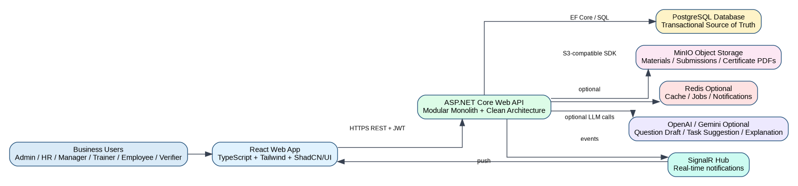
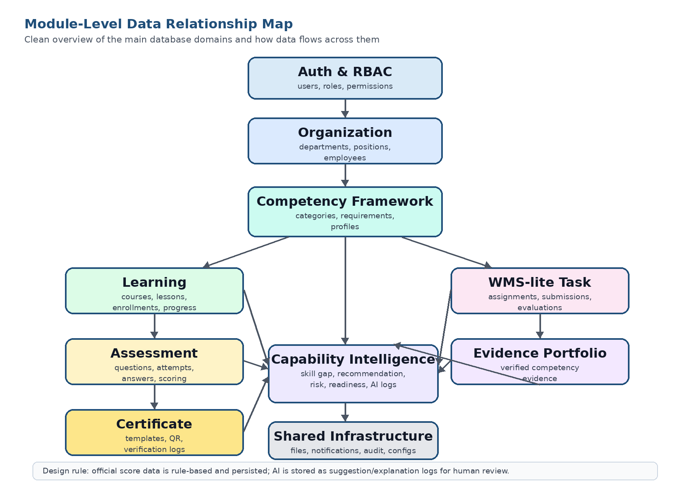
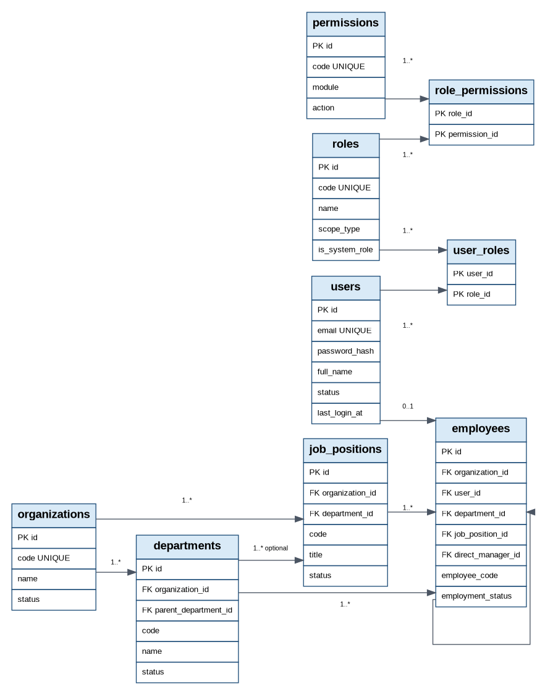
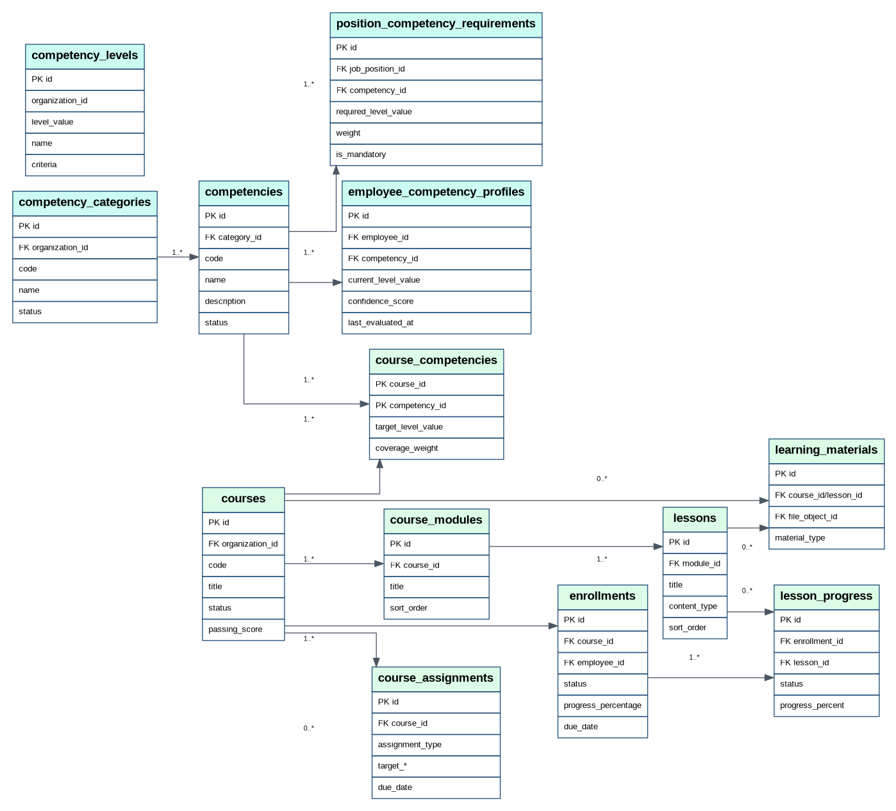
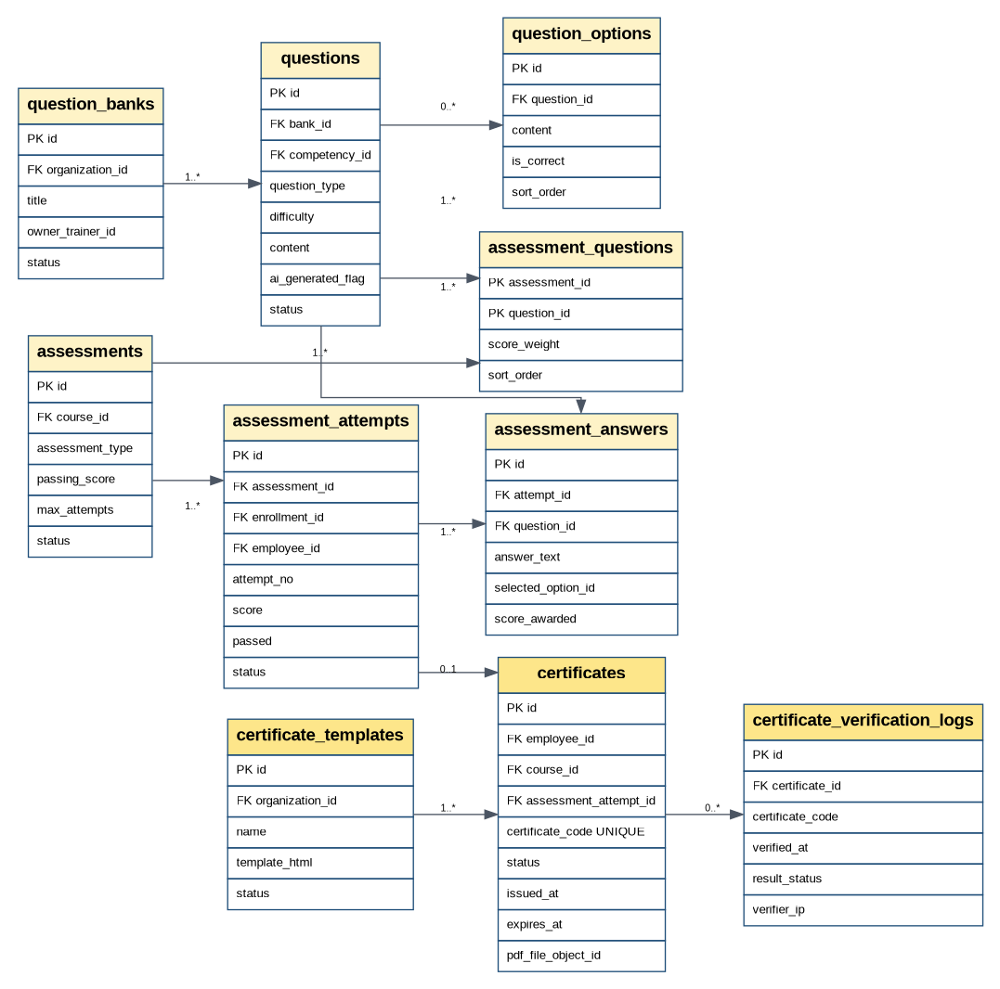
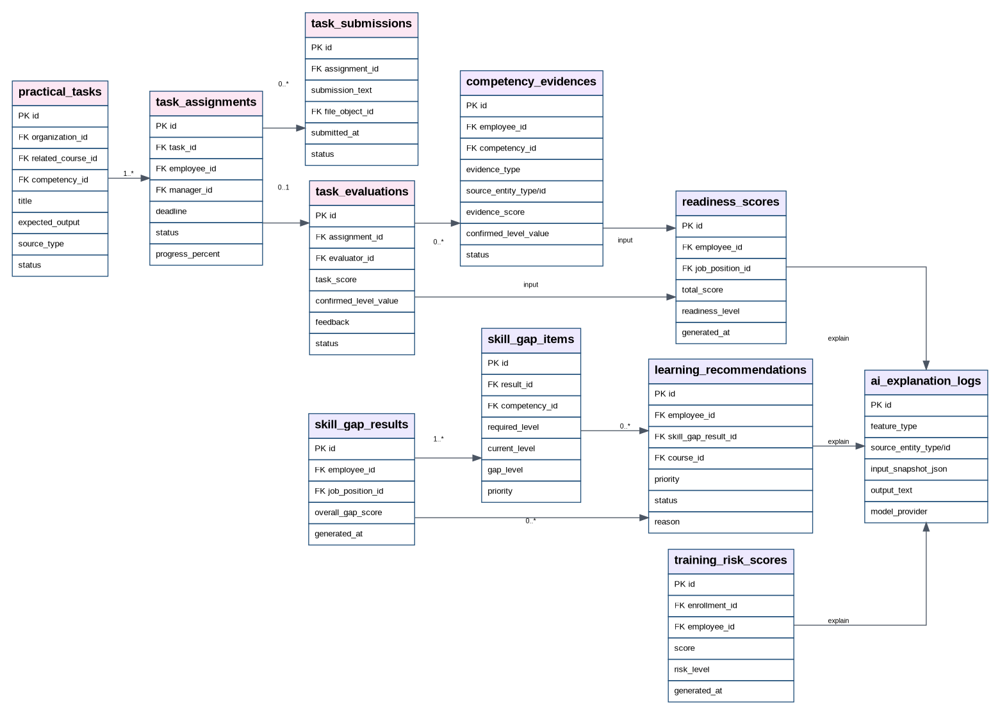
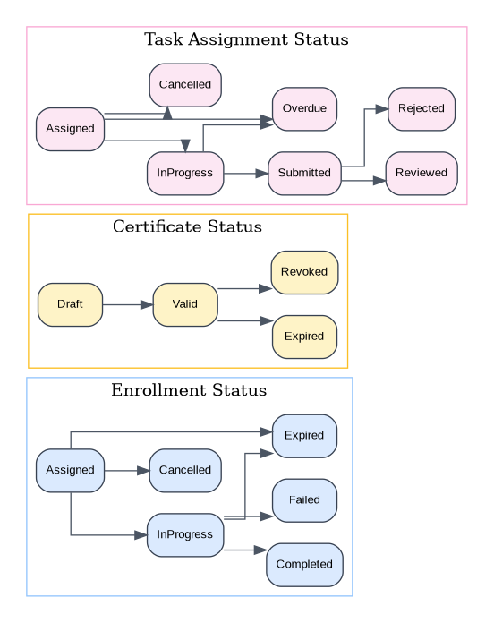

**DigiTalent AI**

**Database Design Document / ERD**

_Version 1.0 - Prepared before implementation_

| **Item** | **Description** |
| --- | --- |
| Project | DigiTalent AI - Digital Competency Training, Internal Certification and Work-Based Assessment Platform |
| Purpose | Define the database model, core entities, relationships, constraints, indexes and ERD baseline for implementation. |
| Primary Technology | PostgreSQL with ASP.NET Core / EF Core as application data access layer. |
| Architecture Fit | Modular Monolith, Clean Architecture, REST APIs, MinIO object storage, optional Redis and SignalR. |
| Design Level | MVP implementation baseline with future-compatible extension points for AI and analytics. |

This document is written as the database baseline for backend, frontend and testing teams. It should be reviewed before coding starts and updated when business requirements change.

# Document Structure

| **No.** | **Section** |
| --- | --- |
| 1   | Purpose and Scope |
| 2   | Source Baseline and Design Assumptions |
| 3   | Database Design Principles |
| 4   | PostgreSQL and EF Core Conventions |
| 5   | High-Level Data Architecture |
| 6   | ERD Diagrams |
| 7   | Schema Grouping and Entity Overview |
| 8   | Detailed Table Specifications |
| 9   | Business Rules and Data Integrity Rules |
| 10  | Status Models and Enumerations |
| 11  | Scoring and Intelligence Data Model |
| 12  | File Storage and Certificate Data Model |
| 13  | Indexing and Query Performance Plan |
| 14  | Security, Access Control and Audit Design |
| 15  | Migration, Seeding and Environment Strategy |
| 16  | Data Lifecycle and Retention Strategy |
| 17  | Reporting and Dashboard Data Considerations |
| 18  | Implementation Roadmap |
| 19  | Risks and Mitigation |
| 20  | Acceptance Checklist |
| 21  | Appendix: Suggested EF Core Structure and SQL Notes |

# 1\. Purpose and Scope

This Database Design Document defines the logical and physical database baseline for DigiTalent AI. It translates the business scope into concrete PostgreSQL entities, relationships, constraints, status models, indexes and implementation notes. The goal is to make backend implementation predictable, prevent data duplication, and ensure that later API and UI work can be built on a stable data model.

## 1.1 Primary Objectives

*   Provide a clear entity model for employee management, competency framework, learning, assessment, certificate verification, WMS-lite task evidence and capability intelligence.
*   Define table names, key columns, relationship direction, constraints and indexing strategy before code implementation.
*   Separate transactional source-of-truth data from calculated snapshots such as skill gap, risk score and readiness score.
*   Keep AI and rule-based analysis explainable by persisting input snapshots, component scores and explanation logs.
*   Support production-oriented concerns: RBAC, department data boundary, audit logging, status lifecycle, soft deletion/archival and file metadata.

## 1.2 In Scope

*   PostgreSQL relational schema design for MVP and near-term bonus features.
*   ERD at module and entity level.
*   Data dictionary for core tables and high-value extension tables.
*   Database rules for certificate lifecycle, competency evidence and WMS-lite task evaluation.
*   Index plan for common dashboards, search, verification and operational queries.
*   EF Core-friendly design decisions for ASP.NET Core implementation.

## 1.3 Out of Scope

*   Full HRM/payroll schema, attendance, salary, contract management or enterprise talent marketplace.
*   Distributed microservice database per service. The project should start with one PostgreSQL database for a modular monolith.
*   Custom machine learning training dataset schema. MVP uses rule-based scoring and optional LLM support.
*   Full BI warehouse implementation. This document only defines transactional and dashboard-ready tables.

# 2\. Source Baseline and Design Assumptions

The schema is based on the finalized technology stack and the registered project scope: ReactJS/TypeScript frontend, ASP.NET Core/C# backend, PostgreSQL database, MinIO file storage, optional Redis, SignalR, Docker, Nginx and GitHub Actions. The data model prioritizes the registered MVP: competency management, internal learning and assessment, skill gap analysis, recommendation, certificate verification, WMS-lite practical task evidence, readiness dashboard and auditability.

## 2.1 Key Assumptions

| **ID** | **Assumption** | **Database Impact** |
| --- | --- | --- |
| A-01 | The MVP is primarily for one enterprise, but future SaaS/multi-organization support should remain possible. | Include organizations table and organization\_id in core business tables; seed one default organization for MVP. |
| A-02 | Role-based access is required for Admin, HR Manager, Department Manager, Trainer, Employee and Verifier. | Use users, roles, permissions, user\_roles and role\_permissions. Department-level rules are enforced by application queries. |
| A-03 | Competency is the central business concept, not the course. | Position requirements, courses, assessments, certificates, tasks and evidence must link back to competencies. |
| A-04 | Important scores must be explainable and reproducible. | Persist component scores, source snapshots and AI/rule explanation logs. |
| A-05 | Uploaded materials, task submissions and certificate PDFs are stored outside PostgreSQL. | Store file metadata in file\_objects and actual bytes in MinIO. |
| A-06 | Capstone scope should be feasible for a team of five. | Use modular monolith tables and avoid over-normalized enterprise HRM complexity. |

# 3\. Database Design Principles

| **Principle** | **Decision** | **Reason** |
| --- | --- | --- |
| Competency-first | Core business flows should start or end at competency records. | This differentiates DigiTalent AI from a basic LMS. |
| Normalize core master data | Departments, positions, competencies, courses, assessments and employees are normalized. | Prevents inconsistent business definitions and supports dashboard joins. |
| Snapshot calculated results | Skill gap, risk and readiness results are persisted as snapshots, not only calculated on UI. | Supports audit, trend tracking and demo explanation. |
| Soft lifecycle over hard delete | Use status/archived state for important records. | Protects assessment, certificate and task evidence history. |
| File metadata only in DB | Store object keys and metadata, not file binary bytes. | Keeps PostgreSQL lean and allows MinIO/cloud object storage. |
| Configurable scoring | Store scoring weights in scoring\_configs rather than hard-code. | Enables mentor/demo adjustment and production-style governance. |
| Audit by design | Write audit logs for sensitive changes. | Supports accountability and defense explanation. |
| EF Core-friendly | Use uuid PKs, FK constraints, explicit join tables, predictable naming. | Simplifies ASP.NET Core implementation and migration management. |

# 4\. PostgreSQL and EF Core Conventions

## 4.1 Naming Conventions

| **Item** | **Convention** | **Example** |
| --- | --- | --- |
| Database table | snake\_case, plural noun | employee\_competency\_profiles |
| Column | snake\_case | created\_at, employee\_id |
| Primary key | id uuid | id  |
| Foreign key | <entity>\_id | employee\_id, course\_id |
| Unique index | ux\_<table>\_<columns> | ux\_users\_email |
| Normal index | ix\_<table>\_<columns> | ix\_enrollments\_employee\_status |
| Enum/status | varchar with application enum + optional check constraint | status = VALID |
| C# entity | PascalCase singular | EmployeeCompetencyProfile |
| DTO | Use case based name | CreateCourseRequest, CourseDetailResponse |

## 4.2 Common Columns

| **Column** | **Type** | **Used In** | **Meaning** |
| --- | --- | --- | --- |
| id  | uuid | All entity tables | Primary identifier. Generated by application or database. |
| created\_at | timestamptz | Most tables | Creation timestamp in UTC. |
| updated\_at | timestamptz | Most mutable tables | Last update timestamp in UTC. |
| created\_by\_user\_id | uuid | Sensitive master/transaction tables | User who created the record. |
| updated\_by\_user\_id | uuid | Sensitive mutable tables | User who last updated the record. |
| status | varchar(30) | Master and lifecycle tables | Current lifecycle state. |
| is\_deleted | boolean | Only if archive status is not enough | Soft-delete flag. Prefer status for domain records. |
| row\_version | xmin or bytea/int | Optional concurrency tables | Optimistic concurrency for edit-heavy records. |

## 4.3 Data Type Decisions

| **Concept** | **Recommended Type** | **Notes** |
| --- | --- | --- |
| Primary keys | uuid | Good for distributed generation and safer public IDs than sequential integer IDs. |
| Timestamps | timestamptz | Store UTC and convert in frontend. |
| Scores | numeric(5,2) or numeric(6,2) | Avoid float rounding issues for grades/readiness. |
| Weights | numeric(6,4) | Example 0.3500 for 35%. |
| Flexible snapshots | jsonb | Use for audit old/new values, AI input snapshots, evaluation criteria. |
| Enums | varchar(30/80) | Map to C# enums. Optional DB check constraints can be added after status stabilizes. |
| Large content | text | Lesson body, question content, feedback, AI output. |
| Files | metadata row + MinIO object key | Never store uploaded binary file content in PostgreSQL. |

# 5\. High-Level Data Architecture

Figure 1. Data context: PostgreSQL as transactional source of truth with MinIO for file objects.

PostgreSQL stores authoritative business data: users, employees, competencies, learning progress, assessment results, certificates, tasks, evidence, scores and audit logs. MinIO stores file bytes such as lesson materials, task submissions and certificate PDFs. Redis can be added for cache and background jobs, but it must not replace PostgreSQL as source of truth.

## 5.1 Data Ownership by Layer

| **Layer** | **Owns** | **Does Not Own** |
| --- | --- | --- |
| React Frontend | View state, forms, temporary filters, cached API responses. | Business rules, scoring formulas, authorization decisions. |
| ASP.NET Core API | Business logic, validation, authorization, EF Core transactions, scoring jobs. | Long-term file bytes. |
| PostgreSQL | Business records, relationships, lifecycle statuses, score snapshots, audit logs. | Raw uploaded files and generated PDFs. |
| MinIO | File bytes and object storage. | Business status, score, permission logic. |
| Redis optional | Cache, queues, notification fan-out. | Permanent learning/certificate/task state. |

# 6\. ERD Diagrams

## 6.1 Module-Level ERD

Figure 2. Module-level ERD showing major data domains and cross-domain relationships.

## 6.2 Auth and Organization ERD

Figure 3. Auth, RBAC and organization structure ERD.

## 6.3 Competency and Learning ERD

Figure 4. Competency framework, course, lesson, assignment and progress ERD.

## 6.4 Assessment and Certificate ERD

Figure 5. Assessment, attempt, answer and certificate verification ERD.

## 6.5 WMS-lite Task, Evidence and Intelligence ERD

Figure 6. Practical task, evidence portfolio and capability intelligence ERD.

## 6.6 Core Status Transition Overview

Figure 7. Main lifecycle states for enrollment, certificate and task assignment.

# 7\. Schema Grouping and Entity Overview

The schema is grouped by bounded business capability. These groups should map directly to backend modules/namespaces and frontend feature folders. The physical database can stay in the public schema for MVP, while module boundaries are enforced in code through folder structure and service boundaries.

| **Group** | **Purpose** | **Tables** |
| --- | --- | --- |
| Auth & RBAC | Identity, user accounts, role/permission assignment, refresh tokens and login control. | users, roles, permissions, user\_roles, role\_permissions, refresh\_tokens |
| Organization | Company structure, departments, job positions, employee profile and reporting line. | organizations, departments, job\_positions, employees |
| Competency Framework | Digital competency taxonomy, levels, job requirements, current employee competency and evidence. | competency\_categories, competencies, competency\_levels, position\_competency\_requirements, employee\_competency\_profiles, competency\_evidences |
| Learning Management | Courses, modules, lessons, materials, competency coverage, assignments, enrollments and lesson progress. | courses, course\_modules, lessons, learning\_materials, course\_competencies, course\_assignments, enrollments, lesson\_progress |
| Assessment | Question banks, questions, assessments, attempts, answers and scoring history. | question\_banks, questions, question\_options, assessments, assessment\_questions, assessment\_attempts, assessment\_answers |
| Certificate | Certificate templates, generated certificates, QR verification and certificate status tracking. | certificate\_templates, certificates, certificate\_verification\_logs |
| WMS-lite Task | Practical task definitions, assignments, submissions and evaluations after training. | practical\_tasks, task\_assignments, task\_submissions, task\_evaluations |
| Capability Intelligence | Skill gap, recommendation, training risk, readiness and AI explanation logs. | skill\_gap\_results, skill\_gap\_items, learning\_recommendations, training\_risk\_scores, readiness\_scores, promotion\_readiness\_results, ai\_explanation\_logs |
| Shared / Infrastructure | File references, notifications, scoring configs, system settings and audit logs. | file\_objects, notifications, notification\_preferences, scoring\_configs, scoring\_config\_items, system\_settings, audit\_logs |

## 7.1 Core Relationship Summary

| **Relationship** | **Cardinality** | **Implementation Note** |
| --- | --- | --- |
| organization -> departments / positions / employees | 1 to many | Keep organization\_id on business tables for future tenant boundary. |
| user -> employee | 0..1 to 1 | Some verifier/admin accounts may not map to employee profiles. |
| position -> competency requirements | 1 to many | Each active position should have at least one required competency. |
| employee -> competency profile | 1 to many | One current profile row per employee/competency. |
| course -> competencies | many to many | Use course\_competencies with target level and coverage weight. |
| course -> modules -> lessons | 1 to many chain | Supports enterprise learning content structure. |
| course -> enrollment -> lesson progress | 1 to many | Enrollment is per employee-course; progress is per enrollment-lesson. |
| assessment -> questions | many to many | Use assessment\_questions for ordering and score weight. |
| assessment attempt -> certificate | 0..1 | A passing final attempt may issue one certificate. |
| task assignment -> submission -> evaluation -> evidence | 1 to many / 0..1 | Task evaluation becomes verified competency evidence when passed. |
| skill\_gap/readiness/risk | snapshots | Persist calculated results for explainability and dashboard history. |

# 8\. Detailed Table Specifications

This section provides the implementation-oriented data dictionary. It is intentionally detailed enough for backend entity creation, EF Core mapping, migration planning and API contract alignment.

## 8.1 Auth & RBAC

Identity, user accounts, role/permission assignment, refresh tokens and login control.

### users

| **Column** | **Type** | **Key / Nullability** | **Description** |
| --- | --- | --- | --- |
| id  | uuid | PK  | Application user identifier. |
| email | varchar(255) | UNIQUE, NOT NULL | Login email; lower-case normalized. |
| password\_hash | text | NULL for external auth | Password hash generated by ASP.NET identity/password hasher. |
| full\_name | varchar(255) | NOT NULL | Display name. |
| avatar\_url | text | NULL | Optional profile image URL. |
| status | varchar(30) | NOT NULL | ACTIVE, LOCKED, DISABLED, PENDING. |
| email\_verified\_at | timestamptz | NULL | Verification timestamp. |
| last\_login\_at | timestamptz | NULL | Last successful login. |
| failed\_login\_count | int | NOT NULL DEFAULT 0 | For lockout policy. |
| created\_at / updated\_at | timestamptz | NOT NULL | Audit timestamps. |

### roles

| **Column** | **Type** | **Key / Nullability** | **Description** |
| --- | --- | --- | --- |
| id  | uuid | PK  | Role identifier. |
| code | varchar(80) | UNIQUE, NOT NULL | SYSTEM\_ADMIN, HR\_MANAGER, DEPT\_MANAGER, TRAINER, EMPLOYEE, VERIFIER. |
| name | varchar(120) | NOT NULL | Human-readable role name. |
| description | text | NULL | Role description. |
| scope\_type | varchar(30) | NOT NULL | GLOBAL, ORGANIZATION, DEPARTMENT, SELF, PUBLIC. |
| is\_system\_role | boolean | NOT NULL | True for built-in roles. |
| status | varchar(30) | NOT NULL | ACTIVE/INACTIVE. |

### permissions

| **Column** | **Type** | **Key / Nullability** | **Description** |
| --- | --- | --- | --- |
| id  | uuid | PK  | Permission identifier. |
| code | varchar(120) | UNIQUE, NOT NULL | Example: course.create, employee.view.all. |
| module | varchar(80) | NOT NULL | Functional module name. |
| action | varchar(80) | NOT NULL | create, read, update, delete, approve, evaluate, verify. |
| description | text | NULL | Permission meaning. |

### user\_roles

| **Column** | **Type** | **Key / Nullability** | **Description** |
| --- | --- | --- | --- |
| user\_id | uuid | PK, FK users.id | Assigned user. |
| role\_id | uuid | PK, FK roles.id | Assigned role. |
| assigned\_by | uuid | FK users.id, NULL | Actor who assigned this role. |
| assigned\_at | timestamptz | NOT NULL | Assignment timestamp. |

### role\_permissions

| **Column** | **Type** | **Key / Nullability** | **Description** |
| --- | --- | --- | --- |
| role\_id | uuid | PK, FK roles.id | Role. |
| permission\_id | uuid | PK, FK permissions.id | Permission. |
| granted\_at | timestamptz | NOT NULL | Grant timestamp. |

### refresh\_tokens

| **Column** | **Type** | **Key / Nullability** | **Description** |
| --- | --- | --- | --- |
| id  | uuid | PK  | Token record. |
| user\_id | uuid | FK users.id, NOT NULL | Owner. |
| token\_hash | text | UNIQUE, NOT NULL | Store hash only, not raw token. |
| expires\_at | timestamptz | NOT NULL | Expiry. |
| revoked\_at | timestamptz | NULL | Revoked timestamp. |
| replaced\_by\_token\_id | uuid | FK refresh\_tokens.id, NULL | Rotation support. |
| ip\_address | varchar(64) | NULL | Client IP. |
| user\_agent | text | NULL | Client info. |

## 8.2 Organization

Company structure, departments, job positions, employee profile and reporting line.

### organizations

| **Column** | **Type** | **Key / Nullability** | **Description** |
| --- | --- | --- | --- |
| id  | uuid | PK  | Organization/tenant boundary. MVP can seed one default organization. |
| code | varchar(80) | UNIQUE, NOT NULL | Organization code. |
| name | varchar(255) | NOT NULL | Organization name. |
| domain | varchar(255) | NULL | Optional email domain. |
| status | varchar(30) | NOT NULL | ACTIVE/INACTIVE. |
| created\_at / updated\_at | timestamptz | NOT NULL | Audit timestamps. |

### departments

| **Column** | **Type** | **Key / Nullability** | **Description** |
| --- | --- | --- | --- |
| id  | uuid | PK  | Department identifier. |
| organization\_id | uuid | FK organizations.id, NOT NULL | Organization scope. |
| parent\_department\_id | uuid | FK departments.id, NULL | Hierarchy support. |
| manager\_employee\_id | uuid | FK employees.id, NULL | Department manager. |
| code | varchar(80) | NOT NULL | Unique within organization. |
| name | varchar(255) | NOT NULL | Department name. |
| description | text | NULL | Description. |
| status | varchar(30) | NOT NULL | ACTIVE/INACTIVE/ARCHIVED. |

### job\_positions

| **Column** | **Type** | **Key / Nullability** | **Description** |
| --- | --- | --- | --- |
| id  | uuid | PK  | Position identifier. |
| organization\_id | uuid | FK organizations.id, NOT NULL | Organization scope. |
| department\_id | uuid | FK departments.id, NULL | Default department; position can be shared if NULL. |
| code | varchar(80) | NOT NULL | Unique within organization. |
| title | varchar(255) | NOT NULL | Position title. |
| description | text | NULL | Job description. |
| level\_name | varchar(80) | NULL | Junior/Middle/Senior/Lead or internal level. |
| status | varchar(30) | NOT NULL | ACTIVE/INACTIVE/ARCHIVED. |

### employees

| **Column** | **Type** | **Key / Nullability** | **Description** |
| --- | --- | --- | --- |
| id  | uuid | PK  | Employee profile identifier. |
| organization\_id | uuid | FK organizations.id, NOT NULL | Organization scope. |
| user\_id | uuid | FK users.id, UNIQUE, NULL | Linked login account; may be created later. |
| department\_id | uuid | FK departments.id, NOT NULL | Current department. |
| job\_position\_id | uuid | FK job\_positions.id, NOT NULL | Current position. |
| direct\_manager\_id | uuid | FK employees.id, NULL | Reporting line. |
| employee\_code | varchar(80) | NOT NULL | Unique within organization. |
| full\_name | varchar(255) | NOT NULL | Legal/display name. |
| email | varchar(255) | NOT NULL | Work email. |
| phone | varchar(50) | NULL | Optional. |
| employment\_status | varchar(30) | NOT NULL | ACTIVE, INACTIVE, TRANSFERRED, ARCHIVED. |
| joined\_at | date | NULL | Join date. |

## 8.3 Competency Framework

Digital competency taxonomy, levels, job requirements, current employee competency and evidence.

### competency\_categories

| **Column** | **Type** | **Key / Nullability** | **Description** |
| --- | --- | --- | --- |
| id  | uuid | PK  | Category identifier. |
| organization\_id | uuid | FK organizations.id, NOT NULL | Organization scope. |
| code | varchar(80) | NOT NULL | AI\_LITERACY, DATA\_LITERACY, CYBERSECURITY, etc. |
| name | varchar(255) | NOT NULL | Category name. |
| description | text | NULL | Description. |
| sort\_order | int | NOT NULL DEFAULT 0 | Display order. |
| status | varchar(30) | NOT NULL | ACTIVE/INACTIVE. |

### competencies

| **Column** | **Type** | **Key / Nullability** | **Description** |
| --- | --- | --- | --- |
| id  | uuid | PK  | Competency identifier. |
| category\_id | uuid | FK competency\_categories.id, NOT NULL | Parent category. |
| code | varchar(80) | NOT NULL | Unique within organization/category. |
| name | varchar(255) | NOT NULL | Competency name. |
| description | text | NULL | Description. |
| status | varchar(30) | NOT NULL | ACTIVE/INACTIVE/ARCHIVED. |

### competency\_levels

| **Column** | **Type** | **Key / Nullability** | **Description** |
| --- | --- | --- | --- |
| id  | uuid | PK  | Level identifier. |
| organization\_id | uuid | FK organizations.id, NOT NULL | Organization scope. |
| level\_value | int | NOT NULL | Numeric level, usually 0-5. |
| name | varchar(120) | NOT NULL | Beginner/Basic/Intermediate/Advanced/Expert. |
| description | text | NULL | Level description. |
| achievement\_criteria | text | NULL | Criteria for achieving this level. |
| status | varchar(30) | NOT NULL | ACTIVE/INACTIVE. |

### position\_competency\_requirements

| **Column** | **Type** | **Key / Nullability** | **Description** |
| --- | --- | --- | --- |
| id  | uuid | PK  | Position requirement record. |
| job\_position\_id | uuid | FK job\_positions.id, NOT NULL | Target position. |
| competency\_id | uuid | FK competencies.id, NOT NULL | Required competency. |
| required\_level\_value | int | NOT NULL | Target level required for this position. |
| weight | numeric(5,2) | NOT NULL | Relative importance in readiness score. |
| is\_mandatory | boolean | NOT NULL | Mandatory competency flag. |
| effective\_from | date | NULL | Start date. |
| effective\_to | date | NULL | End date if replaced. |

### employee\_competency\_profiles

| **Column** | **Type** | **Key / Nullability** | **Description** |
| --- | --- | --- | --- |
| id  | uuid | PK  | Current employee competency profile. |
| employee\_id | uuid | FK employees.id, NOT NULL | Employee. |
| competency\_id | uuid | FK competencies.id, NOT NULL | Competency. |
| current\_level\_value | int | NOT NULL | Current confirmed/estimated level. |
| confidence\_score | numeric(5,2) | NULL | Confidence based on evidence quality. |
| last\_evidence\_id | uuid | FK competency\_evidences.id, NULL | Latest supporting evidence. |
| last\_evaluated\_at | timestamptz | NULL | Last update time. |
| updated\_by | uuid | FK users.id, NULL | Actor/system that updated profile. |

### competency\_evidences

| **Column** | **Type** | **Key / Nullability** | **Description** |
| --- | --- | --- | --- |
| id  | uuid | PK  | Evidence record. |
| employee\_id | uuid | FK employees.id, NOT NULL | Employee. |
| competency\_id | uuid | FK competencies.id, NOT NULL | Competency. |
| evidence\_type | varchar(30) | NOT NULL | ASSESSMENT, CERTIFICATE, TASK, MANAGER\_REVIEW, MANUAL. |
| source\_entity\_type | varchar(80) | NOT NULL | assessment\_attempt, certificate, task\_evaluation, manual. |
| source\_entity\_id | uuid | NOT NULL | Source record identifier. |
| evidence\_score | numeric(5,2) | NULL | Score supporting competency. |
| confirmed\_level\_value | int | NULL | Level confirmed by this evidence. |
| verified\_by\_user\_id | uuid | FK users.id, NULL | Approver/verifier. |
| status | varchar(30) | NOT NULL | PENDING, VERIFIED, REJECTED, SUPERSEDED. |
| notes | text | NULL | Evaluator comments. |

## 8.4 Learning Management

Courses, modules, lessons, materials, competency coverage, assignments, enrollments and lesson progress.

### courses

| **Column** | **Type** | **Key / Nullability** | **Description** |
| --- | --- | --- | --- |
| id  | uuid | PK  | Course identifier. |
| organization\_id | uuid | FK organizations.id, NOT NULL | Organization scope. |
| code | varchar(80) | NOT NULL | Unique within organization. |
| title | varchar(255) | NOT NULL | Course title. |
| description | text | NULL | Course description. |
| difficulty\_level | varchar(30) | NULL | BEGINNER, INTERMEDIATE, ADVANCED. |
| estimated\_duration\_minutes | int | NULL | Estimated duration. |
| owner\_trainer\_id | uuid | FK employees.id, NULL | Trainer owner. |
| passing\_score | numeric(5,2) | NULL | Default passing score. |
| status | varchar(30) | NOT NULL | DRAFT, PUBLISHED, ARCHIVED. |

### course\_modules

| **Column** | **Type** | **Key / Nullability** | **Description** |
| --- | --- | --- | --- |
| id  | uuid | PK  | Course module identifier. |
| course\_id | uuid | FK courses.id, NOT NULL | Parent course. |
| title | varchar(255) | NOT NULL | Module title. |
| description | text | NULL | Description. |
| sort\_order | int | NOT NULL | Display order. |
| status | varchar(30) | NOT NULL | ACTIVE/INACTIVE. |

### lessons

| **Column** | **Type** | **Key / Nullability** | **Description** |
| --- | --- | --- | --- |
| id  | uuid | PK  | Lesson identifier. |
| module\_id | uuid | FK course\_modules.id, NOT NULL | Parent module. |
| title | varchar(255) | NOT NULL | Lesson title. |
| content\_type | varchar(30) | NOT NULL | TEXT, FILE, VIDEO\_LINK, MIXED. |
| content\_body | text | NULL | HTML/Markdown lesson body or description. |
| estimated\_minutes | int | NULL | Estimated learning time. |
| sort\_order | int | NOT NULL | Display order. |
| is\_required | boolean | NOT NULL | Required to complete course. |
| status | varchar(30) | NOT NULL | DRAFT/PUBLISHED/ARCHIVED. |

### learning\_materials

| **Column** | **Type** | **Key / Nullability** | **Description** |
| --- | --- | --- | --- |
| id  | uuid | PK  | Material record. |
| course\_id | uuid | FK courses.id, NULL | Course-level material. |
| lesson\_id | uuid | FK lessons.id, NULL | Lesson-level material. |
| file\_object\_id | uuid | FK file\_objects.id, NULL | Uploaded file. |
| material\_type | varchar(30) | NOT NULL | PDF, SLIDE, VIDEO\_LINK, LINK, OTHER. |
| external\_url | text | NULL | For video or external resource. |
| title | varchar(255) | NOT NULL | Display title. |
| sort\_order | int | NOT NULL | Display order. |

### course\_competencies

| **Column** | **Type** | **Key / Nullability** | **Description** |
| --- | --- | --- | --- |
| course\_id | uuid | PK, FK courses.id | Course. |
| competency\_id | uuid | PK, FK competencies.id | Covered competency. |
| target\_level\_value | int | NULL | Expected competency level after course. |
| coverage\_weight | numeric(5,2) | NOT NULL | How much the course contributes to the competency. |
| notes | text | NULL | Mapping notes. |

### course\_assignments

| **Column** | **Type** | **Key / Nullability** | **Description** |
| --- | --- | --- | --- |
| id  | uuid | PK  | Assignment campaign. |
| course\_id | uuid | FK courses.id, NOT NULL | Assigned course. |
| assignment\_type | varchar(30) | NOT NULL | EMPLOYEE, DEPARTMENT, POSITION. |
| target\_employee\_id | uuid | FK employees.id, NULL | For individual assignment. |
| target\_department\_id | uuid | FK departments.id, NULL | For department assignment. |
| target\_job\_position\_id | uuid | FK job\_positions.id, NULL | For position assignment. |
| assigned\_by\_user\_id | uuid | FK users.id, NOT NULL | HR/Manager assigning course. |
| due\_date | date | NULL | Due date. |
| status | varchar(30) | NOT NULL | ACTIVE/CANCELLED/COMPLETED. |

### enrollments

| **Column** | **Type** | **Key / Nullability** | **Description** |
| --- | --- | --- | --- |
| id  | uuid | PK  | Employee-course enrollment. |
| course\_id | uuid | FK courses.id, NOT NULL | Course. |
| employee\_id | uuid | FK employees.id, NOT NULL | Learner. |
| course\_assignment\_id | uuid | FK course\_assignments.id, NULL | Source assignment. |
| status | varchar(30) | NOT NULL | ASSIGNED, IN\_PROGRESS, COMPLETED, FAILED, CANCELLED, EXPIRED. |
| progress\_percentage | numeric(5,2) | NOT NULL DEFAULT 0 | Completion progress. |
| started\_at | timestamptz | NULL | First access. |
| completed\_at | timestamptz | NULL | Completion time. |
| due\_date | date | NULL | Enrollment due date. |

### lesson\_progress

| **Column** | **Type** | **Key / Nullability** | **Description** |
| --- | --- | --- | --- |
| id  | uuid | PK  | Lesson progress record. |
| enrollment\_id | uuid | FK enrollments.id, NOT NULL | Enrollment. |
| lesson\_id | uuid | FK lessons.id, NOT NULL | Lesson. |
| status | varchar(30) | NOT NULL | NOT\_STARTED, IN\_PROGRESS, COMPLETED. |
| progress\_percent | numeric(5,2) | NOT NULL DEFAULT 0 | Lesson progress. |
| last\_accessed\_at | timestamptz | NULL | Last access. |
| completed\_at | timestamptz | NULL | Completed time. |

## 8.5 Assessment

Question banks, questions, assessments, attempts, answers and scoring history.

### question\_banks

| **Column** | **Type** | **Key / Nullability** | **Description** |
| --- | --- | --- | --- |
| id  | uuid | PK  | Question bank. |
| organization\_id | uuid | FK organizations.id, NOT NULL | Organization scope. |
| title | varchar(255) | NOT NULL | Bank title. |
| description | text | NULL | Description. |
| owner\_trainer\_id | uuid | FK employees.id, NULL | Trainer owner. |
| status | varchar(30) | NOT NULL | ACTIVE/ARCHIVED. |

### questions

| **Column** | **Type** | **Key / Nullability** | **Description** |
| --- | --- | --- | --- |
| id  | uuid | PK  | Question identifier. |
| bank\_id | uuid | FK question\_banks.id, NOT NULL | Question bank. |
| competency\_id | uuid | FK competencies.id, NULL | Target competency. |
| question\_type | varchar(30) | NOT NULL | SINGLE\_CHOICE, MULTIPLE\_CHOICE, TRUE\_FALSE, SHORT\_TEXT, SCENARIO. |
| difficulty | varchar(30) | NULL | EASY, MEDIUM, HARD. |
| content | text | NOT NULL | Question content. |
| explanation | text | NULL | Explanation after answer. |
| ai\_generated\_flag | boolean | NOT NULL DEFAULT false | Generated by AI draft or manual. |
| status | varchar(30) | NOT NULL | DRAFT, REVIEW\_PENDING, APPROVED, REJECTED, ARCHIVED. |

### question\_options

| **Column** | **Type** | **Key / Nullability** | **Description** |
| --- | --- | --- | --- |
| id  | uuid | PK  | Option identifier. |
| question\_id | uuid | FK questions.id, NOT NULL | Parent question. |
| content | text | NOT NULL | Option text. |
| is\_correct | boolean | NOT NULL | Correct flag. |
| sort\_order | int | NOT NULL | Display order. |

### assessments

| **Column** | **Type** | **Key / Nullability** | **Description** |
| --- | --- | --- | --- |
| id  | uuid | PK  | Assessment identifier. |
| course\_id | uuid | FK courses.id, NOT NULL | Course. |
| title | varchar(255) | NOT NULL | Assessment title. |
| assessment\_type | varchar(30) | NOT NULL | PRE, QUIZ, FINAL, POST. |
| time\_limit\_minutes | int | NULL | Time limit. |
| max\_attempts | int | NULL | Allowed attempts. |
| passing\_score | numeric(5,2) | NOT NULL | Pass threshold. |
| status | varchar(30) | NOT NULL | DRAFT, PUBLISHED, ARCHIVED. |

### assessment\_questions

| **Column** | **Type** | **Key / Nullability** | **Description** |
| --- | --- | --- | --- |
| assessment\_id | uuid | PK, FK assessments.id | Assessment. |
| question\_id | uuid | PK, FK questions.id | Question. |
| score\_weight | numeric(6,2) | NOT NULL | Question score weight. |
| sort\_order | int | NOT NULL | Display order. |

### assessment\_attempts

| **Column** | **Type** | **Key / Nullability** | **Description** |
| --- | --- | --- | --- |
| id  | uuid | PK  | Attempt identifier. |
| assessment\_id | uuid | FK assessments.id, NOT NULL | Assessment. |
| enrollment\_id | uuid | FK enrollments.id, NOT NULL | Course enrollment. |
| employee\_id | uuid | FK employees.id, NOT NULL | Employee. |
| attempt\_no | int | NOT NULL | Attempt number. |
| status | varchar(30) | NOT NULL | IN\_PROGRESS, SUBMITTED, GRADED, CANCELLED. |
| started\_at | timestamptz | NOT NULL | Start time. |
| submitted\_at | timestamptz | NULL | Submit time. |
| score | numeric(6,2) | NULL | Final score. |
| passed | boolean | NULL | Pass result. |

### assessment\_answers

| **Column** | **Type** | **Key / Nullability** | **Description** |
| --- | --- | --- | --- |
| id  | uuid | PK  | Answer record. |
| attempt\_id | uuid | FK assessment\_attempts.id, NOT NULL | Attempt. |
| question\_id | uuid | FK questions.id, NOT NULL | Question. |
| selected\_option\_id | uuid | FK question\_options.id, NULL | For single choice. |
| answer\_text | text | NULL | For text/scenario. |
| is\_correct | boolean | NULL | Correct flag after grading. |
| score\_awarded | numeric(6,2) | NULL | Score for this answer. |
| graded\_by\_user\_id | uuid | FK users.id, NULL | Manual grader when needed. |

## 8.6 Certificate

Certificate templates, generated certificates, QR verification and certificate status tracking.

### certificate\_templates

| **Column** | **Type** | **Key / Nullability** | **Description** |
| --- | --- | --- | --- |
| id  | uuid | PK  | Template identifier. |
| organization\_id | uuid | FK organizations.id, NOT NULL | Organization scope. |
| name | varchar(255) | NOT NULL | Template name. |
| template\_html | text | NOT NULL | HTML template or document template markup. |
| background\_file\_object\_id | uuid | FK file\_objects.id, NULL | Optional background image. |
| status | varchar(30) | NOT NULL | DRAFT, ACTIVE, ARCHIVED. |
| created\_by\_user\_id | uuid | FK users.id | Creator. |

### certificates

| **Column** | **Type** | **Key / Nullability** | **Description** |
| --- | --- | --- | --- |
| id  | uuid | PK  | Certificate identifier. |
| employee\_id | uuid | FK employees.id, NOT NULL | Recipient. |
| course\_id | uuid | FK courses.id, NOT NULL | Course certified. |
| assessment\_attempt\_id | uuid | FK assessment\_attempts.id, NULL | Passing assessment attempt. |
| certificate\_template\_id | uuid | FK certificate\_templates.id, NOT NULL | Template. |
| certificate\_code | varchar(120) | UNIQUE, NOT NULL | Public verification code. |
| qr\_url | text | NOT NULL | Verification URL encoded in QR. |
| status | varchar(30) | NOT NULL | VALID, EXPIRED, REVOKED. |
| issued\_at | timestamptz | NOT NULL | Issue date. |
| expires\_at | timestamptz | NULL | Expiry date. |
| revoked\_at | timestamptz | NULL | Revocation date. |
| revoked\_reason | text | NULL | Required when revoked. |
| pdf\_file\_object\_id | uuid | FK file\_objects.id, NULL | Generated PDF file. |

### certificate\_verification\_logs

| **Column** | **Type** | **Key / Nullability** | **Description** |
| --- | --- | --- | --- |
| id  | uuid | PK  | Verification log. |
| certificate\_id | uuid | FK certificates.id, NULL | Matched certificate. |
| certificate\_code | varchar(120) | NOT NULL | Code requested. |
| verified\_at | timestamptz | NOT NULL | Timestamp. |
| result\_status | varchar(30) | NOT NULL | VALID, EXPIRED, REVOKED, NOT\_FOUND. |
| verifier\_ip | varchar(64) | NULL | Verifier IP. |
| user\_agent | text | NULL | Verifier device/browser. |

## 8.7 WMS-lite Task

Practical task definitions, assignments, submissions and evaluations after training.

### practical\_tasks

| **Column** | **Type** | **Key / Nullability** | **Description** |
| --- | --- | --- | --- |
| id  | uuid | PK  | Task definition. |
| organization\_id | uuid | FK organizations.id, NOT NULL | Organization scope. |
| related\_course\_id | uuid | FK courses.id, NULL | Course after which task can be assigned. |
| competency\_id | uuid | FK competencies.id, NOT NULL | Competency to validate. |
| title | varchar(255) | NOT NULL | Task title. |
| description | text | NOT NULL | Task details. |
| expected\_output | text | NOT NULL | Expected deliverable. |
| evaluation\_criteria | jsonb | NOT NULL | Rubric/criteria list. |
| source\_type | varchar(30) | NOT NULL | MANUAL, AI\_SUGGESTED. |
| status | varchar(30) | NOT NULL | DRAFT, ACTIVE, ARCHIVED. |

### task\_assignments

| **Column** | **Type** | **Key / Nullability** | **Description** |
| --- | --- | --- | --- |
| id  | uuid | PK  | Task assignment. |
| task\_id | uuid | FK practical\_tasks.id, NOT NULL | Task. |
| employee\_id | uuid | FK employees.id, NOT NULL | Assignee. |
| assigned\_by\_user\_id | uuid | FK users.id, NOT NULL | Manager/HR assigning task. |
| manager\_employee\_id | uuid | FK employees.id, NULL | Responsible evaluator. |
| deadline | timestamptz | NULL | Due date/time. |
| status | varchar(30) | NOT NULL | ASSIGNED, IN\_PROGRESS, SUBMITTED, REVIEWED, REJECTED, OVERDUE, CANCELLED. |
| progress\_percent | numeric(5,2) | NOT NULL DEFAULT 0 | Task progress. |
| assigned\_at | timestamptz | NOT NULL | Assignment time. |

### task\_submissions

| **Column** | **Type** | **Key / Nullability** | **Description** |
| --- | --- | --- | --- |
| id  | uuid | PK  | Submission record. |
| task\_assignment\_id | uuid | FK task\_assignments.id, NOT NULL | Task assignment. |
| submitted\_by\_user\_id | uuid | FK users.id, NOT NULL | Employee user. |
| submission\_text | text | NULL | Submission text. |
| file\_object\_id | uuid | FK file\_objects.id, NULL | Attached evidence file. |
| submitted\_at | timestamptz | NOT NULL | Submission time. |
| status | varchar(30) | NOT NULL | SUBMITTED, REPLACED, WITHDRAWN. |

### task\_evaluations

| **Column** | **Type** | **Key / Nullability** | **Description** |
| --- | --- | --- | --- |
| id  | uuid | PK  | Evaluation record. |
| task\_assignment\_id | uuid | FK task\_assignments.id, NOT NULL | Assignment evaluated. |
| evaluator\_user\_id | uuid | FK users.id, NOT NULL | Manager/Trainer evaluator. |
| task\_score | numeric(5,2) | NOT NULL | Score 0-100. |
| feedback | text | NULL | Feedback. |
| confirmed\_competency\_id | uuid | FK competencies.id, NOT NULL | Competency confirmed. |
| confirmed\_level\_value | int | NULL | Level confirmed after task. |
| evaluation\_status | varchar(30) | NOT NULL | PASSED, NEEDS\_REVISION, FAILED. |
| evaluated\_at | timestamptz | NOT NULL | Evaluation time. |

## 8.8 Capability Intelligence

Skill gap, recommendation, training risk, readiness and AI explanation logs.

### skill\_gap\_results

| **Column** | **Type** | **Key / Nullability** | **Description** |
| --- | --- | --- | --- |
| id  | uuid | PK  | Skill gap run. |
| employee\_id | uuid | FK employees.id, NOT NULL | Employee. |
| job\_position\_id | uuid | FK job\_positions.id, NOT NULL | Reference position. |
| overall\_gap\_score | numeric(6,2) | NOT NULL | Aggregate gap severity. |
| generated\_at | timestamptz | NOT NULL | Generated timestamp. |
| generated\_by | varchar(30) | NOT NULL | SYSTEM, USER\_REQUEST. |
| snapshot\_json | jsonb | NULL | Input snapshot for reproducibility. |

### skill\_gap\_items

| **Column** | **Type** | **Key / Nullability** | **Description** |
| --- | --- | --- | --- |
| id  | uuid | PK  | Individual competency gap. |
| skill\_gap\_result\_id | uuid | FK skill\_gap\_results.id, NOT NULL | Parent result. |
| competency\_id | uuid | FK competencies.id, NOT NULL | Competency. |
| required\_level\_value | int | NOT NULL | Required level. |
| current\_level\_value | int | NOT NULL | Current level. |
| gap\_level | int | NOT NULL | required - current, min 0. |
| priority | varchar(30) | NOT NULL | LOW, MEDIUM, HIGH, CRITICAL. |
| recommended\_action | text | NULL | Action note. |

### learning\_recommendations

| **Column** | **Type** | **Key / Nullability** | **Description** |
| --- | --- | --- | --- |
| id  | uuid | PK  | Recommendation. |
| employee\_id | uuid | FK employees.id, NOT NULL | Employee. |
| source\_skill\_gap\_result\_id | uuid | FK skill\_gap\_results.id, NULL | Skill gap run source. |
| course\_id | uuid | FK courses.id, NOT NULL | Recommended course. |
| priority\_score | numeric(6,2) | NOT NULL | Ranking score. |
| reason | text | NOT NULL | Explainable reason. |
| status | varchar(30) | NOT NULL | NEW, ACCEPTED, DISMISSED, ASSIGNED, COMPLETED. |
| created\_at | timestamptz | NOT NULL | Created time. |

### training\_risk\_scores

| **Column** | **Type** | **Key / Nullability** | **Description** |
| --- | --- | --- | --- |
| id  | uuid | PK  | Risk score record. |
| enrollment\_id | uuid | FK enrollments.id, NOT NULL | Enrollment. |
| employee\_id | uuid | FK employees.id, NOT NULL | Employee. |
| risk\_score | numeric(5,2) | NOT NULL | 0-100 risk score. |
| risk\_level | varchar(30) | NOT NULL | LOW, MEDIUM, HIGH, CRITICAL. |
| inactivity\_score | numeric(5,2) | NOT NULL | Component score. |
| low\_score\_rate | numeric(5,2) | NOT NULL | Component score. |
| deadline\_pressure | numeric(5,2) | NOT NULL | Component score. |
| failed\_attempt\_rate | numeric(5,2) | NOT NULL | Component score. |
| progress\_delay | numeric(5,2) | NOT NULL | Component score. |
| generated\_at | timestamptz | NOT NULL | Generated time. |

### readiness\_scores

| **Column** | **Type** | **Key / Nullability** | **Description** |
| --- | --- | --- | --- |
| id  | uuid | PK  | Readiness score record. |
| employee\_id | uuid | FK employees.id, NOT NULL | Employee. |
| job\_position\_id | uuid | FK job\_positions.id, NOT NULL | Position scope. |
| competency\_score | numeric(5,2) | NOT NULL | Component. |
| certificate\_score | numeric(5,2) | NOT NULL | Component. |
| learning\_progress\_score | numeric(5,2) | NOT NULL | Component. |
| compliance\_score | numeric(5,2) | NOT NULL | Component. |
| task\_performance\_score | numeric(5,2) | NOT NULL | Component. |
| total\_score | numeric(5,2) | NOT NULL | Weighted total. |
| readiness\_level | varchar(30) | NOT NULL | NOT\_READY, DEVELOPING, READY, STRONG. |
| generated\_at | timestamptz | NOT NULL | Generated time. |
| snapshot\_json | jsonb | NULL | Inputs used. |

### promotion\_readiness\_results

| **Column** | **Type** | **Key / Nullability** | **Description** |
| --- | --- | --- | --- |
| id  | uuid | PK  | Optional/bonus result. |
| employee\_id | uuid | FK employees.id, NOT NULL | Employee. |
| target\_job\_position\_id | uuid | FK job\_positions.id, NOT NULL | Target position. |
| readiness\_percent | numeric(5,2) | NOT NULL | Weighted achieved requirement percent. |
| missing\_weight | numeric(6,2) | NOT NULL | Unmet competency weight. |
| recommendation\_text | text | NULL | Development suggestion. |
| generated\_at | timestamptz | NOT NULL | Generated time. |

### ai\_explanation\_logs

| **Column** | **Type** | **Key / Nullability** | **Description** |
| --- | --- | --- | --- |
| id  | uuid | PK  | AI/rule explanation audit. |
| feature\_type | varchar(80) | NOT NULL | QUESTION\_DRAFT, TASK\_SUGGESTION, RISK\_EXPLANATION, READINESS\_EXPLANATION. |
| source\_entity\_type | varchar(80) | NULL | Related entity type. |
| source\_entity\_id | uuid | NULL | Related entity id. |
| input\_snapshot\_json | jsonb | NOT NULL | Input sent to rule/LLM. |
| output\_text | text | NOT NULL | LLM or explanation output. |
| model\_provider | varchar(80) | NULL | OpenAI/Gemini/InternalRule. |
| model\_name | varchar(120) | NULL | Model name if LLM. |
| created\_by\_user\_id | uuid | FK users.id, NULL | Actor requested output. |
| created\_at | timestamptz | NOT NULL | Created time. |

## 8.9 Shared / Infrastructure

File references, notifications, scoring configs, system settings and audit logs.

### file\_objects

| **Column** | **Type** | **Key / Nullability** | **Description** |
| --- | --- | --- | --- |
| id  | uuid | PK  | File metadata; actual bytes stored in MinIO. |
| bucket\_name | varchar(120) | NOT NULL | MinIO bucket. |
| object\_key | text | UNIQUE, NOT NULL | Object key/path. |
| original\_file\_name | varchar(255) | NOT NULL | User file name. |
| content\_type | varchar(120) | NOT NULL | MIME type. |
| file\_size\_bytes | bigint | NOT NULL | Size. |
| checksum\_sha256 | varchar(128) | NULL | Integrity check. |
| access\_level | varchar(30) | NOT NULL | PRIVATE, INTERNAL, PUBLIC\_VERIFY. |
| related\_entity\_type | varchar(80) | NULL | Lesson, task\_submission, certificate, etc. |
| related\_entity\_id | uuid | NULL | Related entity id. |
| uploaded\_by\_user\_id | uuid | FK users.id, NULL | Uploader. |
| created\_at | timestamptz | NOT NULL | Upload time. |

### notifications

| **Column** | **Type** | **Key / Nullability** | **Description** |
| --- | --- | --- | --- |
| id  | uuid | PK  | Notification. |
| recipient\_user\_id | uuid | FK users.id, NOT NULL | Recipient. |
| type | varchar(80) | NOT NULL | COURSE\_ASSIGNED, DEADLINE\_REMINDER, RISK\_ALERT, TASK\_REVIEWED, CERT\_EXPIRY. |
| title | varchar(255) | NOT NULL | Notification title. |
| message | text | NOT NULL | Message. |
| related\_entity\_type | varchar(80) | NULL | Related entity type. |
| related\_entity\_id | uuid | NULL | Related entity id. |
| is\_read | boolean | NOT NULL DEFAULT false | Read flag. |
| created\_at | timestamptz | NOT NULL | Created time. |
| read\_at | timestamptz | NULL | Read timestamp. |

### notification\_preferences

| **Column** | **Type** | **Key / Nullability** | **Description** |
| --- | --- | --- | --- |
| id  | uuid | PK  | Preference. |
| user\_id | uuid | FK users.id, NOT NULL | User. |
| notification\_type | varchar(80) | NOT NULL | Type. |
| in\_app\_enabled | boolean | NOT NULL DEFAULT true | In-app flag. |
| email\_enabled | boolean | NOT NULL DEFAULT false | Email flag for future. |
| updated\_at | timestamptz | NOT NULL | Updated time. |

### scoring\_configs

| **Column** | **Type** | **Key / Nullability** | **Description** |
| --- | --- | --- | --- |
| id  | uuid | PK  | Scoring formula configuration version. |
| organization\_id | uuid | FK organizations.id, NOT NULL | Organization scope. |
| config\_type | varchar(80) | NOT NULL | READINESS, TRAINING\_RISK, SKILL\_GAP\_PRIORITY. |
| version | int | NOT NULL | Version number. |
| is\_active | boolean | NOT NULL | Active config. |
| description | text | NULL | Purpose. |
| created\_by\_user\_id | uuid | FK users.id, NOT NULL | Creator. |
| created\_at | timestamptz | NOT NULL | Created time. |

### scoring\_config\_items

| **Column** | **Type** | **Key / Nullability** | **Description** |
| --- | --- | --- | --- |
| id  | uuid | PK  | Scoring component weight. |
| scoring\_config\_id | uuid | FK scoring\_configs.id, NOT NULL | Parent config. |
| component\_code | varchar(120) | NOT NULL | COMPETENCY\_SCORE, CERTIFICATE\_SCORE, etc. |
| weight | numeric(6,4) | NOT NULL | Weight, e.g., 0.3500. |
| min\_value | numeric(8,2) | NULL | Optional bounds. |
| max\_value | numeric(8,2) | NULL | Optional bounds. |
| notes | text | NULL | Formula note. |

### system\_settings

| **Column** | **Type** | **Key / Nullability** | **Description** |
| --- | --- | --- | --- |
| id  | uuid | PK  | Setting record. |
| organization\_id | uuid | FK organizations.id, NULL | NULL for global setting. |
| setting\_key | varchar(120) | NOT NULL | Setting key. |
| setting\_value | jsonb | NOT NULL | Setting value. |
| description | text | NULL | Purpose. |
| updated\_by\_user\_id | uuid | FK users.id, NULL | Last updater. |
| updated\_at | timestamptz | NOT NULL | Updated time. |

### audit\_logs

| **Column** | **Type** | **Key / Nullability** | **Description** |
| --- | --- | --- | --- |
| id  | uuid | PK  | Audit event. |
| organization\_id | uuid | FK organizations.id, NULL | Organization scope if applicable. |
| actor\_user\_id | uuid | FK users.id, NULL | Actor; NULL for system job. |
| action | varchar(120) | NOT NULL | CREATE, UPDATE, DELETE, ISSUE\_CERTIFICATE, REVOKE\_CERTIFICATE, EVALUATE\_TASK. |
| entity\_type | varchar(120) | NOT NULL | Entity/table name. |
| entity\_id | uuid | NULL | Record id. |
| old\_values\_json | jsonb | NULL | Before state. |
| new\_values\_json | jsonb | NULL | After state. |
| ip\_address | varchar(64) | NULL | Client IP. |
| created\_at | timestamptz | NOT NULL | Event timestamp. |

# 9\. Business Rules and Data Integrity Rules

These rules protect the business meaning of the data model. Some rules should be implemented as database constraints, while others belong in the service layer because they require role, workflow or cross-table validation.

| **Rule ID** | **Rule** |
| --- | --- |
| DBR-01 | Every business table must have id, created\_at, updated\_at and should keep created\_by/updated\_by when action attribution is required. |
| DBR-02 | Do not hard delete important training, assessment, certificate, task, evidence or audit records. Use status or archived state. |
| DBR-03 | A job position cannot be marked ACTIVE without at least one active position\_competency\_requirement. |
| DBR-04 | A course cannot be PUBLISHED without at least one course\_competency mapping and at least one lesson or material. |
| DBR-05 | An employee can receive a certificate only when the related enrollment is completed and the assessment attempt passed the configured threshold. |
| DBR-06 | A revoked or expired certificate must not contribute to certificate\_score in readiness calculation. |
| DBR-07 | A task evaluation can create competency evidence only after the task assignment is submitted and evaluator has permission. |
| DBR-08 | Employee competency profile should be updated from verified evidence, not from raw AI suggestion alone. |
| DBR-09 | Department Manager data access must be scoped to employees in managed departments; enforce in service layer and query filters. |
| DBR-10 | Scoring weights must be stored in scoring\_configs/scoring\_config\_items, not hard-coded in services. |
| DBR-11 | AI-generated questions or task suggestions remain drafts until a Trainer or Manager reviews/approves them. |
| DBR-12 | All certificate issue/revoke, task evaluation, profile-level update and score config update actions must write audit\_logs. |

## 9.1 Constraint Placement Guidance

| **Rule Type** | **Best Place** | **Example** |
| --- | --- | --- |
| Referential integrity | Database FK | employee.department\_id must reference departments.id. |
| Uniqueness | Database unique index | certificate\_code must be unique. |
| Simple numeric bounds | Database check + service validation | score between 0 and 100. |
| Authorization | Application service layer | Manager can evaluate only employees in managed department. |
| Workflow transition | Application service layer + audit log | Certificate can be revoked only from VALID state with reason. |
| Computed score | Domain service/job + snapshot table | Readiness score calculation. |
| AI human review | Application service layer | AI-generated question must be approved before publish. |

# 10\. Status Models and Enumerations

| **Enum / Status** | **Values** | **Usage** |
| --- | --- | --- |
| UserStatus | PENDING, ACTIVE, LOCKED, DISABLED | Controls authentication and access. |
| EmployeeStatus | ACTIVE, INACTIVE, TRANSFERRED, ARCHIVED | Controls employee lifecycle without hard delete. |
| PublishStatus | DRAFT, REVIEW\_PENDING, PUBLISHED, ARCHIVED | For courses, lessons, questions, assessments. |
| EnrollmentStatus | ASSIGNED, IN\_PROGRESS, COMPLETED, FAILED, CANCELLED, EXPIRED | Learning lifecycle. |
| QuestionType | SINGLE\_CHOICE, MULTIPLE\_CHOICE, TRUE\_FALSE, SHORT\_TEXT, SCENARIO | Assessment question format. |
| CertificateStatus | VALID, EXPIRED, REVOKED | Verification result and certificate score. |
| TaskAssignmentStatus | ASSIGNED, IN\_PROGRESS, SUBMITTED, REVIEWED, REJECTED, OVERDUE, CANCELLED | WMS-lite lifecycle. |
| EvidenceType | ASSESSMENT, CERTIFICATE, TASK, MANAGER\_REVIEW, MANUAL | Competency evidence sources. |
| EvidenceStatus | PENDING, VERIFIED, REJECTED, SUPERSEDED | Evidence trust level. |
| RiskLevel | LOW, MEDIUM, HIGH, CRITICAL | Training risk dashboard. |
| ReadinessLevel | NOT\_READY, DEVELOPING, READY, STRONG | Workforce readiness dashboard. |
| RecommendationStatus | NEW, ACCEPTED, DISMISSED, ASSIGNED, COMPLETED | Learning recommendation lifecycle. |
| FileAccessLevel | PRIVATE, INTERNAL, PUBLIC\_VERIFY | Object storage access policy. |

## 10.1 Lifecycle Notes

*   Enrollment status should be changed by learning progress, assessment result or manager/HR cancellation action.
*   Certificate status is visible to the verification page and must be accurate even without authentication.
*   Task assignment status drives Employee task list, Manager review queue and dashboard metrics.
*   Evidence status controls whether evidence contributes to employee\_competency\_profiles and readiness score.
*   Question status prevents AI-generated or draft questions from being used in published assessments.

# 11\. Scoring and Intelligence Data Model

Capability Intelligence must be explainable and reproducible. The system should not only return a score to the UI; it should store the score components and related snapshot so that HR/Manager can understand why the result was generated.

| **Metric** | **Default Formula** | **Storage Note** |
| --- | --- | --- |
| Skill Gap | max(required\_level\_value - current\_level\_value, 0) | Stored in skill\_gap\_items; aggregate severity stored in skill\_gap\_results. |
| Readiness Score | competency\_score\*0.35 + certificate\_score\*0.20 + learning\_progress\_score\*0.15 + compliance\_score\*0.15 + task\_performance\_score\*0.15 | Weights are defaults; active weights come from scoring\_configs. |
| Training Risk Score | inactivity\_score\*0.25 + low\_score\_rate\*0.30 + deadline\_pressure\*0.20 + failed\_attempt\_rate\*0.15 + progress\_delay\*0.10 | Component scores stored in training\_risk\_scores for explainability. |
| Learning Improvement Rate | (post\_assessment\_score - pre\_assessment\_score) / NULLIF(pre\_assessment\_score, 0) \* 100 | Can be calculated for reporting instead of always persisted. |
| Career/Promotion Readiness | achieved\_required\_competency\_weight / total\_required\_competency\_weight \* 100 | Optional/bonus table promotion\_readiness\_results. |

## 11.1 Data Flow for Skill Gap

1.  Load employee current position or selected target position.
2.  Load active position\_competency\_requirements for that position.
3.  Load employee\_competency\_profiles for the same competencies.
4.  Calculate gap per competency and priority based on gap size, mandatory flag and weight.
5.  Persist skill\_gap\_results and skill\_gap\_items with a snapshot for reproducibility.
6.  Generate learning\_recommendations by matching course\_competencies to missing competencies.

## 11.2 Data Flow for Workforce Readiness

1.  Calculate competency score from employee profile vs position requirements.
2.  Calculate certificate score using only VALID and non-expired certificates.
3.  Calculate learning progress score from active/completed enrollments.
4.  Calculate compliance score based on mandatory course/certificate requirements.
5.  Calculate task performance score from reviewed WMS-lite tasks and verified evidence.
6.  Apply active scoring configuration weights and persist readiness\_scores snapshot.

# 12\. File Storage and Certificate Data Model

Lesson materials, task attachments and certificate PDFs should be stored in MinIO. PostgreSQL stores only metadata and object references. This keeps the database performant and allows the team to migrate to S3-compatible cloud storage later without changing the main business schema.

## 12.1 Recommended Bucket Structure

| **Bucket / Prefix** | **Used For** | **Access Level** |
| --- | --- | --- |
| learning-materials/{organizationId}/{courseId}/... | PDF, slides and files used in lessons. | PRIVATE or INTERNAL |
| task-submissions/{organizationId}/{assignmentId}/... | Employee submitted files and evidence. | PRIVATE |
| certificates/{organizationId}/{certificateCode}.pdf | Generated certificate PDFs. | PRIVATE with controlled download or PUBLIC\_VERIFY if required. |
| template-assets/{organizationId}/... | Certificate backgrounds, logos, reusable assets. | PRIVATE/INTERNAL |

## 12.2 Certificate Verification Design

*   certificate\_code must be globally unique and should not expose sequential database IDs.
*   qr\_url should point to a verification endpoint/page such as /verify/{certificateCode}.
*   The verifier should only see minimal certificate data: holder name, course title, issue date, expiry date and status.
*   Every verification attempt should create certificate\_verification\_logs for audit and demonstration.
*   Revocation requires revoked\_reason and audit\_logs entry.

# 13\. Indexing and Query Performance Plan

The MVP will likely have a modest dataset, but good indexes make the system feel production-ready and prevent dashboard/API slowness. Start with indexes that support authentication, dashboard filtering, certificate verification and employee-centric queries.

| **Table** | **Index** | **Columns / Expression** | **Purpose** |
| --- | --- | --- | --- |
| users | ux\_users\_email | UNIQUE(email) | Login and lookup by email. |
| roles | ux\_roles\_code | UNIQUE(code) | Role seed lookup. |
| permissions | ux\_permissions\_code | UNIQUE(code) | Permission seed lookup. |
| employees | ux\_employees\_org\_code | UNIQUE(organization\_id, employee\_code) | Employee code must be unique inside organization. |
| employees | ix\_employees\_department | department\_id | Manager department list and dashboard. |
| departments | ux\_departments\_org\_code | UNIQUE(organization\_id, code) | Department master data. |
| job\_positions | ux\_positions\_org\_code | UNIQUE(organization\_id, code) | Position master data. |
| competencies | ux\_competencies\_category\_code | UNIQUE(category\_id, code) | Competency catalog. |
| position\_competency\_requirements | ux\_position\_competency | UNIQUE(job\_position\_id, competency\_id, effective\_to NULL) | Prevent duplicate active requirements. |
| employee\_competency\_profiles | ux\_employee\_competency | UNIQUE(employee\_id, competency\_id) | One current profile per employee/competency. |
| courses | ux\_courses\_org\_code | UNIQUE(organization\_id, code) | Course catalog. |
| course\_competencies | pk\_course\_competencies | PRIMARY KEY(course\_id, competency\_id) | Many-to-many mapping. |
| enrollments | ux\_enrollment\_course\_employee | UNIQUE(course\_id, employee\_id) | Avoid duplicate active enrollment for same course. |
| lesson\_progress | ux\_lesson\_progress | UNIQUE(enrollment\_id, lesson\_id) | One progress record per lesson. |
| assessment\_attempts | ix\_attempts\_employee\_assessment | employee\_id, assessment\_id, attempt\_no | Assessment history. |
| certificates | ux\_certificates\_code | UNIQUE(certificate\_code) | Public QR verification. |
| certificates | ix\_cert\_employee\_status | employee\_id, status, expires\_at | Employee certificate list and score. |
| task\_assignments | ix\_task\_assign\_employee\_status | employee\_id, status, deadline | Employee task board. |
| competency\_evidences | ix\_evidence\_employee\_competency | employee\_id, competency\_id, status | Evidence portfolio and profile update. |
| training\_risk\_scores | ix\_risk\_enrollment\_generated | enrollment\_id, generated\_at DESC | Latest risk calculation. |
| readiness\_scores | ix\_readiness\_employee\_generated | employee\_id, generated\_at DESC | Latest readiness dashboard. |
| notifications | ix\_notifications\_recipient\_read | recipient\_user\_id, is\_read, created\_at DESC | Notification center. |
| audit\_logs | ix\_audit\_entity | entity\_type, entity\_id, created\_at DESC | Audit trail per entity. |
| audit\_logs | ix\_audit\_actor | actor\_user\_id, created\_at DESC | Audit by actor. |

## 13.1 Query Patterns to Optimize

*   HR dashboard: count employees by department, readiness level, certificate status and risk level.
*   Manager dashboard: list employees under managed department with progress/risk/readiness summary.
*   Employee portal: my enrollments, my certificates, my tasks, my competency profile.
*   Verifier page: certificate lookup by certificate\_code.
*   Trainer portal: courses, question banks and assessments by owner/status.
*   Capability analysis: join position requirements, competency profiles, evidence and course mappings.

# 14\. Security, Access Control and Audit Design

## 14.1 Data Access Rules

| **Actor** | **Data Scope** | **Database/Service Implication** |
| --- | --- | --- |
| System Admin | System-wide configuration and user/role management. | Can access most master data but still audited. |
| HR / Training Manager | Organization-wide employee, training, competency, certificate and dashboard data. | Queries filtered by organization\_id. |
| Department Manager | Employees in managed department(s), assigned tasks and team dashboards. | Service layer must filter by department and manager relationship. |
| Internal Trainer | Courses, lessons, questions, assessments owned or assigned. | Course owner and trainer permissions. |
| Employee | Own learning, own assessment attempts, own certificates, own tasks and own profile. | Filter by linked employee\_id/user\_id. |
| Certificate Verifier | Public/minimal certificate verification result. | Lookup certificates by code; no access to employee private data. |

## 14.2 Audit Events

*   User role assignment/removal.
*   Position competency requirement create/update/archive.
*   Course publish/archive and assessment publish/archive.
*   Assessment manual grading if used.
*   Certificate issue, revoke and renewal actions.
*   Task assignment, submission review and evaluation.
*   Employee competency profile manual adjustment.
*   Scoring configuration update.
*   AI-generated content approval or rejection when implemented.

## 14.3 Sensitive Data Notes

*   Store refresh tokens as hashes only.
*   Do not expose internal UUIDs in public certificate URLs if a certificate\_code is available.
*   Do not store raw LLM secrets or provider API keys in database; use environment variables or secret manager.
*   AI explanation logs should avoid storing excessive personal data. Store only the input snapshot needed for audit/demo.
*   Task submissions may contain sensitive business files; file access must be controlled by signed URL or authenticated download endpoint.

# 15\. Migration, Seeding and Environment Strategy

| **Rule ID** | **Migration / Seed Rule** |
| --- | --- |
| MIG-01 | Use EF Core migrations as the primary schema migration mechanism; every DB change must be committed with code. |
| MIG-02 | Seed fixed roles, permissions, default organization, default competency levels and default scoring configs in controlled seed files. |
| MIG-03 | Never edit production database manually except emergency scripts reviewed by the team lead. |
| MIG-04 | For destructive schema changes, create a two-step migration: add new fields and backfill first, remove old fields later. |
| MIG-05 | Test migrations against a copied local database before applying to shared/dev server. |
| MIG-06 | Keep sample data separate from base seed data; sample data is for demo environment only. |

## 15.1 Required Seed Data

| **Seed Group** | **Records** |
| --- | --- |
| Roles | SYSTEM\_ADMIN, HR\_MANAGER, DEPARTMENT\_MANAGER, TRAINER, EMPLOYEE, CERTIFICATE\_VERIFIER. |
| Permissions | Module/action permissions such as employee.view.all, course.create, task.evaluate, certificate.verify. |
| Default organization | One demo organization for MVP. |
| Competency levels | Level 0-5 or Level 1-5 with clear descriptions. |
| Default scoring configs | Readiness and training risk default weights. |
| Demo data | Departments, positions, employees, courses, assessments, certificates and tasks for defense demo. Keep separate from base seed. |

## 15.2 Environment Separation

| **Environment** | **Purpose** | **Database Note** |
| --- | --- | --- |
| local | Individual developer environment. | Local Docker PostgreSQL with migrations and sample data. |
| dev/shared | Team integration environment. | Shared database; migrations applied through pipeline or team lead. |
| staging/demo | Mentor review and defense rehearsal. | Stable sample data; backup before each demo. |
| production-like | Optional deployment environment. | No sample reset; stricter backup/security settings. |

# 16\. Data Lifecycle and Retention Strategy

| **Data Type** | **Retention Strategy** | **Reason** |
| --- | --- | --- |
| Users / Employees | Disable or archive; do not hard delete if linked to assessments/certificates/tasks. | Preserve history and certificates. |
| Courses / Lessons | Archive old versions; avoid deleting if enrollments exist. | Learner history needs course context. |
| Questions / Assessments | Archive instead of delete after attempts exist. | Attempt answers need question references. |
| Assessment Attempts | Permanent in MVP. | Used for certificate and competency evidence. |
| Certificates | Permanent; status changes to EXPIRED/REVOKED. | Verification and audit requirement. |
| Task Submissions / Evaluations | Permanent in MVP. | Competency evidence and readiness calculation. |
| Skill Gap / Risk / Readiness Snapshots | Keep history for trend; optional cleanup after long period. | Dashboard trends and explainability. |
| Audit Logs | Retain at least through project lifecycle; production can define longer retention. | Accountability. |
| Files | Delete only through controlled workflow when related record allows. | Avoid orphaned MinIO objects. |

# 17\. Reporting and Dashboard Data Considerations

Dashboards can be built directly from transactional tables for MVP. If data grows, the team can add materialized views or dashboard summary tables later. Do not add unnecessary BI complexity before the core workflow is stable.

| **Dashboard Question** | **Primary Tables** | **Implementation Note** |
| --- | --- | --- |
| Which departments are weak in digital competency? | employee\_competency\_profiles, position\_competency\_requirements, employees, departments | Use competency heatmap query grouped by department and competency category. |
| Who is at risk of not completing training? | training\_risk\_scores, enrollments, employees, courses | Use latest risk score per enrollment. |
| Which employees are ready for current/target role? | readiness\_scores, skill\_gap\_results, employee\_competency\_profiles | Use latest readiness snapshot per employee/position. |
| Which certificates are expired or close to expiry? | certificates, employees, courses | Filter by status and expires\_at. |
| Did training improve capability? | assessment\_attempts, competency\_evidences, readiness\_scores | Compare pre/post assessment and readiness trend. |
| Which tasks validate real competency? | task\_assignments, task\_evaluations, competency\_evidences | Show task outcomes and evidence contribution. |

## 17.1 Optional Materialized Views

*   mv\_employee\_latest\_readiness: latest readiness score per employee and position.
*   mv\_employee\_latest\_risk: latest risk score per employee enrollment.
*   mv\_department\_competency\_heatmap: aggregated competency level by department.
*   mv\_certificate\_status\_summary: certificate count by course/status/department.

# 18\. Implementation Roadmap

| **Phase** | **Database Work** | **Reason** |
| --- | --- | --- |
| Phase 1 - Foundation | Auth/RBAC, organizations, departments, positions, employees, audit\_logs. | Enables login and access-controlled master data. |
| Phase 2 - Competency Core | competency\_categories, competencies, levels, position requirements, employee profiles. | Builds the central business model. |
| Phase 3 - Learning Core | courses, modules, lessons, materials, course competencies, assignments, enrollments, lesson progress. | Enables training flow. |
| Phase 4 - Assessment | question bank, questions, assessments, attempts, answers. | Enables pass/fail and score data. |
| Phase 5 - Certificate | templates, certificates, verification logs, file\_objects integration. | Enables QR certificate demo. |
| Phase 6 - WMS-lite Evidence | practical tasks, assignments, submissions, evaluations, competency evidences. | Enables post-training validation. |
| Phase 7 - Intelligence/Dashboard | skill gap, recommendations, risk, readiness, scoring configs, ai logs. | Enables value proposition and dashboard. |
| Phase 8 - Polish/Bonus | promotion readiness, materialized views, additional AI features. | Adds defense bonus features after core is stable. |

# 19\. Risks and Mitigation

| **Risk** | **Impact** | **Mitigation** |
| --- | --- | --- |
| Schema becomes too large for capstone timeline. | Team cannot finish core features. | Implement by phases and keep optional tables disabled until MVP is stable. |
| AI features drive schema complexity. | Core LMS/competency flow is delayed. | Keep AI outputs as logs/suggestions; official scores are rule-based. |
| Department-level permissions are forgotten in queries. | Data leakage between managers. | Use query filter helpers and integration tests for manager APIs. |
| Certificate verification exposes too much data. | Privacy issue. | Use certificate\_code endpoint with minimal response DTO. |
| Score formulas are hard-coded. | Hard to explain/change during demo. | Use scoring\_configs and store component scores. |
| Files become orphaned in MinIO. | Storage clutter and broken references. | Use file\_objects, related\_entity\_type/id and cleanup jobs. |
| Circular references cause EF Core mapping issues. | Migration/model complexity. | Use nullable FK where needed, define delete behavior as Restrict, avoid cascade delete on business records. |
| Dashboard queries become slow. | Poor UX. | Add targeted indexes and cache/materialized views only when needed. |

# 20\. Acceptance Checklist

| **Checklist Item** | **Status** |
| --- | --- |
| Core entities are mapped to registered MVP modules. | Pending/Done |
| All active job positions can be linked to competency requirements. | Pending/Done |
| Courses can be linked to competencies and assigned to employees/departments/positions. | Pending/Done |
| Assessment attempts can produce pass/fail data for certificate issuance. | Pending/Done |
| Certificate code is unique and supports QR verification flow. | Pending/Done |
| WMS-lite task evaluation can create competency evidence. | Pending/Done |
| Readiness/risk/skill gap tables store explainable component data. | Pending/Done |
| RBAC and department-level access rules are considered. | Pending/Done |
| Important operations write audit\_logs. | Pending/Done |
| Index plan covers login, dashboard, verification and employee-centric queries. | Pending/Done |
| EF Core migration and seed strategy is agreed by the team. | Pending/Done |
| Demo data scenario can be represented by this schema. | Pending/Done |

# 21\. Appendix: Suggested EF Core Structure and SQL Notes

## 21.1 Suggested Backend Persistence Structure

| **Folder / Namespace** | **Contains** |
| --- | --- |
| DigiTalent.Infrastructure.Persistence | DbContext, migrations, entity configurations, seeders. |
| DigiTalent.Domain.Entities.Auth | User, Role, Permission, RefreshToken. |
| DigiTalent.Domain.Entities.Organization | Organization, Department, JobPosition, Employee. |
| DigiTalent.Domain.Entities.Competency | CompetencyCategory, Competency, CompetencyLevel, PositionCompetencyRequirement, EmployeeCompetencyProfile, CompetencyEvidence. |
| DigiTalent.Domain.Entities.Learning | Course, CourseModule, Lesson, LearningMaterial, CourseCompetency, CourseAssignment, Enrollment, LessonProgress. |
| DigiTalent.Domain.Entities.Assessment | QuestionBank, Question, QuestionOption, Assessment, AssessmentQuestion, AssessmentAttempt, AssessmentAnswer. |
| DigiTalent.Domain.Entities.Certificate | CertificateTemplate, Certificate, CertificateVerificationLog. |
| DigiTalent.Domain.Entities.Tasking | PracticalTask, TaskAssignment, TaskSubmission, TaskEvaluation. |
| DigiTalent.Domain.Entities.Intelligence | SkillGapResult, LearningRecommendation, TrainingRiskScore, ReadinessScore, AIExplanationLog. |
| DigiTalent.Domain.Entities.Shared | FileObject, Notification, ScoringConfig, AuditLog, SystemSetting. |

## 21.2 EF Core Delete Behavior Guidance

*   Use DeleteBehavior.Restrict for most business relationships to avoid accidental cascade deletion.
*   Use cascade only for pure child records where the parent cannot exist without children, such as assessment\_questions within a draft assessment before publication.
*   For published or historical entities, archive instead of delete.
*   Use transactions when issuing certificates, submitting assessments, evaluating tasks and updating competency evidence.

## 21.3 Example SQL Notes

The following notes are not full migration scripts. They are design guidance for implementation:

*   Enable uuid generation extension if database-generated UUIDs are used: CREATE EXTENSION IF NOT EXISTS "pgcrypto";
*   Consider jsonb\_path\_ops indexes only if JSONB snapshots become heavily queried. For MVP, keep JSONB mostly audit/explanation data.
*   Use partial indexes for active records if dataset grows, e.g., certificates(status) WHERE status = VALID.
*   Use database backups before demo days and before destructive migrations.