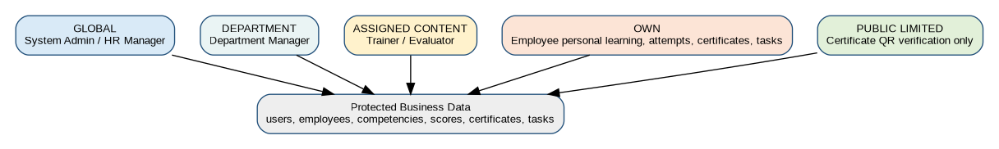
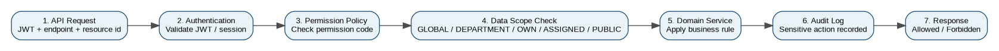

**DigiTalent AI**

**RBAC & Permission Matrix**

_Role-Based Access Control Design for Implementation_

| **Document Item** | **Value** |
| --- | --- |
| Project | DigiTalent AI - Digital Competency Training, Internal Certification and Work-Based Assessment Platform |
| Document Code | 09\_RBAC\_Permission\_Matrix\_DigiTalent\_AI |
| Version | v1.0 - Implementation Preparation |
| Primary Purpose | Define roles, permissions, data scopes, UI/API access rules and security controls before coding. |
| Target Readers | Backend developers, frontend developers, QA testers, project leader, mentor/supervisor. |
| Technology Alignment | ReactJS, TypeScript, TailwindCSS, ShadCN/UI, ASP.NET Core/C#, PostgreSQL, MinIO, Redis optional, SignalR, Docker, Nginx, GitHub Actions. |

**Implementation principle**

The system should not rely on frontend menu hiding only. Every protected API must enforce permission checks and row-level data scope checks in the backend. RBAC is a security boundary, not only a UI feature.

# Table of Contents

*   1\. Purpose and Scope
*   2\. RBAC Design Goals
*   3\. Role Catalog
*   4\. Permission Symbols and Data Scope Model
*   5\. High-Level Permission Matrix
*   6\. Detailed Permission Matrix by Module
*   7\. Role Assignment Rules
*   8\. API Policy Mapping
*   9\. UI Navigation Permission Matrix
*   10\. Critical Authorization Business Rules
*   11\. Backend and Frontend Implementation Guidance
*   12\. Audit, Logging and Security Controls
*   13\. RBAC Test Cases and Acceptance Checklist
*   14\. Seed Data Proposal
*   15\. Risks and Mitigation

# 1\. Purpose and Scope

This document defines the Role-Based Access Control (RBAC) and Permission Matrix for DigiTalent AI. It translates business roles into implementation-ready access rules for frontend navigation, backend APIs, database queries, workflow actions and audit controls.

The matrix is designed for a capstone-scale but production-oriented enterprise web application. The goal is to prevent unclear ownership, accidental data leakage, insecure API access and inconsistent UI behavior when the team starts coding.

*   **In scope:** roles, permissions, operation-level access, data scope, row-level authorization, UI menu visibility, API policy mapping, audit-sensitive actions and testing expectations.
*   **Out of scope:** full enterprise SSO/LDAP/SCIM provisioning, multi-tenant SaaS billing, external HRM integration, and fine-grained ABAC beyond the MVP scope.
*   **Recommended model:** permission-based RBAC with resource/data-scope validation. Role names are user-friendly; permission codes are the backend source of truth.

# 2\. RBAC Design Goals

| **Goal** | **Explanation** | **Implementation Impact** |
| --- | --- | --- |
| Least privilege | Users receive only permissions required for their job role. | Default deny. No broad access for convenience. |
| Backend-enforced security | Frontend controls improve UX but do not secure data. | ASP.NET Core authorization policies and service-level scope checks are mandatory. |
| Row-level data scope | Manager/Trainer/Employee can access only allowed records. | Queries must filter by department, ownership, assigned content or employee id. |
| Business auditability | Sensitive actions must be traceable. | Audit logs for role assignment, certificates, evidence, task evaluation and score overrides. |
| Explainable governance | Mentor/hội đồng can understand why a user can/cannot perform an action. | Permission matrix, role catalog and test cases must be maintained. |
| Scalable without overengineering | Fit capstone MVP while leaving room for future expansion. | Use Modular Monolith, database-seeded permissions and policy-based authorization. |

# 3\. Role Catalog

DigiTalent AI has six main roles. A user may have multiple roles, but effective permissions must still pass resource scope checks. For example, a Department Manager can manage tasks only inside managed department(s), even if the UI menu is visible.

| **Role Code** | **Role Name** | **Scope Type** | **Responsibility** |
| --- | --- | --- | --- |
| SYS\_ADMIN | System Admin | Global technical/system role | Manages users, roles, permissions, system configuration, audit logs and master data. Can perform technical override actions, but business-sensitive overrides must be audited. |
| HR\_MANAGER | HR / Training Manager | Global business role | Owns organization-wide training, competency framework, employee records, certificates, dashboards, score configuration and business governance. |
| DEPT\_MANAGER | Department Manager | Department-scoped business role | Manages employees in assigned department(s), monitors training/readiness, assigns/evaluates WMS-lite practical tasks and views department dashboards. |
| TRAINER | Internal Trainer | Content/assessment authoring role | Creates courses, lessons, learning materials, question banks and assessments. Reviews AI question drafts. May evaluate tasks only when assigned as evaluator. |
| EMPLOYEE | Employee | Own-data role | Learns assigned courses, takes assessments, views own progress/certificates/competency profile, submits tasks and receives feedback. |
| CERT\_VERIFIER | Certificate Verifier | Public/limited verification role | Verifies certificate validity by QR/code. Cannot access full employee profile, scores, internal evidence or organization dashboards. |

## 3.1 Recommended role hierarchy and caution

*   SYS\_ADMIN is a technical/system role. It should not be used as the normal business user for training operations during demo; use HR\_MANAGER for business flows.
*   HR\_MANAGER has global business access but should not manage low-level permission definitions in production.
*   DEPT\_MANAGER is never global by default. Department scope must be stored in database, not inferred from UI only.
*   TRAINER is a content/assessment owner, not an HR governance role. Trainer cannot self-issue certificates to learners without business rules.
*   EMPLOYEE can perform own learning actions but cannot mutate official scores, competency levels, certificate status or approved evidence.
*   CERT\_VERIFIER must receive the smallest possible certificate verification payload.

# 4\. Permission Symbols and Data Scope Model

| **Symbol** | **Meaning** | **Usage Note** |
| --- | --- | --- |
| A   | Full access / administrator-level manage | Allowed with global scope. Sensitive actions still require audit logs. |
| M   | Manage | Create/update/archive/assign within allowed business scope. |
| R   | Read | View/list/search only; no mutation. |
| D   | Department-scoped | Allowed only for employees, tasks, certificates or analytics in managed department(s). |
| O   | Own-data only | Allowed only for the authenticated user employee profile, own learning, own tasks, own certificates. |
| C   | Conditional / assigned ownership | Allowed only when the user is assigned owner, evaluator, trainer, reviewer or course author. |
| S   | Submit/attempt action | Allowed for learner actions such as assessment attempt, lesson completion or task submission. |
| V   | Verify limited | Certificate validity check only; limited fields returned. |
| P   | Public limited | No login required, but response must be minimal and safe. |
| \-  | No access | Denied by default. Frontend must hide UI, backend must still enforce. |

## 4.1 Data scope model

Permissions answer “can this user perform this type of action?”. Data scope answers “on which records can the user perform it?”. DigiTalent AI needs both because many roles can read or manage similar objects, but at different organizational boundaries.

| **Scope Code** | **Typical Roles** | **Rule** | **Example** |
| --- | --- | --- | --- |
| GLOBAL | SYS\_ADMIN, HR\_MANAGER | Can query across company. Still constrained by permission type and business rules. | Company-wide dashboards, employee search, certificate tracking. |
| DEPARTMENT | DEPT\_MANAGER | Can query only employees/tasks/certificates/enrollments under managed department(s). | Department dashboard, task assignment, department risk list. |
| ASSIGNED\_CONTENT | TRAINER | Can query courses, assessments, learners and tasks where trainer is author, owner, evaluator or assigned reviewer. | Course authoring, assessment management, assigned learner progress. |
| OWN | EMPLOYEE and all authenticated users for own profile | Can query only data linked to current user/employee. | My Learning, My Assessments, My Certificates, My Tasks. |
| PUBLIC\_LIMITED | Anonymous or CERT\_VERIFIER | Can access only public-safe certificate verification fields. | QR code verification page. |

## 4.2 Authorization flow

The recommended authorization pipeline is: authenticate user, load effective permissions, validate permission code, validate data scope, enforce domain rule, then record audit if the action is sensitive.

# 5\. High-Level Permission Matrix

This table gives the project team a quick view of access by module. The detailed table in the next section should be treated as the implementation source for permission codes.

| **Module / Capability** | **SYS\_ADMIN** | **HR\_MANAGER** | **DEPT\_MANAGER** | **TRAINER** | **EMPLOYEE** | **CERT\_VERIFIER** | **Rule Note** |
| --- | --- | --- | --- | --- | --- | --- | --- |
| Authentication & own account | A   | M/R | O   | O   | O   | O   | All authenticated users can manage their own profile/password; admin/HR manage accounts. |
| User, role and permission management | A   | M/C | \-  | \-  | \-  | \-  | HR may create employee accounts and assign business roles except SYS\_ADMIN. Permission management is admin-only. |
| Organization and employee management | A   | M   | D/R | C/R | O/R | \-  | Manager sees department employees; Trainer sees assigned learners only. |
| Competency framework management | A   | M   | R/D | R   | O/R | \-  | Only Admin/HR manage framework and position requirements. |
| Employee competency profile and evidence | A   | M/R | D/M | C/M | O/R | \-  | Manager/Trainer can create evidence only for assigned scope; employee cannot edit official level. |
| Course and lesson authoring | A   | M   | R/D | M/C | O/R | \-  | Trainer authors content; HR can govern/publish/assign. |
| Course assignment and enrollment | A   | M   | D/M | C/R | O/R | \-  | Manager can assign only within department when enabled. Employee can view assigned courses. |
| Assessment and question bank | A   | M   | D/R | M/C | S/O | \-  | Employee attempts only assigned/eligible assessments. Trainer cannot change submitted attempt scores without approved workflow. |
| Certificate management and QR verification | A   | M   | D/R | C/R | O/R | V/P | Public verification returns limited certificate validity only. |
| Capability intelligence and scoring | A   | M/R | D/R | C/R | O/R | \-  | Official formulas are rule-based and auditable; AI output is advisory. |
| WMS-lite practical task | A   | M/R | D/M | C/M | S/O | \-  | Manager is primary task evaluator; Trainer may evaluate only when assigned. |
| Dashboard and analytics | A   | M/R | D/R | C/R | O/R | \-  | Dashboard data must follow data scope filtering. |
| Notification and reminder | A   | M   | D/M | C/M | O/R | \-  | Users read own notifications; business roles can send within scope. |
| Audit, configuration and scoring thresholds | A   | M/R | D/R | \-  | \-  | \-  | Admin owns technical config; HR owns business thresholds; department logs are limited. |

# 6\. Detailed Permission Matrix by Module

The permission codes below should be converted into backend constants, database seed data and frontend route guards. Naming convention: <domain>.<resource/action>. For example: certificate.revoke, task.evaluate, employee.read.

## 6.1 Auth & Account

| **Permission Code** | **Description** | **Admin** | **HR** | **Manager** | **Trainer** | **Employee** | **Verifier** | **Scope / Control Note** |
| --- | --- | --- | --- | --- | --- | --- | --- | --- |
| auth.login | Login and receive access/refresh token. | A   | A   | A   | A   | A   | A   | Public endpoint; result depends on valid credentials and active account. |
| auth.refresh\_token | Refresh access token using valid refresh token. | A   | A   | A   | A   | A   | A   | Refresh token must be active, not revoked, not expired. |
| auth.logout | Revoke current session/refresh token. | O   | O   | O   | O   | O   | O   | Own session only. |
| account.view\_own | View own account and basic profile. | O   | O   | O   | O   | O   | O   | All authenticated users. |
| account.update\_own\_profile | Update own non-critical profile fields. | O   | O   | O   | O   | O   | O   | Cannot change role, score, certificate, department, or position. |
| account.change\_own\_password | Change own password after verifying current password. | O   | O   | O   | O   | O   | O   | Password policy enforced. |
| account.reset\_password\_for\_user | Reset password for another user. | A   | C   | \-  | \-  | \-  | \-  | HR can trigger reset for employee accounts; Admin can reset any account. |

## 6.2 User & Role

| **Permission Code** | **Description** | **Admin** | **HR** | **Manager** | **Trainer** | **Employee** | **Verifier** | **Scope / Control Note** |
| --- | --- | --- | --- | --- | --- | --- | --- | --- |
| user.read | List/search/view user accounts. | A   | R   | \-  | \-  | \-  | \-  | HR sees business users; Admin sees all system users. |
| user.create | Create user account. | A   | M   | \-  | \-  | \-  | \-  | HR cannot create SYS\_ADMIN account. |
| user.update | Update account metadata/status. | A   | M   | \-  | \-  | \-  | \-  | HR can update employee business accounts; admin can update all. |
| user.lock\_unlock | Lock/unlock user account. | A   | C   | \-  | \-  | \-  | \-  | HR can suspend employee accounts; reason required. |
| role.read | View system roles and role descriptions. | A   | R   | \-  | \-  | \-  | \-  | Business users normally do not need role catalog. |
| role.assign\_business | Assign business roles to users. | A   | C   | \-  | \-  | \-  | \-  | HR may assign HR\_MANAGER, DEPT\_MANAGER, TRAINER, EMPLOYEE if policy allows; not SYS\_ADMIN. |
| permission.read | View permission catalog. | A   | R   | \-  | \-  | \-  | \-  | Useful for governance and audit. |
| permission.manage | Create/update permission definitions or role-permission mapping. | A   | \-  | \-  | \-  | \-  | \-  | Admin-only. Prefer seed/migration controlled changes. |

## 6.3 Organization

| **Permission Code** | **Description** | **Admin** | **HR** | **Manager** | **Trainer** | **Employee** | **Verifier** | **Scope / Control Note** |
| --- | --- | --- | --- | --- | --- | --- | --- | --- |
| department.read | List/view departments. | A   | R   | D/R | R   | O/R | \-  | Employee can see own department summary only. |
| department.create\_update | Create/update/archive departments. | A   | M   | \-  | \-  | \-  | \-  | Department archival should not hard-delete historical data. |
| job\_position.read | List/view job positions. | A   | R   | D/R | R   | O/R | \-  | Employee can see own position and related requirements. |
| job\_position.create\_update | Create/update/archive job positions. | A   | M   | \-  | \-  | \-  | \-  | Position must have competency requirements before full use. |
| employee.read | View employee profiles. | A   | R   | D/R | C/R | O/R | \-  | Trainer can view assigned learners only. Manager department scope required. |
| employee.create\_update | Create/update employee profiles. | A   | M   | \-  | \-  | \-  | \-  | Employee cannot change department, manager or job position. |
| employee.transfer | Transfer employee to another department/position/manager. | A   | M   | \-  | \-  | \-  | \-  | Must create history/audit log and recalculate requirements if position changes. |
| employee.archive\_restore | Archive/restore employee profile. | A   | M   | \-  | \-  | \-  | \-  | Soft delete only; training/certificate history preserved. |
| manager\_assignment.manage | Assign direct manager or department manager. | A   | M   | \-  | \-  | \-  | \-  | Required for department-scoped access. |

## 6.4 Competency

| **Permission Code** | **Description** | **Admin** | **HR** | **Manager** | **Trainer** | **Employee** | **Verifier** | **Scope / Control Note** |
| --- | --- | --- | --- | --- | --- | --- | --- | --- |
| competency\_category.read | View competency categories. | A   | R   | R   | R   | O/R | \-  | Employee sees categories related to own profile/assigned courses. |
| competency\_category.manage | Create/update/archive competency categories. | A   | M   | \-  | \-  | \-  | \-  | HR owns business taxonomy. |
| competency.read | View competency definitions and level criteria. | A   | R   | R   | R   | O/R | \-  | Read access supports transparency. |
| competency.manage | Create/update/archive competencies and levels. | A   | M   | \-  | \-  | \-  | \-  | Changes must be versioned/audited because scores depend on them. |
| position\_requirement.read | View required competencies for a job position. | A   | R   | D/R | R   | O/R | \-  | Employee can view own target requirements. |
| position\_requirement.manage | Create/update competency requirements by position. | A   | M   | \-  | \-  | \-  | \-  | Requires weight, target level and mandatory flag. |
| employee\_competency\_profile.read | View employee competency profile. | A   | R   | D/R | C/R | O/R | \-  | Trainer assigned learners only. |
| employee\_competency\_profile.override | Manually override official competency level. | A   | C   | \-  | \-  | \-  | \-  | Rare governance action; reason and audit log required. Prefer evidence-driven updates. |

## 6.5 Competency Evidence

| **Permission Code** | **Description** | **Admin** | **HR** | **Manager** | **Trainer** | **Employee** | **Verifier** | **Scope / Control Note** |
| --- | --- | --- | --- | --- | --- | --- | --- | --- |
| evidence.read | View competency evidence portfolio. | A   | R   | D/R | C/R | O/R | \-  | Employee sees own evidence; may not see private manager notes if configured. |
| evidence.create\_manual | Create manual/manager/trainer evidence. | A   | M   | D/M | C/M | \-  | \-  | Employee evidence is created through assessment/certificate/task workflows, not manual self-approval. |
| evidence.approve\_confirm | Approve/confirm evidence and competency impact. | A   | M   | D/M | C/M | \-  | \-  | Manager/Trainer confirmation must be within scope. |
| evidence.revoke | Revoke invalid evidence. | A   | M   | D/C | \-  | \-  | \-  | Reason required; keep audit history. |

## 6.6 Course

| **Permission Code** | **Description** | **Admin** | **HR** | **Manager** | **Trainer** | **Employee** | **Verifier** | **Scope / Control Note** |
| --- | --- | --- | --- | --- | --- | --- | --- | --- |
| course.read\_catalog | View course catalog/assigned courses. | A   | R   | D/R | R   | O/R | \-  | Employee sees assigned/published courses only. |
| course.create | Create course draft. | A   | M   | \-  | M   | \-  | \-  | Trainer is primary author; HR can create governance courses. |
| course.update | Update course metadata/content. | A   | M   | \-  | C/M | \-  | \-  | Trainer can update own/assigned course. |
| course.publish\_unpublish | Publish/unpublish course. | A   | M   | \-  | C   | \-  | \-  | Trainer publish may require HR approval depending on workflow. |
| course.archive | Archive course. | A   | M   | \-  | C   | \-  | \-  | Do not delete enrollments/history. |
| course\_competency.manage | Map course to competencies and target levels. | A   | M   | \-  | C/M | \-  | \-  | Required for recommendation and competency tracking. |

## 6.7 Learning Material

| **Permission Code** | **Description** | **Admin** | **HR** | **Manager** | **Trainer** | **Employee** | **Verifier** | **Scope / Control Note** |
| --- | --- | --- | --- | --- | --- | --- | --- | --- |
| material.upload | Upload lesson material to MinIO. | A   | M   | \-  | C/M | \-  | \-  | Validate file type, size and malware risk if supported. |
| material.download\_view | Download/view learning material. | A   | R   | D/R | C/R | O/R | \-  | Access depends on course publication/enrollment/author scope. |
| material.delete\_archive | Remove/archive material. | A   | M   | \-  | C/M | \-  | \-  | Prefer archive to preserve lesson history. |

## 6.8 Course Assignment

| **Permission Code** | **Description** | **Admin** | **HR** | **Manager** | **Trainer** | **Employee** | **Verifier** | **Scope / Control Note** |
| --- | --- | --- | --- | --- | --- | --- | --- | --- |
| course\_assignment.create | Assign course to employee/department/position. | A   | M   | D/M | \-  | \-  | \-  | Department manager can assign only to own department if enabled. |
| course\_assignment.read | View course assignments/enrollments. | A   | R   | D/R | C/R | O/R | \-  | Trainer sees assigned courses; employee sees own enrollment. |
| course\_assignment.cancel | Cancel or withdraw assignment. | A   | M   | D/C | \-  | \-  | \-  | Must keep audit trail. |

## 6.9 Learning Progress

| **Permission Code** | **Description** | **Admin** | **HR** | **Manager** | **Trainer** | **Employee** | **Verifier** | **Scope / Control Note** |
| --- | --- | --- | --- | --- | --- | --- | --- | --- |
| learning\_progress.read | View learning progress. | A   | R   | D/R | C/R | O/R | \-  | Employee owns own progress. |
| lesson.complete | Mark lesson complete / update progress. | \-  | \-  | \-  | \-  | S   | \-  | Employee action only; backend must validate enrollment. |

## 6.10 Assessment

| **Permission Code** | **Description** | **Admin** | **HR** | **Manager** | **Trainer** | **Employee** | **Verifier** | **Scope / Control Note** |
| --- | --- | --- | --- | --- | --- | --- | --- | --- |
| question\_bank.read | View question banks and questions. | A   | R   | \-  | R   | \-  | \-  | Questions hidden from employees before/after attempt unless review mode allows. |
| question.create\_update | Create/update questions manually. | A   | M   | \-  | M   | \-  | \-  | Trainer primary owner. |
| question.ai\_generate\_draft | Generate AI draft questions. | A   | M   | \-  | M   | \-  | \-  | AI output must be draft only. |
| question.approve\_publish | Approve question for official use. | A   | M   | \-  | M   | \-  | \-  | Trainer/HR review required before use. |
| assessment.read | View assessment metadata. | A   | R   | D/R | R   | O/R | \-  | Employee sees assigned/eligible assessments. |
| assessment.create\_update | Create/update assessment and scoring rules. | A   | M   | \-  | M   | \-  | \-  | Assessment must have passing score and attempt rules. |
| assessment.publish\_close | Publish/close assessment. | A   | M   | \-  | C/M | \-  | \-  | Published assessment cannot be changed in a way that invalidates existing attempts. |

## 6.11 Assessment Attempt

| **Permission Code** | **Description** | **Admin** | **HR** | **Manager** | **Trainer** | **Employee** | **Verifier** | **Scope / Control Note** |
| --- | --- | --- | --- | --- | --- | --- | --- | --- |
| attempt.start | Start an assessment attempt. | \-  | \-  | \-  | \-  | S   | \-  | Only if enrolled, within attempt limit and assessment is open. |
| attempt.submit | Submit answers for scoring. | \-  | \-  | \-  | \-  | S   | \-  | Submission becomes immutable after finalization. |
| attempt.read\_result | View attempt result/score. | A   | R   | D/R | C/R | O/R | \-  | Employees see own result and allowed feedback. |
| attempt.regrade\_override | Regrade or override attempt result. | A   | C   | \-  | C   | \-  | \-  | Exception workflow only; reason and audit required. |
| assessment\_result.export | Export assessment results. | A   | M   | D/R | C/R | \-  | \-  | No raw answer export to unauthorized users. |

## 6.12 Certificate

| **Permission Code** | **Description** | **Admin** | **HR** | **Manager** | **Trainer** | **Employee** | **Verifier** | **Scope / Control Note** |
| --- | --- | --- | --- | --- | --- | --- | --- | --- |
| certificate\_template.manage | Create/update certificate template. | A   | M   | \-  | \-  | \-  | \-  | Templates controlled by HR/Admin. |
| certificate.issue\_auto | Automatically issue certificate after completion rules pass. | A   | M   | \-  | \-  | \-  | \-  | System action; HR/Admin can trigger recalculation/re-issue if needed. |
| certificate.issue\_manual | Manually issue certificate. | A   | M   | \-  | \-  | \-  | \-  | Manual issue requires reason and evidence. |
| certificate.read | View certificate detail. | A   | R   | D/R | C/R | O/R | V   | Verifier receives limited fields only. |
| certificate.download\_pdf | Download generated certificate PDF. | A   | R   | D/R | C/R | O/R | \-  | Download access follows data scope. Public verification should not expose private PDF unless intentionally allowed. |
| certificate.verify\_public | Verify certificate by QR/code. | P   | P   | P   | P   | P   | P/V | Returns minimal validity data: code, status, holder display name, course/certificate name, issue/expiry. |
| certificate.revoke | Revoke certificate. | A   | M   | \-  | \-  | \-  | \-  | Reason required; certificate becomes invalid immediately. |
| certificate.renew | Renew certificate when eligible. | A   | M   | \-  | \-  | \-  | \-  | Renewal requires valid rule, assessment or recertification workflow. |
| certificate\_verification\_log.read | Read verification logs. | A   | R   | \-  | \-  | \-  | \-  | May include IP/time; restrict to admin/HR. |

## 6.13 Capability Intelligence

| **Permission Code** | **Description** | **Admin** | **HR** | **Manager** | **Trainer** | **Employee** | **Verifier** | **Scope / Control Note** |
| --- | --- | --- | --- | --- | --- | --- | --- | --- |
| skill\_gap.calculate | Calculate skill gap from position requirements and employee competency profile. | A   | M   | D/R | C/R | O/R | \-  | Formula-driven. Calculation can be system-triggered. |
| skill\_gap.read | View skill gap result. | A   | R   | D/R | C/R | O/R | \-  | Scope filtering required. |
| learning\_recommendation.generate | Generate learning recommendations. | A   | M   | D/R | C/R | O/R | \-  | Core rule-based; AI text explanation optional. |
| learning\_recommendation.read | View recommended learning path. | A   | R   | D/R | C/R | O/R | \-  | Employee sees own recommendation. |
| training\_risk.calculate | Calculate training risk score. | A   | M   | D/R | \-  | O/R | \-  | Risk formula uses progress, low scores, inactivity, deadline and failed attempts. |
| training\_risk.read | View training risk score and reason. | A   | R   | D/R | C/R | O/R | \-  | Employee may see warning; HR/Manager see risk list within scope. |
| readiness.calculate | Calculate workforce readiness score. | A   | M   | D/R | \-  | O/R | \-  | Triggered after competency, certificate, progress or task updates. |
| readiness.read | View readiness score. | A   | R   | D/R | C/R | O/R | \-  | Department manager sees department readiness only. |
| career\_readiness.read | View career/promotion readiness. | A   | M/R | D/R | \-  | O/R | \-  | Optional/bonus. Advisory, not official promotion decision. |
| ai\_explanation.read | View AI/rule explanation logs. | A   | R   | D/R | C/R | O/R | \-  | Hide raw sensitive prompt data from unauthorized users. |
| scoring\_config.manage | Manage scoring weights/thresholds. | A   | M   | \-  | \-  | \-  | \-  | Must not be hard-coded. Version and audit changes. |
| ai\_prompt\_template.manage | Manage AI prompt templates. | A   | M   | \-  | C/M | \-  | \-  | Trainer can manage content generation prompts only if allowed. |

## 6.14 WMS-lite Task

| **Permission Code** | **Description** | **Admin** | **HR** | **Manager** | **Trainer** | **Employee** | **Verifier** | **Scope / Control Note** |
| --- | --- | --- | --- | --- | --- | --- | --- | --- |
| task\_suggestion.generate | Generate practical task suggestion. | A   | M   | D/M | C/M | \-  | \-  | AI suggestion is draft; Manager/Trainer must review. |
| task.create | Create practical task. | A   | M   | D/M | C/M | \-  | \-  | Must include description, deadline, expected output and evaluation criteria. |
| task.assign | Assign task to employee. | A   | M   | D/M | C   | \-  | \-  | Assignee must be within allowed scope. |
| task.read | View task detail. | A   | R   | D/R | C/R | O/R | \-  | Employee sees assigned tasks only. |
| task.update\_progress | Update task progress. | \-  | \-  | \-  | \-  | S/O | \-  | Assignee action before submission. |
| task.submit | Submit task result/file. | \-  | \-  | \-  | \-  | S/O | \-  | Submission must meet file validation and deadline rules. |
| task.evaluate | Evaluate task, score and feedback. | A   | M   | D/M | C/M | \-  | \-  | Evaluator must be manager/trainer assigned to the task. |
| task.reopen | Reopen task after revision request. | A   | M   | D/M | C/M | \-  | \-  | Reason required. |
| task.cancel | Cancel task. | A   | M   | D/M | C   | \-  | \-  | Cannot delete evaluated task; use status transition. |
| task\_attachment.download | Download task submission attachments. | A   | R   | D/R | C/R | O/R | \-  | Scope filtering and signed URL recommended. |

## 6.15 Dashboard

| **Permission Code** | **Description** | **Admin** | **HR** | **Manager** | **Trainer** | **Employee** | **Verifier** | **Scope / Control Note** |
| --- | --- | --- | --- | --- | --- | --- | --- | --- |
| dashboard.hr\_company.read | View HR company-wide dashboard. | A   | R   | \-  | \-  | \-  | \-  | Company-wide heatmap, readiness, risk, certificates, learning progress. |
| dashboard.department.read | View department dashboard. | A   | R   | D/R | \-  | \-  | \-  | Department manager sees only managed department(s). |
| dashboard.trainer.read | View trainer dashboard. | A   | R   | \-  | C/R | \-  | \-  | Course/assessment authoring and learner progress for assigned courses. |
| dashboard.employee.read | View employee dashboard. | A   | R   | D/R | C/R | O/R | \-  | Employee sees own learning, tasks, certificates, competency. |
| report.export | Export reports. | A   | M   | D/R | C/R | \-  | \-  | Export must obey the same data scope as the screen. |
| competency\_heatmap.read | View competency heatmap. | A   | R   | D/R | \-  | \-  | \-  | MVP can support HR/company and manager/department versions. |

## 6.16 Notification

| **Permission Code** | **Description** | **Admin** | **HR** | **Manager** | **Trainer** | **Employee** | **Verifier** | **Scope / Control Note** |
| --- | --- | --- | --- | --- | --- | --- | --- | --- |
| notification.read\_own | Read own notifications. | O   | O   | O   | O   | O   | O   | Own notifications only. |
| notification.mark\_read | Mark own notifications as read. | O   | O   | O   | O   | O   | O   | Own notification only. |
| notification.send | Send notification/reminder. | A   | M   | D/M | C/M | \-  | \-  | Business role can send within authorized scope. |
| notification\_template.manage | Manage notification templates. | A   | M   | \-  | \-  | \-  | \-  | HR/Admin only. |
| signalr.connect | Connect to SignalR hub. | A   | A   | A   | A   | A   | A   | Authenticated connection; hub events filtered by user id/scope. |

## 6.17 File Storage

| **Permission Code** | **Description** | **Admin** | **HR** | **Manager** | **Trainer** | **Employee** | **Verifier** | **Scope / Control Note** |
| --- | --- | --- | --- | --- | --- | --- | --- | --- |
| file.upload\_material | Upload course/lesson material. | A   | M   | \-  | C/M | \-  | \-  | MinIO object metadata linked to lesson/material. |
| file.upload\_task\_submission | Upload task submission file. | \-  | \-  | \-  | \-  | S/O | \-  | Employee assignee only before/equal deadline unless revision allowed. |
| file.download\_authorized | Download authorized file. | A   | R   | D/R | C/R | O/R | \-  | Use signed URL or backend proxy; never expose bucket publicly. |
| file.delete\_archive | Archive/delete file object metadata. | A   | M   | \-  | C/M | C/O | \-  | Employee can remove own draft submission only before submit if allowed. |

## 6.18 Audit & Config

| **Permission Code** | **Description** | **Admin** | **HR** | **Manager** | **Trainer** | **Employee** | **Verifier** | **Scope / Control Note** |
| --- | --- | --- | --- | --- | --- | --- | --- | --- |
| audit\_log.read\_system | Read system-wide audit logs. | A   | R   | \-  | \-  | \-  | \-  | HR read may be limited to business logs; admin sees security logs. |
| audit\_log.read\_department | Read department-level task/evidence audit logs. | A   | R   | D/R | \-  | \-  | \-  | Department manager limited to managed department. |
| system\_config.manage | Manage system settings, CORS, feature flags, storage, integrations. | A   | \-  | \-  | \-  | \-  | \-  | Admin-only technical configuration. |
| business\_config.manage | Manage business thresholds, certificate expiry policy, attempt rules. | A   | M   | \-  | \-  | \-  | \-  | HR-owned business settings. |
| master\_data.manage | Manage controlled master data/enums. | A   | M   | \-  | \-  | \-  | \-  | No hard delete if referenced by history. |

# 7\. Role Assignment Rules

Role assignment is a sensitive action. The system should separate user creation from role assignment and should record who assigned which role, to whom, when and why.

| **Role Assignment Action** | **SYS\_ADMIN** | **HR\_MANAGER** | **DEPT\_MANAGER** | **TRAINER** | **EMPLOYEE** | **CERT\_VERIFIER** | **Control Note** |
| --- | --- | --- | --- | --- | --- | --- | --- |
| Assign SYS\_ADMIN | A   | \-  | \-  | \-  | \-  | \-  | Only existing SYS\_ADMIN can assign. Requires extra confirmation and audit. |
| Assign HR\_MANAGER | A   | C   | \-  | \-  | \-  | \-  | HR assignment by HR should be controlled by policy; safer MVP: Admin only. |
| Assign DEPT\_MANAGER | A   | M   | \-  | \-  | \-  | \-  | Must also define department scope. |
| Assign TRAINER | A   | M   | \-  | \-  | \-  | \-  | Trainer may need course ownership/assignment. |
| Assign EMPLOYEE | A   | M   | \-  | \-  | \-  | \-  | Default role for employee accounts. |
| Assign CERT\_VERIFIER | A   | M   | \-  | \-  | \-  | \-  | Use only if authenticated verifier portal is implemented; QR verification can also be public. |

*   A user can have multiple roles, but the most sensitive scope must still be checked by resource ownership or department assignment.
*   Removing a user role should not delete historical records created by that user.
*   Changing a Department Manager role must also update department manager assignments or access will be ambiguous.
*   For MVP, avoid letting HR assign SYS\_ADMIN to reduce security risk.

# 8\. API Policy Mapping

Each API endpoint should declare a required permission policy. The controller can check the coarse permission, while the service layer validates resource scope and business rules. This prevents an endpoint from returning records outside the user scope.

| **Endpoint Example** | **Required Permission** | **Allowed Scope** | **Implementation Note** |
| --- | --- | --- | --- |
| GET /api/v1/employees | employee.read | Admin/HR: GLOBAL. Manager: DEPARTMENT. Trainer: ASSIGNED\_CONTENT. Employee: not list, only own detail. | Service must apply row-level filter; frontend filtering is not enough. |
| GET /api/v1/employees/{id}/competency-profile | employee\_competency\_profile.read | GLOBAL / DEPARTMENT / ASSIGNED\_CONTENT / OWN | Return 403 when user has role but lacks resource scope. |
| PUT /api/v1/job-positions/{id}/competency-requirements | position\_requirement.manage | SYS\_ADMIN or HR\_MANAGER only | Changing requirements should create audit and may trigger recalculation. |
| POST /api/v1/course-assignments | course\_assignment.create | HR global; Manager department-scoped if enabled | Reject cross-department assignment by manager. |
| POST /api/v1/assessments/{id}/attempts | attempt.start | Employee own enrollment only | Validate published assessment, enrollment, attempt limit and deadline. |
| POST /api/v1/certificates/issue | certificate.issue\_manual | Admin/HR only | Manual issue requires reason and eligible evidence. |
| GET /api/v1/certificates/verify/{code} | certificate.verify\_public | Public limited | Return only safe verification payload. |
| POST /api/v1/practical-tasks/{id}/evaluate | task.evaluate | Manager department-scoped or assigned Trainer evaluator | Evaluation creates evidence and triggers readiness recalculation. |
| GET /api/v1/dashboard/hr | dashboard.hr\_company.read | Admin/HR only | No department-only role should access company-wide dashboard. |
| GET /api/v1/audit-logs | audit\_log.read\_system | Admin; HR limited business logs | Security/system logs are admin-only. |

## 8.1 Example backend policy naming

**ASP.NET Core controller example**

\[Authorize(Policy = "permission:employee.read")\]

\[HttpGet("/api/v1/employees")\]

public async Task<IActionResult> GetEmployees(\[FromQuery\] EmployeeFilterRequest request)

{

// Permission is checked by policy.

// Data scope is checked in service/query layer using CurrentUserService.

var result = await \_employeeService.SearchAsync(request, CurrentUser);

return Ok(ApiResponse.Success(result));

}

## 8.2 Recommended JWT claims

| **Claim** | **Purpose** | **Recommended Note** |
| --- | --- | --- |
| sub / user\_id | Identify authenticated account. | Required for all authenticated requests. |
| employee\_id | Map user to employee profile. | Required for own-data scope. |
| roles | User-friendly role list. | Useful for UI, but do not rely on roles only. |
| permission\_version | Detect stale permission cache/token. | Useful when permissions are cached in Redis or loaded server-side. |
| department\_ids / managed\_department\_ids | Support department-scoped access. | Can be token claim or loaded server-side. Avoid oversized JWT. |

**Token size warning**

If the permission catalog grows, do not put every permission in the JWT. Prefer roles + permission version in token, then load effective permissions from database/Redis on the backend.

# 9\. UI Navigation Permission Matrix

Frontend route guards and sidebar visibility should follow the matrix below. However, backend authorization remains mandatory even if a menu is hidden.

| **Screen/Menu** | **Admin** | **HR** | **Manager** | **Trainer** | **Employee** | **Verifier** | **Visibility Rule** |
| --- | --- | --- | --- | --- | --- | --- | --- |
| Admin Dashboard | Yes | No  | No  | No  | No  | No  | System configuration, users, roles, audit. |
| HR Dashboard | Yes | Yes | No  | No  | No  | No  | Company-wide capability governance. |
| Manager Dashboard | Yes | Yes | Yes | No  | No  | No  | Department-scoped dashboard. |
| Trainer Dashboard | Yes | Yes | No  | Yes | No  | No  | Course/assessment authoring and learner tracking. |
| Employee Dashboard | Yes | Yes | Limited | Limited | Yes | No  | Own learning/tasks/certificates. |
| User Management | Yes | Limited | No  | No  | No  | No  | HR cannot manage SYS\_ADMIN. |
| Departments & Positions | Yes | Yes | Read | Read | Own Read | No  | Employee sees own position requirements. |
| Employee Management | Yes | Yes | Dept Read | Assigned Read | Own Read | No  | Strict scope filtering. |
| Competency Framework | Yes | Yes | Read | Read | Own Read | No  | Only Admin/HR manage. |
| Courses | Yes | Yes | Read/Assign | Author | Assigned | No  | Trainer authoring and employee learning. |
| Question Bank & Assessment | Yes | Yes | Read Result | Author | Attempt | No  | Question content hidden from employee. |
| Certificates | Yes | Yes | Dept Read | Assigned Read | Own | Verify | Verifier limited view only. |
| Practical Tasks | Yes | Yes | Dept Manage | Assigned Manage | Assigned Submit | No  | WMS-lite scope. |
| Evidence Portfolio | Yes | Yes | Dept Read/Confirm | Assigned Read/Confirm | Own Read | No  | Employee cannot self-confirm. |
| Reports/Exports | Yes | Yes | Dept Export | Assigned Export | No  | No  | Exports obey same scope as UI. |
| Audit Logs | Yes | Limited | Dept Limited | No  | No  | No  | Sensitive logs protected. |

# 10\. Critical Authorization Business Rules

| **Rule ID** | **Rule** | **Explanation** |
| --- | --- | --- |
| RBAC-01 | Deny by default | If no explicit permission exists for a role and scope, the action is denied. |
| RBAC-02 | Backend enforcement first | UI hiding is only UX support. Every API and service method must validate permission and data scope. |
| RBAC-03 | Permission-based, not role-only | Use role-to-permission mapping. Avoid hard-coding role names in business logic except for bootstrapping/critical system policies. |
| RBAC-04 | Row-level scope validation | Department, assigned content and own-data filters must be applied in query/service layer. |
| RBAC-05 | Employee self-service boundary | Employee can learn, attempt, submit and view own data, but cannot modify official scores, certificates, competency levels or evidence approval. |
| RBAC-06 | Manager department boundary | Department Manager cannot access or mutate employees/tasks/results outside managed department(s). |
| RBAC-07 | Trainer authoring boundary | Trainer can create content and assessments but cannot grant official certificates or change employee competency level directly. |
| RBAC-08 | Certificate verifier minimization | Verifier/public QR response must not expose full employee profile, assessment answers, task evidence or internal notes. |
| RBAC-09 | Sensitive mutation audit | Role assignment, score override, certificate issue/revoke, evidence approval, task evaluation and threshold changes must be audited. |
| RBAC-10 | Configurable thresholds | Score thresholds and readiness weights should be stored as versioned configuration, not hard-coded. |
| RBAC-11 | AI human-in-the-loop | AI-generated questions/tasks/explanations are drafts or advisory; official publication/evaluation requires authorized human review. |
| RBAC-12 | Soft delete for historical entities | Important business records should use archive/status instead of hard delete. |

# 11\. Backend and Frontend Implementation Guidance

## 11.1 Backend guidance for ASP.NET Core

*   Create a central PermissionConstants class or enum source generated from seed data. Avoid string literals scattered across controllers.
*   Use ASP.NET Core policy-based authorization for coarse permission checks: permission:<permission\_code>.
*   Create a CurrentUserService that exposes user id, employee id, roles, managed department ids and assigned course/task evaluator ids when needed.
*   Apply data scope filters in service/query layer. Example: Department Manager employee queries must filter by managed department ids.
*   Use resource-based authorization for actions that need resource id validation, such as task.evaluate or certificate.read.
*   Sensitive mutations should be wrapped with audit logging. Audit record should include actor, action, target entity, reason, timestamp and before/after when feasible.
*   Do not allow direct update of official calculated scores by normal CRUD endpoints. Use domain services that recalculate or override with reason.

## 11.2 Frontend guidance for React/TypeScript

*   Load current user profile, roles and allowed menu permissions after login via /auth/me.
*   Implement route guard by permission and role scope. Example: RequirePermission("dashboard.hr\_company.read").
*   Hide unavailable menu items but still handle 401/403 API responses gracefully.
*   Use component-level permission checks for action buttons such as Revoke Certificate, Evaluate Task, Assign Course.
*   Never trust hidden UI as security. Users can still call API directly; backend must enforce.
*   Show clear error messages for forbidden actions: "You do not have permission to access this resource." Do not leak whether hidden data exists.

## 11.3 Suggested backend folder placement

DigiTalent.Api/

Authorization/

PermissionConstants.cs

PermissionRequirement.cs

PermissionAuthorizationHandler.cs

ResourceScopeAuthorizationService.cs

Identity/

CurrentUserService.cs

Common/

Audit/AuditLogService.cs

Responses/ApiResponse.cs

Modules/

Employees/

Courses/

Assessments/

Certificates/

PracticalTasks/

CapabilityIntelligence/

# 12\. Audit, Logging and Security Controls

RBAC should be connected to audit and observability. Permission failures, suspicious access patterns and sensitive business actions should be traceable.

| **Action Type** | **Audit Required?** | **Reason / Data to Store** |
| --- | --- | --- |
| Login failure / lockout | Yes | Security monitoring and brute-force detection. |
| Role assignment/removal | Yes | Track privilege changes and prevent unauthorized escalation. |
| Department manager scope change | Yes | Changes who can access employee data. |
| Certificate issue/revoke/renew | Yes | Certificate validity is business-critical. |
| Assessment score override/regrade | Yes | Can affect certification and competency profile. |
| Task evaluation/reopen/cancel | Yes | Can create evidence and affect readiness score. |
| Competency level override | Yes | Directly changes employee capability profile. |
| Score weight/threshold update | Yes | Affects readiness/risk outputs. |
| AI question/task generation | Recommended | Useful for explainability and defense/demo. |

# 13\. RBAC Test Cases and Acceptance Checklist

| **Test ID** | **Scenario** | **Expected Result** |
| --- | --- | --- |
| RBAC-TC-01 | Employee attempts to open another employee profile | 403 Forbidden; no data returned. |
| RBAC-TC-02 | Department Manager lists employees | Only employees in managed department(s) are returned. |
| RBAC-TC-03 | Department Manager assigns task to employee outside department | Request rejected with scope violation. |
| RBAC-TC-04 | Trainer updates a course they own | Allowed if course ownership/assignment matches. |
| RBAC-TC-05 | Trainer updates another trainer course without assignment | 403 Forbidden. |
| RBAC-TC-06 | Employee submits assessment twice after attempt is finalized | Rejected according to attempt rules. |
| RBAC-TC-07 | Employee modifies assessment score through API | 403 Forbidden and attempt result remains unchanged. |
| RBAC-TC-08 | HR revokes certificate without reason | Rejected due to validation rule. |
| RBAC-TC-09 | Public user verifies a certificate code | Allowed, limited verification response only. |
| RBAC-TC-10 | Public user accesses certificate PDF private URL directly | Denied unless public PDF exposure is explicitly enabled. |
| RBAC-TC-11 | HR views company dashboard | Allowed with global data. |
| RBAC-TC-12 | Department Manager opens HR dashboard endpoint | 403 Forbidden. |
| RBAC-TC-13 | Role assignment to SYS\_ADMIN by HR user | Denied; admin-only. |
| RBAC-TC-14 | Changing readiness score weights | Allowed only Admin/HR; audit log is created. |
| RBAC-TC-15 | Task evaluation by unassigned Trainer | Denied unless trainer is assigned evaluator/owner. |
| RBAC-TC-16 | SignalR notification event for other user | Not delivered; hub filters by user and scope. |

## 13.1 Acceptance checklist

*   All protected APIs return 401 when unauthenticated and 403 when authenticated but unauthorized.
*   Employee cannot access other employees by changing URL id.
*   Department Manager cannot access cross-department records through API filters or direct id.
*   Trainer cannot modify courses, assessments or tasks they do not own/are not assigned to.
*   Public certificate verification returns only limited certificate data.
*   Sensitive business actions create audit logs.
*   Frontend menu/action buttons follow permission matrix but backend remains the final gate.
*   Role and permission seed data can be recreated in a clean environment.

# 14\. Seed Data Proposal

The following seed structure is recommended for EF Core migrations or a controlled SQL seed script. This allows the team to keep RBAC consistent across development, staging and demo environments.

| **Seed Table** | **Key Fields** | **Purpose** |
| --- | --- | --- |
| roles | id, code, name, description, is\_system | Stores SYS\_ADMIN, HR\_MANAGER, DEPT\_MANAGER, TRAINER, EMPLOYEE, CERT\_VERIFIER. |
| permissions | id, code, module, description, risk\_level | Stores permission catalog from this document. |
| role\_permissions | role\_id, permission\_id, scope\_type | Maps roles to permissions and default scope. |
| user\_roles | user\_id, role\_id, assigned\_by, assigned\_at | Stores assigned roles per user. |
| department\_managers | employee\_id, department\_id, active\_from, active\_to | Defines department scope for managers. |
| course\_trainers | course\_id, trainer\_employee\_id, role | Defines author/reviewer/trainer scope. |
| task\_evaluators | task\_id, evaluator\_employee\_id | Defines task evaluation scope. |
| audit\_logs | actor\_id, action, target\_type, target\_id, reason, before\_json, after\_json, created\_at | Tracks sensitive changes. |

## 14.1 Example permission seed snippet

Permission: employee.read

Module: Organization

Default role mappings:

SYS\_ADMIN -> GLOBAL

HR\_MANAGER -> GLOBAL

DEPT\_MANAGER -> DEPARTMENT

TRAINER -> ASSIGNED\_CONTENT

EMPLOYEE -> OWN

CERT\_VERIFIER -> NONE

Permission: certificate.verify\_public

Module: Certificate

Default role mappings:

Anonymous/Public -> PUBLIC\_LIMITED

CERT\_VERIFIER -> PUBLIC\_LIMITED

# 15\. Risks and Mitigation

| **Risk** | **Impact** | **Mitigation** |
| --- | --- | --- |
| Only frontend hides menus but backend does not enforce | Critical data leakage and unauthorized mutation. | Implement backend authorization policies and service-level data scope checks. |
| Department scope is not modeled in database | Managers may see wrong employees or no employees. | Create explicit department manager mapping and test it. |
| Too many role checks hard-coded in controllers | Difficult to maintain and inconsistent behavior. | Use permission constants, policy handlers and scope services. |
| Public certificate endpoint returns too much data | Privacy leak. | Return minimal verification payload and never expose internal evidence/scores. |
| Trainer can modify submitted attempts or official scores | Academic/business integrity risk. | Submitted attempts immutable; override requires HR/Admin approval and audit. |
| Admin used for all demo flows | Demo does not prove business RBAC. | Demo with HR, Manager, Trainer and Employee accounts separately. |
| Role/permission seed differs between environments | Bugs that appear only in staging/demo. | Versioned seed scripts and permission\_version strategy. |

# 16\. Final Recommendation

**Recommended implementation decision**

For DigiTalent AI, use permission-based RBAC with resource/data-scope validation. Start with six roles and the permission catalog in this document. Do not implement a complex external policy engine in MVP. The cleanest approach is ASP.NET Core policy-based authorization plus database-seeded permissions, a CurrentUserService, and resource-scope checks inside domain services.

This document should be reviewed together with the API Specification and Database Design documents before backend coding starts. Any change in role responsibility must update the permission matrix, route guards, API policies, test cases and seed data.