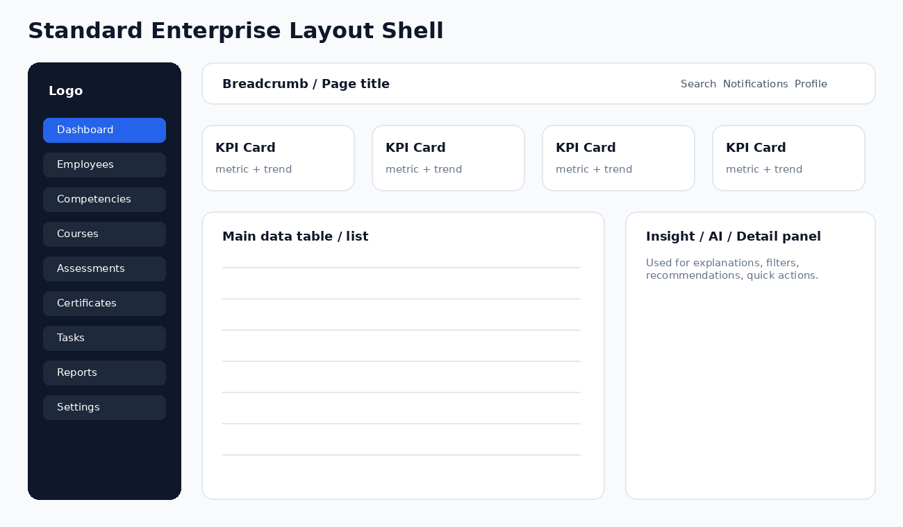
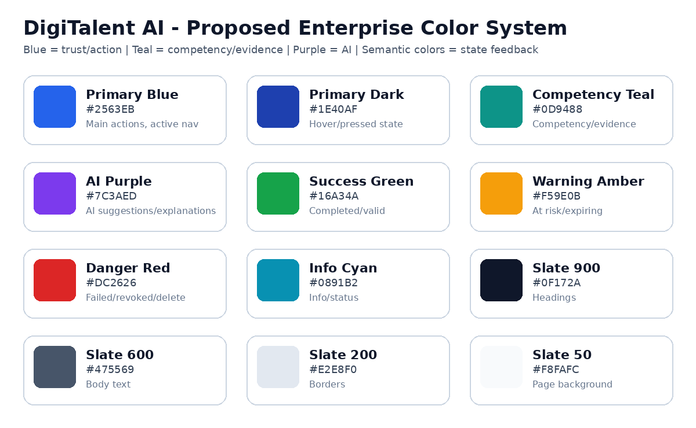
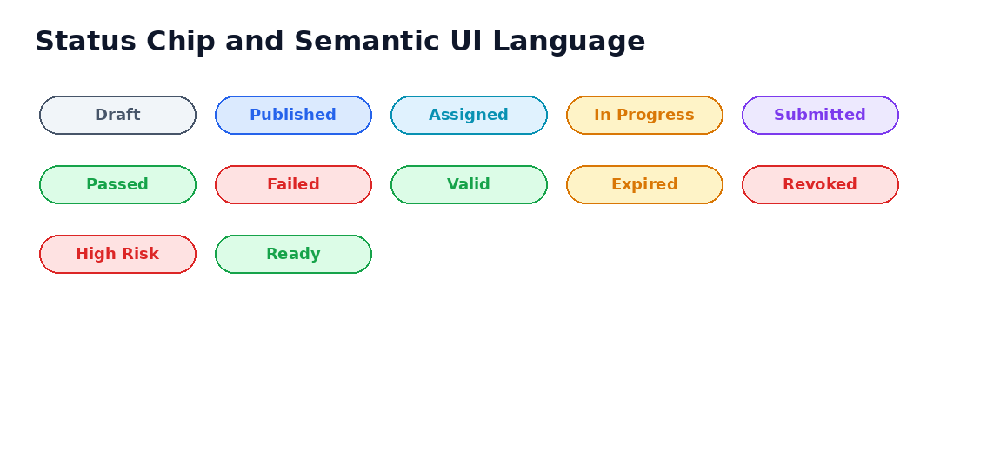
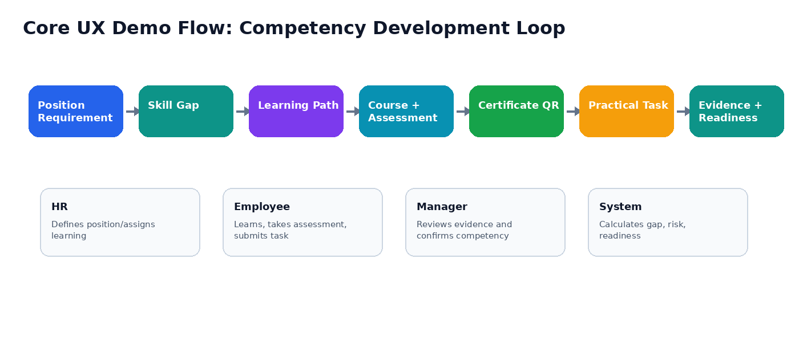

**DigiTalent AI**

**10\. UI/UX Design Specification**

Enterprise Web Application UI Standards, Screen Specification, Interaction Rules and Component Guidelines

|     |     |
| --- | --- |
| **Project** | DigiTalent AI - Digital Competency Training, Internal Certification and Work-Based Assessment Platform |
| **Document Type** | UI/UX Design Specification |
| **Target Product** | Enterprise web application for HR, Managers, Trainers, Employees, Admins and Certificate Verifiers |
| **Primary Frontend Stack** | ReactJS, TypeScript, TailwindCSS, ShadCN/UI |
| **Backend/API Dependency** | ASP.NET Core Web API, PostgreSQL, MinIO, SignalR |
| **Design Goal** | Clear, role-based, enterprise-ready, implementation-friendly UI/UX specification before coding |
| **Version** | v1.0 |

**Implementation Positioning**

This document is not only a visual guideline. It is a practical UI/UX contract for frontend implementation, backend API planning, QA verification and demo preparation. Every screen must support role-based access, clear data states, business validation, audit-aware actions and explainable capability decisions.

# Table of Contents

1.  1\. Purpose and Scope
2.  2\. UX Strategy and Design Principles
3.  3\. User Roles and UX Goals
4.  4\. Information Architecture and Navigation
5.  5\. Visual Identity and Color System
6.  6\. Typography, Spacing and Layout Grid
7.  7\. Component Design Specification
8.  8\. Button and Action Rules
9.  9\. Form, Validation and Field Rules
10.  10\. Table, Filter and Data Display Rules
11.  11\. Status, Feedback and Edge Case Design
12.  12\. Role-Based Screen Map
13.  13\. Detailed Screen Specifications by Module
14.  14\. Critical User Flows and Wireframe Guidelines
15.  15\. Accessibility, Responsive and Localization Rules
16.  16\. Microcopy and Content Guidelines
17.  17\. Frontend Implementation Guidance
18.  18\. UI QA Checklist and Acceptance Criteria
19.  Appendix A. Suggested Design Tokens
20.  Appendix B. MVP Screen Prioritization

# 1\. Purpose and Scope

This UI/UX Design Specification defines how DigiTalent AI should look, behave and guide users through the full competency development workflow. The document is intended to be used by frontend developers, backend developers, testers, designers and project reviewers before implementation begins.

| **Scope Area** | **Included in This Document** | **Reason** |
| --- | --- | --- |
| Visual design system | Color palette, typography, spacing, status colors, layout shell and component behavior. | Keeps UI consistent across all roles and modules. |
| Role-based navigation | Sidebar, dashboard entry points and accessible screen map for each role. | Prevents users from seeing screens or actions outside their responsibility. |
| Screen specification | Detailed UI structure, buttons, fields, states and edge cases for key screens. | Allows frontend and backend teams to agree on data and behavior before code. |
| Interaction design | Create/update/delete, publish, assign, submit, evaluate, issue, revoke and verify flows. | Ensures business actions are handled safely with confirmation and audit logic. |
| Implementation guidance | ShadCN/UI component mapping, route guard, form pattern and QA checklist. | Reduces ambiguity during React implementation. |

**Design Scope Boundary**

The MVP should prioritize functional clarity over visual complexity. The UI should look modern and enterprise-ready, but should avoid over-designed animations, heavy custom components or complex dashboards that slow down implementation.

# 2\. UX Strategy and Design Principles

| **Principle** | **Meaning for DigiTalent AI** | **UI Decision** |
| --- | --- | --- |
| Competency-first | The system is not a normal LMS. Learning, certificate and task evidence must always connect back to competencies and job position requirements. | Show competency badges, level indicators and related evidence on course, employee, task and certificate pages. |
| Role-focused | Admin, HR, Manager, Trainer and Employee have different goals and should not share a confusing generic dashboard. | Provide role-specific sidebars, dashboards and default landing pages. |
| Explainable by default | Skill gap, risk, readiness and recommendations must be understandable. | Every score card should have “View explanation” with factor breakdown and data source. |
| Human-in-the-loop | AI and rule-based suggestions support humans, not replace them. | AI outputs appear as draft/suggestion with Approve/Edit/Reject buttons. |
| Evidence traceability | Competency changes must be backed by assessment, certificate, task or manager review. | Employee competency profile must include evidence timeline and source links. |
| Enterprise clarity | The product should feel professional, calm and trustworthy. | Use clean tables, cards, neutral background, clear states and restrained colors. |
| Safe critical actions | Revoking certificates, evaluating task, updating competency and deleting data are sensitive. | Require confirmation dialogs, reason fields and audit logging for critical actions. |

# 3\. User Roles and UX Goals

| **Role** | **Primary UX Goal** | **Main Questions the UI Must Answer** | **Default Landing Page** |
| --- | --- | --- | --- |
| System Admin | Configure system access and monitor governance. | Who can access what? Are roles and audit logs healthy? | Admin Dashboard / User Management |
| HR / Training Manager | Manage workforce capability across the organization. | Which departments are weak? Who is at risk? Which certificates expire soon? | HR Capability Dashboard |
| Department Manager | Track and validate capability of employees in own department. | Which team members need support? Which tasks must be evaluated? | Manager Team Dashboard |
| Internal Trainer | Create learning content and assessments. | Which courses are published? Are questions ready? Did learners pass? | Trainer Dashboard |
| Employee | Complete assigned learning, assessments and practical tasks. | What do I need to learn now? What is due? What certificates do I have? | My Learning Dashboard |
| Certificate Verifier | Verify certificate validity quickly and safely. | Is this certificate valid, expired or revoked? | Certificate Verification Page |

# 4\. Information Architecture and Navigation

The application should use a stable enterprise shell: left sidebar for module navigation, topbar for context actions, breadcrumb for location, and main content area for role-specific workflows. Users should never need more than three clicks to access their core tasks.

| **Shell Area** | **Content** | **Behavior** |
| --- | --- | --- |
| Sidebar | Logo, role-aware menu groups, collapsed mode, active item highlight. | Only show menu items allowed by RBAC. Do not show disabled forbidden items unless explaining missing permission is necessary. |
| Topbar | Breadcrumb, page title, global search, notifications, profile dropdown. | Keep role switch unavailable unless the user has multiple roles. Profile dropdown includes My Profile, Change Password, Logout. |
| Content Header | Title, subtitle, primary action, secondary actions. | One primary action per page. Secondary actions go to dropdown if more than two. |
| Main Content | Cards, data tables, forms, tabs, detail panels. | Use progressive disclosure. Do not put every advanced action on the first screen. |
| Right Panel / Sheet | AI explanation, filters, details, quick edit. | Use for contextual review without leaving list pages. |

## 4.1 Role-Based Sidebar Menu Proposal

| **Role** | **Sidebar Menus** |
| --- | --- |
| System Admin | Dashboard; User Management; Role & Permission; System Configuration; Audit Log; Notification Templates |
| HR Manager | Dashboard; Departments; Job Positions; Employees; Competency Framework; Position Requirements; Course Assignment; Certificates; Analytics; Reports |
| Department Manager | Team Dashboard; Team Employees; Skill Gaps; Practical Tasks; Task Evaluation; Team Readiness; Certificates |
| Trainer | Trainer Dashboard; Courses; Lessons & Materials; Question Bank; Assessments; AI Draft Review; Learner Results |
| Employee | My Dashboard; My Learning; My Assessments; My Tasks; My Certificates; My Competency Profile; Notifications |
| Certificate Verifier | Verify Certificate; Verification History (optional) |

# 5\. Visual Identity and Color System

The proposed visual direction is a modern enterprise SaaS style: light background, strong blue primary actions, teal competency/evidence accents, purple AI indicators, and semantic status colors. The UI should feel reliable, analytical and easy to scan.

| **Token** | **Hex** | **Usage Rule** | **Do Not Use For** |
| --- | --- | --- | --- |
| Primary Blue | #2563EB | Main CTA, active navigation, selected tabs, primary links. | Danger actions or AI-only indicators. |
| Primary Dark | #1E40AF | Hover/pressed state for primary actions. | Normal body text. |
| Competency Teal | #0D9488 | Competency badges, evidence links, readiness improvement. | Generic success state if it can be confused with completion. |
| AI Purple | #7C3AED | AI suggestion labels, explanation panels, draft question/task suggestion. | Final human-approved decisions. |
| Success Green | #16A34A | Completed, passed, valid certificate, low risk, ready. | Non-final draft states. |
| Warning Amber | #F59E0B | Expiring, medium risk, due soon, pending review. | Critical failure. |
| Danger Red | #DC2626 | Failed, revoked, overdue, delete, high risk. | General warning. |
| Neutral Slate | #0F172A / #475569 / #E2E8F0 / #F8FAFC | Text, border, surface and background scale. | Status meaning without semantic color. |

**Color Usage Rule**

Use color to support meaning, not decoration. Every red/yellow/green state must also have text labels or icons so users with color vision differences can understand the status.

# 6\. Typography, Spacing and Layout Grid

| **Element** | **Recommended Style** | **Implementation Notes** |
| --- | --- | --- |
| Font family | Inter or system sans-serif. Fallback: Arial, sans-serif. | Use consistent font through Tailwind theme. Avoid mixing decorative fonts. |
| Page title | 24-30px, font-semibold/bold, Slate 900. | Should summarize current task, e.g., “Employee Competency Profile”. |
| Section heading | 18-20px, font-semibold. | Used inside cards or detail sections. |
| Body text | 14px or 15px, Slate 700. | Default readable text in forms/tables. |
| Helper text | 12-13px, Slate 500. | Validation hints, field descriptions, timestamps. |
| Grid | 12-column responsive grid for dashboard, single-column for forms on mobile. | Use max width for forms; avoid full-width fields when not needed. |
| Spacing | 4px base scale: 4, 8, 12, 16, 24, 32. | Cards usually p-4/p-6; table rows h-12. |
| Radius | 8px for input/button, 12-16px for cards/modals. | Keep enterprise clean; avoid overly rounded playful UI. |

# 7\. Component Design Specification

| **Component** | **ShadCN/UI Base** | **Usage** | **Important States** |
| --- | --- | --- | --- |
| Button | Button | Primary and secondary actions, form submit, destructive confirmation. | Default, hover, active, disabled, loading. |
| Input / Textarea | Input, Textarea | Text entry fields for names, descriptions, codes, criteria. | Focused, error, disabled, readonly. |
| Select / Combobox | Select, Command | Role, department, position, competency, course selection. | Searchable for lists above 20 items. |
| Data Table | Table + custom DataTable | All management lists. | Loading skeleton, empty, filtered empty, row action menu. |
| Card | Card | Dashboards, summary panels, score cards. | Use consistent header/body/footer. |
| Dialog | Dialog / AlertDialog | Confirmation, create small item, destructive action. | Must trap focus and show clear action labels. |
| Sheet / Drawer | Sheet | Quick detail, filter panel, AI explanation side panel. | Close with X and ESC; preserve unsaved warning. |
| Tabs | Tabs | Employee detail, course detail, certificate detail. | Use for peer-level sections only. |
| Badge / Status Chip | Badge | Status, risk, competency level, AI draft tag. | Semantic color + text. |
| Toast | Sonner / Toast | Success/error feedback after actions. | No critical info only in toast; critical errors stay on page. |
| Progress | Progress | Learning progress, readiness score, course completion. | Add numeric label. |
| Skeleton | Skeleton | Loading cards/tables. | Do not show blank white screen. |

# 8\. Button and Action Rules

| **Button Type** | **Visual Proposal** | **When to Use** | **Examples** | **Rules** |
| --- | --- | --- | --- | --- |
| Primary | Blue filled, white text | Main page action or form submit. | Create Course, Save Changes, Assign Course, Submit Assessment. | Only one primary CTA per page section. Disabled until required validation passes. |
| Secondary | White/neutral border | Alternative safe action. | Cancel, Preview, Export CSV, Save Draft. | Do not use secondary for destructive action. |
| Outline | White background + border | Low emphasis action in tables/cards. | View Details, Filter, Download Certificate. | Can be multiple per page. |
| Ghost | No border, subtle hover | Toolbar/menu actions. | Collapse Sidebar, Open More Menu. | Do not use for important workflows. |
| Danger | Red filled or red outline | Destructive or irreversible action. | Revoke Certificate, Delete Draft, Archive Employee. | Always require AlertDialog and reason field when business-critical. |
| Success | Green filled/outline | Positive review decision. | Approve Question, Confirm Competency, Mark Valid. | Use only when action completes a positive state. |
| AI Action | Purple outline or purple soft background | Generate draft or explanation. | Suggest Task, Generate Questions, Explain Score. | Always label output as AI Draft or AI Suggestion. |
| Link Button | Blue text | Navigation or inline reference. | View Evidence, Open Lesson, Verify QR. | Do not use for destructive actions. |

| **Action Pattern** | **Required UI Behavior** |
| --- | --- |
| Create | Open create page for complex entities; use dialog only for simple master data such as category or level. |
| Edit | Use edit page or side sheet. Show unsaved changes warning when user navigates away. |
| Delete/Archive | Prefer Archive/Deactivate over hard delete. Ask for confirmation and explain impact. |
| Publish | Show validation checklist before publish: required fields, lesson count, assessment configuration, competency mapping. |
| Assign | Show selected target, due date, notification option and preview affected employees. |
| Submit | Disable after click, show loading state, prevent duplicate submission. |
| Evaluate | Require score, feedback and competency confirmation decision. |
| Revoke | Require reason, show certificate status impact and create audit log. |

# 9\. Form, Validation and Field Rules

| **Field Pattern** | **UI Rule** | **Validation / Edge Case** |
| --- | --- | --- |
| Required field | Show red asterisk and concise helper text. | Submit disabled or error shown after touched/submitted. |
| Name field | Use placeholder with realistic sample, not real personal data. | Trim spaces; min/max length; prevent duplicate when business requires. |
| Code field | Uppercase style for certificate/course/competency code. | Validate uniqueness; only letters, numbers, dash/underscore. |
| Long description | Textarea with counter if max length matters. | Do not silently truncate. |
| Date / deadline | Date picker with timezone-aware display. | Deadline cannot be before current date for assignment/task. |
| Score/weight | Numeric input with unit/percentage label. | Min/max validation; total weight may need equal 100%. |
| File upload | Drag-and-drop + browse button + accepted file types. | Show progress, max size, failed upload retry and delete attachment. |
| Multi-select | Searchable combobox with selected chips. | Prevent too many selections if performance can degrade. |
| AI prompt input | Textarea with warning that output is draft. | Do not send empty prompt; show usage limit/error. |

| **Validation State** | **Visual Treatment** | **Message Example** |
| --- | --- | --- |
| Empty required | Red border + message under field. | Course title is required. |
| Invalid format | Red border + specific instruction. | Certificate code must contain only letters, numbers and hyphens. |
| Duplicate data | Red message after API validation. | A competency with this code already exists. |
| Permission denied | Inline alert or forbidden page. | You do not have permission to evaluate this employee task. |
| Unsaved changes | Confirmation dialog before leaving. | You have unsaved changes. Leave without saving? |
| Server error | Page-level alert with retry. | Could not save changes. Please retry or contact admin. |

# 10\. Table, Filter and Data Display Rules

| **Area** | **Specification** |
| --- | --- |
| Toolbar | Left: search input. Middle/right: filters. Far right: primary action or export. Keep toolbar sticky for long lists if needed. |
| Columns | Put identifying columns first: name/code/title. Status and updated date near right. Row actions in final column. |
| Pagination | Default page size 10/20. Show total count and current page. Backend-driven pagination for all large datasets. |
| Sorting | Allow sorting for name, status, created date, updated date, score, deadline where meaningful. |
| Bulk actions | Only if safe and useful. Bulk archive/assign must show confirmation and affected count. |
| Row action menu | View, Edit, Duplicate, Archive, Delete, depending on role and status. Disable/hide actions not allowed. |
| Empty state | Show illustration/icon, short reason and recommended next action. |
| Filtered empty | Different from empty state: “No results match current filters.” Include Clear filters button. |

# 11\. Status, Feedback and Edge Case Design

| **Domain** | **Statuses** | **UI Treatment** |
| --- | --- | --- |
| Course | Draft, Published, Archived | Draft gray, Published blue, Archived slate. Published courses cannot be edited freely without warning. |
| Enrollment | Assigned, In Progress, Completed, Overdue, Cancelled | Overdue red with deadline. Completed green with score/certificate link if applicable. |
| Assessment Attempt | Not Started, In Progress, Submitted, Passed, Failed | Show attempt count and remaining attempts. |
| Certificate | Valid, Expired, Revoked, Pending Renewal | Valid green, Expired amber, Revoked red. Verifier page must make status dominant. |
| Task | Draft, Assigned, In Progress, Submitted, Under Review, Approved, Rejected, Overdue | Submitted/Under Review require manager attention. Rejected must show feedback. |
| Risk | Low, Medium, High, Critical | Low green, Medium amber, High red, Critical red with stronger icon. |
| Readiness | Not Ready, Developing, Nearly Ready, Ready | Use progress bar + label + explanation; do not show score alone. |

| **Edge Case** | **Required UI Response** |
| --- | --- |
| User has no assigned course | Employee dashboard shows empty state with message: “No learning assignments yet.” |
| Employee misses deadline | Show overdue badge, manager notification and recommended next action. |
| AI service unavailable | Show fallback: rule-based result remains available; AI explanation can be retried later. |
| File upload fails | Keep selected file in list with failed state and Retry/Remove actions. |
| Certificate QR scanned but revoked | Verifier page shows red Revoked status, revocation date and generic reason if allowed. |
| Manager opens employee outside department | Show forbidden page; do not leak employee details. |
| Score cannot be calculated due to missing data | Show “Insufficient data” with missing input checklist. |

# 12\. Role-Based Screen Map

| **Role** | **MVP Screens** | **Optional/Bonus Screens** |
| --- | --- | --- |
| System Admin | Login, Admin Dashboard, User List, User Detail, Role Permission, System Config, Audit Log | Notification Template, Advanced System Health |
| HR Manager | HR Dashboard, Department List, Job Position List, Employee List/Detail, Competency Framework, Position Requirements, Course Assignment, Certificate Tracking, Workforce Readiness | Career Readiness, Learning ROI Report, Competency Heatmap advanced filters |
| Department Manager | Manager Dashboard, Team Employee List, Employee Skill Gap, Practical Task Board, Task Detail, Task Evaluation, Team Readiness | AI Task Suggestion Review, Promotion Readiness |
| Trainer | Trainer Dashboard, Course List, Course Builder, Lesson Editor, Material Upload, Question Bank, Assessment Builder, Learner Result | AI Question Draft Review |
| Employee | My Dashboard, My Learning, Course Detail, Lesson Viewer, Assessment Attempt, My Certificates, My Tasks, My Competency Profile | AI Learning Assistant, Knowledge Search |
| Certificate Verifier | Certificate Verification Page | Verification History |

# 13\. Detailed Screen Specifications by Module

**How to Read Screen Specs**

Each screen spec defines goal, layout, fields, buttons/actions and required states. During implementation, each screen should be converted into routes, React components, API calls and test cases.

## AUTH-01 Login Page

| **Item** | **Specification** |
| --- | --- |
| Goal | All users authenticate securely. |
| Main Layout | Centered login card, app logo, email, password, remember me, forgot password link. |
| Buttons / Actions | Sign In primary; Forgot Password link; Show/Hide Password icon. |
| Required States and Edge Cases | Invalid credentials, locked/inactive account, network error, loading state, already logged in redirect. |

## AUTH-02 My Profile

| **Item** | **Specification** |
| --- | --- |
| Goal | User reviews and updates basic profile/password. |
| Main Layout | Profile card, personal info form, password change tab, session info. |
| Buttons / Actions | Save Changes; Change Password; Logout All Sessions optional. |
| Required States and Edge Cases | Readonly email if managed by admin; password complexity; success toast. |

## ADMIN-01 User Management

| **Item** | **Specification** |
| --- | --- |
| Goal | Admin/HR manages accounts and role assignments. |
| Main Layout | Data table with search/filter by role/status/department; create button; row actions. |
| Buttons / Actions | Create User; Edit; Activate/Deactivate; Reset Password; Assign Role. |
| Required States and Edge Cases | Duplicate email; cannot deactivate last admin; audit log required. |

## ADMIN-02 Role & Permission

| **Item** | **Specification** |
| --- | --- |
| Goal | Admin controls RBAC policies. |
| Main Layout | Role list left, permission matrix right, data scope explanation. |
| Buttons / Actions | Create Role optional; Save Permissions; Reset Changes. |
| Required States and Edge Cases | Danger warning for changing system roles; prevent removing own admin access. |

## HR-01 HR Capability Dashboard

| **Item** | **Specification** |
| --- | --- |
| Goal | HR monitors overall workforce capability. |
| Main Layout | KPI cards, competency heatmap, risk list, certificate status, readiness distribution. |
| Buttons / Actions | Export Report; View Risk Employees; Filter by Department/Position. |
| Required States and Edge Cases | No data, insufficient data, loading skeleton, drill-down to employee. |

## ORG-01 Department Management

| **Item** | **Specification** |
| --- | --- |
| Goal | HR/Admin manages departments. |
| Main Layout | Table/list, hierarchy optional, department detail side panel. |
| Buttons / Actions | Create Department; Edit; Deactivate; Assign Manager. |
| Required States and Edge Cases | Cannot deactivate department with active employees unless transfer/archive rule handled. |

## ORG-02 Job Position Management

| **Item** | **Specification** |
| --- | --- |
| Goal | HR/Admin manages job positions and required competencies. |
| Main Layout | Position table, detail tabs: Info, Requirements, Employees. |
| Buttons / Actions | Create Position; Add Requirement; Edit Weight; Archive Position. |
| Required States and Edge Cases | At least one competency requirement; total weight validation if configured. |

## ORG-03 Employee List and Detail

| **Item** | **Specification** |
| --- | --- |
| Goal | HR/Manager reviews employee profile and capability. |
| Main Layout | List filters, detail page tabs: Overview, Learning, Competency, Certificates, Tasks, Evidence. |
| Buttons / Actions | Create Employee; Edit Profile; Assign Course; View Evidence; Export. |
| Required States and Edge Cases | Manager scope restriction; inactive employee banner; missing position warning. |

## COMP-01 Competency Framework

| **Item** | **Specification** |
| --- | --- |
| Goal | HR defines competency categories, competencies and levels. |
| Main Layout | Left category tree, competency table, level criteria panel. |
| Buttons / Actions | Create Category; Create Competency; Add Level; Archive. |
| Required States and Edge Cases | Duplicate code; cannot delete competency linked to course/position/evidence. |

## COMP-02 Position Requirement Mapping

| **Item** | **Specification** |
| --- | --- |
| Goal | HR maps competencies to job positions. |
| Main Layout | Position selector, requirements table with level, weight, mandatory flag. |
| Buttons / Actions | Add Competency Requirement; Save Mapping; Preview Skill Gap. |
| Required States and Edge Cases | Missing level, duplicate competency, invalid weight, mandatory impact explanation. |

## COURSE-01 Course List

| **Item** | **Specification** |
| --- | --- |
| Goal | Trainer/HR manages course catalog. |
| Main Layout | Cards/table with status, competencies, owner, last updated. |
| Buttons / Actions | Create Course; Edit; Preview; Publish; Archive; Duplicate. |
| Required States and Edge Cases | Publish blocked if no lesson/assessment/competency mapping. |

## COURSE-02 Course Builder

| **Item** | **Specification** |
| --- | --- |
| Goal | Trainer creates course structure. |
| Main Layout | Tabs: Overview, Modules/Lessons, Materials, Competencies, Completion Rules, Preview. |
| Buttons / Actions | Save Draft; Add Module; Add Lesson; Upload Material; Publish. |
| Required States and Edge Cases | Unsaved changes; file upload failed; invalid completion rule. |

## LEARN-01 Lesson Viewer

| **Item** | **Specification** |
| --- | --- |
| Goal | Employee consumes learning content. |
| Main Layout | Course sidebar, content viewer, material links, progress indicator, next/previous buttons. |
| Buttons / Actions | Mark Complete; Next Lesson; Download Material; Ask AI optional. |
| Required States and Edge Cases | No access, material unavailable, progress save failure, completed lesson readonly. |

## ASSESS-01 Question Bank

| **Item** | **Specification** |
| --- | --- |
| Goal | Trainer manages reusable questions. |
| Main Layout | Table with filters by competency, difficulty, type, status. |
| Buttons / Actions | Create Question; Import; Generate AI Draft; Approve; Edit; Archive. |
| Required States and Edge Cases | AI draft not publishable until reviewed; prevent deleting used questions. |

## ASSESS-02 Assessment Attempt

| **Item** | **Specification** |
| --- | --- |
| Goal | Employee takes quiz/final assessment. |
| Main Layout | Question area, timer optional, navigation list, progress, submit bar. |
| Buttons / Actions | Save Answer; Next; Previous; Submit Assessment. |
| Required States and Edge Cases | Timeout, unanswered questions, lost connection, max attempts reached, result display. |

## CERT-01 Certificate Management

| **Item** | **Specification** |
| --- | --- |
| Goal | HR/Trainer tracks issued certificates. |
| Main Layout | Certificate table with employee, course, code, status, issue/expiry date. |
| Buttons / Actions | Issue Certificate; Download PDF; Revoke; Renew; View Verification. |
| Required States and Edge Cases | Cannot issue if completion criteria unmet; revoke needs reason; expired not counted in score. |

## CERT-02 Public/Internal Verification Page

| **Item** | **Specification** |
| --- | --- |
| Goal | Verifier checks certificate validity through QR/code. |
| Main Layout | Search/scan input, dominant status card, certificate metadata, minimal employee info. |
| Buttons / Actions | Verify; Download Public Proof optional; Back. |
| Required States and Edge Cases | Invalid code, expired, revoked, network error; do not expose private training data. |

## INTEL-01 Skill Gap Analysis

| **Item** | **Specification** |
| --- | --- |
| Goal | HR/Manager/Employee understands missing competency. |
| Main Layout | Employee/position selector, gap table, recommended learning path. |
| Buttons / Actions | Run Analysis; View Explanation; Assign Recommended Course. |
| Required States and Edge Cases | Insufficient competency profile; no mapped position; rule explanation required. |

## INTEL-02 Training Risk and Readiness

| **Item** | **Specification** |
| --- | --- |
| Goal | HR/Manager identifies risk and readiness. |
| Main Layout | Score cards, factor breakdown, trend, explanation drawer. |
| Buttons / Actions | View Explanation; Notify Employee; Assign Support Course; Export. |
| Required States and Edge Cases | AI unavailable fallback; score stale warning; missing data checklist. |

## TASK-01 Practical Task Board

| **Item** | **Specification** |
| --- | --- |
| Goal | Manager tracks WMS-lite tasks. |
| Main Layout | Kanban/list by status, filters by assignee, deadline, competency. |
| Buttons / Actions | Create Task; Use AI Suggestion; Assign; Bulk Reminder. |
| Required States and Edge Cases | No assignee, due date passed, permission boundary by department. |

## TASK-02 Task Detail and Submission

| **Item** | **Specification** |
| --- | --- |
| Goal | Employee views task and submits evidence. |
| Main Layout | Task description, criteria, deadline, attachments, submission form, timeline. |
| Buttons / Actions | Start Task; Upload Evidence; Submit; Withdraw before review optional. |
| Required States and Edge Cases | Late submission, file error, already under review, feedback required after rejection. |

## TASK-03 Task Evaluation

| **Item** | **Specification** |
| --- | --- |
| Goal | Manager evaluates practical task and confirms competency evidence. |
| Main Layout | Submission preview, scoring rubric, feedback textarea, competency impact selector. |
| Buttons / Actions | Approve; Request Revision; Reject; Confirm Competency; Save Evaluation. |
| Required States and Edge Cases | Score range validation; reason required for reject; audit log; recalculates readiness. |

## EVID-01 Competency Evidence Portfolio

| **Item** | **Specification** |
| --- | --- |
| Goal | User reviews evidence supporting competency profile. |
| Main Layout | Timeline/list grouped by evidence type: assessment, certificate, task, manager review, manual. |
| Buttons / Actions | View Source; Add Manual Evidence (HR); Confirm Evidence; Export. |
| Required States and Edge Cases | Do not allow employee self-confirm; hidden evidence by permission; stale evidence indicator. |

## NOTI-01 Notification Center

| **Item** | **Specification** |
| --- | --- |
| Goal | Users track reminders and action requests. |
| Main Layout | Inbox list, unread badge, filters by type/severity. |
| Buttons / Actions | Mark Read; Open Related Item; Dismiss optional. |
| Required States and Edge Cases | Expired link, deleted related item, batch mark read. |

## AUDIT-01 Audit Log

| **Item** | **Specification** |
| --- | --- |
| Goal | Admin audits sensitive actions. |
| Main Layout | Filterable table: actor, action, module, target, time, IP/device optional. |
| Buttons / Actions | Filter; Export; View Detail. |
| Required States and Edge Cases | Immutable records; sensitive payload masking. |

# 14\. Critical User Flows and Wireframe Guidelines

| **Flow** | **Primary Screens** | **Key UX Rules** |
| --- | --- | --- |
| Setup competency model | Competency Framework -> Position Requirement Mapping -> Position Detail | Guide HR with empty state and checklist. Do not allow position readiness analysis without requirements. |
| Assign learning | Employee/Position -> Course Recommendation -> Assign Course | Show impacted employees, due date, notification option and preview before confirming. |
| Complete learning and assessment | My Learning -> Lesson Viewer -> Assessment Attempt -> Result | Always show progress and what remains to earn certificate. |
| Issue certificate | Assessment Result -> Certificate Issue -> Certificate Detail -> QR Verify | Certificate status must be visible and verifiable. Avoid hidden issuance logic. |
| Validate practical competency | Task Board -> Task Detail -> Submission -> Evaluation -> Evidence Portfolio | Manager must see criteria before evaluating. Employee must see feedback after review. |
| Explain readiness | Readiness Dashboard -> Explanation Drawer -> Evidence Links | Score without explanation is not acceptable. Show components and data source. |

# 15\. Accessibility, Responsive and Localization Rules

| **Area** | **Requirement** |
| --- | --- |
| Keyboard navigation | All buttons, dialogs, forms, tabs and menus must be reachable by keyboard. Dialogs must trap focus. |
| Contrast | Text and important UI elements must meet readable contrast. Do not rely on color only. |
| Labels | Every form field must have visible label. Icons must have aria-label if clickable. |
| Error messaging | Errors must identify the field and how to fix it. Error summary is recommended for long forms. |
| Responsive | Desktop-first enterprise layout. Tablet should collapse side panels. Mobile should use top drawer/sidebar and single-column forms. |
| Language | Interface can be English-first for technical consistency, but labels should be easy to translate to Vietnamese. Avoid hard-coded text inside components. |
| Date/time | Use consistent format and show timezone if deadline/audit matters. |
| File accessibility | Certificate PDF should have clear text, readable QR area and no overlapping text. |

# 16\. Microcopy and Content Guidelines

| **Context** | **Recommended Copy** | **Avoid** |
| --- | --- | --- |
| Create action | Create Course, Create Competency, Add Employee | Submit, OK, Done without context |
| Publish warning | This course will become visible to assigned learners. Continue? | Are you sure? |
| AI suggestion | AI Draft - Please review before publishing. | AI has decided... |
| Risk explanation | High risk because progress is behind schedule and quiz scores are below threshold. | User is bad / weak |
| Certificate revoked | This certificate has been revoked and is no longer valid. | Invalid user / fake certificate |
| Empty learning | No learning assignments yet. Your manager or HR will assign courses when needed. | No data |
| Permission denied | You do not have permission to view this resource. | Forbidden 403 only |

# 17\. Frontend Implementation Guidance

| **Frontend Area** | **Recommended Approach** |
| --- | --- |
| Routing | Use role-protected routes and permission guards. Route metadata should define required permission and page title. |
| State management | Use server-state library such as TanStack Query for API data; keep local state for UI-only controls. |
| Forms | Use React Hook Form + Zod for form validation. Map backend validation errors back to fields. |
| API layer | Use typed API clients/services per module. Centralize auth token refresh and error handling. |
| Design tokens | Define colors, spacing and radius in Tailwind config. Do not hard-code hex values across components. |
| Components | Create shared AppButton, AppDataTable, StatusBadge, ScoreCard, ConfirmDialog, EmptyState, PageHeader. |
| Data table | Use reusable table config for columns, filters, sorting and row actions. |
| Error handling | Use page-level ErrorState for fatal load errors and inline field errors for form validation. |
| Feature folders | Group by domain: auth, organization, competency, learning, assessment, certificate, task, dashboard, admin. |

| **Suggested Component** | **Purpose** |
| --- | --- |
| PageHeader | Title, subtitle, breadcrumbs, primary action, secondary actions. |
| RoleSidebar | RBAC-aware menu rendering. |
| StatusBadge | Shared status chip for certificate, task, course, risk and readiness. |
| DataTable | Server-side pagination, search, filters, columns and row actions. |
| FormSection | Reusable form card with title, description and content. |
| ConfirmActionDialog | Critical action confirmation with optional reason input. |
| ScoreExplanationDrawer | Factor breakdown for skill gap, risk and readiness. |
| EvidenceTimeline | Display competency evidence history. |
| FileUploadBox | MinIO-backed upload with progress/retry/remove. |
| EmptyState | Reusable no-data and filtered-empty UI. |

# 18\. UI QA Checklist and Acceptance Criteria

| **Category** | **Acceptance Criteria** |
| --- | --- |
| Navigation | Each role sees only allowed menu items. Active item and breadcrumb are correct. |
| Forms | Required fields, API validation errors, disabled state and unsaved change warning work correctly. |
| Buttons | Primary action is clear. Loading and disabled states prevent duplicate submission. |
| Tables | Search, filter, sort, pagination and empty states work correctly. |
| Permissions | Forbidden actions are blocked on both frontend and backend. UI must not leak data outside scope. |
| Status | Course, enrollment, certificate, task, risk and readiness statuses use correct colors and labels. |
| Critical actions | Revoke, archive, evaluate, confirm competency and publish actions require confirmation where needed. |
| AI features | AI outputs are clearly marked as draft/suggestion and require human review before official use. |
| Responsiveness | Dashboard, table and forms remain usable on common laptop and tablet widths. |
| Accessibility | Keyboard navigation, labels, focus states and color contrast are acceptable. |

# Appendix A. Suggested Design Tokens

| **Token Name** | **Value** | **Usage** |
| --- | --- | --- |
| color.primary.600 | #2563EB | Primary buttons, active links |
| color.primary.700 | #1D4ED8 | Primary hover |
| color.teal.600 | #0D9488 | Competency/evidence |
| color.purple.600 | #7C3AED | AI indicator |
| color.success.600 | #16A34A | Success status |
| color.warning.500 | #F59E0B | Warning status |
| color.danger.600 | #DC2626 | Danger status |
| color.slate.900 | #0F172A | Main text/headings |
| color.slate.600 | #475569 | Secondary text |
| color.slate.200 | #E2E8F0 | Borders |
| color.background | #F8FAFC | App background |
| radius.input | 8px | Inputs/buttons |
| radius.card | 12px-16px | Cards/modals |
| spacing.base | 4px | Tailwind spacing scale |

# Appendix B. MVP Screen Prioritization

| **Priority** | **Screens** | **Reason** |
| --- | --- | --- |
| P0 - Must build first | Login, Role shell, User/Employee, Department, Position, Competency, Course, Assessment, Certificate, Task, Dashboard basics. | These screens support the main demo loop and core scope. |
| P1 - Build after core data works | Skill Gap, Recommendation, Readiness, Risk, Evidence Portfolio, Notification Center. | These screens show intelligence and business value after core data exists. |
| P2 - Bonus | AI Question Draft, AI Task Suggestion, Career Readiness, Advanced Heatmap, Learning ROI. | Useful for higher score but should not block MVP. |
| Future | AI Learning Assistant, Semantic Knowledge Search, HRM/SSO integration. | Keep outside implementation commitment unless core is finished early. |

**Final UI/UX Recommendation**

Build the UI around one clear demo story: HR defines position competency requirements, employee learns and passes assessment, system issues QR certificate, manager assigns and evaluates practical task, evidence updates readiness dashboard. If every screen supports this loop, the product will feel coherent and defendable.