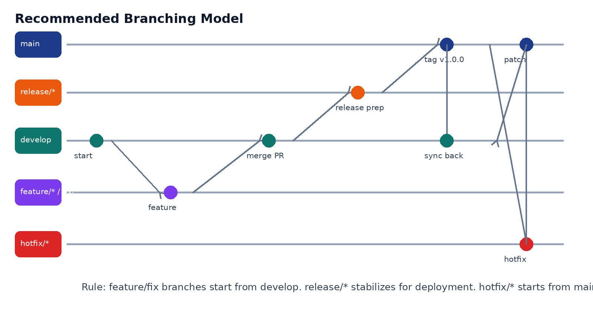
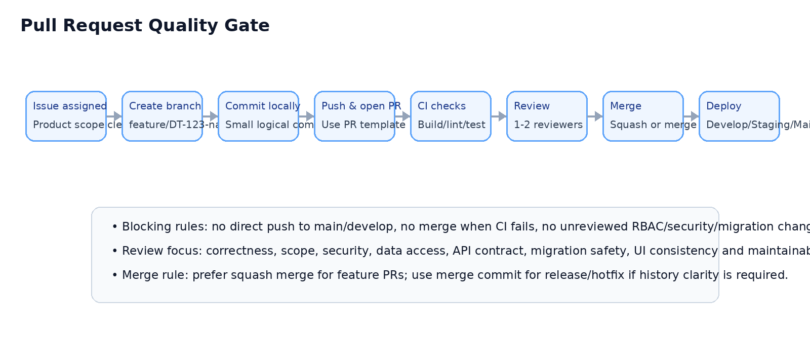
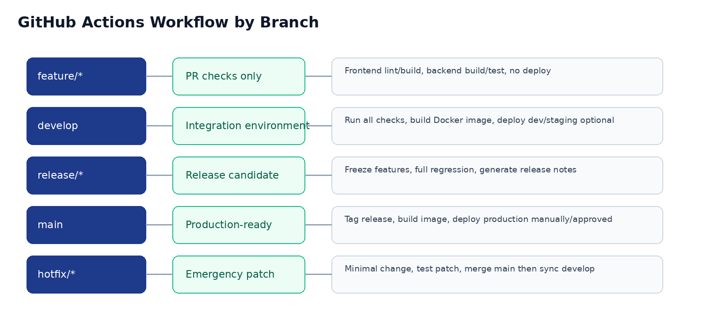

**DigiTalent AI**

**Git Workflow & Branching Strategy**

Document 12 - Team Source Control Operating Standard

| **Field** | **Value** |
| --- | --- |
| Project | DigiTalent AI - Digital Competency Training, Internal Certification and Work-Based Assessment Platform |
| Technology Scope | ReactJS, TypeScript, TailwindCSS, ShadCN/UI, ASP.NET Core/C#, PostgreSQL, MinIO, Redis optional, SignalR, Docker, Nginx, GitHub Actions |
| Repository Model | Recommended: monorepo for capstone team coordination, with protected main/develop branches |
| Audience | Team leader, backend developers, frontend developers, DevOps owner, QA/test owner, reviewer/mentor |
| Purpose | Standardize all Git/GitHub operations before coding so the team works consistently, safely and traceably. |
| Version | v1.0 - Prepared before implementation |

**Rule:** This document is an operating rulebook. It should be used together with the SRS, API Specification, Database Design, RBAC Matrix, UI/UX Specification and Coding Convention documents.

# Table of Contents

*   1\. Purpose and Scope
*   2\. Source Control Principles
*   3\. Repository Model and Ownership
*   4\. GitHub Project Setup Standard
*   5\. Branching Strategy
*   6\. Branch Naming Convention
*   7\. Commit Message Convention
*   8\. Issue, Task and Milestone Workflow
*   9\. Pull Request Workflow
*   10\. Code Review Rules
*   11\. Merge Strategy and History Policy
*   12\. Complete Git Operation Scenarios
*   13\. Environment, Secret and Large File Policy
*   14\. Database Migration Workflow
*   15\. API Contract Workflow
*   16\. Release, Versioning and Tagging
*   17\. CI/CD Branch Rules
*   18\. Team Roles and Responsibilities
*   19\. Conflict Resolution and Incident Handling
*   20\. Git Anti-patterns and Dangerous Commands
*   21\. GitHub Templates
*   22\. Team Checklist and Acceptance Criteria
*   Appendix A. Command Cheat Sheet
*   Appendix B. Recommended .gitignore Baseline
*   Appendix C. Daily Working Protocol

# 1\. Purpose and Scope

This document defines how the DigiTalent AI team should use Git and GitHub during development. The goal is to keep the codebase stable, traceable and reviewable while multiple members work on frontend, backend, database, DevOps, documentation and testing in parallel.

**Rule:** This is a team operating standard, not only a list of commands. Every developer should follow the same branch names, commit style, pull request flow, merge rules, review checklist and release process.

| **Scope Area** | **Covered Rules** |
| --- | --- |
| Repository governance | Repository structure, branch protection, issue labels, milestones, ownership and GitHub settings. |
| Daily development | How to pull, branch, commit, push, open PR, sync branches and handle conflicts. |
| Team collaboration | Issue workflow, PR review rules, merge strategy, code ownership and Definition of Done. |
| Risk control | How to avoid lost work, broken main/develop, leaked secrets, bad migrations, oversized files and unstable releases. |
| Deployment readiness | Branch-based CI/CD, release tagging, hotfix handling and rollback strategy. |

# 2\. Source Control Principles

*   main must always represent production-ready code or the latest stable demo release.
*   develop is the integration branch where completed features are combined before release preparation.
*   Every code change must come from an issue/task and must be implemented in a short-lived branch.
*   No direct push to main or develop. Changes must go through Pull Request review.
*   Commit small logical units. Avoid one huge commit that mixes frontend, backend, database and documentation changes without reason.
*   Never commit secrets, private keys, .env files, database dumps, generated upload files or large binary artifacts.
*   Database migration changes require extra review because they affect all environments.
*   RBAC, authentication, certificate verification, scoring logic and deployment files require stricter review.
*   Prefer clarity over speed. A slightly slower but traceable workflow is safer for a capstone team than uncontrolled pushing.

# 3\. Repository Model and Ownership

## 3.1 Recommended Repository Model

For DigiTalent AI, the recommended model is a monorepo. This is practical for a 5-member capstone team because frontend, backend, API contracts, database migrations, Docker Compose and documentation can evolve together under one source history.

Recommended monorepo structure

digitalent-ai/

├─ backend/ # ASP.NET Core solution

├─ frontend/ # React + TypeScript + Tailwind + ShadCN/UI

├─ infra/ # Docker, Nginx, deployment scripts

├─ docs/ # Project documents, diagrams, API notes

├─ scripts/ # helper scripts, seed commands, local setup

├─ .github/ # workflows, PR templates, issue templates

├─ docker-compose.yml

├─ README.md

└─ .gitignore

| **Area** | **Primary Owner** | **Review Required From** |
| --- | --- | --- |
| backend/ | Backend lead | At least one backend reviewer; security reviewer for Auth/RBAC changes. |
| frontend/ | Frontend lead | At least one frontend reviewer; UX owner for layout/system-wide component changes. |
| infra/ | DevOps owner | Team leader or backend lead; CI/CD changes should not be merged casually. |
| docs/ | Team leader / document owner | Relevant module owner if the document affects implementation. |
| database migrations | Backend/database owner | Backend lead and at least one module owner affected by schema change. |
| API contracts | Backend + frontend owners | Both sides must review before API behavior is changed. |

**Note:** If the team chooses separate frontend and backend repositories, the same branching and PR rules still apply. However, API contract changes must be synchronized more carefully across repositories.

# 4\. GitHub Project Setup Standard

| **Setting** | **Recommended Configuration** |
| --- | --- |
| Default branch | develop during active development, or main if the team strictly opens PRs to develop. The repository must still protect main. |
| Branch protection: main | Require PR, require status checks, require review, disallow force push, disallow deletion, require linear history optional. |
| Branch protection: develop | Require PR, require CI checks, require at least 1 review, no direct push except emergency by team leader. |
| CODEOWNERS | Use for backend, frontend, infra and docs to automatically request reviewers. |
| GitHub Issues | All features, bugs and documentation tasks should be tracked by issue ID. |
| GitHub Projects | Columns: Backlog, Ready, In Progress, In Review, QA/Test, Done. |
| Secrets | Use GitHub Actions secrets. Never store deployment credentials in source code. |
| Actions | Enable CI on PR to develop/main. Deployment should require manual approval for production/demo environment. |

Suggested issue labels

\# Suggested GitHub labels

type:feature type:bug type:docs type:refactor

type:test type:devops type:security type:database

priority:high priority:medium priority:low

status:blocked status:needs-review status:ready

area:frontend area:backend area:api area:uiux

area:rbac area:assessment area:certificate area:task

area:deployment

# 5\. Branching Strategy

DigiTalent AI should use a simplified Git Flow. This gives enough structure for release and hotfix control without becoming too heavy for a capstone team.

Figure 1. Recommended branch flow for DigiTalent AI.

| **Branch Type** | **Source Branch** | **Target Branch** | **Purpose** | **Lifetime** |
| --- | --- | --- | --- | --- |
| main | \-  | \-  | Stable, demo-ready or production-ready code. | Long-lived |
| develop | main initially | release/\* or main via release | Integration branch for completed work. | Long-lived |
| feature/\* | develop | develop | New business features or modules. | Short-lived |
| fix/\* | develop | develop | Non-emergency bug fixes found during development. | Short-lived |
| docs/\* | develop | develop | Documentation updates affecting team understanding. | Short-lived |
| refactor/\* | develop | develop | Internal cleanup with no behavior change. | Short-lived |
| test/\* | develop | develop | Test additions or test infrastructure changes. | Short-lived |
| release/\* | develop | main and develop | Release stabilization, regression fixes and version tagging. | Short-lived |
| hotfix/\* | main | main and develop | Emergency fix for stable/demo branch. | Short-lived |

**Rule:** A branch should be small enough to review. If a feature branch becomes too large, split it into smaller PRs such as backend API first, frontend UI second, integration third.

# 6\. Branch Naming Convention

Branch names must be lowercase, meaningful and linked to an issue/task ID whenever possible. Use hyphens instead of spaces.

| **Work Type** | **Pattern** | **Example** |
| --- | --- | --- |
| Feature | feature/DT-<issue>-<short-name> | feature/DT-101-auth-login-api |
| Bug fix | fix/DT-<issue>-<short-name> | fix/DT-142-certificate-qr-expired-status |
| Hotfix | hotfix/v<version>-<short-name> | hotfix/v1.0.1-refresh-token-expiry |
| Release | release/v<major>.<minor>.<patch> | release/v1.0.0 |
| Documentation | docs/DT-<issue>-<short-name> | docs/DT-050-update-api-spec |
| Refactor | refactor/DT-<issue>-<short-name> | refactor/DT-211-split-assessment-service |
| Test | test/DT-<issue>-<short-name> | test/DT-305-add-rbac-api-tests |
| DevOps | chore/DT-<issue>-<short-name> | chore/DT-401-add-docker-compose-healthcheck |

**Warning:** Avoid branch names like linh-code, final-update, test2, new-branch, demo-fix. They are not traceable and make review/history difficult.

# 7\. Commit Message Convention

Use Conventional Commits with a module scope. This makes history readable and allows the team to generate release notes more easily.

| **Type** | **Meaning** | **Example** |
| --- | --- | --- |
| feat | New feature or business capability. | feat(auth): implement login with refresh token |
| fix | Bug fix. | fix(certificate): reject revoked certificate in verifier API |
| docs | Documentation only. | docs(api): update assessment submit endpoint |
| style | Formatting only, no logic change. | style(ui): align dashboard card spacing |
| refactor | Code restructure without behavior change. | refactor(task): split task evaluation service |
| test | Add or update tests. | test(rbac): add manager department scope tests |
| chore | Build, config, dependencies or maintenance. | chore(ci): add backend test workflow |
| perf | Performance improvement. | perf(dashboard): optimize readiness query |
| security | Security-related change. | security(auth): rotate refresh token on reuse detection |

Commit format and examples

\# Format

<type>(<scope>): <short summary>

\# Good examples

feat(competency): add position requirement management

fix(assessment): prevent retake after max attempts reached

docs(database): update certificate table description

chore(docker): add MinIO bucket initialization script

security(rbac): enforce department scope on manager dashboard

\# Bad examples

update code

fix bug

final version

linh changes

working now

# 8\. Issue, Task and Milestone Workflow

Every meaningful code change should start from an issue. This keeps development traceable and lets the team leader know who is working on what.

| **Issue State** | **Meaning** | **Required Action** |
| --- | --- | --- |
| Backlog | Idea or future task exists but not ready. | Clarify requirement and priority. |
| Ready | Task has enough detail to start. | Assign owner and estimate. |
| In Progress | Developer is working on branch. | Push regularly and ask early if blocked. |
| In Review | PR opened and waiting for review. | Reviewer checks code, tests and scope. |
| QA/Test | Merged to develop or staging and being tested. | Run manual/automated tests. |
| Done | Accepted, merged and documented. | Close issue with PR link and result summary. |
| Blocked | Cannot continue due to dependency or unclear requirement. | State blocker and owner who can resolve it. |

Issue naming examples

\# Suggested issue title format

\[Module\] Short action-oriented title

\# Examples

\[Auth\] Implement JWT login and refresh token

\[Competency\] Create position requirement CRUD APIs

\[Certificate\] Generate QR verification endpoint

\[Task\] Build manager task evaluation UI

\[DevOps\] Add Docker Compose for local development

**Rule:** A developer should not work on a vague issue such as “do frontend” or “fix backend”. Split into clear deliverables such as screen, API, entity, test or integration task.

# 9\. Pull Request Workflow

Figure 2. Pull Request quality gate.

| **Step** | **Developer Action** | **Reviewer / Team Action** |
| --- | --- | --- |
| 1\. Prepare branch | Create branch from latest develop. | Issue must be assigned and requirement clear. |
| 2\. Commit work | Make small logical commits; run local build/tests. | No review yet. |
| 3\. Push branch | Push to GitHub and open PR to develop. | GitHub Actions starts CI checks. |
| 4\. Fill PR template | Describe changes, screenshots, test evidence, affected modules and risks. | Reviewer uses checklist. |
| 5\. Review | Respond to comments and push fixes. | Reviewer checks correctness, code quality, security, scope and regression risk. |
| 6\. Merge | Squash or merge after approval and passing CI. | Delete remote branch after merge. |
| 7\. Verify | Test on develop/staging if needed. | Move issue to QA/Test or Done. |

**Warning:** PRs affecting Auth, RBAC, migrations, CI/CD, certificate verification or scoring formulas should require stricter review than normal UI-only changes.

# 10\. Code Review Rules

| **Review Area** | **Questions Reviewer Must Check** |
| --- | --- |
| Requirement fit | Does the code solve the issue and match SRS/API/UI/DB documents? |
| Scope control | Does the PR include unrelated changes that should be split? |
| Security | Are authentication, authorization, department scope and sensitive data handled correctly? |
| Data safety | Are migrations safe? Is data loss possible? Are status transitions valid? |
| API contract | Does request/response/error format match API Specification? |
| Frontend UX | Does UI follow design specification, states, validation, loading and error behavior? |
| Maintainability | Are names clear? Is logic in correct layer? Is hard-code avoided? |
| Testing | Are important paths tested or at least manually verified with evidence? |
| Performance | Are obvious N+1 queries, repeated API calls or heavy dashboard queries avoided? |
| Documentation | Is affected documentation updated when behavior changes? |

Review comment convention

\# Review comment style

\[blocking\] This must be fixed before merge.

\[question\] I need clarification before approving.

\[suggestion\] Optional improvement, not blocking.

\[nit\] Small style/readability note.

\# Example

\[blocking\] Department Manager can access employees outside their department. Please enforce department scope in the query/service layer.

# 11\. Merge Strategy and History Policy

| **Case** | **Recommended Merge Method** | **Reason** |
| --- | --- | --- |
| Normal feature PR to develop | Squash merge | Keeps history clean and groups small WIP commits into one meaningful change. |
| Large module PR with meaningful commits | Merge commit optional | Preserves detailed history if commits are well structured. |
| release/\* to main | Merge commit or squash with release note | Release history should be easy to identify. |
| hotfix/\* to main | Merge commit | Emergency patch should remain visible. |
| main back to develop after hotfix | Merge commit | Ensures develop contains production patch. |

**Danger:** Never rebase or force-push shared long-lived branches such as main and develop. Rebase is allowed only on your own feature branch before PR or during cleanup.

# 12\. Complete Git Operation Scenarios

## 12.1 First-Time Setup

git config --global user.name "Your Name"

git config --global user.email "your\_email@domain.com"

git config --global core.autocrlf true # Windows recommended

git config --global pull.rebase false # Team default: merge on pull unless using rebase intentionally

git clone https://github.com/<org>/<repo>.git

cd digitalent-ai

git checkout develop

git pull origin develop

## 12.2 Start a New Feature

git checkout develop

git pull origin develop

git checkout -b feature/DT-101-auth-login-api

\# Work, then check changes

git status

git diff

git add backend/src/DigiTalent.Auth

git commit -m "feat(auth): implement login API"

git push -u origin feature/DT-101-auth-login-api

## 12.3 Keep Your Branch Updated with develop

\# Option A: safer for beginners - merge develop into your branch

git checkout feature/DT-101-auth-login-api

git fetch origin

git merge origin/develop

\# Resolve conflicts if any, then:

git add .

git commit

git push

\# Option B: cleaner history - rebase your own branch only

git checkout feature/DT-101-auth-login-api

git fetch origin

git rebase origin/develop

\# Resolve conflicts, then:

git add .

git rebase --continue

git push --force-with-lease

**Danger:** Only use --force-with-lease on your own feature branch. Never force push main/develop/release/hotfix branches.

## 12.4 Open Pull Request

*   Open PR from feature/DT-xxx branch into develop.
*   Link the issue with “Closes #issue-number” or “Related to #issue-number”.
*   Fill PR template: summary, affected modules, screenshots, test evidence, migration impact and risk notes.
*   Assign reviewer based on CODEOWNERS or module responsibility.
*   Wait for CI to pass before requesting final approval.

## 12.5 Resolve Merge Conflict

git checkout feature/DT-101-auth-login-api

git fetch origin

git merge origin/develop

\# Git marks conflicted files. Open each file and resolve <<<<<<< ======= >>>>>>> markers.

git status

git add <resolved-file-1> <resolved-file-2>

git commit

git push

**Warning:** If the conflict is in API contract, database migration, RBAC policy or shared UI component, do not resolve alone if unsure. Ask the relevant module owner.

## 12.6 Temporarily Save Work with Stash

git status

git stash push -m "WIP assessment UI"

git checkout develop

git pull origin develop

git checkout feature/DT-202-assessment-ui

git stash list

git stash pop

## 12.7 Undo Local Changes Before Commit

\# Discard changes in one file

git restore frontend/src/pages/Dashboard.tsx

\# Discard all unstaged local changes - dangerous

git restore .

\# Unstage a file but keep changes

git restore --staged backend/src/AppDbContext.cs

## 12.8 Fix Last Commit Message or Add Missing File

\# Change last commit message

git commit --amend -m "feat(auth): implement refresh token rotation"

\# Add forgotten file into last commit

git add backend/tests/AuthTests.cs

git commit --amend --no-edit

\# If already pushed to your own branch

git push --force-with-lease

## 12.9 Revert a Bad Commit After Merge

git checkout develop

git pull origin develop

git log --oneline

git revert <commit-hash>

git push origin develop

\# Open a follow-up PR if branch protection does not allow direct push.

**Danger:** Use git revert for shared branches. Do not use reset --hard on main/develop because it rewrites history and can break teammates.

## 12.10 Cherry-pick a Needed Fix

\# Example: bring one small fix from another branch into release branch

git checkout release/v1.0.0

git pull origin release/v1.0.0

git cherry-pick <commit-hash>

\# Resolve conflicts if any

git push origin release/v1.0.0

# 13\. Environment, Secret and Large File Policy

| **Item** | **Commit to Git?** | **Rule** |
| --- | --- | --- |
| .env | No  | Use .env.example with placeholder values only. |
| JWT secret, DB password, MinIO key | No  | Use local .env and GitHub Actions secrets. Rotate immediately if leaked. |
| appsettings.Development.json with real secrets | No  | Commit only safe templates or sample files. |
| Generated certificate PDFs | No  | Store in MinIO/object storage, not in repository. |
| Uploaded lesson materials/task submissions | No  | Store in MinIO/object storage. |
| Database dump | No, unless anonymized and small sample seed | Use seed scripts or sample data carefully. |
| Screenshots for documentation | Yes, if optimized and needed | Keep under reasonable size and store in docs/assets. |
| package-lock.json | Yes | Commit lock file for reproducible frontend installs. |
| EF Core migrations | Yes | Commit migration files and model snapshot. |

Secret leak response

\# If a secret is accidentally committed

1\. Stop using the leaked secret immediately.

2\. Rotate/regenerate the secret in the real service.

3\. Remove it from the current code.

4\. Inform the team leader.

5\. If needed, clean repository history using a proper tool such as git filter-repo or BFG.

6\. Do not assume deleting the file in a later commit is enough.

# 14\. Database Migration Workflow

Database migrations affect the whole team. A bad migration can block backend startup, destroy data, or make frontend/API testing impossible. Therefore, migration PRs require special discipline.

| **Rule** | **Explanation** |
| --- | --- |
| One logical schema change per PR | Avoid mixing unrelated schema changes across many modules. |
| Migration name must be meaningful | Example: AddCertificateVerificationStatus, not Migration1. |
| No destructive migration without explicit approval | Dropping columns/tables or changing types must be discussed. |
| Seed data must be deterministic | Roles, permissions, competency categories and demo accounts should be repeatable. |
| Migration must run from clean DB | Developer should test database update locally before PR. |
| API/Frontend must be compatible | If schema change affects API, update DTO/API docs and frontend usage. |

\# Backend migration example - adjust command to actual solution structure

cd backend

dotnet ef migrations add AddCertificateVerificationStatus --project src/DigiTalent.Infrastructure --startup-project src/DigiTalent.Api

dotnet ef database update --project src/DigiTalent.Infrastructure --startup-project src/DigiTalent.Api

git add backend/src/DigiTalent.Infrastructure/Migrations

git commit -m "feat(certificate): add verification status migration"

# 15\. API Contract Workflow

| **Change Type** | **Required Workflow** |
| --- | --- |
| New endpoint | Update API Specification/OpenAPI starter, implement backend, add DTO, add frontend API client, document permission. |
| Response shape change | Coordinate frontend and backend before merge; update API spec and tests. |
| Error format change | Avoid module-specific error formats. Keep common response/error contract. |
| Authentication/RBAC change | Update RBAC matrix, backend policy, frontend route guard and tests. |
| File upload API | Document allowed type/size, MinIO object metadata and error cases. |
| Scoring API | Document formula version, input fields and explanation output. |

**Rule:** API-breaking changes should not be merged late in a sprint without notifying the frontend owner. Contract changes are team changes, not only backend changes.

# 16\. Release, Versioning and Tagging

Use Semantic Versioning for demo/stable releases: MAJOR.MINOR.PATCH. For capstone, each milestone demo can be tagged so the team can return to a stable state if needed.

| **Version Type** | **Meaning** | **Example** |
| --- | --- | --- |
| MAJOR | Large incompatible changes or major milestone reset. | v2.0.0 |
| MINOR | New feature set without breaking stable behavior. | v1.1.0 |
| PATCH | Bug fix or hotfix. | v1.0.1 |
| RC  | Release candidate before final demo. | v1.0.0-rc.1 |

\# Create release branch

git checkout develop

git pull origin develop

git checkout -b release/v1.0.0

git push -u origin release/v1.0.0

\# After QA approval, merge release to main by PR, then tag

git checkout main

git pull origin main

git tag -a v1.0.0 -m "DigiTalent AI MVP release"

git push origin v1.0.0

\# Sync main back to develop

git checkout develop

git pull origin develop

git merge origin/main

git push origin develop

# 17\. CI/CD Branch Rules

Figure 3. GitHub Actions behavior by branch.

| **Branch/PR** | **Required Checks** |
| --- | --- |
| PR to develop | Backend restore/build/test, frontend install/lint/build, basic formatting check, no secret scan failure. |
| develop push | Full build, test, Docker image build, optional deploy to development/staging server. |
| release/\* | Full regression checks, Docker image build, manual QA gate, release note draft. |
| main push/tag | Build versioned image, deploy only with approval, create release artifact or GitHub release. |
| hotfix/\* PR | Minimal relevant tests plus full build; reviewer confirms patch does not introduce broad changes. |

# 18\. Team Roles and Responsibilities

| **Team Role** | **Git Responsibility** |
| --- | --- |
| Team Leader | Owns branch protection, milestone planning, final merge policy, release decision and conflict escalation. |
| Backend Owner | Reviews backend architecture, EF migrations, API contracts, security-sensitive backend changes. |
| Frontend Owner | Reviews React structure, UI consistency, API client integration and state management. |
| Database Owner | Reviews schema changes, seed data, indexes and data integrity. Can be same as backend owner. |
| DevOps Owner | Maintains Docker, Nginx, GitHub Actions, deployment scripts and environment setup. |
| QA/Test Owner | Maintains test checklist, validates merged features and tracks regressions. |
| Document Owner | Keeps technical documents in sync with actual implementation changes. |

# 19\. Conflict Resolution and Incident Handling

| **Scenario** | **Correct Action** |
| --- | --- |
| Two developers edit same file | Communicate early, pull latest develop, resolve conflict carefully, ask module owner if shared logic. |
| PR conflicts with develop | Developer updates branch; reviewer should not manually merge unknown conflicts. |
| Broken develop | Create fix branch immediately. Identify bad PR, revert if needed, then restore CI green. |
| Accidental direct commit to develop | Notify team. If harmless, create follow-up PR for review. If risky, revert and redo via PR. |
| Wrong branch commit | Create correct branch from current commit or cherry-pick commit to correct branch, then reset wrong branch carefully. |
| Leaked secret | Rotate secret immediately; remove from code; clean history if needed. |
| Bad migration merged | Stop new migrations, decide rollback/forward fix, update migration safely and document recovery. |

Recover accidental local commit on wrong branch

\# Move a commit from wrong branch to correct feature branch

\# Example: you accidentally committed on develop but have not pushed yet.

git branch feature/DT-999-correct-branch

\# Now remove last commit from develop but keep working tree clean

git checkout develop

git reset --hard HEAD~1

\# Continue on correct branch

git checkout feature/DT-999-correct-branch

# 20\. Git Anti-patterns and Dangerous Commands

| **Anti-pattern / Command** | **Why Dangerous** | **Safer Alternative** |
| --- | --- | --- |
| git push --force to main/develop | Rewrites shared history and can delete teammates work. | Never do it. Use PR + revert. |
| git reset --hard on shared branch | Can lose commits locally and confuse team history. | Use git revert on shared branches. |
| Huge PR with many unrelated changes | Hard to review and high regression risk. | Split by module/task. |
| Commit .env or real secrets | Security breach. | Use .env.example and GitHub secrets. |
| Commit generated files/uploads | Repository becomes heavy and messy. | Use MinIO/object storage; ignore generated files. |
| Resolve conflict without understanding logic | Can introduce hidden bugs. | Ask module owner for conflict in shared files. |
| Merge with failing CI | Breaks develop/main. | Fix failing checks first. |
| Direct push to protected branches | Bypasses review and audit. | Use PR workflow. |

# 21\. GitHub Templates

## 21.1 Pull Request Template

\## Summary

\- What changed?

\- Why is this change needed?

\## Related Issue

Closes #

\## Change Type

\- \[ \] Feature

\- \[ \] Bug fix

\- \[ \] Documentation

\- \[ \] Refactor

\- \[ \] Test

\- \[ \] DevOps

\- \[ \] Security

\- \[ \] Database migration

\## Affected Areas

\- \[ \] Frontend

\- \[ \] Backend

\- \[ \] Database

\- \[ \] API Contract

\- \[ \] RBAC/Security

\- \[ \] UI/UX

\- \[ \] Deployment

\## Test Evidence

\- \[ \] Local build passed

\- \[ \] Unit/integration tests passed

\- \[ \] Manual test completed

\- \[ \] Screenshot/video attached if UI change

\## Risk Notes

\- Migration impact:

\- Breaking API change:

\- RBAC/security impact:

\- Rollback plan:

\## Checklist

\- \[ \] Code follows convention

\- \[ \] No secrets committed

\- \[ \] Documentation updated if needed

\- \[ \] Reviewer assigned

## 21.2 Issue Template

\## Goal

Describe the expected result.

\## Background

Why is this needed? Link related document/flow/use case.

\## Scope

\- In scope:

\- Out of scope:

\## Acceptance Criteria

\- \[ \] Criterion 1

\- \[ \] Criterion 2

\## Technical Notes

API:

Database:

UI:

RBAC:

\## Dependencies

Blocked by:

Related to:

\## Owner

Assignee:

Reviewer:

# 22\. Team Checklist and Acceptance Criteria

| **Checklist Item** | **Accepted When** |
| --- | --- |
| Branch protection enabled | main and develop cannot be pushed directly by normal members. |
| Issue-based workflow active | Each PR links to an issue or task. |
| Branch names standardized | All branches follow feature/fix/docs/refactor/test/chore/release/hotfix pattern. |
| Commit messages standardized | Most commits follow Conventional Commits. |
| PR template used | Each PR includes summary, test evidence, risk notes and affected area. |
| CI checks configured | PRs run frontend/backend checks before merge. |
| Secrets protected | .env ignored; secrets only in local env or GitHub secrets. |
| Migration policy followed | Migration PRs are reviewed and tested locally. |
| Release tags used | Demo/stable versions are tagged. |
| Team knows recovery steps | Members know revert, stash, conflict and wrong-branch recovery basics. |

**Rule:** This document is complete only when the repository settings, templates, branch protection and CI workflows are actually configured in GitHub, not just written in documentation.

# Appendix A. Command Cheat Sheet

| **Action** | **Command** |
| --- | --- |
| Check status | git status |
| See changes | git diff |
| Create branch | git checkout -b feature/DT-123-short-name |
| Switch branch | git checkout develop |
| Update current branch | git pull origin develop |
| Stage file | git add <file> |
| Commit | git commit -m "feat(scope): message" |
| Push first time | git push -u origin <branch> |
| Fetch all remote data | git fetch origin |
| Merge develop into branch | git merge origin/develop |
| Rebase branch on develop | git rebase origin/develop |
| Abort merge | git merge --abort |
| Abort rebase | git rebase --abort |
| Stash work | git stash push -m "message" |
| Apply stash | git stash pop |
| Undo unstaged file | git restore <file> |
| Unstage file | git restore --staged <file> |
| Revert shared commit | git revert <commit-hash> |
| Show commit history | git log --oneline --graph --decorate --all |
| Delete local branch | git branch -d <branch> |
| Delete remote branch | git push origin --delete <branch> |

# Appendix B. Recommended .gitignore Baseline

\# Environment and secrets

.env

.env.\*

!.env.example

appsettings.\*.local.json

secrets.\*

\*.pem

\*.key

\# Node / React

frontend/node\_modules/

frontend/dist/

frontend/.vite/

frontend/.env

\# .NET / ASP.NET Core

backend/\*\*/bin/

backend/\*\*/obj/

backend/\*\*/TestResults/

backend/\*\*/\*.user

backend/\*\*/\*.suo

\# IDE

.vscode/

.idea/

\*.swp

\# Docker / local volumes

.docker-data/

postgres-data/

minio-data/

redis-data/

\# Generated files

uploads/

certificates/generated/

\*.log

\*.tmp

\# OS

.DS\_Store

Thumbs.db

# Appendix C. Daily Working Protocol

| **Time / Situation** | **Required Git Behavior** |
| --- | --- |
| Start working day | Checkout your branch, fetch/pull latest develop if needed, check issue status. |
| Before coding | Confirm branch name and issue ID. Do not code directly on develop/main. |
| During coding | Commit small logical changes. Push branch at least once per day to avoid losing work. |
| Before opening PR | Pull/merge latest develop, run build/tests, update docs if needed. |
| When blocked | Mark issue blocked and write reason. Do not silently stop. |
| Before ending day | Push WIP branch or stash carefully. Leave a note in issue/PR if someone depends on your work. |
| Before demo day | Only merge tested PRs. Avoid risky refactor or broad dependency updates. |
| After release | Tag release, update release notes, sync main back to develop. |

# Final Recommendation

For DigiTalent AI, the safest workflow is: issue -> feature branch from develop -> small commits -> PR -> CI -> review -> merge to develop -> release branch -> main tag. This process is not complicated, but it prevents most team problems: overwritten work, unstable demo branch, unclear ownership, broken migrations and unreviewed security changes.

**Rule:** Team leader should configure branch protection, issue labels, PR template, CODEOWNERS and GitHub Actions before the first implementation sprint begins.