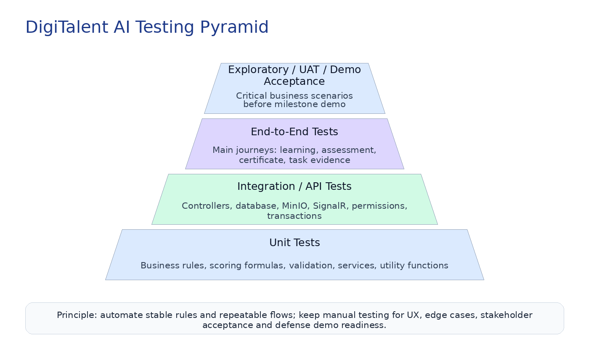
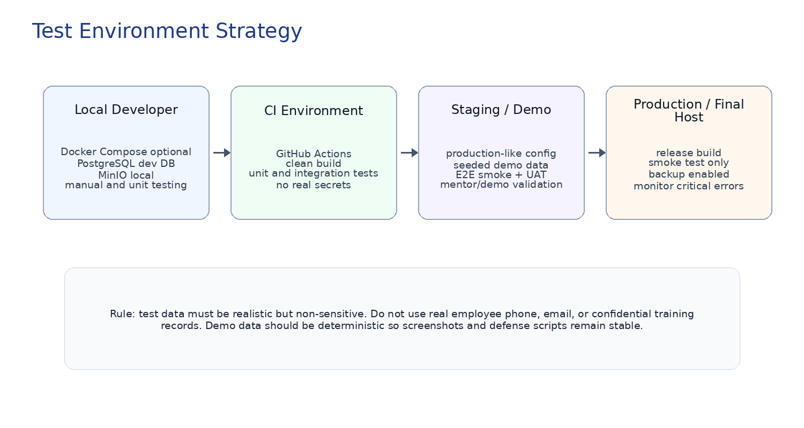
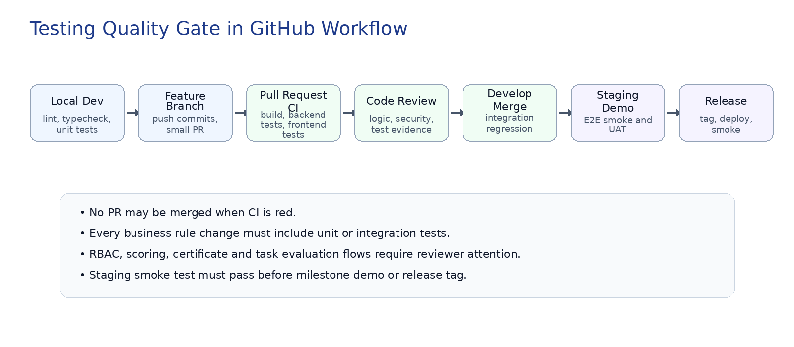

**DigiTalent AI**

**Testing Strategy Document**

Document 13 - QA, Test Coverage and Release Readiness Guideline

| **Field** | **Description** |
| --- | --- |
| Project | DigiTalent AI - Digital Competency Training, Internal Certification and Work-Based Assessment Platform |
| Primary Stack | ReactJS, TypeScript, TailwindCSS, ShadCN/UI, ASP.NET Core/C#, PostgreSQL, MinIO, Redis optional, SignalR, Docker, Nginx, GitHub Actions |
| Document Purpose | Define testing approach, coverage, quality gates, test types, responsibilities and acceptance criteria before implementation. |
| Audience | Project leader, backend developers, frontend developers, QA/test owner, technical mentor and reviewers. |
| Version | 1.0 - Prepared for Capstone implementation planning |

**Gate:** This document is designed to prevent random testing at the end of the project. Testing must be planned from the first sprint, especially for RBAC, scoring formulas, certificates, WMS-lite task evidence and dashboard correctness.

# 1\. Purpose and Scope

This Testing Strategy Document defines how DigiTalent AI should be tested before, during and after implementation. It translates the business requirements, SRS, use cases, API design, RBAC matrix, database design and UI/UX specification into a practical quality assurance plan for a five-member capstone team.

*   Ensure the core learning-to-competency workflow works correctly end-to-end.
*   Protect critical business rules: RBAC, department-level access, certificate validity, scoring formulas, task evaluation and audit logs.
*   Reduce regression risk when multiple team members implement related modules in parallel.
*   Provide a clear testing baseline for GitHub PR review, sprint demo, final defense and production-like deployment.
*   Avoid unrealistic test scope: prioritize critical rules and demo flows first, then expand automation gradually.

**Testing:** Testing is not a final phase. For this project, every sprint should produce code, tests, test evidence and a short defect summary.

# 2\. Testing Objectives

| **Objective** | **Meaning for DigiTalent AI** |
| --- | --- |
| Correctness | Verify that functional modules satisfy SRS, use cases and business rules. |
| Security | Ensure users can only access data and actions allowed by RBAC and data-scope rules. |
| Reliability | Validate stable behavior under normal errors: invalid input, expired certificate, missing file, duplicate records, expired token, failed attempt. |
| Traceability | Link test scenarios to requirements, use cases, APIs and acceptance criteria. |
| Demo Readiness | Guarantee the end-to-end defense scenario works from clean seed data without manual database editing. |
| Maintainability | Make regression testing repeatable through automated tests and documented manual checklists. |

# 3\. Testing Principles

| **Principle** | **Practical Rule** |
| --- | --- |
| Risk-based first | Test the highest business risk modules first: Auth/RBAC, competency calculation, assessment scoring, certificates, task evaluation and readiness dashboard. |
| Automation where stable | Automate deterministic rules and repeatable API flows. Keep UX review, visual inspection and stakeholder acceptance partly manual. |
| Test from user flow | Do not only test screens independently. Validate the workflow: position requirement -> skill gap -> recommendation -> learning -> assessment -> certificate -> task -> evidence -> readiness. |
| No fake pass | A test is considered passed only when expected data state, permission behavior and UI result are verified. |
| Backend is source of truth | Frontend route guards improve UX, but backend authorization and validation must be the real protection layer. |
| Stable demo data | Demo seed data must be deterministic so the team can reproduce the final defense scenario reliably. |

# 4\. Testing Pyramid and Quality Strategy

DigiTalent AI should follow a pragmatic testing pyramid. Unit tests protect business rules; integration/API tests protect workflows and persistence; E2E tests cover the most important user journeys; manual/UAT testing validates usability and defense readiness.

Figure 1. Testing pyramid recommended for DigiTalent AI.

| **Test Level** | **Main Target** | **Priority** | **Reason** |
| --- | --- | --- | --- |
| Unit Tests | Service logic, formulas, validators, utility methods, permission helpers. | High | Fast feedback for business rules. |
| Integration/API Tests | API endpoints, EF Core, PostgreSQL, MinIO integration, authorization policies, transaction behavior. | High | Most valuable backend safety net. |
| Frontend Component Tests | Forms, validation messages, protected routes, table states, role-based navigation. | Medium | Useful for stable UI components. |
| End-to-End Tests | Critical flows: login, course assignment, learning, assessment, certificate verification, task evaluation. | Medium | Run on staging or PR if stable enough. |
| Manual/UAT Tests | UX review, demo script, edge cases, visual consistency, mentor feedback. | Required | Human validation before demo and final defense. |

# 5\. Roles and Responsibilities

| **Role** | **Testing Responsibilities** |
| --- | --- |
| Project Leader / Technical Lead | Own test strategy, quality gate, sprint demo acceptance, cross-module risk review. |
| Backend Developer | Write unit/integration tests for service logic, APIs, EF Core, transactions, RBAC policies and scoring formulas. |
| Frontend Developer | Test UI components, role-based navigation, form validation, API integration, table states and responsive behavior. |
| QA/Test Owner | Maintain test cases, execute manual regression, record defects, verify bug fixes and prepare demo test evidence. |
| Reviewer | Check PR quality, test evidence, risk impact and acceptance criteria before merge. |
| Mentor/Stakeholder | Validate business flow and acceptance criteria during milestone demos. |

# 6\. Scope of Testing

The testing scope is divided by the core modules defined in the SRS and business flow documents. MVP modules must be tested first; optional AI features can be tested after the core workflow is stable.

| **Module** | **Testing Scope** | **Priority** |
| --- | --- | --- |
| Authentication & RBAC | Login, logout, refresh token, protected routes, permissions, data scopes. | MVP Critical |
| Organization & Employee | Department, job position, employee profile, manager assignment, active/inactive status. | MVP High |
| Competency Framework | Competency categories, levels, position requirements, employee competency profile. | MVP Critical |
| Learning Management | Course, lesson, material upload, enrollment, progress tracking. | MVP High |
| Assessment | Question bank, quiz/final assessment, attempt lifecycle, scoring, pass/fail logic. | MVP Critical |
| Certificate | Issue certificate, generate code, QR verification URL, valid/expired/revoked status. | MVP Critical |
| Capability Intelligence | Skill gap, recommendation, training risk, readiness score using explainable formulas. | MVP Critical |
| WMS-lite Task | Task assignment, submission, evaluation, feedback, task evidence, competency update. | MVP Critical |
| Dashboard & Analytics | HR/Manager/Trainer/Employee dashboards, counts, risk lists, readiness and certificate status. | MVP High |
| Notification & SignalR | Training reminders, task updates, risk warnings, certificate expiry alerts. | MVP/Optional Medium |
| AI Optional | AI question draft, task suggestion, explanation logging under human review. | Bonus |

# 7\. Out-of-Scope Testing for MVP

*   Full performance/load testing for large enterprise traffic is not mandatory for MVP, but basic response checks should still be done.
*   Native mobile testing is out of scope because the project is a web application.
*   Full penetration testing is out of scope, but basic security test cases are required.
*   Real enterprise SSO/LDAP integration testing is future scope unless implemented.
*   Full custom machine learning model evaluation is out of scope because core scoring is rule-based.
*   Full Trello/Jira-style project management testing is out of scope because WMS-lite is limited to training task evidence.

# 8\. Test Environment Strategy

Figure 2. Recommended test environments and promotion path.

| **Environment** | **Owner** | **Purpose** | **Rules** |
| --- | --- | --- | --- |
| Local | Developer machine | Fast unit tests, UI work, manual feature verification. | Local .env, local PostgreSQL/MinIO or Docker Compose. |
| CI  | GitHub Actions | Build, lint, typecheck, unit tests, selected integration tests. | No real production secrets. Use test database/service containers if possible. |
| Staging/Demo | Team hosted environment | E2E smoke, UAT, mentor demo, release candidate testing. | Production-like config with deterministic seed data. |
| Production/Final Host | Deployment environment | Smoke test only after release; no destructive test data. | Backup and environment variable checks required. |

# 9\. Test Data Strategy

DigiTalent AI requires carefully designed test data because many workflows depend on realistic relationships between departments, job positions, competencies, courses, assessments, certificates and tasks.

| **Test Data Group** | **Required Data** |
| --- | --- |
| Seed Admin | One SYS\_ADMIN account for setup and RBAC verification. |
| HR Manager | One or two HR accounts for company-wide training and competency management. |
| Department Managers | At least two departments with separate managers to test data-scope boundaries. |
| Trainer | At least one trainer who owns courses, question bank and assessment creation. |
| Employees | Employees assigned to different departments and job positions with different competency levels. |
| Verifier | A certificate verifier account or public verification flow for QR/code testing. |
| Courses | Courses mapped to competencies such as AI Literacy, Data Literacy, Cybersecurity, Digital Collaboration. |
| Assessments | Pre/post/final assessment questions with known answer keys for predictable scoring. |
| Certificates | Valid, expired and revoked certificates for status testing. |
| Tasks | Assigned, in-progress, submitted, evaluated and overdue practical tasks. |

**Rule:** Never use real personal data in seed scripts. Use example names such as Employee 01, Manager 01, Trainer 01 and company sample emails.

# 10\. Backend Testing Strategy

Backend tests protect business logic and data integrity. In this project, backend tests are more important than frontend tests for rules such as RBAC, scoring, certificate validity, task evaluation and audit logs.

| **Backend Test Type** | **Target** | **Implementation Guidance** |
| --- | --- | --- |
| Unit Test | Services, validators, scoring calculators, permission helpers. | xUnit or similar C# test framework; mocks where needed. |
| Integration Test | Controllers, EF Core, PostgreSQL, transactions, authentication pipeline. | Prefer test database/container or isolated test schema. |
| API Contract Test | Request/response shape, status codes, validation errors, pagination format. | Compare against API specification and Swagger contract. |
| Security Test | Unauthorized/forbidden access, token expiry, role permission, department scope. | Must cover positive and negative cases. |
| Data Integrity Test | Unique constraints, FK behavior, status transitions, soft delete. | Validate database state after API calls. |
| Background/Notification Test | Reminder scheduling, notification creation, SignalR event emission if implemented. | Can be integration or service-level tests. |

Backend test command baseline

\# Suggested backend local checks

cd backend

dotnet restore

dotnet build

dotnet test --collect:"XPlat Code Coverage"

\# Suggested API smoke checks after running backend

GET /api/health

POST /api/auth/login

GET /api/me

GET /api/dashboard/hr

# 11\. Frontend Testing Strategy

| **Frontend Test Type** | **Target** | **Guidance** |
| --- | --- | --- |
| Static Checks | TypeScript typecheck, ESLint, formatting. | Required before PR merge. |
| Component Tests | Reusable components: Button, DataTable, FormField, StatusChip, PermissionGate, EmptyState. | Recommended for stable shared components. |
| Page/Container Tests | Login page, course detail, assessment attempt, task evaluation, certificate verification. | Focus on critical interaction states. |
| API Integration Mock Tests | Frontend handles loading, success, validation errors, unauthorized, forbidden and empty data. | Use mock API layer or test fixtures. |
| Responsive Manual Tests | Desktop and tablet layout for enterprise dashboards and tables. | Required for demo screens. |
| Visual QA | Color consistency, spacing, status chip meaning, button hierarchy, form error clarity. | Manual checklist before demo. |

Frontend test command baseline

\# Suggested frontend local checks

cd frontend

npm install

npm run lint

npm run typecheck

npm run test

npm run build

\# Optional if Playwright is configured

npm run e2e

# 12\. Database and Migration Testing

| **Database Test Area** | **Expected Verification** |
| --- | --- |
| Migration Build | Migrations can be applied from empty database without manual SQL fixes. |
| Rollback Awareness | Critical migrations should have a rollback plan or at least documented recovery. |
| Seed Data | Seed scripts create roles, permissions, departments, competency examples and demo users deterministically. |
| Constraints | Unique email, role code, competency code, certificate code and foreign keys behave correctly. |
| Status Integrity | Invalid status transitions are rejected by service/business logic. |
| Soft Delete | Soft-deleted records do not appear in normal lists but remain available for audit if needed. |
| Indexing | Common queries for dashboards, employee lists, certificates and assessments remain acceptable for demo data size. |

# 13\. Security and RBAC Testing

**Danger:** For DigiTalent AI, RBAC testing is a release blocker. It is not acceptable that a user can access another department, modify scores without permission, or verify private employee details through certificate pages.

| **RBAC Test Case Group** | **Required Result** |
| --- | --- |
| Unauthenticated Access | User without token cannot access protected APIs. |
| Expired Token | Expired access token is rejected; refresh token flow works only when valid. |
| Wrong Role | Employee cannot create courses, issue certificates, evaluate tasks or manage users. |
| Department Scope | Department Manager cannot see or evaluate employees outside managed department. |
| Own Data Scope | Employee can see own learning, certificates, tasks and competency profile but cannot edit protected fields. |
| Public Verification Scope | Certificate verifier sees only certificate validity and safe public fields. |
| Audit Requirement | Sensitive actions create audit log: certificate issue/revoke, task evaluation, competency update, role change. |
| Frontend Guard | Menu items and pages are hidden or blocked for unauthorized roles, while backend still enforces permission. |

# 14\. API Testing Rules

| **API Rule** | **Expected Behavior** |
| --- | --- |
| Status Codes | 200/201 for success, 400 validation, 401 unauthenticated, 403 forbidden, 404 not found, 409 conflict, 500 unexpected error. |
| Validation Errors | Every invalid request returns field-level error messages when possible. |
| Pagination | List APIs return consistent page, pageSize, totalItems and items. |
| Filtering and Sorting | Invalid filters are rejected or ignored consistently according to API spec. |
| Idempotency Awareness | Repeated critical calls such as certificate issue should not create duplicates accidentally. |
| File Upload | Reject unsupported extension, oversized file and missing file; return safe file metadata. |
| Permission | Every protected API must have a permission or policy mapping. |
| Traceability | API tests should mention related use case or requirement ID when possible. |

# 15\. Module-Level Test Matrix

The following matrix identifies the most important test groups by module. It should be converted into detailed test cases during implementation.

| **Module** | **High-Value Test Areas** | **Test Level** | **Risk** |
| --- | --- | --- | --- |
| Auth/RBAC | Login, refresh, logout, role menus, permission policies, department scope. | Unit + API + Manual | Critical |
| Organization | CRUD departments/positions/employees, manager assignment, status, duplicate validation. | API + UI | High |
| Competency | Levels, requirements by position, profile updates, evidence linkage. | Unit + API + UI | Critical |
| Learning | Course authoring, lesson progress, enrollment, material upload/download. | API + UI + File | High |
| Assessment | Question bank, attempt start/submit, scoring, pass/fail, retry rules. | Unit + API + E2E | Critical |
| Certificate | Issue, PDF metadata, QR URL, valid/expired/revoked verification. | Unit + API + E2E | Critical |
| Intelligence | Skill gap, recommendation, risk score, readiness score, explanation logs. | Unit + API | Critical |
| WMS-lite Task | Assign, submit, evaluate, feedback, evidence, competency impact. | API + UI + E2E | Critical |
| Dashboard | Correct counts, filters by role/department, risk/readiness summaries. | API + UI + Manual | High |
| Notification | Reminder creation, read/unread, SignalR update if enabled. | API + Manual | Medium |
| AI Optional | Question draft/task suggestion generated as draft only, human approval required. | API + Manual | Bonus |

# 16\. Critical Business Flow Tests

| **Flow ID** | **Flow Name** | **Scenario** | **Acceptance Priority** |
| --- | --- | --- | --- |
| BF-01 | Employee Capability Development Flow | Create position requirement -> employee has skill gap -> recommend course -> enroll -> learn -> assessment -> certificate -> task -> evidence -> readiness recalculated. | Must pass before defense demo. |
| BF-02 | Certificate Verification Flow | Employee qualifies -> system issues certificate -> QR/code verification shows correct valid/expired/revoked status. | Must pass before MVP release. |
| BF-03 | Training Risk Flow | Employee is inactive/low score/near deadline -> risk score increases -> manager/HR can view warning. | Must pass for analytics demo. |
| BF-04 | Department Manager Scope Flow | Manager of Department A can see/evaluate Department A employees but cannot access Department B employees. | Must pass before any demo. |
| BF-05 | Task Evidence Flow | Manager assigns practical task -> employee submits evidence -> manager evaluates -> competency evidence and task performance score update. | Must pass before WMS-lite demo. |
| BF-06 | Trainer Content Flow | Trainer creates course, lessons, materials, questions and assessment; HR/Manager assigns course. | Should pass for content management demo. |
| BF-07 | AI Draft Flow | AI generates question/task suggestion as draft; trainer/manager reviews before official use. | Bonus only if AI optional is implemented. |

# 17\. Detailed Sample Test Scenarios

| **Test ID** | **Scenario** | **Input / Condition** | **Expected Result** |
| --- | --- | --- | --- |
| AUTH-001 | Valid login | Active user enters correct email/password. | Access token, refresh token and user profile are returned. |
| AUTH-002 | Invalid login | Wrong password is submitted. | API returns safe error; no token is issued. |
| AUTH-003 | Protected API without token | Call /api/me without token. | 401 Unauthorized. |
| RBAC-001 | Employee cannot create course | Employee calls create course API. | 403 Forbidden and no course created. |
| RBAC-002 | Manager department boundary | Manager A requests employee in Department B. | 403 or 404 according to API policy; no data leak. |
| ORG-001 | Create duplicate department code | HR creates department with existing code. | 409 Conflict or validation error. |
| COMP-001 | Position requires competency | HR creates requirement Data Literacy level 3. | Requirement saved with weight and mandatory flag. |
| COMP-002 | Skill gap calculation | Required level 3, current level 1. | Skill gap = 2 and priority reflects configured rules. |
| COURSE-001 | Course linked to competency | Trainer creates course and maps to Data Literacy. | Course appears as candidate recommendation for that skill gap. |
| ASSESS-001 | Submit assessment with correct answers | Employee submits final assessment. | Score calculated correctly and attempt status completed. |
| ASSESS-002 | Fail assessment | Score below pass threshold. | No certificate is issued automatically. |
| CERT-001 | Issue certificate after pass | Employee passes required final assessment. | Certificate code created; status VALID; QR URL generated. |
| CERT-002 | Verify revoked certificate | Verifier opens revoked certificate code. | Status REVOKED shown; certificate not counted as valid. |
| TASK-001 | Assign practical task | Manager creates task with criteria and deadline. | Employee receives task; status ASSIGNED. |
| TASK-002 | Submit task evidence | Employee uploads result file/link. | Submission saved; task status SUBMITTED. |
| TASK-003 | Evaluate task | Manager gives score and feedback. | Task becomes EVALUATED; evidence created; readiness recalculated. |
| RISK-001 | High risk due to inactivity | Employee has low progress near deadline. | Risk score and reason include inactivity/deadline/progress delay. |
| READINESS-001 | Readiness formula | Input scores are known. | Readiness equals configured weighted formula. |
| DASH-001 | HR dashboard sees company-wide data | HR opens dashboard. | Company-wide counts and risk summaries are displayed. |
| DASH-002 | Manager dashboard scope | Manager opens dashboard. | Only department/team data is shown. |
| FILE-001 | Reject unsupported upload | User uploads .exe as material. | Upload rejected with safe validation error. |
| AI-001 | AI question draft is not published automatically | Trainer requests AI draft. | Question saved as draft/review state only. |

# 18\. Scoring and Rule-Based Test Strategy

Score-related logic must be tested with deterministic inputs. These tests are high value because they protect the project from subjective or inconsistent analytics results.

| **Rule Area** | **Inputs to Test** | **Expected Control** |
| --- | --- | --- |
| Skill Gap | Required level, current level, mandatory flag, weight. | Gap = required - current; negative gap is treated as 0 or surplus according to rule. |
| Learning Recommendation | Skill gaps, course-competency mapping, course availability. | Courses are prioritized for missing mandatory/high-weight competencies. |
| Training Risk | Progress, quiz scores, attempts, inactivity, deadline. | Risk score and level match configured thresholds and explanation reasons. |
| Readiness Score | Competency score, certificate score, progress, compliance, task performance. | Weighted formula matches configuration; expired/revoked certificates excluded. |
| Task Performance | Task score, evaluation status, evaluator role. | Only evaluated tasks affect task performance/readiness. |
| Career Readiness | Current profile vs target position requirements. | Readiness percentage and missing competencies are calculated correctly if bonus feature is implemented. |

Deterministic scoring test example

Example readiness formula test data:

Competency Score = 80

Certificate Score = 100

Learning Progress Score = 70

Compliance Score = 90

Work Task Performance Score = 85

Readiness Score = 80\*0.35 + 100\*0.20 + 70\*0.15 + 90\*0.15 + 85\*0.15 = 84.75

# 19\. File Storage and MinIO Testing

| **File Test Area** | **Expected Verification** |
| --- | --- |
| Material Upload | Trainer uploads PDF/slide/video link metadata; file metadata saved and associated with lesson. |
| Task Evidence Upload | Employee uploads allowed file; object key stored; manager can access according to permission. |
| Certificate PDF | Generated certificate PDF is stored with metadata and linked to certificate record. |
| Invalid File | Unsupported extension, oversized file, empty file and suspicious filename are rejected. |
| Access Control | User cannot download files that do not belong to their permission scope. |
| Deletion Policy | Record deletion should not accidentally remove files needed for certificate/evidence audit unless explicitly designed. |

# 20\. SignalR and Notification Testing

| **Notification Test Area** | **Expected Result** |
| --- | --- |
| Notification Creation | When a course/task/risk/certificate event occurs, notification record is created. |
| Recipient Scope | Only correct users receive the notification: employee, manager, HR or trainer depending on event. |
| Real-time Delivery | If SignalR is enabled, connected user receives event without page refresh. |
| Read/Unread | User can mark notification as read; unread count updates correctly. |
| Fallback Behavior | If SignalR fails, notification is still available after refresh through API. |
| No Spam | Repeated jobs should not create duplicate reminders for the same event and time window. |

# 21\. Dashboard and Reporting Testing

| **Dashboard Area** | **Test Requirement** |
| --- | --- |
| HR Dashboard | Company-wide employee count, course progress, certificate status, risk list, readiness distribution. |
| Manager Dashboard | Department/team-scoped competency gap, task performance, risk list, readiness. |
| Trainer Dashboard | Courses, assessments, learner progress, question bank review items. |
| Employee Dashboard | Assigned courses, progress, tasks, certificates, competency profile. |
| Data Consistency | Dashboard values match underlying database records and filters. |
| Empty States | New organization or empty department shows meaningful empty state, not broken charts. |
| Access Scope | Dashboard APIs never return data outside user permission scope. |
| Performance | Dashboard should load acceptably with demo seed data and common filters. |

# 22\. E2E and Demo Testing Strategy

E2E tests should not cover every screen. They should cover the flows that prove system value. These are the flows the team should rehearse before mentor review and final defense.

1.  Admin/HR creates organization structure, departments, job positions and sample employees.
2.  HR creates competency framework and maps required competencies to a job position.
3.  Trainer creates course, lesson, material, question bank and final assessment mapped to competencies.
4.  HR or Manager assigns course to employee based on job position or department.
5.  Employee learns lessons and completes assessment.
6.  System calculates skill gap and learning progress; certificate is issued when conditions are met.
7.  Verifier opens QR/code verification page and confirms certificate status.
8.  Manager assigns practical task based on completed course or skill gap.
9.  Employee submits evidence; manager evaluates and confirms competency evidence.
10.  System recalculates readiness score; HR/Manager dashboard reflects updated capability state.

**Gate:** For final defense, prepare one deterministic demo script and test it repeatedly from a reset database. Avoid relying on random AI output for core demo success.

# 23\. CI/CD Quality Gates

Figure 3. Quality gate flow from feature branch to release.

| **Stage** | **Quality Gate** | **Rule** |
| --- | --- | --- |
| Feature Branch | Developer runs local tests before pushing. | Recommended but expected. |
| Pull Request | Build, lint, typecheck, unit tests, selected integration tests. | Required for merge. |
| Develop Branch | Integration tests and smoke tests after merge. | Required daily/when changed. |
| Staging Deployment | E2E smoke, manual regression, UAT checklist. | Required before milestone demo. |
| Release Tag | Production build, migration check, smoke test plan. | Required before final deployment. |
| Hotfix | Reproduce bug, write regression test if possible, verify fix, release note. | Required for critical defects. |

# 24\. Defect Management Process

| **Severity** | **Definition** | **Handling Rule** |
| --- | --- | --- |
| Severity 1 - Blocker | System unusable, login broken, data loss, serious security leak, demo flow blocked. | Fix immediately before other work. |
| Severity 2 - High | Core function broken, wrong score/certificate/task status, incorrect permission, major dashboard error. | Fix within current sprint. |
| Severity 3 - Medium | Validation issue, minor API/UI inconsistency, non-critical edge case. | Plan in sprint backlog. |
| Severity 4 - Low | Text typo, small spacing issue, non-blocking UX improvement. | Fix when convenient. |

*   Every defect should include: title, environment, steps to reproduce, expected result, actual result, screenshot/log if applicable, severity and owner.
*   A defect is not closed until the reporter or QA/test owner verifies the fix.
*   Critical defects should add regression tests when feasible.
*   Do not silently fix production-affecting defects without documenting the root cause and affected modules.

# 25\. Test Case Template and Naming Convention

| **Field** | **Description** |
| --- | --- |
| Test ID | AUTH-001, RBAC-002, CERT-003, TASK-004. |
| Related Requirement/Use Case | Reference SRS requirement or use case ID when available. |
| Title | Short action-oriented name. |
| Preconditions | Data and account state required before test. |
| Steps | Numbered steps that another team member can reproduce. |
| Expected Result | UI result, API status, database state and audit log expectation if relevant. |
| Actual Result | Filled during execution. |
| Status | Pass, Fail, Blocked, Not Run. |
| Evidence | Screenshot, API response, log, database verification or recording. |
| Owner | Person responsible for execution or automation. |

Test naming examples

Example test ID pattern:

<Module>-<Number>

AUTH-001: Valid login

RBAC-001: Employee cannot manage course

CERT-001: Issue certificate after passed assessment

TASK-001: Submit task evidence successfully

READINESS-001: Calculate readiness score from known inputs

# 26\. Manual Regression Checklist

| **Checklist Area** | **Manual Regression Items** |
| --- | --- |
| Authentication | Login, logout, refresh, expired session, protected page redirect. |
| Role Navigation | Sidebar and routes match user role; forbidden pages are blocked. |
| CRUD Forms | Required validation, duplicate validation, cancel/save behavior, success/error toast. |
| Tables | Search, filter, sort, pagination, empty state, row actions, loading state. |
| Assessment | Attempt lifecycle, timer if implemented, scoring, result page, retry restrictions. |
| Certificate | Issue, QR verification, expired/revoked states, PDF metadata. |
| Task | Assign, accept/view, submit, evaluate, feedback, evidence creation. |
| Dashboard | Role-scoped numbers, charts, heatmap, risk list, readiness updates. |
| File Upload | Allowed file, invalid file, oversized file, download permission. |
| Audit | Sensitive actions recorded with actor/time/action/entity. |
| Responsive | Main screens usable on common laptop and tablet widths. |
| Demo Flow | End-to-end defense script can run without manual DB changes. |

# 27\. Performance and Reliability Testing

Full load testing is not required for MVP, but the team should still check basic reliability and response behavior so the demo environment does not fail unexpectedly.

| **Area** | **MVP Reliability Requirement** |
| --- | --- |
| API Response | Common list/detail APIs should respond acceptably with demo seed data. |
| Dashboard Load | Dashboard should not execute excessive repeated calls or block the UI too long. |
| File Upload | Uploading lesson material and task evidence should show progress/loading and handle failure gracefully. |
| Concurrent Attempts | Assessment submission should prevent duplicate/invalid submission states. |
| Database Transaction | Certificate issue and task evaluation should not leave partial data if one step fails. |
| Resilience | Frontend should show clear error when backend/MinIO/API is temporarily unavailable. |

# 28\. Accessibility, UX and Visual QA

| **UX QA Area** | **Expected Standard** |
| --- | --- |
| Color Meaning | Status colors match UI/UX design specification and remain readable. |
| Keyboard Access | Login, forms, modals and important actions can be reached with keyboard. |
| Form Errors | Error messages appear close to fields and explain how to fix input. |
| Confirmation Dialogs | Dangerous actions such as revoke certificate, delete/archive, evaluate task are confirmed. |
| Empty States | Empty tables and dashboards explain what to do next. |
| Loading States | Long operations show loading state and prevent duplicate submissions. |
| Responsive Layout | Main dashboard and forms remain usable on common laptop screen widths. |
| Vietnamese/English Text | Terminology is consistent and avoids mixed confusing labels in the same screen. |

# 29\. Traceability Matrix

| **Source Document** | **What It Defines** | **Testing Output** |
| --- | --- | --- |
| BRD | Business goals, stakeholders, business rules. | Business rule tests, UAT scenarios. |
| SRS Functional | Module requirements and acceptance criteria. | Module test cases and E2E flows. |
| Use Case Specification | Actor flows and alternative/exception flows. | Use case-based tests and manual scripts. |
| User/Business Flow | End-to-end workflow and status transitions. | E2E demo tests and state transition tests. |
| Database Design | Tables, constraints, statuses, relationships. | Migration, FK/unique, data integrity tests. |
| API Specification | Endpoints, request/response, errors, pagination. | API contract and integration tests. |
| RBAC Matrix | Permissions and data scopes. | Security and authorization test cases. |
| UI/UX Specification | Screens, buttons, forms, status states. | UI QA, component tests and manual regression. |
| Coding Guideline | Implementation standards and PR quality. | Code review checklist and CI gates. |
| Git Workflow | Branching, PR, merge and release rules. | CI/CD test enforcement and release validation. |

# 30\. Acceptance Criteria for MVP Testing

*   All critical use cases in the end-to-end capability development flow pass on staging/demo environment.
*   All critical RBAC tests pass: unauthenticated, wrong role, department scope and own data scope.
*   Assessment scoring, certificate issue/verify/revoke/expire and readiness formulas produce deterministic expected results.
*   Task assignment, submission, evaluation and competency evidence update work from UI and API.
*   Dashboards show role-scoped and correct data for HR, Manager, Trainer and Employee.
*   No Severity 1 or Severity 2 defect remains open before final defense.
*   Pull requests for critical modules include test evidence or a clear manual verification checklist.
*   Deployment environment passes smoke test after every release candidate.

# 31\. Risks and Mitigation

| **Risk** | **Impact** | **Mitigation** |
| --- | --- | --- |
| Testing starts too late | High | Write test cases while implementing each module; enforce PR test evidence. |
| RBAC bugs discovered near demo | Critical | Create RBAC test suite early and run after every permission change. |
| Score formulas inconsistent | High | Centralize formula logic and test with deterministic fixture data. |
| Certificate workflow partially broken | High | Test issue, verify, expire and revoke as one flow, not separately only. |
| AI output unstable | Medium | Do not make core demo depend on random AI output; treat AI as draft/optional. |
| File upload breaks in deployment | Medium | Test MinIO config, bucket, file size and download permission in staging. |
| Dashboard numbers wrong | High | Compare dashboard APIs with database fixture counts and role scopes. |
| Team uses inconsistent test data | Medium | Use shared seed scripts and reset strategy. |
| CI too slow or flaky | Medium | Keep PR tests focused; run heavier E2E on staging or scheduled workflow. |
| No evidence for mentor review | Medium | Keep screenshots/test reports for key flows and defects fixed. |

# 32\. Implementation Roadmap for Testing

| **Phase** | **Testing Focus** |
| --- | --- |
| Phase 1 - Foundation | Set up test projects, lint/typecheck, health check, auth/RBAC basic tests, seed data. |
| Phase 2 - Core Domain | Add tests for organization, competency, course, assessment and certificate modules. |
| Phase 3 - Intelligence and Task Evidence | Add unit/API tests for skill gap, recommendation, risk, readiness and WMS-lite task flows. |
| Phase 4 - Dashboard and UI QA | Validate role dashboards, tables, filters, status chips, empty/loading/error states. |
| Phase 5 - Staging/UAT | Run E2E smoke, manual regression, mentor demo script and fix critical defects. |
| Phase 6 - Final Release Readiness | Freeze scope, run full checklist, prepare test evidence and final defense demo dataset. |

# 33\. Definition of Done for Testing

| **Done Criteria** | **Meaning** |
| --- | --- |
| Feature Complete | Implementation matches SRS and use case acceptance criteria. |
| Validation Complete | Input validation, status transition and error handling are verified. |
| Permission Complete | Required role and data-scope checks are tested. |
| Test Evidence Complete | Developer provides unit/API/manual evidence depending on feature risk. |
| No Critical Defect | No open blocker/high severity defect for this feature. |
| Review Complete | PR reviewed; reviewer confirms code and test evidence. |
| Documentation Updated | API spec, UI note, business rule or test checklist updated if behavior changed. |
| Demo Safe | Feature does not break the primary demo flow or staging smoke test. |

# 34\. Appendix A - Suggested Tooling

| **Area** | **Recommended Tools** |
| --- | --- |
| Backend Unit/API | xUnit, FluentAssertions, Moq/NSubstitute, WebApplicationFactory, Testcontainers optional. |
| Coverage | Coverlet or equivalent .NET coverage collector. |
| Frontend Unit/Component | Vitest, React Testing Library, jsdom. |
| Frontend E2E | Playwright for smoke flows if time allows. |
| API Manual | Swagger UI, Postman/Insomnia or REST Client files. |
| CI  | GitHub Actions for build, lint, typecheck and test. |
| Bug Tracking | GitHub Issues with severity labels and milestone. |
| Test Evidence | Screenshots, logs, API responses and short test reports stored in project docs or PR comments. |

# 35\. Appendix B - Example GitHub Issue Labels for QA

| **Label** | **Purpose** |
| --- | --- |
| type:bug | Confirmed defect. |
| type:test | Test case or automation work. |
| severity:blocker | Cannot continue or demo blocked. |
| severity:high | Core business flow broken. |
| severity:medium | Important but not blocking. |
| severity:low | Minor UI/content issue. |
| module:auth | Auth/RBAC related. |
| module:certificate | Certificate/QR related. |
| module:task | WMS-lite task related. |
| module:intelligence | Scoring/recommendation/risk/readiness related. |
| status:needs-retest | Fix is ready for QA verification. |
| status:verified | QA has verified the fix. |

# 36\. Final Recommendation

For DigiTalent AI, the most valuable testing effort is not writing many superficial UI checks. The team should protect the system around six core risks: authorization, scoring, certificate validity, assessment correctness, task evidence workflow and dashboard data scope. If these areas are tested well, the project will appear professional, stable and credible during implementation and final defense.

**Gate:** Recommended minimum before coding starts: create seed data plan, define critical test cases, set up backend/frontend test commands, and make PR reviewers reject code that changes critical business rules without test evidence.