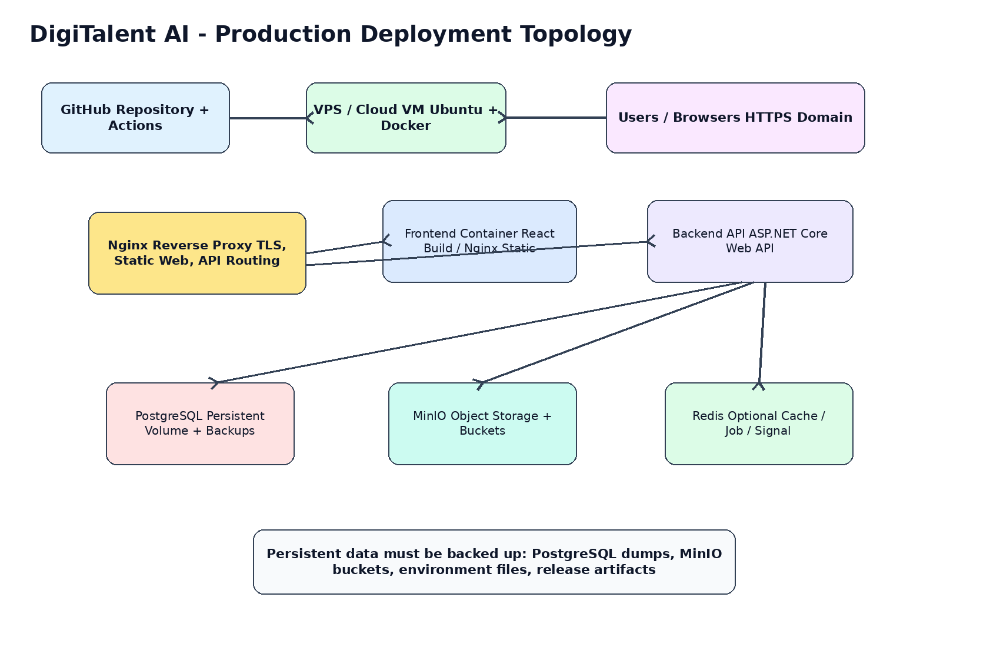
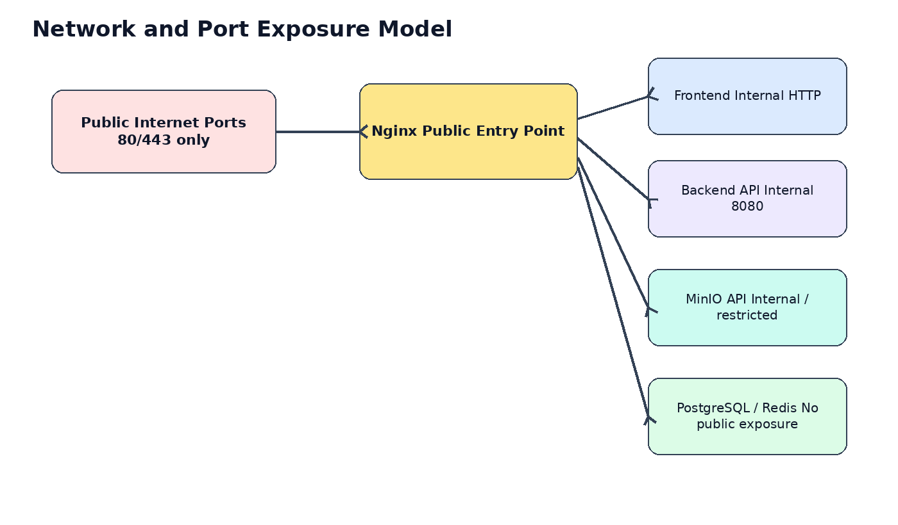
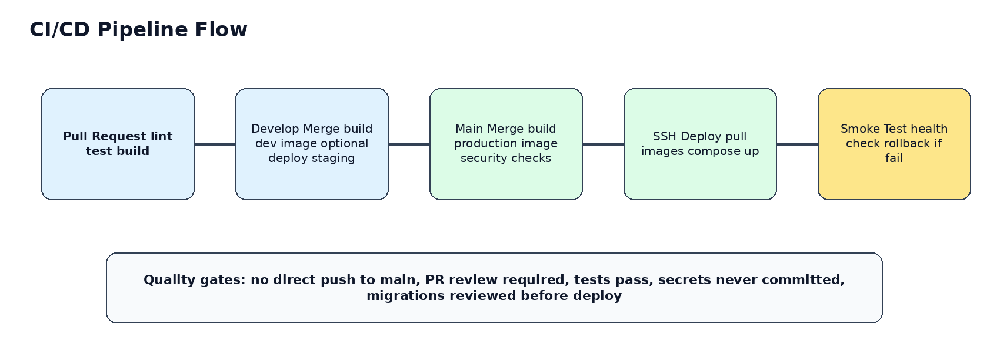
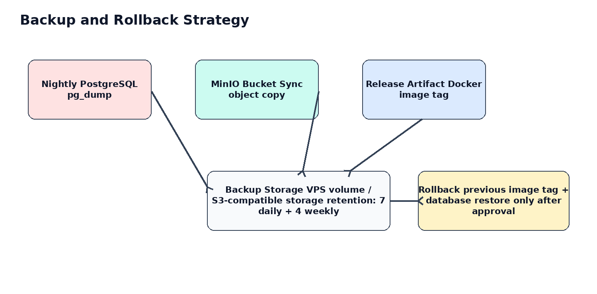

**DigiTalent AI**

**DevOps & Deployment Guide**

Document 14 - Infrastructure, Docker, CI/CD, Release, Backup and Operations

|     |     |
| --- | --- |
| **Field** | **Value** |
| Project | DigiTalent AI - Digital Competency Training, Internal Certification and Work-Based Assessment Platform |
| Primary stack | ReactJS, TypeScript, TailwindCSS, ShadCN/UI; ASP.NET Core/C#; PostgreSQL; MinIO; Redis optional; SignalR; Docker; Nginx; GitHub Actions |
| Architecture direction | Modular Monolith backend with deployment-ready containerized infrastructure |
| Document purpose | Define the practical DevOps and deployment process before coding so the team can build, test, deploy and operate consistently. |
| Version | 1.0 |

**Technical Mentor Note**

This guide is intentionally practical. It avoids over-engineering such as Kubernetes or complex microservices at MVP stage, but still prepares the project for production-like deployment, repeatable releases, backup, rollback and secure configuration.

# Table of Contents

1.  1\. Purpose and Scope
2.  2\. DevOps Objectives and Principles
3.  3\. Deployment Architecture Overview
4.  4\. Environment Strategy
5.  5\. Repository and Artifact Strategy
6.  6\. Dockerization Standard
7.  7\. Docker Compose Design
8.  8\. Environment Variables and Secrets
9.  9\. Nginx Reverse Proxy and HTTPS
10.  10\. PostgreSQL Deployment and Migration
11.  11\. MinIO Object Storage Deployment
12.  12\. Redis and Background Job Strategy
13.  13\. SignalR and WebSocket Deployment
14.  14\. CI/CD with GitHub Actions
15.  15\. Release Management and Versioning
16.  16\. Backup and Restore Strategy
17.  17\. Rollback and Incident Handling
18.  18\. Logging, Monitoring and Health Checks
19.  19\. Security Hardening
20.  20\. Deployment Runbooks
21.  21\. Troubleshooting Guide
22.  22\. Acceptance Checklist
23.  23\. Implementation Roadmap
24.  24\. Appendix: Baseline Configurations

# 1\. Purpose and Scope

This document defines how DigiTalent AI should be packaged, configured, deployed and operated from local development to production-like hosting. It is written before implementation so that all team members follow the same DevOps direction when building the frontend, backend, database, storage, notification and deployment pipeline.

The guide is scoped for the confirmed technology stack: ReactJS/TypeScript/TailwindCSS/ShadCN/UI for the frontend, ASP.NET Core/C# for the backend, PostgreSQL for relational data, MinIO for object storage, Redis as optional infrastructure, SignalR for real-time notification, Docker/Docker Compose for runtime packaging, Nginx for reverse proxy/static serving, and GitHub Actions for CI/CD automation.

## 1.1 In Scope

*   Local development environment using Docker Compose for supporting services.
*   Production-like Docker Compose deployment on a VPS or cloud VM.
*   Nginx routing for frontend, API, certificate verification, SignalR and file access.
*   GitHub Actions workflows for pull request checks, build, deployment and smoke tests.
*   Database migration, backup, restore and rollback procedures.
*   MinIO bucket design for lesson materials, task submissions and certificate PDFs.
*   Environment variables, secrets, release tags, logging, health checks and operational runbooks.

## 1.2 Out of Scope for MVP

*   Kubernetes, Helm, service mesh or advanced autoscaling.
*   Full multi-region high availability architecture.
*   Enterprise SSO/LDAP production integration, unless added as a later enhancement.
*   Managed cloud services requiring significant cost before the project is stable.
*   Automated blue-green deployment. A simple image-tag rollback is enough for MVP.

# 2\. DevOps Objectives and Principles

|     |     |
| --- | --- |
| **Principle** | **Meaning for DigiTalent AI** |
| Repeatable deployment | Any team member should be able to deploy the same version using the documented process. |
| Environment consistency | Local, staging and production-like environments should use the same service names, variable names and container layout where possible. |
| Secure by default | Secrets must not be committed. Database, Redis and MinIO admin ports should not be exposed publicly. |
| Observable runtime | The backend must expose health checks, structured logs and clear error messages for deployment troubleshooting. |
| Safe release | Each deployment must have a version tag, backup awareness, smoke test and rollback option. |
| Scope control | Use Docker Compose for MVP. Do not introduce Kubernetes unless the system is stable and there is a strong reason. |

# 3\. Deployment Architecture Overview

The recommended MVP deployment model is a single VPS or cloud VM running Docker Compose. Nginx is the public entry point. Only HTTP/HTTPS ports should be exposed to the internet. Backend, PostgreSQL, Redis and MinIO services should communicate over the internal Docker network.

## 3.1 Runtime Services

|     |     |     |     |
| --- | --- | --- | --- |
| **Service** | **Purpose** | **Port exposure** | **Notes** |
| nginx | Public reverse proxy and optional static web server | 80, 443 public | Routes web, API, SignalR and verification pages. |
| frontend | React app build | Internal or static build | Can be served by its own Nginx container or copied to the public Nginx image. |
| backend-api | ASP.NET Core Web API | Internal 8080 | Main business API, RBAC, certificate, scoring, dashboard, SignalR hub. |
| postgres | PostgreSQL database | Internal 5432 | Persistent relational data. Not public. |
| minio | S3-compatible object storage | Internal 9000/9001 | Stores lesson files, task submissions, certificate PDFs. |
| redis | Optional cache/job infrastructure | Internal 6379 | Dashboard cache, background jobs, notification support. |

# 4\. Environment Strategy

DigiTalent AI should have clear environment boundaries. Even if the project starts with only local development and one VPS, the configuration should be prepared for dev, staging and production.

|     |     |     |     |
| --- | --- | --- | --- |
| **Environment** | **Location** | **Purpose** | **Suggested compose file** |
| local | Developer machine | Fast feedback, local coding, local DB data | docker-compose.local.yml |
| development | Shared dev server or local team machine | Integration testing between frontend/backend | develop branch deployment optional |
| staging | Production-like test environment | Final QA, demo rehearsal, migration rehearsal | release candidate deployment |
| production | Final demo/production-like environment | Stable version used for defense/demo | main branch release tag |

## 4.1 Environment Naming Rules

*   Use ASPNETCORE\_ENVIRONMENT=Development, Staging or Production.
*   Use VITE\_API\_BASE\_URL for frontend API endpoint configuration.
*   Use separate database names for local/dev/staging/prod to prevent accidental overwrite.
*   Never use production credentials in local development.
*   Keep .env.example committed, but never commit .env or real secrets.

# 5\. Repository and Artifact Strategy

The project may use a monorepo for easier team coordination. This is suitable for a capstone team because frontend, backend, deployment scripts and documentation can be versioned together.

|     |     |
| --- | --- |
| **Path** | **Responsibility** |
| /frontend | ReactJS TypeScript app, ShadCN/UI components, API client and pages |
| /backend | ASP.NET Core solution, modular monolith projects and EF Core migrations |
| /deploy | Docker Compose files, Nginx templates, server scripts and runbooks |
| /docs | SRS, API, DB, UI/UX, testing, DevOps and operation documents |
| /.github/workflows | GitHub Actions CI/CD definitions |

## 5.1 Artifact Naming

*   Backend Docker image: digitalent-api:<version>
*   Frontend Docker image: digitalent-web:<version>
*   Release tag: vMAJOR.MINOR.PATCH, for example v0.1.0.
*   Database migration names must describe the business change, for example AddCertificateVerificationTables.
*   Backup files should include environment and timestamp, for example prod\_postgres\_2026-06-19\_0200.sql.gz.

# 6\. Dockerization Standard

Dockerfiles must be production-oriented, deterministic and lightweight. They should not embed secrets, local paths or developer-specific configuration.

## 6.1 Backend Dockerfile Standard

\# backend/Dockerfile  
FROM mcr.microsoft.com/dotnet/sdk:8.0 AS build  
WORKDIR /src  
COPY DigiTalent.sln ./  
COPY src/ ./src/  
RUN dotnet restore DigiTalent.sln  
RUN dotnet publish src/DigiTalent.Api/DigiTalent.Api.csproj -c Release -o /app/publish --no-restore  
  
FROM mcr.microsoft.com/dotnet/aspnet:8.0 AS runtime  
WORKDIR /app  
COPY --from=build /app/publish .  
ENV ASPNETCORE\_URLS=http://+:8080  
EXPOSE 8080  
ENTRYPOINT \["dotnet", "DigiTalent.Api.dll"\]

## 6.2 Frontend Dockerfile Standard

\# frontend/Dockerfile  
FROM node:22-alpine AS build  
WORKDIR /app  
COPY package\*.json ./  
RUN npm ci  
COPY . .  
ARG VITE\_API\_BASE\_URL  
ENV VITE\_API\_BASE\_URL=$VITE\_API\_BASE\_URL  
RUN npm run build  
  
FROM nginx:1.27-alpine AS runtime  
COPY --from=build /app/dist /usr/share/nginx/html  
COPY nginx.conf /etc/nginx/conf.d/default.conf  
EXPOSE 80

## 6.3 Docker Build Rules

*   Use multi-stage builds for both backend and frontend.
*   Do not run database migrations inside Docker build. Migrations belong to deployment step or controlled startup step.
*   Pin major runtime versions. Avoid floating images for important services in production.
*   Use .dockerignore to reduce context size and avoid copying node\_modules, bin, obj, .env, logs and local files.
*   Every image must be buildable from a clean checkout without manual local files.

# 7\. Docker Compose Design

Docker Compose is the recommended runtime orchestrator for the MVP. It provides enough structure for team deployment without the overhead of Kubernetes.

## 7.1 Production-like Compose Baseline

\# deploy/docker-compose.prod.yml  
services:  
nginx:  
image: nginx:1.27-alpine  
container\_name: digitalent-nginx  
ports:  
\- "80:80"  
\- "443:443"  
volumes:  
\- ./nginx/conf.d:/etc/nginx/conf.d:ro  
\- ./nginx/certbot:/etc/letsencrypt:ro  
depends\_on:  
\- frontend  
\- backend-api  
networks: \[digitalent-net\]  
  
frontend:  
image: ghcr.io/ORG/digitalent-web:${APP\_VERSION}  
container\_name: digtalent-web  
restart: unless-stopped  
networks: \[digitalent-net\]  
  
backend-api:  
image: ghcr.io/ORG/digitalent-api:${APP\_VERSION}  
container\_name: digitalent-api  
restart: unless-stopped  
env\_file: .env  
depends\_on:  
\- postgres  
\- minio  
\- redis  
networks: \[digitalent-net\]  
  
postgres:  
image: postgres:16-alpine  
container\_name: digitalent-postgres  
restart: unless-stopped  
env\_file: .env  
volumes:  
\- postgres\_data:/var/lib/postgresql/data  
networks: \[digitalent-net\]  
  
minio:  
image: minio/minio:latest  
container\_name: digitalent-minio  
restart: unless-stopped  
command: server /data --console-address ":9001"  
env\_file: .env  
volumes:  
\- minio\_data:/data  
networks: \[digitalent-net\]  
  
redis:  
image: redis:7-alpine  
container\_name: digitalent-redis  
restart: unless-stopped  
networks: \[digitalent-net\]  
  
networks:  
digitalent-net:  
driver: bridge  
  
volumes:  
postgres\_data:  
minio\_data:

## 7.2 Compose Safety Rules

*   Do not expose PostgreSQL, Redis or MinIO admin ports publicly unless temporary and protected by firewall/VPN.
*   Use named volumes for persistent data.
*   Use container names for easier troubleshooting, but avoid hard-coding container IP addresses.
*   Use restart: unless-stopped for runtime services.
*   Keep local and production compose files separate to avoid accidentally exposing debug ports.

# 8\. Environment Variables and Secrets

Environment variables must be centrally documented. The backend should fail fast on missing critical configuration.

|     |     |     |     |
| --- | --- | --- | --- |
| **Variable** | **Example** | **Purpose** | **Secret?** |
| ASPNETCORE\_ENVIRONMENT | Production | Runtime mode | No  |
| ConnectionStrings\_\_DefaultConnection | Host=postgres;Database=... | PostgreSQL connection | Yes |
| Jwt\_\_Issuer / Jwt\_\_Audience | digitalent-api | JWT validation | No  |
| Jwt\_\_SigningKey | long-random-secret | JWT signing key | Yes |
| MinIO\_\_Endpoint | minio:9000 | Object storage endpoint | No  |
| MinIO\_\_AccessKey / SecretKey | ... | MinIO credentials | Yes |
| Redis\_\_ConnectionString | redis:6379 | Optional Redis connection | No/Maybe |
| AllowedOrigins | https://your-domain.com | CORS allowed frontend origins | No  |
| PublicBaseUrl | https://your-domain.com | Certificate QR and public URLs | No  |

## 8.1 .env.example

\# deploy/.env.example  
APP\_VERSION=v0.1.0  
ASPNETCORE\_ENVIRONMENT=Production  
POSTGRES\_DB=digitalent  
POSTGRES\_USER=digitalent\_app  
POSTGRES\_PASSWORD=change\_me  
ConnectionStrings\_\_DefaultConnection=Host=postgres;Port=5432;Database=digitalent;Username=digitalent\_app;  
Password=change\_me  
Jwt\_\_Issuer=DigiTalentAI  
Jwt\_\_Audience=DigiTalentAI.Web  
Jwt\_\_SigningKey=replace\_with\_64\_character\_random\_secret  
MinIO\_\_Endpoint=minio:9000  
MinIO\_\_AccessKey=digitalent\_minio  
MinIO\_\_SecretKey=change\_me  
MinIO\_\_UseSSL=false  
Redis\_\_ConnectionString=redis:6379  
AllowedOrigins=https://your-domain.com  
PublicBaseUrl=https://your-domain.com

**Secret Handling Rule**

Only .env.example is committed. Real .env files are stored on the server and in GitHub Actions secrets. If a secret is accidentally committed, rotate it immediately and rewrite only if necessary.

# 9\. Nginx Reverse Proxy and HTTPS

Nginx is the public gateway. It should serve HTTPS, route API requests, support SignalR WebSocket upgrade headers and serve certificate verification pages through the same domain.

## 9.1 Recommended Routing

|     |     |     |
| --- | --- | --- |
| **Public path** | **Upstream** | **Purpose** |
| /   | frontend:80 | React application |
| /api/ | backend-api:8080 | REST API |
| /hubs/notifications | backend-api:8080 | SignalR WebSocket hub |
| /verify/{code} | frontend or backend | Public certificate verification page |
| /minio/ | minio:9000 | Optional internal/restricted object access; avoid public admin console |

## 9.2 Nginx Config Skeleton

server {  
listen 80;  
server\_name your-domain.com;  
return 301 https://$host$request\_uri;  
}  
server {  
listen 443 ssl http2;  
server\_name your-domain.com;  
  
ssl\_certificate /etc/letsencrypt/live/your-domain.com/fullchain.pem;  
ssl\_certificate\_key /etc/letsencrypt/live/your-domain.com/privkey.pem;  
  
location / {  
proxy\_pass http://frontend:80;  
proxy\_set\_header Host $host;  
proxy\_set\_header X-Real-IP $remote\_addr;  
}  
  
location /api/ {  
proxy\_pass http://backend-api:8080/api/;  
proxy\_set\_header Host $host;  
proxy\_set\_header X-Real-IP $remote\_addr;  
proxy\_set\_header X-Forwarded-For $proxy\_add\_x\_forwarded\_for;  
proxy\_set\_header X-Forwarded-Proto $scheme;  
}  
  
location /hubs/ {  
proxy\_pass http://backend-api:8080/hubs/;  
proxy\_http\_version 1.1;  
proxy\_set\_header Upgrade $http\_upgrade;  
proxy\_set\_header Connection "Upgrade";  
proxy\_set\_header Host $host;  
}  
}

## 9.3 HTTPS Setup Options

*   Option A: Use Certbot on VPS and mount /etc/letsencrypt into Nginx container.
*   Option B: Use a reverse proxy companion container for automatic certificates.
*   Option C: Use Cloudflare in front of the VPS and still maintain HTTPS to origin if possible.
*   For a capstone demo, Option A is easiest to explain and control.

# 10\. PostgreSQL Deployment and Migration

PostgreSQL is the source of truth for users, RBAC, organization data, competency, learning progress, assessment results, certificates, task evidence, scoring and audit logs. Data safety is more important than fast deployment.

## 10.1 Migration Strategy

*   Use EF Core migrations in source control.
*   Review migrations in pull requests, especially destructive changes.
*   Never manually edit production schema without documenting the change.
*   For MVP, migrations can be applied manually during deployment or by a controlled migration command.
*   Before production deployment with schema changes, run backup first.

\# Example migration commands  
cd backend  
dotnet ef migrations add AddCertificateVerificationTables -p src/DigiTalent.Infrastructure -s  
src/DigiTalent.Api  
dotnet ef database update -p src/DigiTalent.Infrastructure -s src/DigiTalent.Api  
  
\# Production-like migration inside API container if tooling is available  
docker compose exec backend-api dotnet DigiTalent.Api.dll --migrate

## 10.2 Database Backup Command

\# On the server  
mkdir -p /opt/digitalent/backups/postgres  
BACKUP\_FILE=/opt/digitalent/backups/postgres/prod\_$(date +%Y%m%d\_%H%M).sql.gz  
  
docker exec digitalent-postgres pg\_dump -U digitalent\_app digitalent | gzip > $BACKUP\_FILE

## 10.3 Restore Command

\# Restore only after confirming the target environment and stopping API writes  
zcat /opt/digitalent/backups/postgres/prod\_YYYYMMDD\_HHMM.sql.gz | \\  
docker exec -i digitalent-postgres psql -U digitalent\_app -d digitalent

# 11\. MinIO Object Storage Deployment

MinIO stores files that should not be stored directly in PostgreSQL: lesson materials, task submission attachments and generated certificate PDFs. Database records should store object keys and metadata, not binary file contents.

|     |     |     |
| --- | --- | --- |
| **Bucket** | **Content** | **Access rule** |
| lesson-materials | PDF, slide, video link metadata, training resources | Private by default |
| task-submissions | Employee work evidence files and attachments | Private, permission-checked via backend |
| certificate-pdfs | Generated certificate PDF files | Private or controlled public access through verification flow |
| system-assets | Template images, certificate backgrounds, icons if needed | Private or read-only public depending on use |

## 11.1 File Upload Rules

*   All uploads go through backend permission checks; frontend must not upload directly to MinIO unless signed URL flow is implemented safely.
*   Validate file extension, MIME type and file size.
*   Use object keys with stable prefixes: lessons/{courseId}/{fileId}, tasks/{taskId}/{submissionId}, certificates/{certificateId}.
*   Store file metadata in PostgreSQL: original name, object key, content type, size, uploaded by, uploaded at.
*   Do not expose MinIO console publicly in production demo.

# 12\. Redis and Background Job Strategy

Redis is optional for MVP but useful for caching dashboard data, supporting background jobs, storing temporary tokens or powering notification workflows. If Redis is not implemented early, the system should still work with direct database queries.

|     |     |     |
| --- | --- | --- |
| **Use case** | **Description** | **Priority** |
| Dashboard cache | Cache HR/Manager dashboard summaries for short TTL to reduce expensive queries. | Optional |
| Notification jobs | Queue reminders for course deadlines, task deadlines and certificate expiry. | Optional |
| Rate limiting | Store counters for login attempts or sensitive endpoints. | Should-have |
| SignalR scale-out | Use Redis backplane only if multiple API instances are introduced. | Future |

# 13\. SignalR and WebSocket Deployment

SignalR is used for in-app notifications such as course assignment, training reminder, task update and certificate status update. The deployment must support WebSocket upgrade through Nginx.

*   Backend exposes hub endpoint: /hubs/notifications.
*   Authenticated users connect with access token.
*   Notification delivery must also be persisted in database so users can view missed notifications after reconnecting.
*   Nginx must pass Upgrade and Connection headers.
*   If SignalR fails, core business flows must still work through normal API and notification list polling.

# 14\. CI/CD with GitHub Actions

CI/CD should reduce manual errors. For the MVP, GitHub Actions should check code quality and optionally deploy to a VPS through SSH after main branch release.

## 14.1 Recommended Workflow Matrix

|     |     |     |
| --- | --- | --- |
| **Trigger** | **Actions** | **Notes** |
| Pull Request to develop/main | Install dependencies, lint, build, run tests | Fail PR if checks fail |
| Push to develop | Build images, optional deploy to dev/staging | Only if staging server is available |
| Push tag v\*.\*.\* or merge main | Build production images and deploy | Requires secrets and approval |
| Manual workflow\_dispatch | Deploy selected version | Useful for demo day rollback/redeploy |

## 14.2 GitHub Actions Skeleton

name: CI  
  
on:  
pull\_request:  
branches: \[develop, main\]  
push:  
branches: \[develop, main\]  
  
jobs:  
backend:  
runs-on: ubuntu-latest  
steps:  
\- uses: actions/checkout@v4  
\- uses: actions/setup-dotnet@v4  
with:  
dotnet-version: '8.0.x'  
\- run: dotnet restore backend/DigiTalent.sln  
\- run: dotnet build backend/DigiTalent.sln --configuration Release --no-restore  
\- run: dotnet test backend/DigiTalent.sln --configuration Release --no-build  
  
frontend:  
runs-on: ubuntu-latest  
steps:  
\- uses: actions/checkout@v4  
\- uses: actions/setup-node@v4  
with:  
node-version: '22'  
cache: 'npm'  
cache-dependency-path: frontend/package-lock.json  
\- run: npm ci  
working-directory: frontend - run: npm run lint  
working-directory: frontend - run: npm run build  
working-directory: frontend

## 14.3 Deployment via SSH Skeleton

name: Deploy Production  
  
on:  
workflow\_dispatch:  
inputs:  
version:  
description: 'Docker image tag to deploy'  
required: true  
  
jobs:  
deploy:  
runs-on: ubuntu-latest  
steps:  
\- name: Deploy over SSH  
uses: appleboy/ssh-action@v1.0.3  
with:  
host: ${{ secrets.VPS\_HOST }}  
username: ${{ secrets.VPS\_USER }}  
key: ${{ secrets.VPS\_SSH\_KEY }}  
script: |  
cd /opt/digitalent/deploy  
export APP\_VERSION=${{ github.event.inputs.version }}  
docker compose -f docker-compose.prod.yml pull  
docker compose -f docker-compose.prod.yml up -d  
docker compose -f docker-compose.prod.yml ps  
curl -f https://your-domain.com/api/health || exit 1

**Deployment Approval**

Production deployment should be manual or protected by GitHub Environments. Do not auto-deploy every commit to production during capstone development.

# 15\. Release Management and Versioning

Each stable demo build should have a version tag. This makes the defense demo easier to reproduce and makes rollback possible.

|     |     |
| --- | --- |
| **Version** | **Suggested content** |
| v0.1.0 | First integrated MVP demo: auth, organization, competency, course basics |
| v0.2.0 | Learning, assessment, certificate QR and core dashboard |
| v0.3.0 | WMS-lite task, evidence portfolio and readiness scoring |
| v1.0.0 | Final defense-ready release |

## 15.1 Release Checklist

*   All PRs merged and reviewed.
*   Database migrations tested on staging or local production-like environment.
*   Manual regression checklist completed for core demo flow.
*   Backup completed before deployment if production data exists.
*   Version tag created and release notes written.
*   Smoke test passed after deployment.

# 16\. Backup and Restore Strategy

Backups protect the project from data loss during migration, deployment, demo preparation or server failure. PostgreSQL and MinIO are the two most important persistent services.

|     |     |     |     |
| --- | --- | --- | --- |
| **Asset** | **Backup method** | **Retention** | **When required** |
| PostgreSQL | Nightly pg\_dump gzip | Keep 7 daily + 4 weekly backups | Before each production deployment with schema changes |
| MinIO | Bucket sync/copy | Keep object backup aligned with database backup | Weekly or before major demo |
| Environment files | Encrypted manual backup | Keep latest production .env securely | After every secret update |
| Docker image tags | Registry retention | Keep recent release tags | Every release |

## 16.1 Restore Validation

*   A backup is not reliable until it has been restored successfully at least once in a non-production environment.
*   After restore, verify login, course list, certificate verification and file download.
*   Restore should be documented with date, backup file, target environment and person responsible.

# 17\. Rollback and Incident Handling

Rollback is required when a deployment causes broken login, API errors, failed migration, missing files, or critical demo flow failure.

|     |     |     |
| --- | --- | --- |
| **Incident** | **Primary action** | **Notes** |
| Frontend build broken | Revert to previous frontend image tag | No database restore needed |
| Backend runtime error | Rollback API image and check logs | Database restore only if migration caused data issue |
| Migration failure before data change | Fix migration and redeploy | Keep service stopped until schema consistent |
| Migration corrupts data | Restore database backup after approval | Highest risk; document incident |
| MinIO file loss | Restore object backup and verify DB object keys | Check certificate/task file flows |

## 17.1 Rollback Commands

\# Rollback to previous application version  
cd /opt/digitalent/deploy  
export APP\_VERSION=v0.2.0  
docker compose -f docker-compose.prod.yml pull  
docker compose -f docker-compose.prod.yml up -d  
curl -f https://your-domain.com/api/health  
  
\# Inspect logs  
docker logs digitalent-api --tail=200  
docker logs digitalent-nginx --tail=200

# 18\. Logging, Monitoring and Health Checks

The MVP does not need enterprise monitoring, but it must have enough observability to debug deployment issues quickly.

|     |     |     |
| --- | --- | --- |
| **Item** | **Purpose** | **Notes** |
| /api/health | Returns service health | Used by CI/CD smoke test |
| /api/health/db | Checks PostgreSQL connectivity | Restricted or internal only if detailed |
| Structured logs | JSON or consistent text logs | Include request id, user id if available, action name |
| Audit logs | Business/security events | Login, RBAC change, certificate revocation, task evaluation |
| Container logs | docker logs | Useful for demo troubleshooting |

## 18.1 Backend Logging Rules

*   Log deployment startup: environment, database connection status, MinIO connection status, migration version if available.
*   Do not log passwords, JWT tokens, refresh tokens, MinIO secrets or full personal data.
*   Log failed authorization attempts with actor, endpoint and reason where safe.
*   Use correlation/request id for tracing frontend/API issues.

# 19\. Security Hardening

|     |     |
| --- | --- |
| **Area** | **Required control** |
| Firewall | Allow only 22, 80, 443 publicly. Restrict SSH by key. |
| SSH | Disable password login where possible. Use separate deploy user, not root. |
| Secrets | Use GitHub Secrets and server .env. Rotate if leaked. |
| Database | No public PostgreSQL port. Use strong user/password. Backup before migrations. |
| MinIO | Do not expose admin console publicly. Use strong credentials and private buckets. |
| CORS | Allow only official frontend domain in production. |
| JWT | Long random signing key. Short access token lifetime with refresh token flow. |
| Uploads | Validate file type, size and permission before storing. |
| Nginx | HTTPS, security headers, body size limit for uploads. |

## 19.1 Recommended Nginx Security Headers

add\_header X-Content-Type-Options nosniff;  
add\_header X-Frame-Options SAMEORIGIN;  
add\_header X-XSS-Protection "1; mode=block";  
add\_header Referrer-Policy strict-origin-when-cross-origin;  
client\_max\_body\_size 20M;

# 20\. Deployment Runbooks

## 20.1 First-Time VPS Setup

1.  Create VPS or cloud VM with Ubuntu LTS.
2.  Create a non-root deploy user and configure SSH key login.
3.  Install Docker Engine and Docker Compose plugin.
4.  Clone the repository into /opt/digitalent or upload deployment folder.
5.  Create production .env from .env.example and fill real values.
6.  Create Docker network and volumes through docker compose.
7.  Configure domain DNS A record to VPS public IP.
8.  Configure Nginx and HTTPS certificate.
9.  Run docker compose pull and docker compose up -d.
10.  Run smoke tests: frontend loads, API health OK, login works, file upload works, certificate verification works.

## 20.2 Normal Deployment Runbook

1.  Confirm release tag and changelog.
2.  Confirm CI checks passed.
3.  Backup PostgreSQL and MinIO if data exists.
4.  Deploy selected APP\_VERSION using GitHub Actions or SSH command.
5.  Apply or verify database migrations.
6.  Run smoke tests.
7.  Notify team that deployment is completed.
8.  If smoke test fails, rollback to previous version.

## 20.3 Demo-Day Runbook

*   Freeze main branch at least one day before defense if possible.
*   Prepare local fallback environment using docker compose in case VPS/network fails.
*   Export seed data for demo company, employees, courses, assessments, certificates and tasks.
*   Prepare backup admin account and test employee/manager accounts.
*   Verify QR certificate flow on another device/browser.
*   Keep rollback commands and previous image tag ready.

# 21\. Troubleshooting Guide

|     |     |     |
| --- | --- | --- |
| **Symptom** | **Likely causes** | **Action** |
| Frontend cannot call API | Wrong VITE\_API\_BASE\_URL, CORS blocked, Nginx route wrong | Check browser console, Nginx config, backend AllowedOrigins. |
| API container exits | Missing env variable, DB unavailable, migration error | docker logs digitalent-api, check .env and postgres health. |
| Login fails after deploy | JWT key changed, time mismatch, DB seed missing | Check auth logs, seed data, server time. |
| File upload fails | MinIO credentials/bucket missing, body size too small | Check bucket, Nginx client\_max\_body\_size, API logs. |
| SignalR not connected | WebSocket headers missing, token issue | Check /hubs route and Nginx Upgrade headers. |
| Certificate QR shows wrong URL | PublicBaseUrl incorrect | Fix env and regenerate affected verification links if needed. |
| Database migration fails | Existing data violates constraint | Restore backup or write corrective migration. |
| Server disk full | Old images/logs/backups | docker system df, prune carefully, rotate backups. |

# 22\. Acceptance Checklist

|     |     |
| --- | --- |
| **Area** | **Acceptance condition** |
| Docker | Frontend, backend, PostgreSQL, MinIO, Redis and Nginx run with Docker Compose. |
| HTTPS | Official domain loads with valid HTTPS certificate. |
| API | /api/health returns healthy and Swagger is accessible in allowed environment. |
| Database | Migrations can be applied and rollback plan exists. |
| Files | Lesson material upload, task submission and certificate PDF storage work. |
| Auth/RBAC | Admin, HR, Manager, Trainer, Employee and Verifier accounts work with correct permissions. |
| SignalR | Notifications connect or fallback API notification list works. |
| Backup | PostgreSQL backup command works and restore has been tested at least once. |
| CI/CD | PR checks run; deployment workflow can deploy a selected version. |
| Demo | End-to-end capability development demo flow works on production-like environment. |

# 23\. Implementation Roadmap

|     |     |     |
| --- | --- | --- |
| **Phase** | **Name** | **Deliverables** |
| Phase 1 | Local DevOps foundation | Docker Compose local for PostgreSQL, MinIO, Redis; .env.example; backend health check. |
| Phase 2 | Repository quality gates | GitHub Actions for backend build/test and frontend lint/build. |
| Phase 3 | Production-like VPS | Nginx, domain, HTTPS, docker-compose.prod.yml, manual deployment. |
| Phase 4 | Automated deployment | Build/push images, SSH deploy, smoke test and rollback command. |
| Phase 5 | Operations hardening | Backup scripts, restore rehearsal, log review, monitoring checklist. |

# 24\. Appendix: Baseline Configurations

## 24.1 .dockerignore Baseline

.git  
.github  
node\_modules  
dist  
build  
bin  
obj  
.env  
.env.\*  
!.env.example  
logs  
\*.log  
.vscode  
.idea  
coverage  
TestResults

## 24.2 Backend Health Check Endpoint Requirements

*   GET /api/health returns service status, version and environment.
*   GET /api/health/ready checks database and MinIO connectivity.
*   GET /api/health/live only checks process liveness.
*   Detailed health output should be restricted in production if it exposes internal details.

## 24.3 Suggested Server Directory Layout

/opt/digitalent/  
deploy/  
docker-compose.prod.yml  
.env  
nginx/  
conf.d/  
certbot/  
scripts/  
backup-postgres.sh  
restore-postgres.sh  
deploy-version.sh  
backups/  
postgres/  
minio/  
logs/

## 24.4 Final Recommendation

For DigiTalent AI, the best MVP DevOps approach is Docker Compose on a VPS/cloud VM with Nginx, HTTPS, PostgreSQL and MinIO persistent volumes, GitHub Actions for CI quality gates, manual-approved production deployment and scripted backup/rollback. This is professional enough for a real capstone implementation while avoiding unnecessary infrastructure complexity.