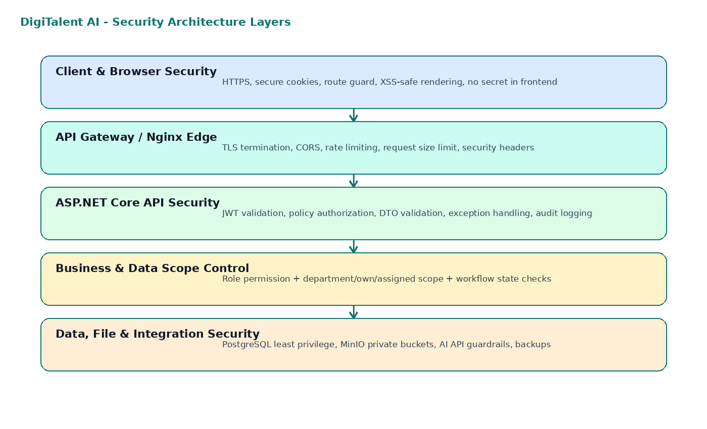
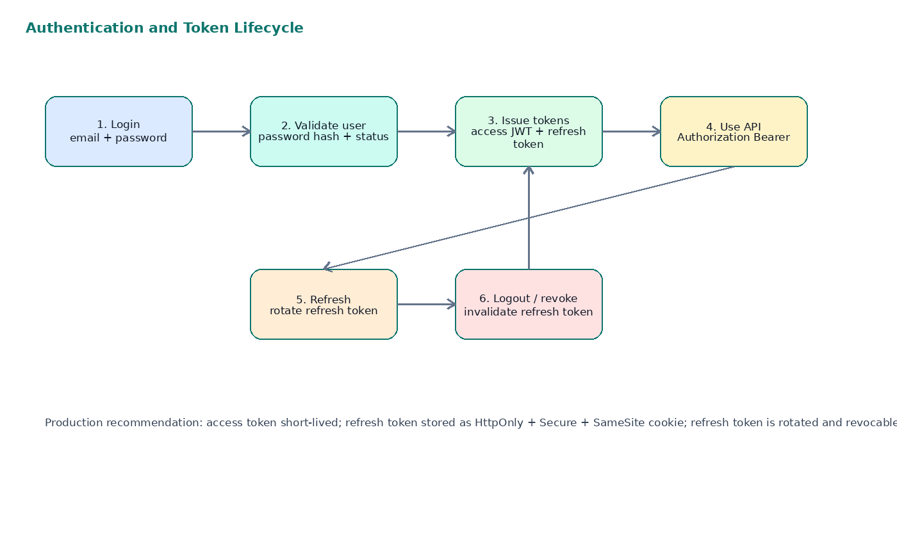
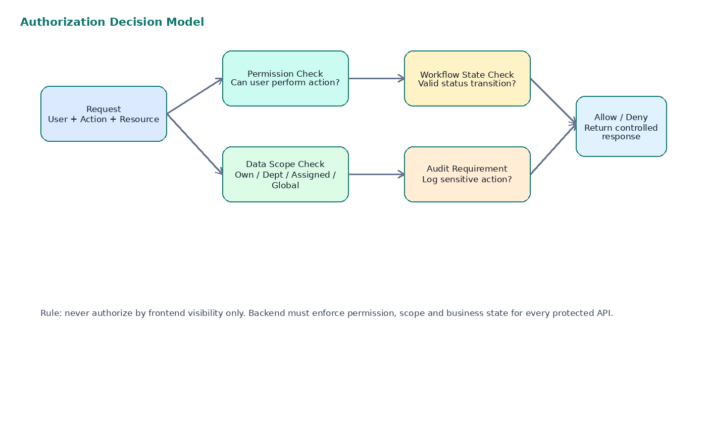
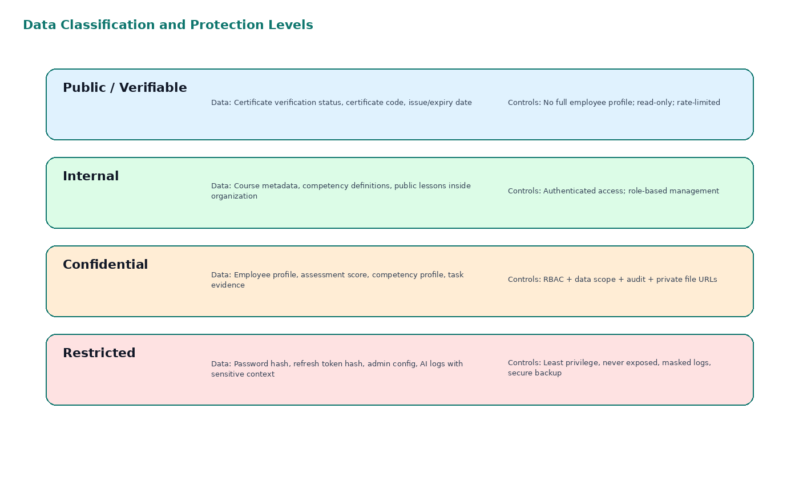

**DIGITALENT AI**

**15\. Security Design Document**

_Security Architecture, Authentication, Authorization, Data Protection and Operational Controls_

Technology baseline: ReactJS, TypeScript, TailwindCSS, ShadCN/UI, ASP.NET Core/C#, PostgreSQL, MinIO, Redis, SignalR, Docker, Nginx, GitHub Actions

**Document Purpose**

This document defines the practical security design for DigiTalent AI before implementation. It translates business requirements, RBAC, API design, database design, DevOps guide and UI behavior into concrete security controls that the development team can implement, test and demonstrate during defense.  

| **Field** | **Value** |
| --- | --- |
| Document ID | 15-SDD-DIGITALENT-AI |
| Version | 1.0 |
| Prepared for | DigiTalent AI Capstone Project Team |
| Primary focus | Secure implementation guideline for MVP and extensible enterprise direction |
| Security posture | Practical enterprise baseline, not over-engineered for capstone scope |
| Date | 2026-06-19 |

# Table of Contents

1.  1\. Purpose and Scope
2.  2\. Security Objectives and Principles
3.  3\. Security Context and Threat Model
4.  4\. Security Architecture Overview
5.  5\. Identity and Authentication Design
6.  6\. Authorization, RBAC and Data Scope Design
7.  7\. API Security and Request Protection
8.  8\. Frontend Security Design
9.  9\. Data Security and Privacy Protection
10.  10\. File Storage and Upload Security
11.  11\. Certificate QR Verification Security
12.  12\. Assessment and Learning Security
13.  13\. WMS-lite Task Evidence Security
14.  14\. AI and Rule-based Intelligence Security
15.  15\. SignalR Notification Security
16.  16\. Infrastructure, DevOps and Deployment Security
17.  17\. Logging, Audit and Monitoring
18.  18\. Incident Response and Recovery
19.  19\. Security Testing Strategy
20.  20\. Security Requirements Traceability
21.  21\. MVP Implementation Roadmap
22.  22\. Security Acceptance Checklist
23.  Appendix A. Policy and Permission Naming
24.  Appendix B. Secure Configuration Baseline
25.  Appendix C. Security Review Checklist for Pull Requests

# 1\. Purpose and Scope

**DigiTalent AI** manages internal employees, job positions, digital competency profiles, courses, assessments, certificates, practical task evidence and capability intelligence scores. Because the system contains employee information and evaluation records, security must be designed before coding rather than patched later.

**Security design scope**

The security scope covers authentication, authorization, RBAC, data scope, API protection, frontend behavior, PostgreSQL data protection, MinIO files, certificate verification, WMS-lite task evidence, AI integration, logging, audit, deployment and testing controls.  

| **Area** | **Included in this document** | **MVP Priority** |
| --- | --- | --- |
| Authentication | Login, refresh token, logout, password policy, lockout, session control. | Core |
| Authorization | Permission-based RBAC plus data scope validation for department/own/assigned resources. | Core |
| API Security | DTO validation, CORS, rate limit, error handling, Swagger access control, anti-overposting. | Core |
| Data Security | Classification, data minimization, audit, soft delete, score immutability, restricted public certificate view. | Core |
| File Security | Private MinIO buckets, object metadata, allowed file types, size limits, secure download flow. | Core |
| AI Security | LLM used only for optional suggestions; no official decisions without human review. | Optional |
| Advanced Enterprise Security | SSO/LDAP, MFA, SIEM, virus scanning, WAF, multi-tenant isolation. | Future |

# 2\. Security Objectives and Principles

*   Protect employee profile, assessment score, certificate, task evidence and capability intelligence data from unauthorized access.
*   Ensure every sensitive action is authorized by backend permission and data scope, not only by frontend route visibility.
*   Keep official competency, certificate and readiness results explainable, auditable and resistant to unauthorized modification.
*   Prevent common web security risks such as broken access control, token leakage, SQL injection, unsafe file upload and excessive information exposure.
*   Maintain a security design that is realistic for a 5-member capstone team while still showing enterprise thinking.

| **Principle** | **Meaning for DigiTalent AI** | **Implementation Direction** |
| --- | --- | --- |
| Least privilege | Users only access functions and data necessary for their role. | Permission matrix + policy-based authorization + department/own scope checks. |
| Defense in depth | Security is applied across browser, API, business service, database, file storage and deployment. | Nginx headers, JWT validation, DTO validation, business state validation, audit logs. |
| Secure by default | New API endpoints, new screens and new entities must be private until explicitly opened. | Default deny policy, protected routes, no anonymous access except certificate verification. |
| Data minimization | Public certificate verification must not expose the full employee profile or internal training details. | Return only certificate code, holder display name, course/certificate title and status. |
| Explainability and auditability | Important decisions must be traceable. | Audit certificate issuance/revocation, task evaluation, competency change, score recalculation and AI suggestions. |
| Human-in-the-loop | AI must not directly make official HR decisions. | AI can suggest questions/tasks/explanations; Trainer/Manager/HR approves official outputs. |

# 3\. Security Context and Threat Model

The threat model is scoped to the MVP web application deployed on a VPS/cloud environment using Docker Compose, Nginx, ASP.NET Core API, PostgreSQL and MinIO.

| **Asset** | **Example Data** | **Primary Threat** | **Required Control** |
| --- | --- | --- | --- |
| User account | Email, password hash, roles, refresh tokens. | Credential theft, token replay, account takeover. | Hash passwords, short-lived JWT, refresh rotation, lockout, secure cookie. |
| Employee profile | Department, position, manager, status. | Unauthorized cross-department access. | RBAC + department data scope. |
| Assessment result | Attempts, answers, scores, pass/fail. | Score tampering or self-modification. | Immutable attempt records, server-side scoring, audit. |
| Certificate | Certificate code, QR, PDF, status. | Fake or revoked certificate accepted. | Ungguessable code, server-side verify, status and expiry checks. |
| Task evidence | Submission files, evaluation score, feedback. | Unauthorized download, self-evaluation, data leakage. | Private MinIO objects, signed URLs, evaluator permission check. |
| Capability scores | Skill gap, risk, readiness. | Manipulated business decisions. | Rule-based service only, config-controlled weights, recalculation audit. |
| AI prompt/output | Task suggestion, question draft, explanation. | Prompt injection, leakage of internal data. | No secrets in prompts, output review, AI logs with controlled access. |

| **Threat Scenario** | **Risk Level** | **Mitigation** |
| --- | --- | --- |
| Department Manager accesses employees from another department by changing an ID in URL. | Critical | Backend checks department scope for every employee, task, dashboard and evidence API. |
| Employee tries to modify assessment score or certificate status through API request manipulation. | Critical | No direct update endpoints for official results; only system/service workflow can update scores; audit all changes. |
| Public certificate QR exposes too much employee data. | High | Verification endpoint returns minimal public data; detailed certificate pages require authentication. |
| Uploaded file contains malicious content or unexpected format. | High | MIME/extension/size validation, private buckets, future antivirus scan. |
| Refresh token is stolen and reused. | High | Store hashed refresh token, rotate on refresh, revoke on logout, detect reuse. |
| Developer commits .env or cloud credentials to GitHub. | High | .gitignore, GitHub secrets, pre-commit secret scan recommendation, PR checklist. |
| AI output is treated as official evaluation without review. | Medium | Human approval required; AI features marked optional and logged. |

# 4\. Security Architecture Overview

Security is designed as layered controls. Each layer reduces risk if another layer fails.

| **Layer** | **Controls** | **Owner** |
| --- | --- | --- |
| Browser / React | Protected routes, role-based menu, safe rendering, no hard-coded secrets, input constraints. | Frontend Team |
| Nginx / Edge | HTTPS, security headers, CORS origin control, body size limit, static file serving. | DevOps Team |
| ASP.NET Core API | Authentication middleware, policy authorization, DTO validation, exception handling, logging. | Backend Team |
| Business Service Layer | Workflow status validation, data scope checks, scoring rules, audit events. | Backend Team |
| PostgreSQL / MinIO | Least privilege connection, private object storage, backups, migration control. | Backend + DevOps |
| Operational Layer | GitHub secrets, CI checks, backup/restore, incident runbook. | Whole Team |

# 5\. Identity and Authentication Design

Authentication proves who the user is. Authorization decides what the user can do. These two responsibilities must remain separated in code.

## 5.1 Account and Login Rules

| **Requirement ID** | **Requirement** | **Implementation Guideline** |
| --- | --- | --- |
| SEC-AUTH-01 | Users authenticate using email and password in MVP. | Use ASP.NET Core password hasher or BCrypt/Argon2id equivalent. Never store plain text passwords. |
| SEC-AUTH-02 | Inactive/archived users cannot login. | Check user status before issuing tokens. |
| SEC-AUTH-03 | Failed login attempts must be controlled. | Lock account or temporarily block login after configured threshold, e.g., 5 failed attempts in 15 minutes. |
| SEC-AUTH-04 | Login response must not reveal whether email or password is wrong. | Use generic error: Invalid email or password. |
| SEC-AUTH-05 | Password change must revoke old refresh sessions. | Revoke refresh tokens after password update or admin reset. |
| SEC-AUTH-06 | System must support future SSO/OAuth2 without redesigning RBAC. | Keep IdentityProvider fields optional and separate from roles/permissions. |

## 5.2 JWT and Refresh Token Strategy

| **Token** | **Recommended Handling** | **Reason** |
| --- | --- | --- |
| Access token | Short-lived JWT, recommended 10-30 minutes; stored in memory or secure runtime state on frontend. | Limits impact if token is leaked. |
| Refresh token | Longer-lived, stored as HttpOnly + Secure + SameSite cookie in production; store hash in database. | Prevents JavaScript access and supports server-side revocation. |
| Refresh rotation | On every refresh, issue a new refresh token and invalidate the previous one. | Reduces replay risk. |
| Logout | Revoke current refresh token and clear cookie/session. | Prevents token reuse after logout. |
| Role/permission changes | Either force re-login, invalidate active sessions, or include security stamp version. | Prevents stale permissions from remaining active. |

**Frontend token storage recommendation**

For local development, teams often use localStorage for convenience. For production-like deployment, avoid storing refresh tokens in localStorage. Use HttpOnly secure cookies for refresh tokens and keep the access token short-lived.  

# 6\. Authorization, RBAC and Data Scope Design

DigiTalent AI must use permission-based RBAC combined with data scope validation. Role name alone is not enough because Department Managers and Employees can only access a subset of data.

## 6.1 Role Model

| **Role** | **Business Responsibility** | **Security Boundary** |
| --- | --- | --- |
| SYS\_ADMIN | Manage system users, roles, global configuration and audit. | Global administrative access, but still audited for sensitive operations. |
| HR\_MANAGER | Manage organization, employees, training plan, competency framework and company-level dashboards. | Company-wide business data access. Cannot bypass audit or workflow rules. |
| DEPT\_MANAGER | Monitor and evaluate employees in assigned department. | Department-scoped data only. Cannot access other departments by changing IDs. |
| TRAINER | Create courses, lessons, questions and assessments. | Training content scope; can review AI questions; cannot alter official employee scores directly. |
| EMPLOYEE | Learn, take assessments, view own certificates/tasks/competency profile. | Own data only. Cannot modify official scores, certificates or competency levels. |
| CERT\_VERIFIER | Verify certificate validity by code/QR. | Minimal certificate verification access only. |

## 6.2 Data Scope Rules

| **Scope Type** | **Meaning** | **Examples** |
| --- | --- | --- |
| GLOBAL | Can access all records in organization. | SYS\_ADMIN, HR\_MANAGER for dashboards/employees. |
| DEPARTMENT | Can access records belonging to managed department(s). | DEPT\_MANAGER viewing employee list, tasks and readiness. |
| ASSIGNED | Can access records explicitly assigned to the user. | Trainer assigned to course; evaluator assigned to task. |
| OWN | Can access only personal records. | Employee learning progress, own task, own certificate. |
| PUBLIC\_VERIFY | Can access only minimal certificate verification response. | QR verification page. |

## 6.3 Critical Authorization Rules

*   Frontend menus are usability controls, not security controls. Backend APIs must enforce authorization.
*   Every endpoint that returns employee, assessment, certificate, task or evidence data must validate data scope.
*   Employees can submit assessment attempts and task submissions, but cannot update official scores, certificates or competency levels.
*   Department Managers can evaluate only task assignments within their department or assigned responsibility.
*   Certificate verification can be public only if the returned data is minimal and read-only.
*   System Admin cannot silently change business outcomes without audit log.
*   Permission changes should be tested with direct API calls, not only UI navigation.

# 7\. API Security and Request Protection

| **Control** | **Required Behavior** | **Implementation Notes** |
| --- | --- | --- |
| HTTPS only | Production/staging must use HTTPS. | Terminate TLS at Nginx or cloud proxy; redirect HTTP to HTTPS. |
| CORS | Only configured frontend origins can call API. | Never use wildcard CORS with credentials. |
| Authentication middleware | All APIs protected by default except login/refresh and public certificate verify. | Use \[Authorize\] globally or endpoint group policy. |
| Policy authorization | Each protected endpoint maps to a permission policy. | Example: PolicyNames.CoursesCreate, TasksEvaluate. |
| DTO validation | Reject invalid request body before business logic. | Use FluentValidation or ASP.NET validation filters. |
| Anti-overposting | Do not bind EF entities directly from request. | Use request DTOs, explicit mapping. |
| Pagination limits | Prevent excessive data extraction. | Default page size 20, max 100. |
| Rate limiting | Apply rate limits to login, refresh, certificate verify and AI calls. | Use ASP.NET Core rate limiting middleware. |
| Error handling | Return safe error messages to client. | No stack trace or SQL details in response. |
| Swagger exposure | Swagger enabled for dev/staging; protected or disabled in production. | If public, no sensitive examples/secrets. |

## 7.1 Standard Error Response

{  
"success": false,  
"message": "Validation failed",  
"traceId": "00-a1b2c3...",  
"errors": \[  
{ "field": "deadline", "message": "Deadline must be in the future" }  
\]  
}  

## 7.2 API Security Checklist per Endpoint

| **Question** | **Expected Answer Before Merge** |
| --- | --- |
| Is the endpoint authenticated? | Yes, except documented public endpoints. |
| Is the permission policy mapped? | Yes, policy name is defined and tested. |
| Is data scope validated? | Yes, especially employee/task/evidence/certificate/detail APIs. |
| Are request DTOs validated? | Yes, with length/range/status rules. |
| Are dangerous fields excluded from client update? | Yes, no client updates for score/status/createdBy unless workflow allows. |
| Is audit required? | Yes for sensitive operations. |
| Are errors safe? | Yes, no sensitive internal details. |

# 8\. Frontend Security Design

| **Frontend Area** | **Rule** | **Reason** |
| --- | --- | --- |
| Route Guard | Protected pages require authenticated user and matching permissions. | Prevents accidental UI exposure and improves UX. |
| Menu Rendering | Sidebar menu is generated from permission map. | Avoid showing actions users cannot perform. |
| Button Visibility | Create/Edit/Delete/Evaluate/Revoke buttons must check permission and resource state. | Prevents invalid client actions. |
| Token Handling | Do not store refresh tokens in localStorage for production. | Reduces XSS token theft risk. |
| Form Validation | Frontend validation improves UX but backend remains source of truth. | Avoid trusting client validation. |
| HTML Rendering | Do not render untrusted lesson/AI content using dangerouslySetInnerHTML unless sanitized. | Prevents XSS. |
| Error Display | Display user-friendly errors; do not show raw stack trace/API exception. | Avoid leaking internals. |
| File Download | Use backend-authorized signed URL or proxy endpoint. | Prevents direct object access. |

**Important frontend rule**

Hiding a button is not authorization. A user can still call the API manually. Always combine frontend guards with backend permission and data scope checks.  

# 9\. Data Security and Privacy Protection

## 9.1 Data Protection Rules

| **Data Category** | **Examples** | **Protection Rule** |
| --- | --- | --- |
| Identity data | Email, full name, role, department. | Authenticated access; HR/Admin can manage; employee can view own profile. |
| Assessment data | Attempts, answers, scores, pass/fail. | Immutable after submit; only authorized trainer/system views details. |
| Competency data | Current level, required level, evidence. | Only HR/Manager/Employee own view; updates through approved workflow. |
| Certificate data | Code, QR, PDF, status, expiry. | Public verify returns minimal data; full certificate detail is authenticated. |
| Task evidence | Files, links, feedback, score. | Private access; manager/evaluator and employee own view only. |
| Audit data | Who did what, when, resource affected. | Admin/security access only; append-only behavior preferred. |
| Secrets | JWT keys, DB password, MinIO keys, AI API key. | Never stored in database or repository; environment/GitHub secrets only. |

## 9.2 Database-Level Controls

*   Use application-specific PostgreSQL user with least required privileges.
*   Separate development, staging and production databases.
*   Use migrations for schema changes; do not manually modify production schema without migration script.
*   Do not hard-delete sensitive business records by default; use status/is\_deleted where appropriate.
*   Store refresh token hashes, not raw refresh tokens.
*   Sensitive logs must not include passwords, full tokens, connection strings or AI API keys.
*   Backup files must be protected and not pushed to GitHub.

# 10\. File Storage and Upload Security

DigiTalent AI uses MinIO/object storage for lesson materials, task submission files and generated certificate PDFs. These files can contain internal documents and employee evidence; therefore object storage must be private by default.

| **File Type** | **Uploader** | **Allowed Access** | **Security Rules** |
| --- | --- | --- | --- |
| Lesson material | Trainer/HR | Assigned learners, authorized trainers/managers. | Allowed extensions, size limit, private bucket, scan future. |
| Task submission | Employee | Employee, assigned Manager/evaluator, HR if permitted. | Private object, signed URL, no public bucket. |
| Certificate PDF | System | Certificate holder and authorized HR/Manager; public verification page does not need full PDF. | Protected download, watermark/status if revoked optional. |
| AI-generated draft export | Trainer/Manager | Creator and authorized reviewers. | Mark as draft; never auto-publish. |

## 10.1 Upload Validation Requirements

| **Validation** | **MVP Rule** | **Future Enhancement** |
| --- | --- | --- |
| File size | Configure per file category, e.g., 20MB material, 50MB task evidence. | Per-organization storage quota. |
| Extension | Allow only documented extensions such as pdf, docx, pptx, xlsx, png, jpg, jpeg, mp4 link metadata. | File signature validation and antivirus. |
| MIME type | Check content type but do not trust it alone. | Magic-byte validation. |
| File name | Generate safe server-side object key; never trust original file name for path. | Content-disposition safe download name. |
| Access control | No public bucket for internal files. | Temporary signed URLs with expiration. |
| Audit | Log upload/download of sensitive evidence where feasible. | Detailed access analytics. |

Recommended object key format:  
organization/{orgId}/module/{moduleName}/yyyy/mm/{resourceId}/{uuid}\_{safeFileName}  
  
Examples:  
organization/default/course-materials/2026/06/course-123/uuid\_security-awareness.pdf  
organization/default/task-submissions/2026/06/task-456/uuid\_evidence.xlsx  

# 11\. Certificate QR Verification Security

| **Requirement** | **Security Behavior** |
| --- | --- |
| Certificate code must be unguessable. | Use UUID/ULID/random code, not sequential numeric IDs. |
| QR URL must verify server-side status. | Do not trust PDF contents alone; verification endpoint checks database. |
| Revoked/expired certificates must show invalid status. | Verification page displays VALID, EXPIRED, REVOKED or NOT FOUND. |
| Public verification must expose minimal data. | Show certificate title, holder display name, issue date, expiry date, status; avoid detailed assessment/evidence. |
| Verification attempts should be logged. | Log certificate code, timestamp, status and basic request metadata where appropriate. |
| Certificate PDF should not be source of truth. | PDF is output artifact; database is authoritative. |

**Certificate verification principle**

The QR code proves where to verify. It does not prove validity by itself. Validity is decided by the backend based on certificate status, expiry date and revocation state.  

# 12\. Assessment and Learning Security

| **Area** | **Security Rule** |
| --- | --- |
| Question Bank | Only Trainer/HR/Admin with permission can create or publish questions. AI-generated questions remain draft until approved. |
| Assessment Attempt | Attempt is created by server, bound to employee, course/assessment and time window. |
| Answer Submission | Employee can submit own active attempt only. Late submission follows configured rule. |
| Scoring | Score is calculated server-side. Client must never submit final score as trusted input. |
| Attempt History | Submitted attempts should be immutable except administrative correction with audit. |
| Retake Rules | Max attempts and pass score are course/assessment configuration, not hard-coded. |
| Progress Tracking | Employee can update lesson progress only for own enrollment; backend checks enrollment. |
| Certificate Trigger | Certificate issuance checks completion and score on server side. |

# 13\. WMS-lite Task Evidence Security

| **Workflow Step** | **Security Control** |
| --- | --- |
| Task creation | Manager/HR creates task only for employees within allowed department or assignment scope. |
| Task assignment | Assigned employee can view task; unrelated employees cannot view. |
| Task submission | Employee can submit only own assigned task before/within allowed state. |
| Task evaluation | Evaluator cannot be the same employee. Manager/Trainer must have evaluation permission and scope. |
| Competency impact | Task score affects competency/readiness only after valid evaluation. |
| Evidence file | Private object storage, permission-checked download, audit if required. |
| Re-evaluation | Changing an evaluated task requires reason and audit log. |
| Task closure | Closed/cancelled tasks cannot accept new submissions unless reopened by authorized user. |

# 14\. AI and Rule-based Intelligence Security

The MVP should keep official scores rule-based and explainable. LLM/AI services are optional support tools for drafts, suggestions and explanations, not final decision-makers.

| **Feature** | **Security Classification** | **Required Control** |
| --- | --- | --- |
| Skill Gap Analysis | Core rule-based | Formula-based; no LLM needed; store result snapshot if used for decision. |
| Learning Recommendation | Core rule-based, AI optional for explanation text | Recommendation reason visible; HR/Manager can override. |
| Training Risk Score | Core rule-based | Explain factors; do not use opaque model for MVP. |
| Workforce Readiness Score | Core rule-based | Weights stored in config; recalculation audited. |
| AI Task Suggestion | Optional AI | Manager reviews before assignment; AI output saved as draft/suggestion. |
| AI Question Draft | Optional AI | Trainer must approve before publishing. |
| AI Learning Assistant | Future | Add prompt injection controls, content boundaries and usage monitoring before production. |

## 14.1 AI Guardrails

*   Do not send passwords, tokens, API keys, private connection strings or unnecessary personal information to AI APIs.
*   Prompt templates must instruct AI to produce suggestions only, not final decisions.
*   AI outputs that become business content must be reviewed by Trainer/Manager/HR.
*   Store AI explanation logs with minimum necessary input snapshot and output, accessible only to authorized roles.
*   Rate limit AI calls to control cost and abuse.
*   Clearly label AI-generated drafts in the UI.

# 15\. SignalR Notification Security

| **Area** | **Rule** |
| --- | --- |
| Hub authentication | SignalR hub requires authenticated user for internal notifications. |
| Group mapping | Users join groups based on user ID, role and allowed department after server validation. |
| Message content | Do not broadcast sensitive details unnecessarily. Use notification summary with link to protected page. |
| Authorization | Receiving a notification does not grant access. Linked API/page still checks permission. |
| Connection lifecycle | Remove user from groups on disconnect; refresh permissions when token/session changes. |
| Audit | Critical notifications such as certificate revoked or high training risk can be logged. |

# 16\. Infrastructure, DevOps and Deployment Security

| **Component** | **Security Requirement** |
| --- | --- |
| Nginx | HTTPS, security headers, reverse proxy only to backend/frontend, body size limit, WebSocket forwarding for SignalR. |
| Docker | Use non-root container where possible, no secrets baked into images, minimal base images. |
| PostgreSQL | Internal Docker network only; no public port in production unless strictly required. |
| MinIO | Private buckets, strong access keys, console not exposed publicly without protection. |
| Redis | Internal network only; password if exposed; no public port. |
| GitHub Actions | Secrets stored in GitHub Secrets, no secrets printed in logs, branch-based deployment rules. |
| Environment files | .env files never committed; provide .env.example without real values. |
| Backups | Encrypted or access-restricted backup storage; test restore process. |
| Domain and TLS | Use production domain and valid TLS certificate before real user data. |

## 16.1 Baseline Security Headers

X-Content-Type-Options: nosniff  
X-Frame-Options: DENY  
Referrer-Policy: strict-origin-when-cross-origin  
Permissions-Policy: camera=(), microphone=(), geolocation=()  
Content-Security-Policy: default-src 'self'; img-src 'self' data: blob:; connect-src 'self' https://api.example.com wss://api.example.com;  

# 17\. Logging, Audit and Monitoring

| **Event** | **Audit Required?** | **Notes** |
| --- | --- | --- |
| Login success/failure | Yes | Log user ID/email hash, timestamp, result, IP if appropriate. |
| Role/permission change | Yes | Who changed what, old/new values. |
| Employee profile change | Yes | HR/Admin action. |
| Assessment submission | Yes | Attempt ID, employee, assessment, timestamp. |
| Score correction | Yes - critical | Reason required. |
| Certificate issued/revoked/expired update | Yes - critical | Reason required for revoke. |
| Task evaluation/re-evaluation | Yes - critical | Score, evaluator, reason if changed. |
| Competency level update | Yes - critical | Evidence source required. |
| AI suggestion generated | Recommended | Store prompt type, input category, output summary; avoid secrets. |
| File upload/download | Recommended | Required for sensitive task evidence if feasible. |

**Logging safety rule**

Never log raw passwords, full JWTs, refresh tokens, API keys, database connection strings, MinIO secret keys or full sensitive file contents.  

# 18\. Incident Response and Recovery

| **Incident** | **Immediate Action** | **Follow-up Action** |
| --- | --- | --- |
| Leaked GitHub secret | Revoke/rotate secret immediately; remove from repository history if needed. | Add secret scanning/pre-commit checks; review logs for misuse. |
| Suspicious account access | Disable account or revoke refresh tokens. | Check audit logs, reset password, review role changes. |
| Unauthorized data access bug | Patch API scope check; disable affected endpoint if necessary. | Run regression tests for all similar endpoints. |
| Database corruption/migration issue | Stop deployment; restore from backup or rollback migration. | Add migration test and backup verification. |
| Malicious uploaded file | Disable file access; quarantine/delete object if confirmed. | Add stricter validation and future antivirus scanning. |
| Certificate verification abuse | Rate limit offending source; review logs. | Adjust verification endpoint limits and bot protection. |

# 19\. Security Testing Strategy

| **Test Category** | **Examples** | **MVP Priority** |
| --- | --- | --- |
| Authentication Tests | Invalid login, lockout, inactive user login, refresh rotation, logout revoke. | Core |
| Authorization Tests | Direct API calls with wrong role, wrong department, wrong owner, stale permission. | Core |
| Input Validation Tests | Invalid IDs, long strings, negative scores, invalid enum/status, overposting fields. | Core |
| File Upload Tests | Invalid extension, oversized file, unauthorized download, path traversal filename. | Core |
| Certificate Tests | Valid/expired/revoked/not found code, public minimal response, rate limit. | Core |
| Assessment Tests | Submit someone else attempt, update submitted attempt, client sends fake score. | Core |
| Task Evidence Tests | Employee evaluates own task, manager outside department evaluates, download unrelated evidence. | Core |
| AI Tests | Prompt injection attempt, AI draft not auto-published, no secret in prompt payload. | Optional |

## 19.1 Sample Security Test Cases

| **ID** | **Scenario** | **Expected Result** |
| --- | --- | --- |
| ST-01 | Employee calls GET /api/employees/{otherEmployeeId}. | 403 Forbidden or 404 controlled response. |
| ST-02 | Department Manager calls dashboard for another department. | 403 Forbidden; audit if suspicious repeated attempts. |
| ST-03 | Employee submits assessment attempt with score field in body. | Backend ignores/rejects score field and calculates server-side. |
| ST-04 | Verifier opens revoked certificate QR. | Verification page shows REVOKED and does not show private assessment details. |
| ST-05 | User uploads .exe renamed as .pdf. | Upload rejected by extension/MIME/signature validation as implemented. |
| ST-06 | Trainer tries to publish AI-generated question without review state. | System requires explicit approval action. |
| ST-07 | Logged-out user accesses SignalR hub. | Connection rejected. |
| ST-08 | Developer opens Swagger in production without authentication. | Swagger disabled or protected. |

# 20\. Security Requirements Traceability

| **Security Requirement** | **Related Document Area** | **Implementation Owner** | **Test Evidence** |
| --- | --- | --- | --- |
| JWT + refresh token lifecycle | SRS, API Specification, Coding Guideline | Backend | Auth integration tests and API tests. |
| Permission-based RBAC | RBAC Matrix, API Specification | Backend + Frontend | Policy tests, route guard tests. |
| Department/own data scope | BRD, Use Cases, RBAC Matrix | Backend | Negative API tests. |
| Certificate QR minimal public verification | SRS, DB Design, API Spec | Backend + Frontend | Verify endpoint tests. |
| Private file storage | DB Design, DevOps Guide | Backend + DevOps | Upload/download permission tests. |
| Audit log for sensitive actions | BRD, DB Design, Testing Strategy | Backend | Audit records in test scenarios. |
| AI human-in-the-loop | Project Overview, SRS, UI/UX | Backend + Frontend | AI draft approval test. |
| Secure deployment | DevOps Guide | DevOps | Deployment checklist and smoke test. |

# 21\. MVP Implementation Roadmap

| **Phase** | **Security Deliverables** | **Exit Criteria** |
| --- | --- | --- |
| Phase 1 - Foundation | User model, password hashing, JWT, refresh token, global auth middleware. | Login, refresh, logout and protected API work securely. |
| Phase 2 - RBAC | Role/permission seed, policy handlers, route guard, permission matrix enforcement. | Each role only sees/calls allowed APIs. |
| Phase 3 - Data Scope | Department/own/assigned scope service, secure repositories/query filters. | Cross-department and cross-user access tests fail safely. |
| Phase 4 - Business Security | Assessment immutability, certificate status checks, task evaluation rules, audit logs. | Core workflows cannot be tampered by client-side changes. |
| Phase 5 - File and Notification | Private MinIO access, signed download, SignalR auth groups. | Only authorized users receive/download sensitive content. |
| Phase 6 - AI/Optional | AI prompt guardrails, draft state, approval workflow, AI explanation logs. | AI cannot publish official content without human approval. |
| Phase 7 - Deployment Hardening | HTTPS, Nginx headers, secrets, backups, Swagger protection, rate limits. | Production-like environment passes security checklist. |

# 22\. Security Acceptance Checklist

*   \[ \] All protected APIs require authentication by default.
*   \[ \] Every sensitive endpoint has a named permission policy.
*   \[ \] Department/own/assigned data scope is checked in backend services.
*   \[ \] Employees cannot modify their own score, certificate, competency level or task evaluation.
*   \[ \] Manager cannot access employees outside assigned department scope.
*   \[ \] Certificate verification endpoint returns minimal public information only.
*   \[ \] Uploaded files are stored in private MinIO buckets and downloaded through authorized flow.
*   \[ \] Refresh tokens are stored as hashes and can be revoked.
*   \[ \] Sensitive operations write audit logs.
*   \[ \] Swagger is disabled or protected in production.
*   \[ \] .env and real secrets are not committed to repository.
*   \[ \] Nginx/production deployment uses HTTPS and security headers.
*   \[ \] Security test cases are included in manual regression before demo.
*   \[ \] AI features are labeled as suggestion/draft and require human review before official use.

# Appendix A. Policy and Permission Naming

Examples:  
Permissions.Users.Read  
Permissions.Users.Create  
Permissions.Employees.ReadAll  
Permissions.Employees.ReadDepartment  
Permissions.Employees.ReadOwn  
Permissions.Courses.Create  
Permissions.Assessments.SubmitOwn  
Permissions.Certificates.Issue  
Permissions.Certificates.VerifyPublic  
Permissions.Tasks.AssignDepartment  
Permissions.Tasks.SubmitOwn  
Permissions.Tasks.EvaluateDepartment  
Permissions.Evidence.ReadOwn  
Permissions.Evidence.ReadDepartment  
Permissions.Dashboard.ViewHR  
Permissions.Dashboard.ViewManager  
Permissions.AuditLogs.Read  

# Appendix B. Secure Configuration Baseline

| **Configuration** | **Recommended Baseline** |
| --- | --- |
| JWT\_ACCESS\_TOKEN\_MINUTES | 10-30 minutes. |
| REFRESH\_TOKEN\_DAYS | 7-30 days depending on project demo needs. |
| LOGIN\_MAX\_FAILED\_ATTEMPTS | 5.  |
| LOGIN\_LOCKOUT\_MINUTES | 15. |
| MAX\_PAGE\_SIZE | 100. |
| UPLOAD\_MAX\_SIZE\_MB | Config per file category. |
| CORS\_ALLOWED\_ORIGINS | Exact frontend domains, no wildcard with credentials. |
| ASPNETCORE\_ENVIRONMENT | Development/Staging/Production with environment-specific settings. |
| SWAGGER\_ENABLED | True in dev/staging; false or protected in production. |
| MINIO\_BUCKET\_POLICY | Private by default. |

# Appendix C. Security Review Checklist for Pull Requests

*   Does this PR introduce or modify a protected endpoint?
*   Does the endpoint have permission policy and data scope validation?
*   Does the request DTO exclude fields that users should not control?
*   Are validation rules implemented on backend?
*   Are sensitive operations audited?
*   Could this change expose employee, assessment, certificate or task evidence data?
*   Does the frontend hide restricted actions while backend still enforces authorization?
*   Are secrets, tokens, connection strings or real credentials absent from the commit?
*   Are security-related test cases updated?
*   Does this change follow the RBAC matrix and API specification?

**Final Recommendation**

For DigiTalent AI, the most important security risk is broken access control. The team should implement authentication early, then build a reusable authorization/data-scope service before coding employee, task, certificate, dashboard and evidence APIs. This will prevent expensive rewrites later.