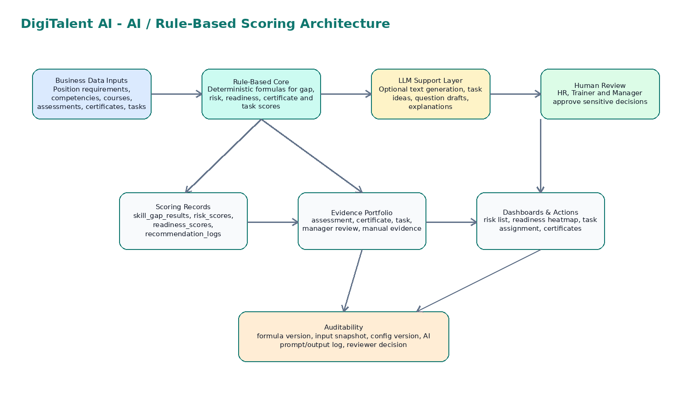
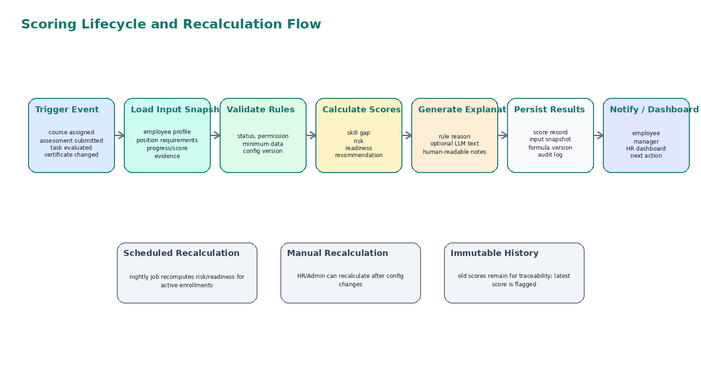
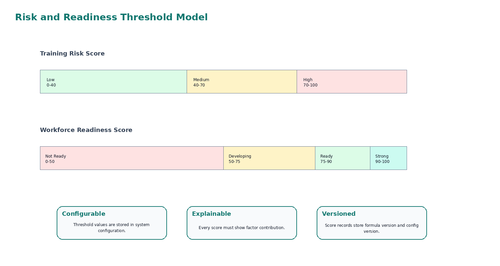
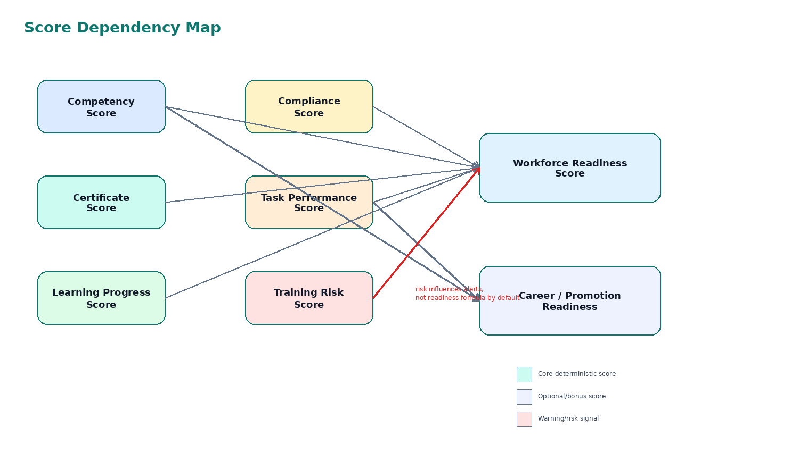
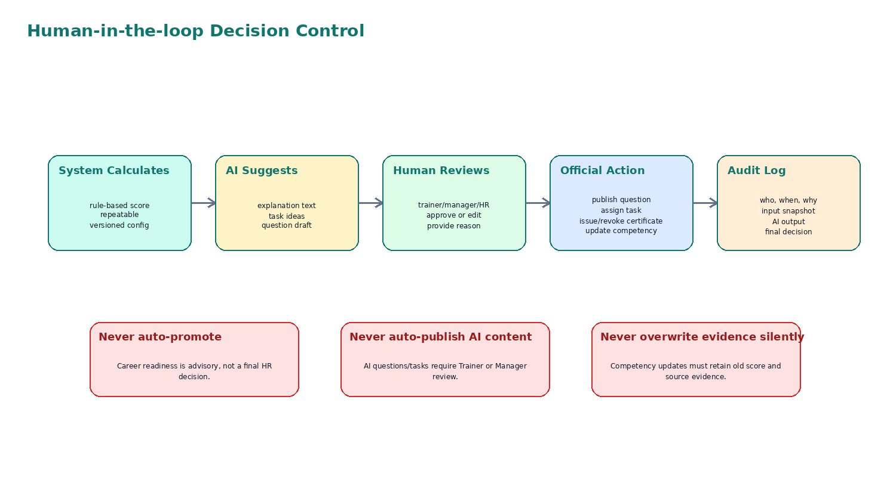

**DigiTalent AI**

**AI / Rule-Based Scoring Design**

Document 16 - Scoring Logic, Explainable Intelligence and Human-in-the-loop AI Design

**Document Purpose**

This document defines how DigiTalent AI calculates skill gaps, learning recommendations, training risk, workforce readiness, certificate/compliance contribution, task evidence scores and optional AI-assisted suggestions. The goal is to make the intelligence layer explainable, testable, configurable and safe for a capstone MVP.

| **Item** | **Description** |
| --- | --- |
| Project | DigiTalent AI - Digital Competency Training, Internal Certification and Work-Based Assessment Platform |
| Document ID | 16\_AI\_Rule\_Based\_Scoring\_Design |
| Primary Audience | Backend developers, frontend developers, QA, project lead, mentor/reviewer |
| Technology Alignment | ASP.NET Core/C#, PostgreSQL, React/TypeScript, MinIO, Redis optional, SignalR optional |
| Design Direction | Rule-based core scoring + optional LLM support for explanation, task ideas and question drafts |
| MVP Priority | High - required before coding scoring services and dashboards |

**Table of Contents**

1\. Purpose and Scope

2\. Source Baseline and Intelligence Positioning

3\. Core Design Principles

4\. Intelligence Feature Map

5\. Scoring Data Inputs and Output Contracts

6\. Scoring Lifecycle

7\. Skill Gap Analysis Design

8\. Learning Recommendation Design

9\. Training Risk Score Design

10\. Workforce Readiness Score Design

11\. Career and Promotion Readiness Design

12\. Learning Improvement Rate

13\. Task Evidence Scoring and Competency Update

14\. Certificate and Compliance Scoring

15\. AI Assistance Design

16\. Explainability and Audit Design

17\. Configuration and Versioning

18\. Data Model and API Mapping

19\. UI/UX Rules for Scoring Results

20\. Security, Privacy and Human Review Controls

21\. Testing Strategy

22\. Implementation Roadmap

23\. Acceptance Checklist

24\. Appendix: Formula and Pseudocode Reference

# 1\. Purpose and Scope

This document translates the intelligence-related scope of DigiTalent AI into a concrete software design that the development team can implement and test. It focuses on deterministic rule-based formulas for business-critical scoring and uses AI/LLM only as an assistive layer under human review.

| **In Scope** | **Description** | **MVP Level** |
| --- | --- | --- |
| Skill Gap Analysis | Compare required competency level of a position with current employee competency level. | Core |
| Learning Recommendation | Recommend courses or learning paths based on missing competencies and course-competency mapping. | Core |
| Training Risk Score | Identify learners likely to fail or delay assigned training based on measurable signals. | Core |
| Workforce Readiness Score | Combine competency, certificate, learning, compliance and task performance into one explainable score. | Core |
| Task Evidence Scoring | Score practical work-based tasks and convert evaluated task output into competency evidence. | Core |
| Career/Promotion Readiness | Compare employee profile with target role requirements and recommend missing development actions. | Optional |
| AI Task Suggestion | Suggest task ideas and evaluation criteria for manager review. | Bonus |
| AI Question Draft | Generate draft quiz/scenario questions for trainer review. | Bonus |
| AI Learning Assistant / Knowledge Search | Learning Q&A or semantic search over training resources. | Future |

**Important MVP Boundary**

Official scores must be produced by deterministic formulas. LLM output may explain, summarize or suggest; it must not independently update competency levels, issue certificates, approve task results or decide promotion readiness.

# 2\. Source Baseline and Intelligence Positioning

The registered scope positions DigiTalent AI as a competency-first internal training platform. The intelligence layer exists to support HR, managers, trainers and employees in making better training decisions. It is not designed as a black-box AI system.

| **Source Item** | **Interpretation for Scoring Design** |
| --- | --- |
| Digital competency management | Competency levels and job position requirements are the foundation of all capability scores. |
| Internal learning and assessment | Course progress, quiz attempts and final assessment scores become learning evidence. |
| Certificate verification | Certificate status, expiry and revocation directly affect certificate and compliance contribution. |
| Work-based competency assessment | Task evaluations become evidence of practical application, not only course completion. |
| Basic capability analysis | Skill gap, recommendation, risk and readiness should be explainable and feasible for MVP. |
| Human-in-the-loop AI | AI supports content, task ideas or explanations; human roles approve official outcomes. |

# 3\. Core Design Principles

| **Principle** | **Meaning** | **Implementation Rule** |
| --- | --- | --- |
| Explainable by default | Every score must show why it was produced. | Store factor contribution, formula version and input snapshot. |
| Rule-based for official scoring | Important scores must be deterministic. | Use formulas and configurable weights, not free-form LLM judgement. |
| Configurable, not hard-coded | Thresholds and weights may change during demo/testing. | Store score\_config records or app settings with version. |
| Evidence-driven | Competency should be supported by measurable evidence. | Use assessment, certificate, task, manager review and manual evidence sources. |
| Human-in-the-loop | Sensitive decisions require human approval. | AI suggestions remain draft until reviewed by authorized roles. |
| Auditable history | Scores and decisions must be traceable. | Never overwrite score history without keeping old records. |
| MVP feasibility | The system must be buildable by a 5-member capstone team. | Avoid custom ML model training unless real data is available. |

# 4\. Intelligence Feature Map

Figure 1 shows the recommended architecture: deterministic scoring services form the core, LLM support is optional and all official decisions remain under human review.

| **Feature** | **Rule-Based Responsibility** | **AI/LLM Responsibility** | **Human Responsibility** |
| --- | --- | --- | --- |
| Skill Gap | Calculate missing level per competency. | Explain gap in plain language if enabled. | HR validates requirement setup. |
| Learning Recommendation | Rank courses by competency coverage and priority. | Generate friendly recommendation explanation. | HR/Manager assigns or approves learning path. |
| Training Risk | Calculate risk from progress, score, deadline and inactivity. | Suggest intervention message. | Manager follows up with employee. |
| Readiness Score | Calculate weighted readiness from official data. | Summarize strengths and weaknesses. | HR/Manager uses score as decision support only. |
| Task Suggestion | Find gap/course context. | Generate draft task and criteria. | Manager edits and assigns task. |
| Question Draft | Select course/competency context. | Generate draft question/options/explanation. | Trainer reviews before publish. |

# 5\. Scoring Data Inputs and Output Contracts

Scoring should be designed as a predictable backend service. Each scoring function receives validated input entities and returns a typed result object containing score, level, factor breakdown, explanation and metadata.

| **Input Group** | **Examples** | **Source Tables/Modules** |
| --- | --- | --- |
| Employee profile | employee id, department, position, status, manager id | employees, departments, job\_positions |
| Competency requirement | required level, weight, mandatory flag, position id | position\_competency\_requirements |
| Current competency | current level, evidence source, last evaluated at | employee\_competency\_profiles, competency\_evidences |
| Learning progress | enrollment status, lesson completion, course progress percentage | course\_enrollments, lesson\_progress |
| Assessment results | pre/post/final score, pass/fail, attempt count | assessment\_attempts, assessment\_answers |
| Certificate status | valid/expired/revoked, issued date, expiry date | certificates |
| Task performance | task score, evaluation status, confirmed competencies | task\_assignments, task\_evaluations |
| Configuration | weights, thresholds, formula version, risk rules | score\_configs or system\_settings |

| **Output Field** | **Description** |
| --- | --- |
| score | Numeric score from 0 to 100 or gap value depending on score type. |
| level | Human-readable category such as Low/Medium/High risk or Ready/Developing/Not Ready. |
| factor\_breakdown | List of factors and contribution values used to produce the score. |
| explanation | Deterministic explanation text, optionally enhanced by LLM. |
| input\_snapshot | Minimal JSON snapshot of scoring inputs for audit and reproducibility. |
| formula\_version | Version of the formula used to calculate the result. |
| config\_version | Version of weights and thresholds. |
| calculated\_at | Timestamp for history and dashboard freshness. |

# 6\. Scoring Lifecycle

Scores should not be recalculated randomly inside UI code. They should be calculated by backend application services when business events happen, or by scheduled/background jobs when score freshness is required.

| **Trigger** | **Scores to Recalculate** | **Recommended Mode** |
| --- | --- | --- |
| Employee assigned to new position | Skill gap, readiness, career readiness if target role is used | Synchronous or queued |
| Position requirement updated | Skill gap and readiness for affected employees | Queued/background |
| Course assigned | Recommendation status and risk baseline | Synchronous |
| Lesson progress changed | Training risk and learning progress contribution | Synchronous or batched |
| Assessment submitted | Competency score, risk, readiness, certificate eligibility | Synchronous |
| Certificate issued/revoked/expired | Certificate score, compliance score, readiness | Synchronous |
| Task evaluated | Task performance score, competency evidence, readiness | Synchronous |
| Score configuration changed | All affected score types | Manual admin-triggered recalculation or background job |

# 7\. Skill Gap Analysis Design

Skill Gap Analysis compares the competency level required by a job position with the current competency level of an employee. It is the foundation for recommendation, task assignment and readiness analysis.

**Core Formula**

Skill Gap = Required Competency Level - Current Competency Level

If gap <= 0, the competency is considered satisfied. If gap > 0, the employee needs development for that competency.

| **Field** | **Rule** |
| --- | --- |
| required\_level | Taken from position\_competency\_requirements. |
| current\_level | Taken from employee\_competency\_profiles. If missing, default to 0 or configured baseline. |
| gap\_value | required\_level - current\_level. |
| gap\_severity | None if <=0, Low if 1, Medium if 2, High if >=3; configurable. |
| priority\_score | gap\_value \* competency\_weight, with mandatory competencies boosted. |
| status | Satisfied, Gap Detected or Missing Evidence. |

| **Example Competency** | **Required Level** | **Current Level** | **Weight** | **Gap** | **Priority** |
| --- | --- | --- | --- | --- | --- |
| Data Literacy | 3   | 1   | 0.30 | 2   | High |
| AI Productivity | 2   | 2   | 0.20 | 0   | Satisfied |
| Cybersecurity Awareness | 3   | 2   | 0.25 | 1   | Medium |
| Digital Collaboration | 2   | 3   | 0.15 | \-1 | Satisfied |

function calculateSkillGap(employeeId, positionId):  
requirements = loadPositionRequirements(positionId)  
profile = loadEmployeeCompetencyProfile(employeeId)  
results = \[\]  
for req in requirements:  
current = profile.getLevel(req.competencyId) or 0  
gap = req.requiredLevel - current  
severity = classifyGap(gap)  
priority = max(gap, 0) \* req.weight \* (1.2 if req.isMandatory else 1.0)  
results.add({ competencyId: req.competencyId, required: req.requiredLevel,  
current: current, gap: gap, severity: severity, priority: priority })  
return sortByPriority(results)  

# 8\. Learning Recommendation Design

Learning Recommendation uses skill gaps, course-competency mapping and course availability to propose a learning path. In MVP, the ranking should be rule-based and explainable; AI may only convert the result into a friendly explanation.

| **Ranking Factor** | **Description** | **Suggested Weight** |
| --- | --- | --- |
| Competency gap coverage | How many missing competencies the course covers and how important they are. | 40% |
| Gap severity match | Course level should match the gap severity; beginner content should not be recommended for advanced gaps unless prerequisite. | 20% |
| Assessment weakness | If employee failed related assessments, prioritize remedial courses. | 15% |
| Course status | Available, active, not archived, and assigned by appropriate role. | 10% |
| Certificate relevance | Courses that lead to required certificates get priority. | 10% |
| Prerequisite readiness | Course should not be recommended if prerequisites are unmet unless marked as foundational. | 5%  |

**Recommendation Score**

Recommendation Score = Gap Coverage \* 0.40 + Level Match \* 0.20 + Assessment Weakness \* 0.15 + Availability \* 0.10 + Certificate Relevance \* 0.10 + Prerequisite Fit \* 0.05

| **Recommendation Type** | **When to Use** | **Action** |
| --- | --- | --- |
| Required learning | Mandatory competency gap or compliance certificate missing. | HR/Manager should assign course. |
| Suggested learning | Non-mandatory gap or improvement opportunity. | Employee may enroll or manager may assign. |
| Remedial learning | Failed assessment or low score in related competency. | Recommend refresher lessons and retake plan. |
| Practice task | Course completed but practical evidence is missing. | Recommend WMS-lite task. |

# 9\. Training Risk Score Design

Training Risk Score is used to detect employees who may fail, delay or abandon training. It should be calculated for active course enrollments and visible to Employee, Manager and HR depending on permissions.

**Core Formula**

Risk Score = Inactivity Score \* 0.25 + Low Score Rate \* 0.30 + Deadline Pressure \* 0.20 + Failed Attempt Rate \* 0.15 + Progress Delay \* 0.10

| **Factor** | **How to Calculate** | **Score Range** |
| --- | --- | --- |
| Inactivity Score | Based on days since last learning activity. Example: 0 days = 0, 7+ days = 100. | 0-100 |
| Low Score Rate | Percentage of quizzes/assessments below pass threshold. | 0-100 |
| Deadline Pressure | Higher when remaining time is short compared to remaining content. | 0-100 |
| Failed Attempt Rate | Failed attempts / total attempts, capped at 100. | 0-100 |
| Progress Delay | Expected progress by today minus actual progress, normalized. | 0-100 |

| **Risk Level** | **Score Range** | **System Behavior** | **Recommended Action** |
| --- | --- | --- | --- |
| Low | 0-39 | Show normal status. | Continue learning. |
| Medium | 40-69 | Show warning chip and reminder. | Employee reviews weak lessons; manager may monitor. |
| High Risk | 70-100 | Show risk list, notify employee and manager. | Manager intervention, remedial course or deadline adjustment. |

function calculateTrainingRisk(enrollment):  
inactivity = normalizeDaysInactive(enrollment.lastActivityAt)  
lowScore = percentBelowThreshold(enrollment.quizAttempts)  
deadline = deadlinePressure(enrollment.deadline, enrollment.progressPercent)  
failedAttempt = failedAttemptsRate(enrollment.assessmentAttempts)  
delay = expectedProgressDelay(enrollment.startDate, enrollment.deadline, enrollment.progressPercent)  
  
risk = inactivity \* 0.25 + lowScore \* 0.30 + deadline \* 0.20 + failedAttempt \* 0.15 + delay \* 0.10  
return clamp(round(risk), 0, 100)  

# 10\. Workforce Readiness Score Design

Workforce Readiness Score is the headline capability score. It answers whether an employee appears ready for the current role based on competency, certificate, learning, compliance and practical task evidence. It is a decision-support score, not an automatic HR decision.

**Core Formula**

Readiness Score = Competency Score \* 0.35 + Certificate Score \* 0.20 + Learning Progress Score \* 0.15 + Compliance Score \* 0.15 + Work Task Performance Score \* 0.15

| **Component** | **Source** | **Calculation Idea** | **Weight** |
| --- | --- | --- | --- |
| Competency Score | Competency profile vs position requirement | Weighted percentage of required competency levels achieved. | 35% |
| Certificate Score | Certificates linked to required competencies | Valid certificates / required certificates, weighted by importance. | 20% |
| Learning Progress Score | Course enrollments and lesson completion | Average completion of required learning paths. | 15% |
| Compliance Score | Mandatory training/certification requirements | Mandatory items completed and valid. | 15% |
| Task Performance Score | WMS-lite evaluated tasks | Average score of approved practical tasks linked to required competencies. | 15% |

| **Readiness Level** | **Range** | **Interpretation** |
| --- | --- | --- |
| Not Ready | 0-49 | Major gaps exist; employee needs training and practical validation. |
| Developing | 50-74 | Employee is progressing but still missing important evidence or competencies. |
| Ready | 75-89 | Employee has sufficient capability for current role with minor gaps. |
| Strong | 90-100 | Employee exceeds or fully satisfies required capability and evidence expectations. |

# 11\. Career and Promotion Readiness Design

Career and Promotion Readiness is optional/bonus. It compares an employee against a target position. It should be framed as development guidance, not a promotion decision.

**Formula**

Career Readiness % = Achieved Required Competency Weight for Target Position / Total Required Competency Weight \* 100

| **Input** | **Description** |
| --- | --- |
| employee\_id | Employee to evaluate. |
| current\_position\_id | Current role for context. |
| target\_position\_id | Target role or career path destination. |
| target requirements | Required competencies, levels and weights for target position. |
| current evidence | Assessment, certificate, task and manager review evidence. |

| **Output** | **Description** |
| --- | --- |
| readiness\_percent | Overall readiness for target role. |
| matched\_competencies | Competencies already meeting target requirement. |
| missing\_competencies | Competencies with gap and priority. |
| development\_actions | Courses, certificates or practical tasks recommended. |
| explanation | Why the employee is or is not ready. |

**Control Rule**

The UI must label this feature as advisory. Do not use wording like Approved for promotion. Use Development readiness or Suggested development actions instead.

# 12\. Learning Improvement Rate

Learning Improvement Rate measures whether the learner improved after training. It is useful for dashboard and learning ROI but should not be the only certificate condition.

**Formula**

Improvement Rate = (Post Assessment Score - Pre Assessment Score) / max(Pre Assessment Score, 1) \* 100

| **Case** | **Pre Score** | **Post Score** | **Improvement** | **Interpretation** |
| --- | --- | --- | --- | --- |
| Clear improvement | 50  | 80  | 60% | Strong learning gain. |
| Small improvement | 70  | 78  | 11.4% | Progress exists but may need practice. |
| No improvement | 75  | 75  | 0%  | Completion without measurable gain. |
| Regression | 80  | 70  | \-12.5% | Needs review; possible assessment or engagement issue. |

# 13\. Task Evidence Scoring and Competency Update

Task Evidence Scoring connects learning outcomes with real work-based evidence. A task should not simply be marked Done. It should have criteria, score, feedback and competency impact.

**Task Score Formula**

Task Score = Output Quality \* 0.40 + Criteria Completion \* 0.25 + Practical Applicability \* 0.20 + Timeliness \* 0.10 + Reflection/Explanation \* 0.05

| **Task Criterion** | **Meaning** | **Suggested Weight** |
| --- | --- | --- |
| Output Quality | Correctness, completeness and quality of submitted result. | 40% |
| Criteria Completion | How well the employee satisfies predefined evaluation criteria. | 25% |
| Practical Applicability | Whether the output can be used in real work context. | 20% |
| Timeliness | Submission before deadline or approved extension. | 10% |
| Reflection/Explanation | Employee can explain reasoning or lesson learned. | 5%  |

| **Task Evaluation Result** | **Competency Impact** |
| --- | --- |
| Score < 50 | No competency level update. Evidence stored as failed/needs revision. |
| Score 50-74 | May confirm partial evidence. Current level can increase only if rules allow and Manager confirms. |
| Score 75-89 | Can confirm competency at target level when linked criteria are satisfied. |
| Score >= 90 | Can confirm strong evidence and may support readiness improvement. |

function evaluateTaskImpact(taskEvaluation):  
if taskEvaluation.status != 'APPROVED':  
return NoUpdate  
taskScore = weightedAverage(taskEvaluation.criteriaScores)  
linkedCompetencies = taskEvaluation.confirmedCompetencies  
for competency in linkedCompetencies:  
proposedLevel = deriveLevelFromTaskScore(taskScore, competency.targetLevel)  
createCompetencyEvidence(source='TASK', score=taskScore, proposedLevel=proposedLevel)  
if managerConfirmed and proposedLevel > currentLevel:  
updateEmployeeCompetencyProfile(competency.id, proposedLevel)  
recalculateReadiness(employeeId)  

# 14\. Certificate and Compliance Scoring

Certificate Score and Compliance Score should remain separate. A certificate may prove a competency, while compliance represents mandatory organizational requirements.

| **Certificate Status** | **Score Behavior** |
| --- | --- |
| VALID and not expired | Count toward Certificate Score. |
| EXPIRED | Do not count; mark renewal needed. |
| REVOKED | Do not count; show reason if authorized. |
| PENDING\_RENEWAL | Partial or zero based on configuration; default zero for compliance-critical certificates. |

| **Score** | **Calculation Direction** |
| --- | --- |
| Certificate Score | Weighted valid certificates linked to required competencies divided by required certificate weight. |
| Compliance Score | Mandatory training/certification items completed and valid divided by total mandatory requirements. |

# 15\. AI Assistance Design

AI support should be implemented as a controlled service layer. The AI service receives sanitized context, produces draft output and stores the prompt/output for review and audit. The AI service should not directly mutate core business records.

| **AI Feature** | **Input Context** | **Output** | **Reviewer** | **MVP Status** |
| --- | --- | --- | --- | --- |
| AI Task Suggestion | Skill gap, course, competency criteria, employee role context | Task title, description, expected output, criteria | Manager | Optional |
| AI Question Draft | Lesson content, competency, difficulty, question type | Draft question, options, correct answer, explanation | Trainer | Optional |
| AI Explanation | Score breakdown and deterministic factors | Friendly explanation text | System/HR review if used in sensitive views | Bonus |
| AI Learning Assistant | Lesson content and learner question | Q&A response or summary | Not official decision | Future |
| AI Knowledge Search | Embedded learning resources and query | Semantic search results | System | Future |

## 15.1 Prompt Guardrails

*   Do not include unnecessary personal data in prompts. Use employee role, department and competency context instead of full employee profile where possible.
*   Ask the model to return structured JSON for task/question drafts so backend validation is possible.
*   All AI-generated questions must be saved as DRAFT until Trainer approves them.
*   All AI-generated tasks must be editable by Manager before assignment.
*   Store ai\_explanation\_logs with prompt template version, sanitized input snapshot, output, reviewer and final action.

AI Task Suggestion Prompt Template (conceptual)  
System: You are an enterprise training assistant. Generate practical tasks for competency validation.  
Rules: Do not decide employee promotion, do not update competency, do not issue certificates.  
Return JSON only.  
Input:  
\- competency: {name, level, achievementCriteria}  
\- skillGap: {requiredLevel, currentLevel, severity}  
\- courseCompleted: {title, outcomes}  
\- roleContext: {jobPosition, department}  
Output JSON:  
{  
"taskTitle": "...",  
"description": "...",  
"expectedOutput": "...",  
"evaluationCriteria": \["..."\],  
"estimatedDurationHours": 2,  
"managerReviewNotes": "..."  
}  

# 16\. Explainability and Audit Design

Explainability must be built into the score result, not added later as UI text. Each score should include factor contribution and reason codes.

| **Explainability Element** | **Example** |
| --- | --- |
| Factor contribution | Low Score Rate contributed 24 points to risk score. |
| Reason code | RISK\_LOW\_SCORE, RISK\_DEADLINE\_PRESSURE, GAP\_MANDATORY\_COMPETENCY. |
| Formula version | training-risk-v1.0. |
| Config version | default-2026-q3. |
| Input snapshot | Progress 35%, failed attempts 2/3, deadline in 3 days. |
| Generated explanation | You are at high risk because progress is behind schedule and recent quiz scores are below threshold. |

Example factor\_breakdown JSON  
{  
"scoreType": "TRAINING\_RISK",  
"score": 72,  
"level": "HIGH",  
"formulaVersion": "training-risk-v1.0",  
"configVersion": "default-v1",  
"factors": \[  
{ "key": "inactivity", "raw": 80, "weight": 0.25, "contribution": 20 },  
{ "key": "lowScoreRate", "raw": 90, "weight": 0.30, "contribution": 27 },  
{ "key": "deadlinePressure", "raw": 70, "weight": 0.20, "contribution": 14 },  
{ "key": "failedAttemptRate", "raw": 40, "weight": 0.15, "contribution": 6 },  
{ "key": "progressDelay", "raw": 50, "weight": 0.10, "contribution": 5 }  
\]  
}  

# 17\. Configuration and Versioning

Weights and thresholds should not be hard-coded. Use configuration records so the system can be adjusted without changing source code. For capstone, configuration may be managed by Admin UI or seeded JSON records.

| **Configuration Item** | **Example Value** | **Owner** |
| --- | --- | --- |
| readiness.weights.competency | 0.35 | Admin/Seed |
| readiness.weights.certificate | 0.20 | Admin/Seed |
| risk.threshold.medium | 40  | Admin/Seed |
| risk.threshold.high | 70  | Admin/Seed |
| task.score.passThreshold | 50  | Admin/Seed |
| certificate.expiry.warningDays | 30  | Admin/Seed |
| formula.activeVersion.trainingRisk | v1.0 | System |

Suggested scoring configuration shape  
{  
"configKey": "readiness.default.v1",  
"version": "1.0",  
"isActive": true,  
"weights": {  
"competency": 0.35,  
"certificate": 0.20,  
"learningProgress": 0.15,  
"compliance": 0.15,  
"taskPerformance": 0.15  
},  
"thresholds": {  
"notReadyMax": 49,  
"developingMax": 74,  
"readyMax": 89,  
"strongMax": 100  
}  
}  

# 18\. Data Model and API Mapping

This section maps scoring design to database and API implementation. Names can be adjusted during final ERD/API implementation, but responsibilities should remain stable.

| **Concept** | **Recommended Table/Entity** | **Notes** |
| --- | --- | --- |
| Skill gap result | skill\_gap\_results | Per employee/position/competency result with gap and priority. |
| Learning recommendation | learning\_recommendations | Stores recommended course/path and reason. |
| Training risk score | training\_risk\_scores | Per employee/enrollment latest score + history. |
| Readiness score | readiness\_scores | Per employee/position latest score + history. |
| AI explanation log | ai\_explanation\_logs | Stores prompt version, sanitized input, output, reviewer status. |
| Score config | score\_configs | Weights, thresholds, active version. |
| Competency evidence | competency\_evidences | Assessment/certificate/task/manager/manual evidence. |

| **API Endpoint** | **Purpose** | **Permission** |
| --- | --- | --- |
| POST /api/intelligence/skill-gaps/calculate | Calculate or recalculate employee skill gap. | HR/Manager/System |
| GET /api/employees/{id}/skill-gaps | View skill gap result. | HR/Manager scoped/Employee own |
| POST /api/intelligence/recommendations/generate | Generate learning recommendation. | HR/Manager/System |
| GET /api/employees/{id}/training-risk | View training risk. | HR/Manager scoped/Employee own |
| POST /api/intelligence/readiness/recalculate | Recalculate readiness score. | HR/Manager/System |
| GET /api/employees/{id}/readiness | View readiness score. | HR/Manager scoped/Employee own |
| POST /api/ai/task-suggestions | Generate draft task suggestion. | Manager/Trainer optional |
| POST /api/ai/question-drafts | Generate draft question. | Trainer |

# 19\. UI/UX Rules for Scoring Results

Scoring UI must be transparent. Users should see not only the final score but also what caused the score and what action is recommended next.

| **Score Type** | **UI Components** | **Required Explanation** |
| --- | --- | --- |
| Skill Gap | Competency gap table, severity chip, required/current level progress bar | Show required level, current level and missing level. |
| Learning Recommendation | Recommended course card, reason tag, priority chip | Show which competency gap the course addresses. |
| Training Risk | Risk badge, factor breakdown, warning banner | Show top risk factors and suggested action. |
| Readiness | Score card, radar/stacked contribution chart, evidence summary | Show component scores and missing evidence. |
| Task Score | Criteria table, feedback box, competency impact chip | Show criteria score and manager feedback. |
| Career Readiness | Target role comparison, missing competency list | Label as advisory and show development actions. |

| **Color/Status** | **Meaning** | **Usage** |
| --- | --- | --- |
| Green | Good / ready / valid | Readiness >= 75, certificate valid, task passed. |
| Yellow/Orange | Warning / developing | Medium risk, readiness 50-74, certificate near expiry. |
| Red | Critical / high risk / invalid | High risk, certificate revoked/expired, failed task. |
| Blue | AI suggestion / informational | AI-generated draft, recommendation explanation. |
| Gray | Neutral / not enough data | No evidence, pending review, not calculated. |

# 20\. Security, Privacy and Human Review Controls

| **Control Area** | **Rule** |
| --- | --- |
| Access control | Only authorized roles can view employee scores; Manager is limited to scoped employees. |
| Data minimization | AI prompts should not include unnecessary personal identifiers. |
| Sensitive decisions | AI cannot approve competency update, certificate issuing/revocation or promotion readiness. |
| Auditability | Store who triggered recalculation, formula version, config version and important input snapshot. |
| File evidence | Task submission files remain private in MinIO and accessed through signed URLs only. |
| Prompt/output logs | AI logs should be viewable only by authorized Admin/HR/Trainer/Manager depending on context. |
| Tamper prevention | Employees cannot modify their own score, assessment result, certificate status or competency level. |

# 21\. Testing Strategy

Scoring logic must be tested more strictly than normal CRUD because small formula errors can break dashboards and demo credibility.

| **Test Type** | **What to Test** |
| --- | --- |
| Unit tests | Formula output for fixed inputs, boundary thresholds, missing data handling. |
| Integration tests | Score recalculation after assessment submission, certificate change, task evaluation. |
| Permission tests | Manager cannot view out-of-department score; Employee can view own summary only. |
| Configuration tests | Changing weights produces expected new score without corrupting old score history. |
| AI guardrail tests | AI generated content remains draft; invalid AI JSON is rejected. |
| Dashboard tests | Latest score is shown; factor breakdown is displayed correctly. |
| Regression tests | Core demo flow recalculates readiness after task evaluation. |

| **Scenario** | **Expected Result** |
| --- | --- |
| Employee has no competency profile | Skill gap uses current level 0 and status Missing Evidence. |
| Certificate expired yesterday | Certificate Score excludes it and dashboard shows renewal needed. |
| Task submitted but not evaluated | Task does not affect readiness until Manager evaluation is approved. |
| AI suggests a question | Question remains DRAFT until Trainer publishes. |
| Position requirement changes | Affected employees are marked needs recalculation or recalculated by job. |
| Risk score high | Employee and scoped Manager receive alert; HR sees in risk list. |

# 22\. Implementation Roadmap

| **Phase** | **Scope** | **Output** |
| --- | --- | --- |
| Phase 1 - Data foundation | Competency requirements, employee profiles, score config seed data. | Tables/entities ready. |
| Phase 2 - Skill gap | Implement skill gap calculation and UI table. | Gap result and recommendation input ready. |
| Phase 3 - Learning recommendation | Course-competency mapping and ranking. | Recommended learning path cards. |
| Phase 4 - Risk score | Enrollment progress, attempts, deadline signals. | Risk badge/list and notification trigger. |
| Phase 5 - Readiness score | Weighted component calculation. | Readiness dashboard and factor breakdown. |
| Phase 6 - Task evidence | Task evaluation affects evidence and readiness. | End-to-end demo value loop. |
| Phase 7 - Optional AI | Task suggestion, question draft, AI explanation. | Bonus features under review workflow. |

# 23\. Acceptance Checklist

| **Checklist Item** | **Status Target** |
| --- | --- |
| All scoring formulas are implemented in backend service layer, not frontend. | Required |
| Weights and thresholds are configurable or seeded as versioned constants. | Required |
| Skill gap shows required level, current level, gap and priority. | Required |
| Training risk shows score, level and factor breakdown. | Required |
| Readiness score shows component scores and evidence summary. | Required |
| Task score affects readiness only after Manager/Trainer evaluation. | Required |
| AI-generated questions/tasks are saved as draft and require human approval. | Required |
| Score history stores formula version and config version. | Required |
| RBAC/data scope prevents unauthorized score viewing. | Required |
| At least one full demo scenario shows readiness improvement after task evidence. | Required |

# 24\. Appendix: Formula and Pseudocode Reference

| **Score** | **Formula** |
| --- | --- |
| Skill Gap | Required Level - Current Level |
| Priority Gap | max(Gap, 0) \* Competency Weight \* Mandatory Boost |
| Training Risk | Inactivity\*0.25 + LowScore\*0.30 + DeadlinePressure\*0.20 + FailedAttempt\*0.15 + ProgressDelay\*0.10 |
| Readiness | Competency\*0.35 + Certificate\*0.20 + LearningProgress\*0.15 + Compliance\*0.15 + TaskPerformance\*0.15 |
| Learning Improvement | (PostScore - PreScore) / max(PreScore, 1) \* 100 |
| Career Readiness | Achieved Required Competency Weight / Total Required Competency Weight \* 100 |
| Task Score | OutputQuality\*0.40 + CriteriaCompletion\*0.25 + Applicability\*0.20 + Timeliness\*0.10 + Reflection\*0.05 |

Suggested backend structure  
/Application  
/Intelligence  
SkillGapService.cs  
LearningRecommendationService.cs  
TrainingRiskService.cs  
ReadinessScoreService.cs  
TaskEvidenceScoringService.cs  
AiSuggestionService.cs  
ScoreExplanationBuilder.cs  
/Domain  
/Scoring  
ScoreConfig.cs  
ScoreResult.cs  
ScoreFactor.cs  
ScoreLevel.cs  
/Infrastructure  
/AI  
LlmClient.cs  
PromptTemplateRenderer.cs  
AiSafetyValidator.cs  

**Final Recommendation**

For capstone implementation, complete Skill Gap, Learning Recommendation, Training Risk, Workforce Readiness and Task Evidence Scoring before adding LLM features. A stable, explainable rule-based intelligence layer will make the demo stronger than a black-box AI feature that is difficult to justify.