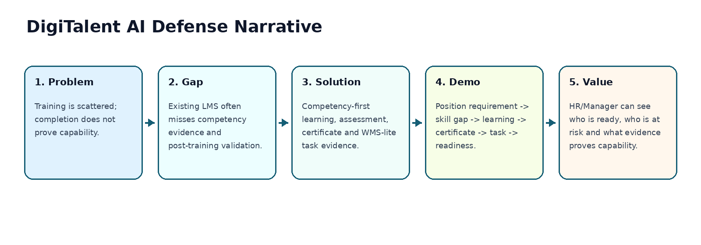
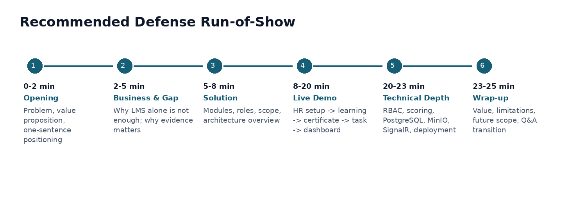
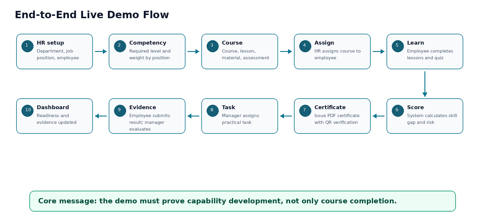

**DigiTalent AI**

**17\. Demo Scenario / Defense Script**

Digital Competency Training, Internal Certification and Work-Based Assessment Platform

Prepared for: Capstone Project Implementation and Defense

|     |     |
| --- | --- |
| **Item** | **Description** |
| Document Type | Demo Scenario / Defense Script |
| Project | DigiTalent AI |
| Primary Scope Baseline | Capstone\_Project\_Register\_DigiTalent\_AI\_Revised\_Scope.docx |
| Supporting Baseline | BRD, SRS, User Flow, Architecture, Database, API, RBAC, UI/UX, Security, AI Scoring documents |
| Technology Stack | ReactJS, TypeScript, TailwindCSS, ShadCN/UI, ASP.NET Core/C#, PostgreSQL, MinIO, Redis optional, SignalR, Docker, Nginx, GitHub Actions |
| Version | 1.0 |
| Prepared Date | 19/06/2026 |

**Mentor Note:** This document is designed to help the team defend the project clearly, run a stable live demo, answer technical questions confidently, and avoid presenting the system as only a generic LMS.

# Table of Contents

*   1\. Purpose and Scope
*   2\. Defense Positioning and Core Message
*   3\. Evaluation Goals and What the Demo Must Prove
*   4\. Demo Storyline and Business Scenario
*   5\. Demo Dataset and Role Accounts
*   6\. Recommended Defense Run-of-Show
*   7\. Presentation Script by Section
*   8\. Live Demo Runbook
*   9\. Detailed Demo Steps and Presenter Notes
*   10\. Expected Screens and Evidence to Show
*   11\. Technical Explanation During Defense
*   12\. AI/Rule-Based Scoring Explanation Script
*   13\. Security, RBAC and Data Scope Explanation Script
*   14\. Backup Plan and Failure Handling
*   15\. Q&A Bank with Suggested Answers
*   16\. Team Role Assignment During Defense
*   17\. Defense Checklist
*   18\. Appendix: Seed Data Reference and Script Snippets

# 1\. Purpose and Scope

This document defines the official defense scenario and demo script for DigiTalent AI. It translates the project scope, business flows, system architecture, database model, RBAC model, UI/UX decisions, testing strategy, security design and AI/rule-based scoring design into a practical presentation plan for the final defense.

**Main usage:** The team should use this document to rehearse the defense, prepare seed data, decide who presents each part, validate demo readiness, and prepare answers for likely council questions.

|     |     |
| --- | --- |
| **Scope Item** | **Included in This Document** |
| Defense storyline | Clear opening, problem framing, solution positioning and final closing. |
| Live demo script | Step-by-step demo scenario from organization setup to readiness dashboard. |
| Presenter notes | What to say, what to click, what evidence to show and what not to overpromise. |
| Technical explanation | Short scripts for architecture, database, API, RBAC, security, scoring and deployment. |
| Backup plan | How to continue if internet, AI API, QR, file storage, or deployment fails during defense. |
| Q&A preparation | Common business and technical questions with recommended answers. |

# 2\. Defense Positioning and Core Message

DigiTalent AI must be positioned as a competency-first internal capability platform, not as a normal LMS clone. The defense should emphasize that the system connects job position requirements, learning, assessment, certificate verification, WMS-lite task evidence and readiness dashboards in one controlled workflow.

Figure 1. Defense narrative from business problem to measurable value.

|     |     |
| --- | --- |
| **Incorrect Positioning** | **Correct Positioning** |
| This is an LMS with AI chatbot. | This is a workforce digital capability platform with learning, assessment, certificate verification and task evidence. |
| The main value is course management. | The main value is proving whether employees are ready and can apply learned knowledge in work scenarios. |
| AI decides employee competency. | Rule-based scoring calculates official scores; AI only supports suggestions or explanations under human review. |
| The system replaces HR/Manager decisions. | The system supports HR/Manager decisions with transparent data and evidence. |

**One-sentence message:** DigiTalent AI helps enterprises know what digital competencies employees have, what they lack, what they should learn next, whether they are at training risk, whether they are ready for work, and what evidence proves that readiness.

# 3\. Evaluation Goals and What the Demo Must Prove

|     |     |
| --- | --- |
| **Evaluation Area** | **What the Team Should Prove** |
| Business value | Show that the system solves fragmented training, unclear competency measurement, weak certificate verification and lack of post-training evidence. |
| Functional completeness | Show a complete loop: position requirement -> skill gap -> learning -> assessment -> certificate -> practical task -> evidence -> dashboard. |
| Technical seriousness | Show RBAC, REST API, PostgreSQL data model, MinIO files, SignalR notifications, Docker deployment and audit/security controls. |
| AI realism | Show that AI is controlled and optional; official scores remain explainable and testable through formulas. |
| Scope control | Show that MVP is feasible while advanced AI tutor, semantic search and full HRM integration are future scope. |

# 4\. Demo Storyline and Business Scenario

The recommended story should be simple, realistic and easy to follow. Use one fictional enterprise, one department, one job position, one employee, one course, one assessment, one certificate and one practical task. This keeps the demo focused and prevents the council from getting lost in too many features.

|     |     |     |
| --- | --- | --- |
| **Demo Element** | **Recommended Value** | **Reason** |
| Company | FPT Digital Services (sample organization) | Looks enterprise-like but remains fictional. |
| Department | Marketing Department | Easy to understand for both technical and non-technical evaluators. |
| Job position | Marketing Executive | Has a natural need for data, AI productivity and digital collaboration. |
| Employee | Employee A - Nguyen Minh Anh | Use sample name only; avoid using real personal data. |
| Competency gap | Data Literacy required level 3, current level 1 | Clear gap for recommendation and score calculation. |
| Course | Data Analytics with Google Sheets for Marketing | Easy to demo lesson, quiz and assessment. |
| Certificate | Digital Data Literacy Certificate | Shows PDF and QR verification value. |
| Practical task | Create a campaign performance report and propose improvements | Shows work-based evidence after training. |
| Final result | Readiness improves after assessment, certificate and task evaluation | Completes the end-to-end value loop. |

# 5\. Demo Dataset and Role Accounts

Seed data should be prepared before the defense. The live demo should not require manually creating every object from scratch. The presenter should demonstrate a few key actions while the rest of the data is pre-seeded for stability.

|     |     |     |
| --- | --- | --- |
| **Role** | **Sample Account** | **Main Demo Responsibility** |
| System Admin | admin@digitalent.demo | Show user, role, permission and system configuration if asked. |
| HR Manager | hr@digitalent.demo | Create or view departments, positions, employees, competency requirements and dashboards. |
| Internal Trainer | trainer@digitalent.demo | Create courses, lessons, question banks and assessments. |
| Department Manager | manager.marketing@digitalent.demo | View team members, assign practical tasks and evaluate submissions. |
| Employee | employee.anh@digitalent.demo | Learn course, take assessment, view certificate and submit task. |
| Certificate Verifier | verifier@digitalent.demo or public QR page | Verify certificate by QR/code without exposing employee private data. |

|     |     |
| --- | --- |
| **Data Group** | **Minimum Seed Data** |
| Organization | 1 company profile, 3 departments, 4 job positions, 8 sample employees. |
| Competencies | 5 competency categories: AI Literacy, Data Literacy, Cybersecurity Awareness, Digital Collaboration, Digital Document Management. |
| Competency levels | Level 1 to Level 5 with descriptions and achievement criteria. |
| Position requirements | Marketing Executive requires Data Literacy L3, AI Productivity L2, Digital Collaboration L2. |
| Courses | At least 3 courses mapped to competencies; one course is used in live demo. |
| Assessments | 1 pre-assessment, 1 quiz, 1 final assessment with multiple-choice and scenario questions. |
| Certificate templates | 1 certificate template with logo placeholder, certificate code and QR area. |
| Tasks | 2-3 WMS-lite task templates, one active assigned task and one completed task for dashboard comparison. |

# 6\. Recommended Defense Run-of-Show

Figure 2. Recommended timing for a 25-minute defense presentation.

|     |     |
| --- | --- |
| **Defense Length** | **Recommended Split** |
| 15 minutes | 2 min problem, 3 min solution, 7 min demo, 2 min technical highlights, 1 min conclusion. |
| 20 minutes | 2 min problem, 4 min solution, 10 min demo, 3 min technical highlights, 1 min conclusion. |
| 25 minutes | 2 min opening, 3 min business gap, 3 min solution, 12 min demo, 3 min technical depth, 2 min wrap-up. |
| 30 minutes | 3 min problem, 5 min solution, 15 min demo, 5 min technical depth, 2 min conclusion. |

# 7\. Presentation Script by Section

The script below is intentionally written in a natural defense style. The team should not read it word-by-word. Use it as a speaking guide and adapt the wording during rehearsal.

## 7.1 Opening Script

|     |     |
| --- | --- |
| **Part** | **Content** |
| Goal | Introduce the topic clearly and set the expectation that this is not just an LMS. |
| Suggested script | Good morning/afternoon, our project is DigiTalent AI, a web-based platform for enterprise digital competency training, internal certification and work-based assessment. The key problem we solve is that many organizations can track whether employees have completed a course, but they still cannot confidently verify whether those employees have achieved the required competency level for their job. DigiTalent AI closes this gap by connecting job position requirements, competency framework, learning, assessment, certificate verification, practical task evidence and readiness dashboards. |
| Transition | To explain why this matters, we will first describe the business problem and then show the end-to-end system flow through a live demo. |

## 7.2 Problem and Gap Script

|     |     |
| --- | --- |
| **Part** | **Content** |
| Goal | Show that the project is grounded in a real enterprise problem. |
| Suggested script | In many organizations, training data is scattered across documents, chat groups, spreadsheets and separate LMS tools. HR can often see completion status, but completion does not always prove competency. Certificates may be manually issued and difficult to verify. After training, practical assignments are usually handled outside the system, so the evidence is weak and disconnected from the employee competency profile. |
| Transition | Therefore, our project focuses on the full capability development workflow rather than only learning content management. |

## 7.3 Solution Script

|     |     |
| --- | --- |
| **Part** | **Content** |
| Goal | Summarize modules without going too deep before demo. |
| Suggested script | DigiTalent AI provides modules for organization and employee management, digital competency framework, course and learning management, assessment, certificate verification, capability analysis and WMS-lite practical task evidence. The core intelligence functions such as skill gap, learning recommendation, training risk and workforce readiness are implemented with transparent rule-based formulas. AI is used only as a controlled support layer for suggestions, explanation and content drafting when needed. |
| Transition | Now we will demonstrate the complete flow using a sample employee in the Marketing Department. |

## 7.4 Closing Script

|     |     |
| --- | --- |
| **Part** | **Content** |
| Goal | End with value and scope control. |
| Suggested script | To conclude, DigiTalent AI helps enterprise managers move from simple course completion tracking to evidence-based capability management. The MVP focuses on a realistic and implementable scope: competency framework, internal learning, assessment, certificate QR verification, readiness scoring and WMS-lite task evidence. Future enhancements can include advanced AI learning assistant, semantic knowledge search and HRM integration, but the core system is already valuable and demonstrable within the capstone scope. |
| Transition | We are ready for questions. |

# 8\. Live Demo Runbook

Figure 3. End-to-end live demo flow to prove capability development.

|     |     |     |     |
| --- | --- | --- | --- |
| **Step** | **Scene** | **Presenter Action** | **Defense Note** |
| D0  | Preparation | Open app, verify seed data, ensure backend/API/DB/MinIO running, prepare QR verification link. | Do not start defense by logging into many accounts slowly. |
| D1  | HR setup | Login as HR and show company, Marketing Department, Marketing Executive position and Employee A. | Explain data is pre-seeded to save demo time. |
| D2  | Competency requirement | Open position requirement and show Data Literacy level 3 requirement. | This is the business baseline for skill gap. |
| D3  | Course mapping | Show course mapped to Data Literacy competency. | Proves course is not isolated content. |
| D4  | Course assignment | Assign course to Employee A or show existing assignment. | Keep it short; avoid long form filling. |
| D5  | Employee learning | Switch to Employee account and complete/view lessons and quiz. | Use pre-completed progress if time is short. |
| D6  | Assessment result | Submit or view final assessment score. | Show pass condition and score history. |
| D7  | Skill gap/recommendation/risk | Show calculated skill gap, recommendation and risk/readiness explanation. | Emphasize rule-based and explainable scoring. |
| D8  | Certificate issuance | Issue or view certificate, open QR verification page. | This is a strong visual moment. |
| D9  | WMS-lite task | Manager assigns a practical task linked to competency. | Explain that task checks real application after training. |
| D10 | Task submission/evaluation | Employee submits result; Manager evaluates score and confirms evidence. | Show evidence file/link and feedback. |
| D11 | Dashboard update | Return to HR/Manager dashboard and show readiness/evidence updated. | This closes the demo loop. |

# 9\. Detailed Demo Steps and Presenter Notes

This section defines exact demo steps. During rehearsal, each step should be timed and validated against the real deployed system. The team should prepare screenshots for every critical step in case the live demo fails.

|     |     |     |     |     |     |
| --- | --- | --- | --- | --- | --- |
| **#** | **Demo Screen/Scene** | **Actor** | **Action** | **Expected Result** | **Presenter Note** |
| 1   | Login and dashboard routing | HR Manager | Login with hr@digitalent.demo. Show HR dashboard. | System redirects based on role and displays organization-level training overview. | This proves authentication, RBAC and role-based dashboard. |
| 2   | Organization setup | HR Manager | Open Departments and Employees. Show Marketing Department and Employee A. | Department, position and employee profile are available. | Do not spend too much time on CRUD; show only enough to prove data foundation. |
| 3   | Position requirement | HR Manager | Open Marketing Executive position. Show required competencies and weights. | Data Literacy L3 and AI Productivity L2 are configured. | This is the key difference from normal course management. |
| 4   | Employee competency profile | HR Manager | Open Employee A competency profile. | Current Data Literacy is L1; system can compare with required L3. | Explain current level can come from assessment, certificate, task or manager review. |
| 5   | Course and lesson | Trainer | Open Data Analytics course. Show lesson list, material and competency mapping. | Course is linked to Data Literacy competency. | Emphasize course-content-to-competency mapping. |
| 6   | Question bank/assessment | Trainer | Show final assessment configuration and pass score. | Assessment has questions, attempts and scoring rules. | Mention AI question draft as optional; trainer must approve before publishing. |
| 7   | Course assignment | HR Manager | Assign course to Employee A or show assigned course. | Employee receives course assignment and progress tracking starts. | If already assigned in seed data, just show assignment status. |
| 8   | Employee learning | Employee | Login as employee and open My Learning. Complete lesson or show progress. | Lesson progress and quiz state are recorded. | Avoid demonstrating long reading/video content; show progress update. |
| 9   | Final assessment | Employee | Take or view final assessment. Submit result. | Employee achieves pass score and assessment history is saved. | Use a pre-configured attempt if live answering takes too long. |
| 10  | Skill gap and recommendation | System/HR | Open skill gap analysis after assessment. | Gap decreases; recommendation list is updated. | Explain formula: Required Level - Current Level. |
| 11  | Training risk/readiness | System/HR | Open readiness/risk panel. | Risk and readiness are calculated with transparent factors. | Say that official score is rule-based, not black-box AI. |
| 12  | Certificate issue | System/HR | Issue or view certificate after pass condition. | Certificate has code, PDF, QR URL and status VALID. | Strong moment: open PDF and verification page. |
| 13  | QR verification | Verifier/Public | Open verification URL or scan QR. | Only certificate validity data is shown; private data is limited. | Mention security: public verifier does not access full employee profile. |
| 14  | Task suggestion | Manager/System | Open task suggestion or create practical task for Data Literacy. | Task includes description, expected output, deadline and criteria. | AI suggestion is optional; Manager reviews before assigning. |
| 15  | Task submission | Employee | Submit report file/link and note. | Submission is stored and attached as competency evidence candidate. | Show MinIO/file upload if stable; otherwise show saved submission. |
| 16  | Task evaluation | Department Manager | Give score, feedback and confirm competency evidence. | Task becomes evaluated; evidence portfolio and task performance score update. | This is the proof of practical competency validation. |
| 17  | Dashboard final view | HR/Manager | Open dashboard and evidence portfolio. | Readiness score, certificate status and task evidence are visible. | Close the loop: learning leads to evidence and capability governance. |

# 10\. Expected Screens and Evidence to Show

|     |     |     |
| --- | --- | --- |
| **Evidence Type** | **Screen to Show** | **Why It Matters** |
| Role-based dashboard | HR Dashboard / Manager Dashboard / Employee Portal | Proves system is role-aware and enterprise-ready. |
| Competency framework | Competency Categories, Levels and Position Requirement screens | Proves system is competency-first. |
| Course mapping | Course Detail with linked competencies | Proves learning content is connected to capability management. |
| Assessment result | Attempt history and score detail | Proves measurable learning outcome. |
| Skill gap explanation | Employee Skill Gap panel | Proves transparent analysis. |
| Certificate QR | Certificate PDF and Verification page | Proves verifiable internal certification. |
| Task evidence | Task detail, submission and evaluation screens | Proves post-training work validation. |
| Evidence portfolio | Employee Competency Evidence tab | Proves the system stores multiple evidence sources. |
| Readiness dashboard | Readiness score and trend cards | Proves business decision support. |
| Audit log | Audit Log screen or backend log sample | Proves governance and traceability. |

# 11\. Technical Explanation During Defense

|     |     |
| --- | --- |
| **Topic** | **Short Explanation Script** |
| Architecture | The system follows a modular monolith architecture using ASP.NET Core Web API. This gives clear module boundaries while keeping deployment simple for a capstone team. ReactJS and TypeScript are used for the enterprise dashboard frontend. |
| Database | PostgreSQL stores relational business data such as users, roles, departments, competencies, courses, assessments, certificates, tasks, evidence and scoring results. The model is normalized and designed around business workflows. |
| File storage | MinIO stores uploaded learning materials, task submission files and generated certificate PDFs. The database stores metadata and object keys, not raw file content. |
| API | The backend exposes RESTful APIs with DTO-based request/response contracts. Swagger/OpenAPI is used to document and test endpoints. |
| RBAC | Authorization is permission-based with data scope checks. For example, a department manager can only access employees and tasks within their department. |
| SignalR | SignalR can be used for in-app notifications such as training reminders, task assignments and certificate status updates. |
| Deployment | The system is containerized with Docker and Docker Compose. Nginx acts as reverse proxy. GitHub Actions supports build/test/deployment preparation. |

# 12\. AI/Rule-Based Scoring Explanation Script

The council may ask whether the system really uses AI or whether it is only rule-based. The correct answer is to separate official scoring from AI support.

|     |     |     |
| --- | --- | --- |
| **Feature** | **MVP Approach** | **Defense Explanation** |
| Skill Gap Analysis | Rule-based core | Skill gap is calculated by comparing required competency level with current competency level. |
| Learning Recommendation | Rule-based core with optional AI text | The system recommends courses mapped to missing competencies. AI can help explain why a course is recommended. |
| Training Risk Score | Rule-based core | Risk uses progress delay, low score rate, failed attempts, inactivity and deadline pressure. |
| Workforce Readiness Score | Rule-based core | Readiness combines competency, certificate, learning progress, compliance and task performance. |
| AI Task Suggestion | Optional/bonus | AI may propose task ideas, but Manager reviews before assignment. |
| AI Question Draft | Optional/bonus | AI may draft questions, but Trainer must approve before publishing. |
| AI Learning Assistant | Future scope | It is not required for MVP to avoid scope risk. |

**Safe answer:** The official scores are explainable and deterministic. AI is used as an assistant, not as an authority. This makes the system safer, easier to test and more suitable for a capstone MVP.

# 13\. Security, RBAC and Data Scope Explanation Script

|     |     |
| --- | --- |
| **Question Area** | **Recommended Answer** |
| How do you protect employee data? | Sensitive employee data is protected by authenticated API access, RBAC permission checks, department-level data scope and audit logs. |
| Can a manager see all employees? | No. Department Manager can only view employees within their assigned department unless explicitly granted broader permissions. |
| Can employee change their own score? | No. Employee can view their own progress, certificates and feedback, but cannot edit assessment scores, certificates or confirmed competency levels. |
| Is QR verification public? | The verification page should expose only certificate validity information, not full employee profile or internal evaluation details. |
| How are files protected? | Files are stored in MinIO as private objects. Users access files through backend authorization or short-lived controlled URLs. |
| What is audited? | Important actions such as login, permission changes, certificate issuance/revocation, task evaluation and competency updates are logged. |

# 14\. Backup Plan and Failure Handling

A professional defense must not depend on a perfect live environment. Prepare a backup plan before the presentation.

|     |     |     |
| --- | --- | --- |
| **Failure Case** | **Backup Action** | **What to Say** |
| Internet or deployment down | Run local Docker Compose or use pre-recorded demo video. | We prepared a local fallback environment to avoid network dependency. |
| AI API unavailable | Use cached AI suggestion/explanation or skip AI optional scene. | Official scoring does not depend on AI API; AI is an optional support layer. |
| QR scan fails | Open verification URL directly from browser. | The QR points to the same verification endpoint; we can open it manually. |
| File upload fails | Use pre-uploaded task submission or screenshot. | The task evidence flow is the important business proof; upload is already covered in implementation. |
| Database seed missing | Restore seed script or use backup database dump. | We prepared seed data for repeatable demo execution. |
| Presenter account locked/wrong password | Use backup accounts printed in private checklist. | No need to mention this unless it happens. |
| UI bug during live click | Switch to screenshot deck or API Swagger proof. | We can still show backend/API behavior and expected UI state. |

# 15\. Q&A Bank with Suggested Answers

|     |     |
| --- | --- |
| **Question** | **Suggested Answer** |
| Why not just use Moodle or another LMS? | Traditional LMS platforms are strong for course delivery, but the project focuses on the gap after learning: competency requirement mapping, skill gap, certificate verification, work-based task evidence and readiness dashboard. We are not trying to clone a large LMS; we focus on a compact capability management workflow. |
| What is the most innovative part of your project? | The core innovation is the closed loop from position competency requirement to learning, assessment, certificate, practical task evidence and readiness update. This allows HR/Manager to verify practical capability, not only course completion. |
| Is your AI really AI? | The MVP uses rule-based scoring for official decisions because it is explainable and testable. AI/LLM is used as a support layer for task suggestions, question drafting and explanation. This is intentional for safety and scope control. |
| How do you calculate readiness? | Readiness is calculated from several factors such as competency score, certificate score, learning progress, compliance and task performance. The weights are configurable so they are not hard-coded. |
| How do you prevent unfair AI decisions? | AI does not make final official decisions. Managers and trainers review AI suggestions. Official scores are rule-based and explanations are stored for audit. |
| Why ASP.NET Core instead of Spring Boot? | The team has chốt ASP.NET Core/C# for the main backend. It supports strong Web API development, JWT/RBAC, Entity Framework Core, Swagger, SignalR and production-ready deployment with Docker. |
| Why PostgreSQL? | The system has many relational entities and reporting needs: employees, roles, departments, competencies, courses, assessments, certificates, tasks and evidence. PostgreSQL is suitable for relational consistency and dashboard queries. |

|     |     |
| --- | --- |
| **Question** | **Suggested Answer** |
| Why MinIO? | MinIO provides S3-compatible object storage for lesson materials, task submissions and certificate PDFs. It is easy to run locally with Docker and can later be replaced by cloud S3-compatible storage. |
| What is WMS-lite? | WMS-lite is a focused task workflow for post-training competency validation. It is not a full project management system. It includes task assignment, progress, submission, evaluation, feedback and evidence update. |
| What are the MVP limitations? | The MVP does not include full AI tutor, semantic search, mobile app, full HRM integration, full project management or custom machine learning model. These are future enhancements. |
| How do you ensure certificate authenticity? | Each certificate has a unique code, QR verification URL, status, issue date, expiry date and audit history. Revoked or expired certificates are not treated as valid. |
| How do you handle role permissions? | We use permission-based RBAC and data scope checks. For example, HR can view company-wide training data, while Department Manager is limited to their department. |
| What happens if an employee finishes learning but fails practical task? | The certificate may show learning achievement, but task evidence and readiness score will reflect that practical competency has not yet been confirmed. |
| How is your project feasible for five members? | We use modular monolith, clear MVP scope, rule-based scoring and optional AI. Advanced AI and HRM integration are deliberately moved to future scope. |

# 16\. Team Role Assignment During Defense

|     |     |     |
| --- | --- | --- |
| **Presenter Role** | **Main Responsibility** | **Backup Responsibility** |
| Presenter 1 - Leader | Opening, business problem, scope, conclusion, Q&A coordination. | Take over if another member is stuck. |
| Presenter 2 - Business/UX | Explain user roles, business flow, UI/UX and demo storyline. | Answer dashboard/user flow questions. |
| Presenter 3 - Backend/Database | Explain API, ASP.NET Core modules, PostgreSQL schema and business rules. | Answer scoring and certificate flow questions. |
| Presenter 4 - Frontend/Demo Operator | Operate live demo, navigate screens and handle fallback screenshots. | Answer React/ShadCN/UI questions. |
| Presenter 5 - DevOps/Security/Testing | Explain Docker, deployment, CI/CD, security, RBAC, testing and backup plan. | Support troubleshooting during demo. |

# 17\. Defense Checklist

|     |     |
| --- | --- |
| **Time** | **Checklist** |
| 7 days before | Freeze MVP demo scope; stop adding risky features. Prepare seed data and first demo recording. |
| 5 days before | Run full demo rehearsal with timer. Identify slow screens and risky actions. |
| 3 days before | Prepare screenshots for each critical scene. Prepare QR verification fallback link. |
| 1 day before | Backup database dump, Docker images, environment variables and demo video. |
| 2 hours before | Start local/deployed environment, clear browser cache if needed, test login accounts and QR page. |
| During defense | Keep demo focused. Do not over-explain CRUD. Emphasize the end-to-end capability loop. |
| During Q&A | Answer directly. Separate MVP, optional and future scope. Do not promise features that are not implemented. |

|     |     |
| --- | --- |
| **Critical Item** | **Pass Criteria** |
| Login accounts | All role accounts can login successfully. |
| Seed data | Organization, competency, course, assessment, certificate and task data are available. |
| API health | Backend health endpoint returns OK. |
| Database | PostgreSQL container/instance is running and seeded. |
| MinIO | Certificate PDF and task file access works. |
| QR verification | Certificate verification URL opens successfully. |
| Scoring | Skill gap, risk and readiness values are explainable and stable. |
| Screenshots/video | Backup media are ready in case live demo fails. |

# 18\. Appendix: Seed Data Reference and Script Snippets

## 18.1 Suggested Seed Data Names

|     |     |
| --- | --- |
| **Entity** | **Sample Values** |
| Departments | Marketing, Human Resources, IT Operations |
| Positions | Marketing Executive, HR Training Specialist, IT Support Officer, Department Manager |
| Competencies | Data Literacy, AI Productivity, Cybersecurity Awareness, Digital Collaboration, Digital Document Management |
| Courses | Data Analytics with Google Sheets, AI Productivity for Office Work, Cybersecurity Awareness Basics |
| Certificates | Digital Data Literacy Certificate, AI Productivity Foundation Certificate |
| Task templates | Marketing Campaign Report, AI Prompt Planning Pack, Phishing Email Classification |

## 18.2 Suggested Demo Commands

|     |     |
| --- | --- |
| **Purpose** | **Command / Action** |
| Start local environment | docker compose up -d --build |
| Check containers | docker compose ps |
| View backend logs | docker compose logs -f backend-api |
| Run database migration | dotnet ef database update |
| Seed demo data | dotnet run -- --seed-demo-data |
| Backup database | pg\_dump -h localhost -U postgres -d digitalent\_ai > backup.sql |
| Restore database | psql -h localhost -U postgres -d digitalent\_ai < backup.sql |

## 18.3 Source Baseline

|     |     |
| --- | --- |
| **Source Document** | **How It Was Used** |
| Capstone\_Project\_Register\_DigiTalent\_AI\_Revised\_Scope.docx | Primary MVP scope, official positioning, controlled AI strategy and technology baseline. |
| Capstone\_Project\_Register\_DigiTalent\_AI.docx | Expanded capability intelligence features and possible bonus/future scope. |
| De\_tai\_DigiTalent\_AI\_Mo\_ta\_cap\_nhat\_14\_he\_thong.docx | Market gap, WMS-lite, Competency Evidence Portfolio, defense positioning and closing message. |
| Project documentation set 01-16 | Used to align demo script with BRD, SRS, user flows, architecture, database, API, RBAC, UI/UX, testing, DevOps, security and AI scoring. |

# Final Recommendation

The defense should not try to show every screen in the system. The strongest defense is to show one complete, stable and meaningful story: an employee has a competency gap, receives learning, passes assessment, receives a verifiable certificate, completes a practical task, gets manager evaluation, and finally has updated competency evidence and readiness score. This story proves the business value of DigiTalent AI more effectively than a long list of unrelated CRUD screens.