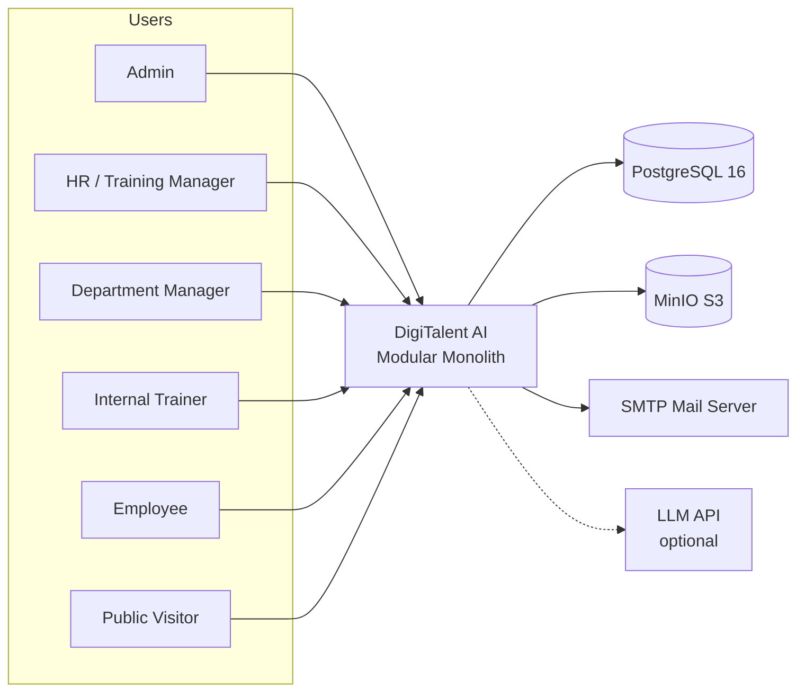
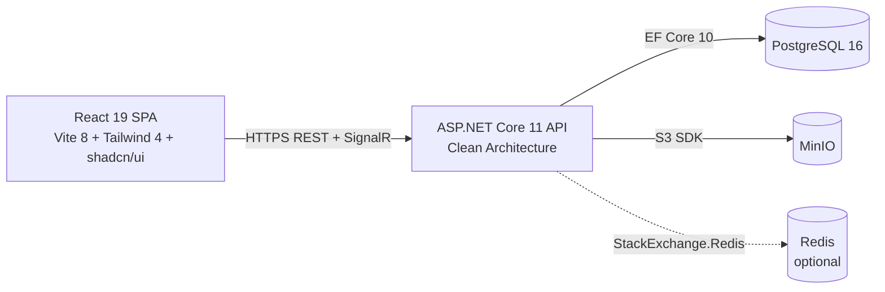

# 06 — Kiến Trúc Hệ Thống

> Nguồn gốc: tổng hợp từ code thực tế (CLAUDE.md, cấu trúc `backend/` + `frontend/`) + C4 Model. Phiên bản docs_v3, tiếng Việt.

---

## 1. Kiểm soát tài liệu

| Mục | Giá trị |
|-----|---------|
| Tên tài liệu | Kiến trúc hệ thống |
| Phiên bản | 3.0 |
| Trạng thái | Bản nháp |
| Chủ sở hữu | Trần Văn Linh (Leader) |
| Căn cứ | Code thực tế + CLAUDE.md + Report 2/3 |

**Lịch sử chỉnh sửa**

| Ngày | Phiên bản | Mô tả |
|------|-----------|-------|
| 16/09/2026 | 3.0 | Chuyển ngữ; mô tả C4 + Clean Architecture theo code thực tế |
| 26/09/2026 | 3.1 | Trỏ schema chuẩn sang SQL v2.3; cập nhật trạng thái token / khóa tài khoản / RBAC trong DB |

---

## 2. Mục đích và phạm vi

Mô tả kiến trúc hệ thống DigiTalent AI theo **C4 Model** (Context → Container → Component) và **Clean Architecture** trên backend, React SPA trên frontend. Tài liệu này là "bản đồ" để team triển khai đồng bộ — mỗi quyết định kiến trúc đều có lý do và ràng buộc rõ ràng.

**Ngoài phạm vi:** thiết kế CSDL (07), đặc tả API (08), bảo mật chi tiết (15).

---

## 3. Tài liệu tham chiếu

- `CLAUDE.md` (repo) — quy ước code thực tế
- Report 2 — *Project Management Plan* (WBS, sprint)
- Report 3 — *Software Requirement Specification* §3.1, §4
- C4 Model (Simon Brown)
- `07_Thiet_Ke_CSDL_ERD.md`, `08_Dac_Ta_API_OpenAPI.md`

---

## 4. Nguyên tắc kiến trúc

| Nguyên tắc | Diễn giải |
|-----------|-----------|
| Modular Monolith | Một deployable duy nhất, chia module rõ; đủ cho SME 80–200 nhân sự, tránh phức tạp microservices |
| Clean Architecture thực dụng | Controller → Service → DTO; business rule nằm ở service/domain; infrastructure inject qua interface |
| Competency-first | Data model và luồng nghiệp vụ neo vào competency, không phải course |
| Explainable | Scoring là rule-based, mọi số giải thích được (không ML train) |
| Human-controlled AI | AI là tùy chọn, chỉ nháp, người duyệt quyết định |

---

## 5. C4 Level 1 — System Context

| Bên ngoài | Chiều | Mục đích |
|-----------|-------|----------|
| PostgreSQL 16 | Hai chiều | Toàn bộ dữ liệu nghiệp vụ (EF Core 10) |
| MinIO (S3) | Hai chiều | Học liệu, bài nộp task, PDF chứng chỉ (file không vào DB) |
| SMTP | Outbound | Link reset mật khẩu, thông báo giao việc |
| LLM API | Outbound (tùy chọn) | Nháp câu hỏi / ý tưởng task; mọi draft cần người duyệt |
| Browser client | Hai chiều | Toàn bộ tương tác người dùng + notification realtime |

---

## 6. C4 Level 2 — Container Architecture

| Container | Công nghệ | Trách nhiệm | Ghi chú |
|-----------|-----------|-------------|---------|
| SPA frontend | React 19 + TS + Vite 8 + Tailwind 4 + shadcn/ui | Toàn bộ UI; gọi API qua `apiClient` (axios); realtime qua SignalR | TanStack Query + Zustand |
| Backend API | ASP.NET Core 11 / C# | Business logic, auth, RBAC, scoring, file metadata | Route `api/v1`, Swagger |
| Database | PostgreSQL 16 | Dữ liệu nghiệp vụ + audit | EF Core 10, migration |
| Object storage | MinIO | File (học liệu/task/PDF cert) | Chỉ lưu metadata vào DB |
| Cache (tùy chọn) | Redis | Cache/queue | Off by default |

---

## 7. Backend — Clean Architecture

Năm project, chiều phụ thuộc nghiêm ngặt `Api → Application → Domain` và `Api → Infrastructure → Application`:

| Project | Mục đích | Ràng buộc |
|---------|----------|-----------|
| `DigiTalent.Domain` | Entities + enums | Không DB, không EF Core, không dependency |
| `DigiTalent.Shared` | `ApiResponse`, `PagedList`, `ErrorCodes`, constants | Không tham chiếu project |
| `DigiTalent.Application` | DTO + Services + Interfaces | Không `HttpContext`, không `[Authorize]` |
| `DigiTalent.Infrastructure` | EF Core, JWT, MinIO, Seed, CurrentUser | Không trả entity (project sang DTO) |
| `DigiTalent.Api` | Controllers, Middleware, Authorization, Program.cs | Không business logic |

**Quy tắc bắt buộc:**
- Mọi endpoint: `Controller → Service → DTO`; response bọc `ApiResponse<T>.Ok/Fail`.
- Controllers ở `Api/Controllers/V1/` (route `api/v1`), mỗi module một controller.
- Service là class thường, inject qua DI trong `Program.cs`.
- Entity cấu hình Fluent API ở `Infrastructure/Persistence/Configurations/<Module>/`; enum lưu string (`HasConversion<string>()`).
- Entity mới → configuration mới → thêm `DbSet` vào cả `AppDbContext` + `IApplicationDbContext` → migration mới (không sửa migration đã push).
- DI: phụ thuộc `IApplicationDbContext`, không phụ thuộc `AppDbContext` cụ thể.
- Hành động nhạy cảm ghi `AuditLogService.LogAsync(...)`.
- Fine-grained data scope qua `ResourceScopeAuthorizationService` (`EnsureDepartmentAccess`, `EnsureOwnership`, `EnsureGlobalAccess`, `EnsureTrainerAccess`).

### 7.1 Transaction boundary

Thao tác đa bảng phải **trọn vẹn hoặc không** (03B §5.2): cấp chứng chỉ, xác nhận evidence, kích hoạt requirement set (archive bản cũ cùng giao dịch — BR-03). Dùng `DbContext` transaction qua `IApplicationDbContext`.

---

## 8. Frontend — React SPA

**Cấu trúc `frontend/src/`:**

| Thư mục | Vai trò |
|---------|---------|
| `app/` | `router.tsx` (toàn bộ route, một file) + `providers.tsx` (React Query) |
| `components/` | `guards/` (AuthGuard, RequirePermission, RequireRole), `layout/`, `shared/` (DataTable, PageHeader, StatusBadge, EmptyState…) |
| `features/<module>/pages/*.tsx` | Một page một file |
| `hooks/` | React Query hooks + Zustand stores |
| `lib/` | `constants.ts`, `sidebar-config.ts`, `utils.ts` (không React) |
| `services/` | Gọi API qua `apiClient` — `<module>.service.ts` |
| `types/` | Interface TS dùng chung (`api.ts`, `auth.ts`, `common.ts`) |

**Quy tắc bắt buộc:**
- Data fetching: **TanStack Query**; client/auth state: **Zustand** (`useCurrentUser`) — không thêm pattern state khác.
- API chỉ qua `apiClient` (`services/api-client.ts`); service export object (không class).
- Route guard: `<RequirePermission permission="...">` / `<RequireRole roles={[...]}>` trong `router.tsx`.
- Permission key từ `hooks/use-permission.ts` (`PERMISSIONS`) — mirror `PermissionConstants` backend.
- Path alias `@/` → `src/`.
- Form: `react-hook-form` + `zod`; toast `sonner`; icon `lucide-react`.
- Vite dev proxy: `/api` và `/hubs` → `http://localhost:5000`.

---

## 9. Kiến trúc dữ liệu

| Nhóm | Bảng chính | Ghi chú |
|------|-----------|---------|
| Identity & Access | `users`, `roles`, `permissions`, `user_roles`, `role_permissions`, `refresh_tokens` | Auth/authorization auditable; refresh token revocable |
| Organization | `departments`, `job_families`, `job_positions`, `employees` | ⚠️ không có `career_grades` (3-level) |
| Competency | `competency_categories`, `competencies`, `competency_levels`, `position_requirements`, `employee_competency_profiles`, `competency_evidences` | Lõi nghiệp vụ |
| Learning | `courses`, `lessons`, `materials`, `enrollments`, `lesson_progress` | — |
| Assessment | `questions`, `assessments`, `assessment_questions`, `attempts`, `attempt_answers` | — |
| Certificate | `certificates`, `certificate_verification_logs` | — |
| WMS-lite | `task_templates`, `task_assignments`, `task_submissions`, `task_evaluations` | — |
| Intelligence | `skill_gap_snapshots`, `training_risk_scores`, `readiness_scores`, `scoring_configs` | Snapshot versioned |
| File & Audit | `file_objects`, `audit_logs`, `notifications` | File metadata; bytes ở MinIO |

> Bảng trên là nhóm khái niệm (v3.0). **Schema chuẩn** (tên bảng, cột, ràng buộc, phase) là `docs/database/DigiTalent_AI_Canonical_v2_3.sql` — khi khác nhau, file SQL thắng. Code hiện đã dựng đủ các bảng Phase 1 (identity, organization, job architecture, audit_logs, system_settings).

---

## 10. Kiến trúc lưu trữ file (MinIO)

- File lưu ở MinIO; PostgreSQL chỉ lưu metadata (object key, tên, MIME, size, owner, entity ref, access policy).
- Upload flow: xác thực → authorize → validate type/size → kiểm tra quyền record cha → upload → lưu metadata.
- Chỉ phục vụ file cho người có quyền với record cha.

---

## 11. Kiến trúc bảo mật (tóm tắt)

| Hạng mục | Cách tiếp cận |
|----------|---------------|
| Mật khẩu | Salted hash, không plaintext, không xuất hiện trong log/audit |
| Token | Đích: JWT access (≤30 phút) + refresh (≤7 ngày), revocable. Hiện tại: access 8 giờ, bảng `refresh_tokens` đã có, luồng refresh chưa làm |
| Khóa tài khoản | Sai 5 lần liên tiếp → khóa 15 phút (đã làm) |
| Authorization | RBAC theo permission key, ma trận lưu trong DB (`role_permissions`); data scope ở server (không phải ẩn menu) |
| Public verify | Rate limit 20 yêu cầu/phút, không lộ định danh nội bộ |
| Audit | Hành động nhạy cảm ghi log chỉ-thêm (không sửa/xóa) |

> Chi tiết tại `15_Thiet_Ke_Bao_Mat.md`, ma trận phân quyền tại `09`.

---

## 12. Kiến trúc thông minh năng lực (Capability Intelligence)

- **Rule-based xuyên suốt** — không ML train trên dữ liệu công ty.
- Thành phần: `skill_gap_snapshots`, `training_risk_scores`, `readiness_scores` — mỗi score ghi kèm breakdown factor + version trọng số đã dùng (BR-08).
- Trọng số/level mapping/ngưỡng nằm ở **configuration** (bảng `scoring_configs`), không hard-code.
- LLM chỉ dùng nháp câu hỏi/ý tưởng task, luôn cần người duyệt.

> Công thức chi tiết tại `16_Thiet_Ke_Cham_Diem_AI_Rule.md`.

---

## 13. Realtime notification (SignalR)

- Hub: `/hubs/notifications`.
- Event: gán course/task/assessment, feedback submission, cấp chứng chỉ, chứng chỉ sắp hết hạn (30 ngày), risk chuyển high (gửi manager).
- Quy tắc: người dùng chỉ nhận notification gửi cho mình; gửi qua `IAuthorizeHubFilter`/scope hiện tại.

---

## 14. Ma trận vết

| Hạng mục kiến trúc | UC/Flow liên quan | File liên quan |
|--------------------|-------------------|----------------|
| Auth/RBAC container | UC-01..13 | 09, 15 |
| Competency data model | UC-14..22 | 07 |
| Learning/Assessment | UC-35..43 | 07, 08 |
| Certificate | UC-27, 45, 46 | 07, 15 |
| Intelligence | NF-01..03 | 16 |
| File storage | UC-44, NF-03 | 07, 15 |
