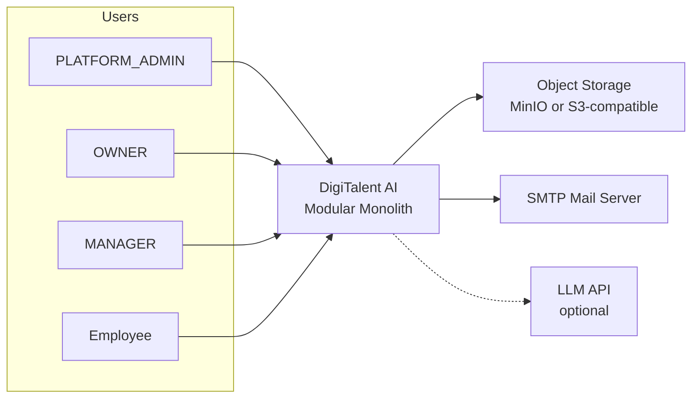
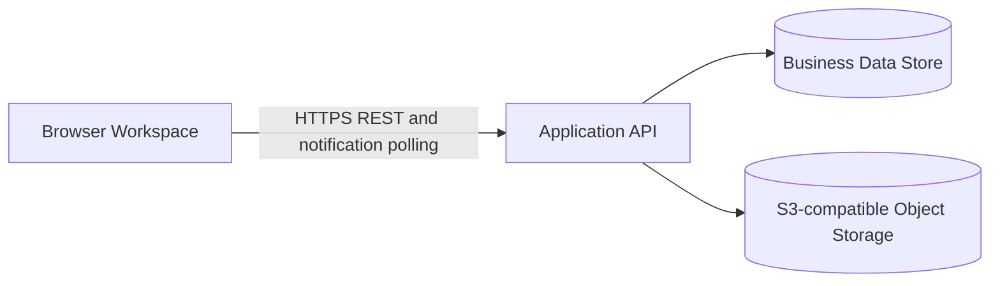

# 06 — Kiến Trúc Hệ Thống

> Nguồn gốc: Report 3 v2.3 external interfaces and Enterprise workflow; implementation-specific sections are labelled as proposals requiring source verification.

> **Baseline tài liệu 09/10/2026 — Enterprise Capstone MVP:** Nội dung bên dưới là thiết kế/định hướng cần đối chiếu, không phải xác nhận implementation đã được audit. Áp dụng bốn role `PLATFORM_ADMIN`, `OWNER`, `MANAGER`, `EMPLOYEE`; standard content do PLATFORM_ADMIN sở hữu. Hệ thống tự đề xuất khóa học theo Skill Gap; OWNER vẫn có thể giao khóa học khi tổ chức cập nhật nội dung/yêu cầu hoặc yêu cầu đào tạo lại. Certificate QR chỉ xác minh sau đăng nhập của OWNER/MANAGER thuộc đúng tổ chức phát hành, không có public route/expiry. Notification dùng in-app và browser polling; SignalR, Redis, risk/readiness scoring và microservices không phải dependency MVP. AI hỗ trợ đánh giá Practical Task theo rubric nhưng quyết định cuối thuộc OWNER/MANAGER reviewer; chỉ review được duyệt mới có thể cập nhật Confirmed Competency. Grade lưu trữ vẫn **PENDING DECISION GRADE-01**; không suy ra constraint/migration.
> **Nguồn chi tiết và version note:** Repository copy is Report 3 v2.3, while the Master Overview cites v2.2. This document uses v2.3 for compatible detail: §4.1 specifies SMTP over TLS, S3-compatible storage over HTTPS, optional LLM over HTTPS REST, and browser HTTPS REST with notification polling. Report 3 does not set the language/framework/database vendor. Its 1–3 grade storage, late-not-scored and Owner grade-raising override statements conflict with the Master Overview and are not adopted.

---

## 1. Kiểm soát tài liệu

| Mục | Giá trị |
|-----|---------|
| Tên tài liệu | Kiến trúc hệ thống |
| Phiên bản | 3.0 |
| Trạng thái | Bản nháp |
| Chủ sở hữu | Trần Văn Linh (Leader) |
| Căn cứ | Code thực tế + CLAUDE.md + Report 2/3 |

**Lịch sử chỉnh sửa**

| Ngày | Phiên bản | Mô tả |
|------|-----------|-------|
| 16/09/2026 | 3.0 | Chuyển ngữ; mô tả C4 + Clean Architecture theo code thực tế |
| 09/10/2026 | 3.2 | Đồng bộ bốn role, external interface và notification theo Report 3 v2.3 và Master Overview |

---

## 2. Mục đích và phạm vi

Mô tả ranh giới hệ thống, các giao diện ngoài và các module nghiệp vụ cho Enterprise Capstone MVP. Stack và implementation architecture dưới đây là proposal cần xác minh riêng với source; Report 3 không chuẩn hóa framework hoặc database vendor.

**Ngoài phạm vi:** thiết kế CSDL (07), đặc tả API (08), bảo mật chi tiết (15).

---

## 3. Tài liệu tham chiếu

- `CLAUDE.md` (repo) — quy ước code thực tế
- Report 2 — *Project Management Plan* (WBS, sprint)
- Report 3 — *Software Requirement Specification* §3.1, §4
- C4 Model (Simon Brown)
- `07_Thiet_Ke_CSDL_ERD.md`, `08_Dac_Ta_API_OpenAPI.md`

---

## 4. Nguyên tắc kiến trúc

| Nguyên tắc | Diễn giải |
|-----------|-----------|
| Modular Monolith | Một deployable duy nhất, chia module rõ; đủ cho SME 80–200 nhân sự, tránh phức tạp microservices |
| Clean Architecture thực dụng | Controller → Service → DTO; business rule nằm ở service/domain; infrastructure inject qua interface |
| Competency-first | Data model và luồng nghiệp vụ neo vào competency, không phải course |
| Explainable | Scoring là rule-based, mọi số giải thích được (không ML train) |
| Human-controlled AI | AI là tùy chọn, chỉ nháp, người duyệt quyết định |

---

## 5. System Context và external interfaces (Report 3 v2.3 §4.1)

| External interface | Direction | Purpose |
|-----------|-------|----------|
| SMTP mail server | Outbound, SMTP over TLS | Password reset, invitations, optional assignment notices |
| Object storage (MinIO or S3-compatible) | Both ways, S3 API over HTTPS | Lesson media, task submissions, certificate PDFs; file contents stay out of the database |
| LLM API (optional) | Outbound, HTTPS REST | Draft questions/task ideas and, only if approved in scope, preliminary Practical Task evaluation; all outputs require human review |
| Browser client | Both ways, HTTPS REST | All user interaction; notifications arrive by polling |

---

## 6. Application boundaries (implementation stack is not specified by Report 3)

| Container | Công nghệ | Trách nhiệm | Ghi chú |
|-----------|-----------|-------------|---------|
| Browser workspace | Framework unspecified | Role-based screens and HTTPS REST interactions | Responsive screens per Report 3 |
| Application API | Framework unspecified | Business rules, authorization/data scope, workflows, OpenAPI | No public certificate verification route |
| Business data store | Vendor unspecified | Organization-scoped records, version/history/audit | Physical model belongs in Report 4 |
| Object storage | MinIO or any S3-compatible service | Lesson media, task submissions, certificate PDFs | File contents do not enter the database |
| Optional LLM | External HTTPS REST | Draft content and, if enabled in the approved scope, preliminary Practical Task evidence evaluation | Human review required; AI output is a proposal and core workflows work without it |

---

## 7. Backend implementation proposal (not specified by Report 3)

The project names, framework choices and dependency rules in this section are retained as an earlier implementation proposal. Report 3 v2.3 does not establish them as the required or verified architecture; confirm against the source at a known revision before treating them as current.

Năm project, chiều phụ thuộc nghiêm ngặt `Api → Application → Domain` và `Api → Infrastructure → Application`:

| Project | Mục đích | Ràng buộc |
|---------|----------|-----------|
| `DigiTalent.Domain` | Entities + enums | Không DB, không EF Core, không dependency |
| `DigiTalent.Shared` | `ApiResponse`, `PagedList`, `ErrorCodes`, constants | Không tham chiếu project |
| `DigiTalent.Application` | DTO + Services + Interfaces | Không `HttpContext`, không `[Authorize]` |
| `DigiTalent.Infrastructure` | EF Core, JWT, MinIO, Seed, CurrentUser | Không trả entity (project sang DTO) |
| `DigiTalent.Api` | Controllers, Middleware, Authorization, Program.cs | Không business logic |

**Quy tắc bắt buộc:**
- Mọi endpoint: `Controller → Service → DTO`; response bọc `ApiResponse<T>.Ok/Fail`.
- Controllers ở `Api/Controllers/V1/` (route `api/v1`), mỗi module một controller.
- Service là class thường, inject qua DI trong `Program.cs`.
- Entity cấu hình Fluent API ở `Infrastructure/Persistence/Configurations/<Module>/`; enum lưu string (`HasConversion<string>()`).
- Entity mới → configuration mới → thêm `DbSet` vào cả `AppDbContext` + `IApplicationDbContext` → migration mới (không sửa migration đã push).
- DI: phụ thuộc `IApplicationDbContext`, không phụ thuộc `AppDbContext` cụ thể.
- Hành động nhạy cảm ghi `AuditLogService.LogAsync(...)`.
- Authorization và data scope phải được thực thi ở backend: PLATFORM_ADMIN theo module quản trị; OWNER trong tổ chức; MANAGER trong phòng ban được giao; EMPLOYEE trên dữ liệu cá nhân. Đây là yêu cầu thiết kế, chưa xác nhận implementation.

### 7.1 Learning recommendation and directed assignment

- Skill Gap is calculated from the active position requirement set and Confirmed Competency. A rule-based mapping from gap competencies to the competency coverage of published standard courses produces explainable Recommended Courses; show the missing competency and course coverage/relevance as the reason. AI does not decide the gap or recommendation in the MVP target design.
- An employee can open and start learning from a Recommended Course. The recommendation is not an assignment and does not itself impose a due date or mandatory completion.
- OWNER can separately create an Assigned Course for organizational content updates, policy requirements, or retraining, with a due date when applicable. OWNER monitors learning progress; an assignment does not itself confirm competency.
- Whether an OWNER-directed update/retraining assignment requires only course assessment or also a Practical Task is **PENDING DECISION**. Do not infer an automatic retest policy.

### 7.2 Human-reviewed AI assistance for Practical Task

- If included in the approved product scope, an evaluator reads only evidence the reviewer is authorized to access, applies the task's rubric version, and returns a proposed criterion-level assessment, numeric task score, rationale, evidence references, and unmet criteria. Model/provider/version metadata is recorded when available.
- The OWNER/MANAGER reviewer checks the proposal and work context, then approves, edits, rejects, or requests more evidence. The reviewer decision and edits are auditable. The AI proposal is not the review decision.
- Numeric task score is distinct from competency grade/level. A competency service may update Confirmed Competency only from a valid, approved review under the approved competency rules; an unapproved AI result or course assessment cannot do so. Skill Gap is recalculated after confirmed data changes.
- The AI evaluator must not receive evidence outside the reviewer's organization/department authorization. AI Practical Task evaluation expands the AI scope and must be reflected in the approved Report 1/2 scope and effort before being treated as committed MVP functionality.

### 7.3 Transaction boundary

Thao tác đa bảng phải **trọn vẹn hoặc không** (03B §5.2): cấp chứng chỉ, xác nhận evidence, kích hoạt requirement set (archive bản cũ cùng giao dịch — BR-03). Dùng `DbContext` transaction qua `IApplicationDbContext`.

---

## 8. Frontend implementation proposal (not specified by Report 3)

The framework and library details below are implementation-specific and are not established by Report 3 v2.3. The report requires role-based screens, HTTPS REST and browser notification polling.

**Cấu trúc `frontend/src/`:**

| Thư mục | Vai trò |
|---------|---------|
| `app/` | `router.tsx` (toàn bộ route, một file) + `providers.tsx` (React Query) |
| `components/` | `guards/` (AuthGuard, RequirePermission, RequireRole), `layout/`, `shared/` (DataTable, PageHeader, StatusBadge, EmptyState…) |
| `features/<module>/pages/*.tsx` | Một page một file |
| `hooks/` | React Query hooks + Zustand stores |
| `lib/` | `constants.ts`, `sidebar-config.ts`, `utils.ts` (không React) |
| `services/` | Gọi API qua `apiClient` — `<module>.service.ts` |
| `types/` | Interface TS dùng chung (`api.ts`, `auth.ts`, `common.ts`) |

**Quy tắc bắt buộc:**
- Data fetching: **TanStack Query**; client/auth state: **Zustand** (`useCurrentUser`) — không thêm pattern state khác.
- API chỉ qua `apiClient` (`services/api-client.ts`); service export object (không class).
- Route guard: `<RequirePermission permission="...">` / `<RequireRole roles={[...]}>` trong `router.tsx`.
- Permission key từ `hooks/use-permission.ts` (`PERMISSIONS`) — mirror `PermissionConstants` backend.
- Path alias `@/` → `src/`.
- Form: `react-hook-form` + `zod`; toast `sonner`; icon `lucide-react`.
- Vite dev proxy: `/api` và `/hubs` → `http://localhost:5000`.

---

## 9. Kiến trúc dữ liệu

| Nhóm | Bảng chính | Ghi chú |
|------|-----------|---------|
| Identity & Access | `users`, `roles`, `permissions`, `user_roles`, `role_permissions`, `refresh_tokens` | Auth/authorization auditable; refresh token revocable |
| Organization | Organization, Department, Position, Member, Manager Assignment | Job Family/Job Grade không thuộc baseline |
| Competency | `competency_categories`, `competencies`, `competency_levels`, `position_requirements`, `employee_competency_profiles`, `competency_evidences` | Lõi nghiệp vụ |
| Learning | `courses`, `lessons`, `materials`, `enrollments`, `lesson_progress` | Recommended Courses are derived from Skill Gap and course competency coverage; OWNER-directed assignments are a separate path |
| Assessment | `questions`, `assessments`, `assessment_questions`, `attempts`, `attempt_answers` | — |
| Certificate | `certificates`, `certificate_verification_logs` | — |
| WMS-lite | `task_templates`, `task_assignments`, `task_submissions`, `task_evaluations` | Human review is authoritative; optional AI evaluation is a proposal, not competency confirmation |
| Intelligence | Requirement Set/Item, Confirmed Competency/History, Skill Gap Result/Run | Không gồm risk/readiness score hoặc scoring weights |
| File & Audit | `file_objects`, `audit_logs`, `notifications` | File metadata; bytes ở MinIO |

> The table and SQL reference above are legacy implementation notes. Neither is authoritative for the Report 3 conceptual model or proof of current implementation. Use §5–6 for the system boundaries and Report 3 v2.3 for business entities; Report 4 defines logical/physical schema after pending decisions are resolved.

---

## 10. Kiến trúc lưu trữ file (MinIO)

- File lưu ở MinIO; PostgreSQL chỉ lưu metadata (object key, tên, MIME, size, owner, entity ref, access policy).
- Upload flow: xác thực → authorize → validate type/size → kiểm tra quyền record cha → upload → lưu metadata.
- Chỉ phục vụ file cho người có quyền với record cha.

---

## 11. Kiến trúc bảo mật (tóm tắt)

| Hạng mục | Cách tiếp cận |
|----------|---------------|
| Mật khẩu | Salted hash, không plaintext, không xuất hiện trong log/audit |
| Token | Đích: JWT access (≤30 phút) + refresh (≤7 ngày), revocable. Hiện tại: access 8 giờ, bảng `refresh_tokens` đã có, luồng refresh chưa làm |
| Khóa tài khoản | Sai 5 lần liên tiếp → khóa 15 phút (đã làm) |
| Authorization | RBAC theo permission key, ma trận lưu trong DB (`role_permissions`); data scope ở server (không phải ẩn menu) |
| Certificate verification | Authenticated OWNER/MANAGER in issuing organization only; least data disclosure |
| Audit | Hành động nhạy cảm ghi log chỉ-thêm (không sửa/xóa) |

> Chi tiết tại `15_Thiet_Ke_Bao_Mat.md`, ma trận phân quyền tại `09`.

---

## 12. Kiến trúc thông minh năng lực (Capability Intelligence)

- Skill Gap dùng rule-based comparison giữa Active Requirement và Confirmed Competency; trạng thái gồm Met, Partial Gap, Gap, Not Assessed.
- Không có Training Risk Score, Workforce Readiness Score hoặc scoring weights trong Enterprise MVP.
- **GRADE-01 PENDING:** Report 3 mô tả TT02 Grade 1–6; không chốt thang lưu trữ hay phép chuyển đổi trong tài liệu này.
- Course recommendation is rule-based and explainable from gap competency to course coverage; it does not automatically enroll/assign the employee.
- Optional AI assistance may draft question/task content and, if approved in project scope, analyze Practical Task evidence by rubric. A human reviewer retains the final decision; course assessment and numeric task score do not themselves update Confirmed Competency.
- OWNER-directed course update/retraining has a pending reevaluation rule: assessment-only vs. requiring a Practical Task.

> Công thức chi tiết tại `16_Thiet_Ke_Cham_Diem_AI_Rule.md`.

---

## 13. Notification (MVP)

- In-app notification được truy vấn bằng browser polling; không yêu cầu SignalR.
- Có thể thông báo assignment và feedback; certificate expiry và risk alert không thuộc baseline vì MVP không có expiry/risk score.
- Người dùng chỉ được đọc notification của mình.

---

## 14. Ma trận vết

| Hạng mục kiến trúc | UC/Flow liên quan | File liên quan |
|--------------------|-------------------|----------------|
| Auth/RBAC container | UC-01..13 | 09, 15 |
| Competency data model | UC-14..22 | 07 |
| Learning/Assessment | UC-35..43 | 07, 08 |
| Certificate | UC-27, 45, 46 | 07, 15 |
| Intelligence | NF-01..03 | 16 |
| File storage | UC-44, NF-03 | 07, 15 |
