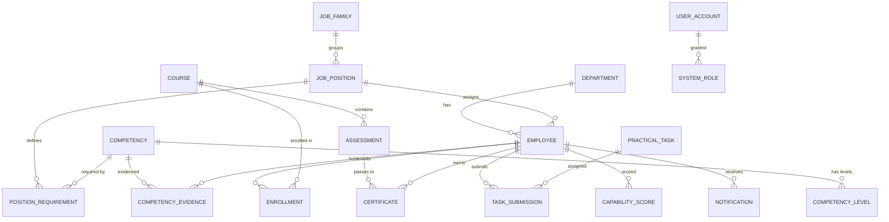

# 07 — Thiết Kế CSDL & ERD

> Nguồn gốc: Report 3 §3.1.5 (18 entity) + thiết kế bảng thực tế. Phiên bản docs_v3, tiếng Việt.

> ⚠️ **Thiết kế vật lý đã được thay thế (26/09/2026).** Schema chuẩn duy nhất hiện là
> [`docs/database/DigiTalent_AI_Canonical_v2_3.sql`](database/DigiTalent_AI_Canonical_v2_3.sql) — 59 bảng (55 lõi + 4 Intelligence), gắn nhãn Phase 1–4, đã kiểm tra chạy được trên PostgreSQL.
> Tài liệu này chỉ còn giá trị ở mức **khái niệm** (ERD tổng quan, quy tắc nghiệp vụ). Khi hai bên khác nhau, **file SQL thắng**. Những điểm đã khác:
>
> | Tài liệu này (v3.0) | SQL v2.3 (chuẩn) |
> |---|---|
> | `competency_levels` (bảng) | Không có bảng; mức năng lực là `smallint` 1..3 + CHECK |
> | `position_competency_requirements`, `is_current` | `position_requirement_sets` (DRAFT/ACTIVE/ARCHIVED, `version_no`) + `position_requirement_items` |
> | Weight `numeric(6,4)` (0.3500) | `weight_percent numeric(5,2)`, tổng = 100.00 khi kích hoạt |
> | `attempt_answers`, `task_templates`, `skill_gap_snapshots` | `assessment_answers`, `practical_task_templates` (+ `practical_task_targets`), `skill_gap_runs` + `skill_gap_items` |
> | `users.status` ACTIVE/LOCKED/DISABLED/PENDING | ACTIVE/INACTIVE/LOCKED + `locked_until` |
> | Role `DEPT_MANAGER` | `DEPARTMENT_MANAGER` |
> | `employees.job_position_id` | Cho phép NULL (chưa gán vị trí → skill gap trả NOT_ASSIGNED) |

---

## 1. Kiểm soát tài liệu

| Mục | Giá trị |
|-----|---------|
| Tên tài liệu | Thiết kế cơ sở dữ liệu & ERD |
| Phiên bản | 3.0 |
| Trạng thái | Bản nháp |
| Chủ sở hữu | Trần Văn Linh (Leader) |
| Căn cứ | Report 3 §3.1.5 |

**Lịch sử chỉnh sửa**

| Ngày | Phiên bản | Mô tả |
|------|-----------|-------|
| 16/09/2026 | 3.0 | Chuyển ngữ; chuẩn hóa **17 entity** theo 3-level (bỏ Career Grade) |
| 26/09/2026 | 3.1 | Thiết kế vật lý chuyển sang `docs/database/DigiTalent_AI_Canonical_v2_3.sql`; tài liệu này giữ vai trò khái niệm |

---

## 2. Mục đích và phạm vi

Thiết kế dữ liệu ở mức **entity quan hệ (ERD)** và **từ điển dữ liệu** đủ để tạo entity EF Core, lập migration và căn chỉnh API. DigiTalent AI dùng PostgreSQL 16 + EF Core 10.

**Ngoài phạm vi:** chi tiết SQL DDL, chiến lược migration/seed đầy đủ.

---

## 3. Tài liệu tham chiếu

- Report 3 §3.1.5 — Entity Relationship Diagram
- `06_Kien_Truc_He_Thong.md` — kiến trúc dữ liệu
- `00_INDEX_Tong_Quan_Tai_Lieu.md` §3.5

---

## 4. Nguyên tắc thiết kế

| Nguyên tắc | Diễn giải |
|-----------|-----------|
| Competency-first | Mọi luồng bắt đầu/kết thúc ở competency record |
| Single 3-level scale | **Một thang 3 mức duy nhất** (Basic/Intermediate/Advanced) cho cả lưu trữ lẫn hiển thị — bỏ trục Career Grade và bỏ thang 5 mức research |
| Explainable scores | Lưu component score + snapshot nguồn + version trọng số |
| File ngoài DB | Metadata ở `file_objects`, bytes ở MinIO |
| Retire không xóa | Bản ghi nghiệp vụ đổi status, không xóa cứng (BR-11) |

---

## 5. Quy ước PostgreSQL + EF Core

| Hạng mục | Quy ước |
|----------|---------|
| Đặt tên bảng | `snake_case` số nhiều (`employees`) |
| Entity C# | `PascalCase` số ít (`Employee`) |
| Khóa chính | `id uuid PK` (gen app-side) |
| Cột chung | `created_at`, `updated_at` (timestamptz), `status` (varchar) |
| Score | `numeric(5,2)` / `numeric(6,2)` — tránh float |
| Weight | `numeric(6,4)` (vd `0.3500`) |
| Enum | `varchar(30/80)` + `HasConversion<string>()`; thêm CHECK constraint khi status ổn định |

---

## 6. ERD tổng quan (17 entity cốt lõi)

---

## 7. Nhóm schema và tổng quan entity

| Nhóm | Bảng chính | Entity cốt lõi (Report 3) |
|------|-----------|---------------------------|
| Identity & Access | `users`, `roles`, `permissions`, `user_roles`, `role_permissions`, `refresh_tokens` | User Account, System Role |
| Organization | `departments`, `job_families`, `job_positions`, `employees` | Department, Employee, Job Position |
| Competency | `competency_categories`, `competencies`, `competency_levels`, `position_requirement_sets`, `position_competency_requirements`, `employee_competency_profiles`, `competency_evidences` | Competency, Competency Level, Position Requirement, Competency Evidence |
| Learning | `courses`, `course_modules`, `lessons`, `learning_materials`, `course_competencies`, `enrollments`, `lesson_progress` | Course, Enrollment |
| Assessment | `questions`, `assessments`, `assessment_questions`, `assessment_attempts`, `attempt_answers` | Assessment |
| Certificate | `certificates`, `certificate_verification_logs` | Certificate |
| WMS-lite | `task_templates`, `task_assignments`, `task_submissions`, `task_evaluations` | Practical Task, Task Submission |
| Intelligence | `skill_gap_snapshots`, `training_risk_scores`, `readiness_scores`, `scoring_configs` | Capability Score |
| File & Notification | `file_objects`, `notifications`, `audit_logs` | Notification |

> ⚠️ **Chuyển đổi 18 → 17 entity:** Report 3 gốc có entity "Career Grade" (G1–G5). docs_v3 **loại bỏ bảng `career_grades`** và mọi khóa ngoại tới nó; thang mức duy nhất là `competency_levels` (3 mức). `position_requirement_sets` khóa theo **job_position** (bỏ `career_grade_id`). Xem `00_INDEX` §3.5.

---

## 8. Từ điển dữ liệu (cột chính)

### 8.1 Auth & RBAC

**users**

| Cột | Kiểu | Key/Null | Mô tả |
|-----|------|----------|-------|
| id | uuid | PK | Định danh người dùng |
| email | varchar(255) | UNIQUE, NOT NULL | Email đăng nhập, chuẩn hóa lower-case |
| password_hash | text | NULL | Hash mật khẩu (không lưu plaintext) |
| full_name | varchar(255) | NOT NULL | Tên hiển thị |
| status | varchar(30) | NOT NULL | ACTIVE, LOCKED, DISABLED, PENDING |
| failed_login_count | int | NOT NULL DEFAULT 0 | Chính sách khóa tài khoản |
| last_login_at | timestamptz | NULL | Lần đăng nhập cuối |
| created_at / updated_at | timestamptz | NOT NULL | Timestamp audit |

**roles** — `code` UNIQUE (`SYSTEM_ADMIN`, `HR_MANAGER`, `DEPT_MANAGER`, `TRAINER`, `EMPLOYEE`); `scope_type` (GLOBAL/DEPARTMENT/SELF/PUBLIC).

**permissions** — `code` UNIQUE (vd `course.create`, `employee.view.all`), `module`, `action`.

**user_roles / role_permissions** — bảng nối nhiều-nhiều, kèm `assigned_by`, `assigned_at`.

**refresh_tokens** — lưu `token_hash` (không lưu raw), `expires_at`, `revoked_at`, `replaced_by_token_id` (rotation).

### 8.2 Job Architecture & Organization

**job_families** — `code` UNIQUE, `name` (5 family), `description`, `display_order`, `is_active`.

**departments** — `parent_department_id` (cây), `manager_employee_id`, `code`, `name`, `status` (ACTIVE/INACTIVE/ARCHIVED).

**job_positions** — `job_family_id` NOT NULL, `code` UNIQUE, `title`, `esco_code`, `sfia_category_reference`, `status`.

**employees** — `user_id` (0..1, UNIQUE), `department_id` NOT NULL, `job_position_id` NOT NULL, `direct_manager_id`, `employee_code` UNIQUE, `full_name`, `email`, `employment_status`, `joined_at`.

> ⚠️ Report 3 gốc có `career_grade_id` + `grade_assigned_date` → **đã bỏ**. Tiêu chí "chưa đủ dữ liệu tính gap" giờ là **`job_position_id` NULL hoặc vị trí chưa có active requirement set** (BR-09).

### 8.3 Competency Framework

**competency_categories** — `code`, `name`, `sort_order`, `status`.

**competencies** — `category_id`, `competency_type` (CORE_DIGITAL/PROFESSIONAL/INTERNAL/BEHAVIOURAL), `framework_source` (DigComp 3.0), `framework_code` (vd `DC-2.1`), `code`, `name`, `status`.

> **Cập nhật 30/09/2026 — khung Thông tư 02/2025 (theo SQL v2.3, đã có migration `AddCompetencyFrameworkMappingsAndCoursePrerequisites`):**
>
> - **competency_frameworks** — `code` (vd `TT02_2025`), `version` (`02/2025/TT-BGDĐT`), `name`, `authority`, `jurisdiction`, `source_url`, `is_active`; UNIQUE (`code`, `version`).
> - **competency_framework_mappings** — `competency_id` → competencies, `framework_id` → competency_frameworks, `source_area_code` (miền 1–6), `source_code` (vd `4.2`), `source_name`, `source_level_text`, `relationship` CHECK ∈ {DIRECT, STRONG_OVERLAP, PARTIAL_OVERLAP}, `is_primary`, `mapping_note`, `reviewed_by_user_id`; UNIQUE (`competency_id`, `framework_id`, `source_code`). Bộ tiêu chuẩn vị trí chỉ kích hoạt được khi đủ 24 năng lực có mapping tới khung `TT02_2025` (D-B4).
> - **course_prerequisites** — PK (`course_id`, `prerequisite_course_id`), CHECK `course_id <> prerequisite_course_id`; dùng cho chuỗi khóa F → I → A và quy tắc gợi ý khóa bậc kế tiếp.

**competency_levels** — thang **3 mức duy nhất**:

| Mức | level_value | name |
|-----|-------------|------|
| 1 | 1 | Basic |
| 2 | 2 | Intermediate |
| 3 | 3 | Advanced |

> ⚠️ docs_v2 dùng `scale_type` (RESEARCH 5 mức / DISPLAY 3 mức) + `level_scale_mappings`. docs_v3 **gộp về một thang 3 mức**, bỏ `scale_type` và `level_scale_mappings`.

**position_requirement_sets** — `job_position_id` NOT NULL (**không còn `career_grade_id`**), `version_number`, `effective_date`, `review_date`, `is_current` (chỉ 1 active/position).

**position_competency_requirements** — `position_requirement_set_id`, `competency_id`, `required_level` (1–3), `weight` (numeric(5,2)), `is_mandatory`, `requires_practical_evidence`.

**employee_competency_profiles** — `employee_id`, `competency_id`, `confirmed_level` (1–3), `evidence_source`, `assessed_by`, `assessed_at`, `last_evidence_id`.

**competency_evidences** — `employee_id`, `competency_id`, `evidence_type` (ASSESSMENT/CERTIFICATE/TASK/MANAGER_REVIEW/MANUAL), `source_entity_type`, `source_entity_id`, `confirmed_level_value`, `verified_by_user_id`, `status` (PENDING/VERIFIED/REJECTED/SUPERSEDED).

### 8.4 Learning Management

**courses** — `code`, `title`, `difficulty_level`, `owner_trainer_id`, `passing_score`, `status` (DRAFT/PUBLISHED/ARCHIVED).

**course_modules / lessons / learning_materials** — cấu trúc course → module → lesson → material; `is_required` (material bắt buộc).

**course_competencies** — `course_id`, `competency_id`, `target_level_value`, `coverage_weight`.

**enrollments** — `employee_id`, `course_id`, `status` (ASSIGNED/IN_PROGRESS/COMPLETED/FAILED/OVERDUE/CANCELLED), `due_date`, `assign_reason`.

**lesson_progress** — `enrollment_id`, `lesson_id`, `status` (NOT_STARTED/IN_PROGRESS/COMPLETED).

### 8.5 Assessment

**questions** — `type` (MCQ/TRUE_FALSE), `competency_id`, `difficulty`, `is_ai_drafted` (flag, phải duyệt).

**assessments** — `course_id`, `is_final`, `pass_score`, `time_limit_minutes`, `max_attempts`.

**assessment_questions** — `assessment_id`, `question_id`, `points`, `sort_order`.

**assessment_attempts** — `enrollment_id`, `assessment_id`, `status` (STARTED/SUBMITTED/SCORED/PASSED/FAILED), `score`, `started_at`, `submitted_at`.

**attempt_answers** — `attempt_id`, `question_id`, `selected_option`, `is_correct`.

### 8.6 Certificate

**certificates** — `employee_id`, `course_id`, `competency_id`, `code` UNIQUE, `verification_url`, `qr_image`, `pdf_object_id`, `issued_at`, `expires_at`, `status` (VALID/EXPIRED/REVOKED), `revoked_reason`.

**certificate_verification_logs** — `certificate_id`, `result`, `hashed_requester_address`, `checked_at`.

### 8.7 WMS-lite

**task_templates** — `title`, `expected_output`, `marking_criteria`, `is_ai_drafted`.

**task_assignments** — `template_id` (NULL nếu ad hoc), `employee_id`, `due_date`, `reviewer_id`, `status` (DRAFT/ASSIGNED/IN_PROGRESS/SUBMITTED/EVALUATED/CLOSED).

**task_submissions** — `assignment_id`, `note`, `file_object_id`, `external_url`, `version_number`, `submitted_at`, `is_late`, `status` (SUBMITTED/SUPERSEDED).

**task_evaluations** — `submission_id`, `score`, `verdict` (PASSED/NEEDS_REVISION/FAILED), `counts_as_evidence`, `confirmed_level`, `feedback`.

### 8.8 Intelligence & Scoring

**skill_gap_snapshots** — `employee_id`, `competency_id`, `required_level`, `confirmed_level`, `gap`, `priority`, `requirement_version_id`, `run_number`, `calculated_at`.

**training_risk_scores** — `employee_id`, `score`, `band`, `factor_breakdown` (JSONB), `weight_version_id`, `calculated_at`.

**readiness_scores** — `employee_id`, `score`, `band`, `factor_breakdown` (JSONB), `weight_version_id`, `calculated_at`.

**scoring_configs** — `config_key` (risk/readiness/recommendation weights), `version_number`, `config_json`, `is_active` (một active/key — BR-08).

### 8.9 File & Notification

**file_objects** — `object_key`, `file_name`, `mime_type`, `size_bytes`, `owner_id`, `entity_type`, `entity_id`, `access_policy`.

**notifications** — `recipient_id`, `type`, `message`, `entity_type`, `entity_id`, `is_read`, `created_at`.

**audit_logs** — `actor_id`, `action`, `entity_type`, `entity_id`, `before_value` (JSONB), `after_value` (JSONB), `ip_address`, `created_at` (chỉ-thêm).

---

## 9. Quy tắc nghiệp vụ & toàn vẹn dữ liệu

| BR | Ràng buộc dữ liệu |
|----|-------------------|
| BR-01 | Gap đo theo active requirement set của position; snapshot ghi `requirement_version_id` |
| BR-02 | `position_requirement_sets.status` chỉ DRAFT → ACTIVE → ARCHIVED |
| BR-03 | Một active set/position; kích hoạt mới archive cũ cùng transaction |
| BR-04 | Confirm evaluation tạo N evidence (mỗi competency 1 dòng) |
| BR-05 | `employee_competency_profiles.confirmed_level` không hạ nếu không override + audit |
| BR-06 | Certificate chỉ tạo khi có attempt PASSED của final assessment |
| BR-08 | `scoring_configs` một active/key |
| BR-09 | `employees.job_position_id` NULL → loại khỏi gap/risk/readiness |
| BR-11 | Bản ghi nghiệp vụ đổi status, không DELETE |
| BR-12 | Scope department ở tầng query, không chỉ ẩn menu |

---

## 10. Mô hình trạng thái & enum

| Entity | Luồng trạng thái |
|--------|------------------|
| course | DRAFT → PUBLISHED → ARCHIVED |
| enrollment | ASSIGNED → IN_PROGRESS → COMPLETED/FAILED/OVERDUE/CANCELLED |
| assessment_attempt | STARTED → SUBMITTED → SCORED → PASSED/FAILED |
| certificate | VALID → EXPIRED/REVOKED |
| task_assignment | DRAFT → ASSIGNED → IN_PROGRESS → SUBMITTED → EVALUATED → CLOSED |
| competency_evidence | PENDING → VERIFIED/REJECTED/SUPERSEDED |
| position_requirement_set | DRAFT → ACTIVE → ARCHIVED |

---

## 11. Indexing & hiệu năng

- Index trên mọi FK; unique trên `email`, `employee_code`, `code` (theo scope).
- Index `(employee_id, calculated_at DESC)` trên snapshot/score để xem lịch sử.
- `certificate_verification_logs(certificate_id, checked_at)` cho rate-limit và tra cứu.
- Dashboard đọc từ snapshot (`skill_gap_snapshots`, `readiness_scores`) — không tính lại khi xem.

---

## 12. Ma trận vết

| Nhóm bảng | UC liên quan | File liên quan |
|-----------|--------------|----------------|
| Auth & RBAC | UC-01..13 | 09, 15 |
| Organization | UC-18, 19 | 04 |
| Competency | UC-14..22 | 16 |
| Learning | UC-24, 35, 41, 42 | 04 |
| Assessment | UC-36..38, 43 | 04 |
| Certificate | UC-27, 45, 46 | 15 |
| WMS-lite | UC-30..33, 44 | 04 |
| Intelligence | NF-01..03 | 16 |
