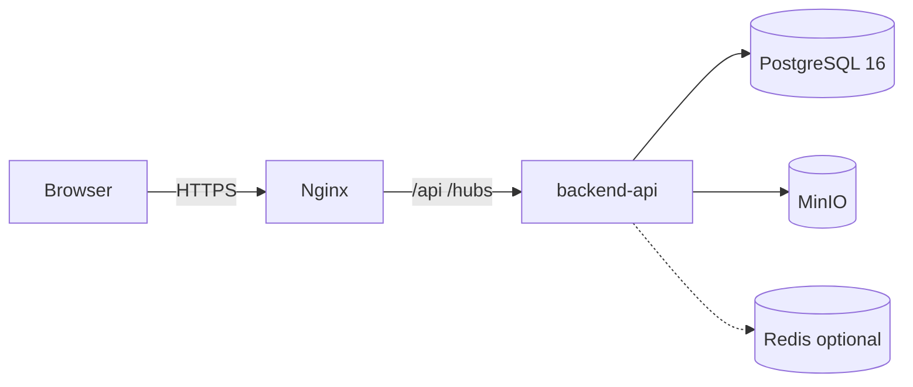

# 14 — DevOps & Triển Khai

> Nguồn gốc: Report 2 §6.3 (triển khai) + `docker/`, `infra/`, `.github/workflows/` (code thực tế). Phiên bản docs_v3, tiếng Việt.

---

## 1. Kiểm soát tài liệu

| Mục | Giá trị |
|-----|---------|
| Tên tài liệu | DevOps & triển khai |
| Phiên bản | 3.0 |
| Trạng thái | Bản nháp |
| Chủ sở hữu | Trần Văn Linh (Leader) |
| Căn cứ | Report 2 §6.3 + docker/infra/workflows |

**Lịch sử chỉnh sửa**

| Ngày | Phiên bản | Mô tả |
|------|-----------|-------|
| 16/09/2026 | 3.0 | Chuyển ngữ; Docker Compose + GitHub Actions theo repo thực tế |

---

## 2. Mục đích và phạm vi

Quy trình đóng gói, CI/CD và triển khai hệ thống từ môi trường dev lên production. Đảm bảo build nhất quán, test tự động và deploy lặp lại được.

**Ngoài phạm vi:** chiến lược test (13), quy ước git (12).

---

## 3. Tài liệu tham chiếu

- Report 2 §6.3 — Deployment Plan
- `docker/docker-compose.yml`, `infra/` (Nginx)
- `.github/workflows/backend-ci.yml`, `frontend-ci.yml`
- `.env.example` (root)

---

## 4. Kiến trúc triển khai (Container)

| Container | Vai trò | Ghi chú |
|-----------|---------|---------|
| `backend-api` | ASP.NET Core 11 API | Route `api/v1`, Swagger |
| `nginx` | Web server + reverse proxy | Phục vụ SPA, proxy `/api` + `/hubs` |
| `postgres` | PostgreSQL 16 | Dữ liệu nghiệp vụ |
| `minio` | Object storage S3 | File học liệu/task/cert |
| `redis` | Cache | **Tùy chọn**, off by default |



---

## 5. Docker Compose (local dev)

- Nguồn cấu hình: `.env.example` → `.env` (Postgres, MinIO, JWT, Redis, frontend URL).
- `docker compose up` khởi động postgres + minio + redis(optional) + nginx + backend-api.
- Backend config: `backend/src/DigiTalent.Api/appsettings.json` (connection string, JWT, MinIO buckets, scoring weights).
- Frontend config: `frontend/.env` (`VITE_API_BASE_URL`).
- Postgres mặc định: `Host=localhost;Port=5432;Database=digitalent;Username=digitalent_app;Password=changeme`.

---

## 6. CI/CD — GitHub Actions

| Workflow | Vai trò |
|----------|---------|
| `backend-ci.yml` | Restore → build → test (`dotnet test`) backend |
| `frontend-ci.yml` | `npm ci` → build (`tsc -b && vite build`) → lint (`oxlint`) |

**Chuỗi CI chuẩn:**

```
push/PR → backend-ci (build + test) + frontend-ci (build + lint) → green → merge
```

| Giai đoạn | Backend | Frontend |
|-----------|---------|----------|
| Install | `dotnet restore` | `npm ci` |
| Build | `dotnet build` | `tsc -b && vite build` |
| Test | `dotnet test` | — |
| Lint | — | `oxlint` |

---

## 7. Môi trường

| Môi trường | Mục đích | Cấu hình |
|-----------|----------|----------|
| Development | Dev local | `appsettings.Development.json`, seed tự động |
| Staging | Kiểm thử trước release | DB riêng, log chi tiết |
| Production | Người dùng thật | Secret qua secret manager, log tối giản |

---

## 8. Triển khai production (tóm tắt)

1. Build image backend + build SPA → copy vào Nginx.
2. Áp migration: `dotnet ef database update`.
3. Seed role/permission/competency gốc.
4. Cấu hình Nginx: phục vụ SPA, proxy `/api` + `/hubs`, HTTPS.
5. Health check `GET /health` để giám sát.

---

## 9. Quản lý cấu hình & secret

- Không commit `.env`; chỉ commit `.env.example`.
- Secret (JWT key, DB password, MinIO access key) qua **environment variable** hoặc secret manager.
- Rotate secret khi nghi ngờ lộ.

---

## 10. Sao lưu & phục hồi

- PostgreSQL: sao lưu định kỳ (pg_dump) + kiểm tra phục hồi.
- MinIO: sao lưu bucket (file học liệu, PDF chứng chỉ).
- Test phục hồi định kỳ để đảm bảo dữ liệu không mất.

---

## 11. Giám sát & log

- Log backend ghi chi tiết server-side (không lộ stack/SQL ra client).
- Health check endpoint `GET /health`.
- Theo dõi P95 API < 500 ms (Report 2 §1.2).

---

## 12. Ma trận vết

| Hạng mục | Liên quan | File |
|----------|-----------|------|
| Container architecture | Kiến trúc | 06 |
| CI test | Test | 13 |
| Secret management | Bảo mật | 15 |
| Health check | API | 08 |
