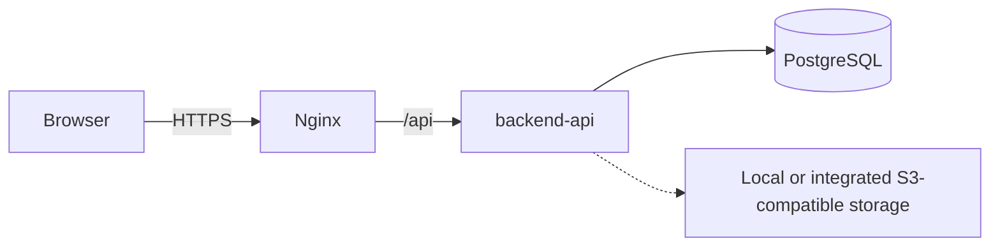

# 14 — DevOps & Triển Khai

> Nguồn gốc: Report 2 v2.5 §6.3 và Master System Overview 09/10/2026 §9–10. Đây là hướng dẫn triển khai; cấu hình và deployment cần xác minh theo commit.

---

## 1. Kiểm soát tài liệu

| Mục | Giá trị |
|-----|---------|
| Tên tài liệu | DevOps & triển khai |
| Phiên bản | 3.1 |
| Trạng thái | Bản nháp |
| Chủ sở hữu | Trần Văn Linh (Leader) |
| Căn cứ | Report 2 v2.5 §6.3; Master System Overview §9–10, §14 |

**Lịch sử chỉnh sửa**

| Ngày | Phiên bản | Mô tả |
|------|-----------|-------|
| 16/09/2026 | 3.0 | Chuyển ngữ; Docker Compose + GitHub Actions theo repo thực tế |
| 09/10/2026 | 3.1 | Gỡ SignalR/scoring weights khỏi baseline bắt buộc; phân biệt hướng dẫn với trạng thái triển khai |

---

## 2. Mục đích và phạm vi

Hướng dẫn đóng gói, CI/CD và triển khai môi trường. Docker Compose, OpenAPI/Swagger, basic CI/audit là deployment approach trong baseline, không phải xác nhận đã cấu hình hoặc triển khai.

**Ngoài phạm vi:** chiến lược test (13), quy ước git (12).

---

## 3. Tài liệu tham chiếu

- Report 2 v2.5 §6.3 — Deployment Plan
- Master System Overview §9–10 — architecture and quality baseline
- Verify actual Docker/infra/workflow files and `.env.example` before treating them as active configuration

---

## 4. Kiến trúc triển khai (Container)

| Container | Vai trò | Ghi chú |
|-----------|---------|---------|
| `backend-api` | ASP.NET Core API | Version, route and OpenAPI are governed by current reports/source |
| `web` / reverse proxy | SPA hosting and proxy if configured | No `/hubs` dependency; in-app/browser polling is the MVP notification baseline |
| `postgres` | PostgreSQL | Relational business data |
| File storage | Local for development; S3-compatible/MinIO when integrated | Learning materials, evidence and certificate PDF |
| Redis | Not an MVP dependency | Add only with approved architecture/scope |



---

## 5. Docker Compose (local dev)

- Read the current `.env.example` and compose files to identify required settings and services; keep `.env` local and out of Git.
- Do not assume Redis, SignalR, MinIO or scoring-weight configuration is required.
- Backend/frontend configuration must follow schemas verified in the repository; do not publish default passwords in this guide.

---

## 6. CI/CD — GitHub Actions

| Workflow | Vai trò |
|----------|---------|
| Backend workflow | If present, restore/build and configured tests |
| Frontend workflow | If present, install/build/type/lint checks configured in the repository |

**Chuỗi CI chuẩn:**

```
push/PR → run configured checks → record results for that commit → merge by repository policy
```

| Giai đoạn | Backend | Frontend |
|-----------|---------|----------|
| Install | `dotnet restore` | `npm ci` |
| Build | `dotnet build` | `tsc -b && vite build` |
| Test | Configured test commands; record evidence | As configured |
| Lint | As configured | Configured lint/type checks; record evidence |

---

## 7. Môi trường

| Môi trường | Mục đích | Cấu hình |
|-----------|----------|----------|
| Development | Dev local | Local configuration and synthetic seed data, if configured |
| Staging | Kiểm thử trước release | DB riêng, log chi tiết |
| Production | Người dùng thật | Secret qua secret manager, log tối giản |

---

## 8. Triển khai production (tóm tắt)

1. Build and tag artifacts from the reviewed commit using the repository's verified pipeline.
2. Review and apply migrations with a backup and rollback plan.
3. Load approved TT02/reference seed data; use synthetic demo records, never real personal data.
4. Configure TLS, proxy, file storage, authentication secrets and tenant isolation for the target environment.
5. Configure health checks only for endpoints/services confirmed to exist; record deployment evidence separately.

---

## 9. Quản lý cấu hình & secret

- Không commit `.env`; chỉ commit `.env.example`.
- Secret (JWT key, DB password, MinIO access key) qua **environment variable** hoặc secret manager.
- Rotate secret khi nghi ngờ lộ.

---

## 10. Sao lưu & phục hồi

- PostgreSQL: sao lưu định kỳ (pg_dump) + kiểm tra phục hồi.
- MinIO: sao lưu bucket (file học liệu, PDF chứng chỉ).
- Test phục hồi định kỳ để đảm bảo dữ liệu không mất.

---

## 11. Giám sát & log

- Log backend ghi chi tiết server-side (không lộ stack/SQL ra client).
- Configure/monitor health checks only for verified endpoints.
- Measure API P95 under a documented workload according to Report 3; this document does not claim a target is met.

---

## 12. Ma trận vết

| Hạng mục | Liên quan | File |
|----------|-----------|------|
| Container architecture | Kiến trúc | 06 |
| CI test | Test | 13 |
| Secret management | Bảo mật | 15 |
| Health check | API | 08 |
