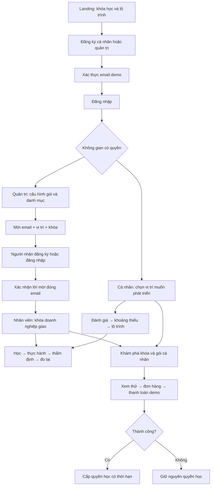

# Luồng đầu vào, doanh nghiệp và quyền học — FE demo

## Cách trải nghiệm

1. Landing → **Đào tạo đội ngũ** → điền tên, email, mật khẩu thử, tên/ngành/quy mô doanh nghiệp và mục tiêu.
2. **Mở hộp thư demo** → lấy mã 6 số → xác thực → đăng nhập. Doanh nghiệp được tạo sau xác thực.
3. **Gói học & chi phí** → lưu danh mục tài trợ và số khóa/người → **Nhân viên** → mời đúng email, chọn vị trí và khóa cụ thể.
4. Đăng xuất. Đăng ký cá nhân bằng email vừa được mời → xác thực → đăng nhập → **Tài khoản & lời mời** → đồng ý tham gia.
5. Nhân viên vào **Công việc & hồ sơ** để thấy khóa đã giao, rồi học video, làm bài và nộp minh chứng. Quản trị xem tiến độ, đánh giá và hồ sơ năng lực trong khu doanh nghiệp hiện có.
6. **Khám phá & gói học** → xem thử khóa nâng cao → mua khóa hoặc gói cá nhân → thử thanh toán thất bại/thành công. Chỉ thành công cấp quyền học.
7. **Tài khoản & lời mời** → chuyển sang cá nhân → chọn vị trí mục tiêu hoặc vị trí của doanh nghiệp mẫu → lập lộ trình → đánh giá khoảng thiếu → học từ cơ bản đến nâng cao.
8. Đăng xuất và đăng nhập lại quản trị để xem thành viên, tiến độ, giao thêm/thu hồi khóa hoặc nâng gói doanh nghiệp. Xem [hướng dẫn không gian quản lý mới](BUSINESS_MANAGEMENT_GUIDE.md).

Email, thanh toán và toàn bộ dữ liệu chỉ mô phỏng trên cùng trình duyệt, cùng origin. `localhost` và `127.0.0.1` là hai kho dữ liệu khác nhau. Không gửi thư thật, không thu tiền, không tích hợp tuyển dụng. Chỉ dùng mật khẩu và thông tin thử nghiệm. Xác thực email không xác minh tư cách pháp lý hay quyền đại diện doanh nghiệp.

## Luồng tổng thể



## Quy tắc đã triển khai

| Phần | Ràng buộc |
|---|---|
| Tài khoản | Email chuẩn hóa, không trùng; mật khẩu thử tối thiểu 8 ký tự, lưu hash có salt; phải xác thực trước khi đăng nhập |
| Mã xác thực | 15 phút, tối đa 5 lần nhập sai; gửi lại cách 30 giây và vô hiệu mã cũ |
| Phân không gian | Dựa vào chủ doanh nghiệp/thành viên đã xác nhận, không suy quyền quản trị từ đuôi email |
| Doanh nghiệp | Chỉ chủ sở hữu cấu hình, mời, thu hồi và mua gói cho đúng doanh nghiệp |
| Lời mời | 7 ngày, giữ một chỗ, chặn trùng và sai email; chỉ tạo nhân viên và giao khóa khi đồng ý |
| Giao khóa | Đúng thành viên, gói còn hạn, đúng danh mục, không vượt số khóa/người; cấu hình mới không được làm mất các khóa đã giao/lời mời còn hiệu lực |
| Thu hồi | Thu hồi phân bổ giải phóng hạn mức; giữ lịch sử học. Khóa miễn phí hoặc đã mua riêng vẫn học được |
| Thanh toán | PENDING → PAID/FAILED/CANCELLED; chặn thanh toán lặp; thất bại/hủy không cấp quyền; có thể tiếp tục đơn đang chờ |
| Quyền cá nhân | Đi theo tài khoản khi chuyển không gian; không ghi thành chi phí doanh nghiệp |
| Kết quả | Tiến độ và mục tiêu lưu riêng theo không gian; khảo sát nhân viên đồng bộ trước/sau vào hồ sơ doanh nghiệp dưới dạng sơ bộ |
| Thẩm định | Khảo sát và việc xem video không tự xác nhận năng lực; tiếp tục luồng bài thực hành và đánh giá của hệ thống cũ |

## Gói minh họa

| Gói | Giá demo | Quyền |
|---|---:|---|
| Khám phá cá nhân | 0 | 5 khóa cơ bản |
| Phát triển nghề nghiệp | 499.000 đ/30 ngày | Các khóa được đánh dấu sẵn sàng mở học |
| Khóa lẻ trung cấp/nâng cao | 390.000 / 790.000 đ | 365 ngày, chỉ khóa sẵn sàng |
| Doanh nghiệp dùng thử | 0/14 ngày | 5 nhân viên, tối đa 2 khóa cơ bản/người |
| Doanh nghiệp Growth | 1.990.000 đ/30 ngày | 20 nhân viên, tối đa 10 khóa/người |

Nâng gói giữ nguyên danh mục doanh nghiệp đang chọn; quản trị chủ động bổ sung khóa. Khóa chờ thẩm định chỉ cho xem thử, chưa mở bán. Các tài khoản mẫu cũ được giữ quyền trải nghiệm và tách khỏi doanh nghiệp mới.

## Database: tái sử dụng và mở rộng

File `DigiTalent_v2_2_reviewed.dbml` có **59 bảng**. Đây là số bảng của thiết kế canonical, không có nghĩa FE đã triển khai đủ mọi nghiệp vụ của cả 59 bảng. FE hiện dùng đối tượng JSON trong localStorage, chưa tạo bảng hay chạy migration.

Tái sử dụng cho luồng này: `users`, `organizations`, `employees`, `job_positions`, các bảng quyền, khung năng lực, yêu cầu vị trí, `courses`, `course_assignments`, `enrollments`, `lesson_progress`, đánh giá, minh chứng, hồ sơ, thông báo và audit. Các bảng lớp học/thẩm định hiện hữu tiếp tục dùng.

Đề xuất **13 bảng bổ sung** khi thiết kế BE cho B2B + B2C (tên có thể điều chỉnh trong thiết kế chi tiết):

| Bảng đề xuất | Mục đích và liên kết chính |
|---|---|
| `email_verification_tokens` | Token hash, user, hạn dùng, số lần thử, thời điểm dùng |
| `mail_outbox` | Hàng đợi thư, template, người nhận, trạng thái gửi, retry |
| `organization_invitations` | Doanh nghiệp, người mời, email, vị trí, trạng thái, hạn; danh sách khóa có thể dùng JSON hoặc tách bảng con |
| `organization_memberships` | User ↔ doanh nghiệp, vai trò, trạng thái; unique cặp user/doanh nghiệp |
| `subscription_plans` | Giá, kỳ hạn, số chỗ, giới hạn khóa và danh mục áp dụng |
| `subscriptions` | Người trả/doanh nghiệp, plan, ngày hiệu lực, trạng thái |
| `organization_learning_policies` | Cấu hình số khóa/người và phiên bản chính sách |
| `organization_learning_policy_courses` | Khóa thuộc chính sách, unique policy/course |
| `orders` | Người mua, doanh nghiệp nếu có, số tiền snapshot, trạng thái |
| `order_items` | Khóa/gói, đơn giá, số lượng, thời hạn tại lúc đặt |
| `payments` | Order, nhà cung cấp, tham chiếu duy nhất, trạng thái, idempotency key |
| `learning_entitlements` | User, khóa/gói, nguồn tài trợ, order/subscription, hạn và thu hồi |
| `career_goals` | User, vị trí/khung mục tiêu và phiên bản yêu cầu |

Các thay đổi cần thiết với bảng cũ:

- `employees.user_id` hiện unique toàn cục: nếu hỗ trợ nhiều doanh nghiệp cần chuyển thành unique `(organization_id, user_id)` và liên kết membership.
- `users.organization_id` không nên là ràng buộc một user chỉ thuộc một doanh nghiệp; dùng làm không gian mặc định hoặc bỏ khi có memberships.
- B2C cần `enrollments`, progress, assessment, submissions và certificates tham chiếu người học bằng user/learner; employee/organization là ngữ cảnh tùy chọn. Không tạo doanh nghiệp giả để chứa cá nhân.
- Doanh nghiệp giới thiệu công khai cần cờ xuất bản và dữ liệu công khai riêng; FE hiện chỉ cho tham khảo các công ty mẫu.
- Thanh toán và nhận lời mời ở BE phải chạy transaction, kiểm tra quyền/tenant ở server, chống gọi trùng, xử lý webhook đã xác minh. Hash và kiểm tra trên FE chỉ phục vụ demo, không là ranh giới bảo mật thật.

13 bảng là đề xuất thiết kế, chưa được chèn vào canonical DBML. Có thể cần thêm bảng con cho invitation courses, plan courses và vòng đời hoàn tiền ở giai đoạn BE.

## Phạm vi khung và tham khảo sản phẩm

- [DigComp 3.0 — JRC](https://publications.jrc.ec.europa.eu/repository/handle/JRC144121): 5 lĩnh vực, 21 năng lực, 4 mức; AI xuyên suốt. Xem [đối chiếu và kế hoạch hoàn thiện](DIGCOMP3_REVIEW_AND_ROADMAP.md).
- [Thông tư 02/2025/TT-BGDĐT — văn bản chính thức](https://datafiles.chinhphu.vn/cpp/files/vbpq/2025/01/02-bgddt.pdf): 6 miền, 24 năng lực thành phần, 8 bậc. Demo 5 lĩnh vực và 3 nhóm khóa chỉ bao phủ một phần; không tuyên bố tuân thủ đầy đủ. Giáo trình AI hiện có khu xem trước 3 khóa/9 module. Đối chiếu mức và tính phù hợp cho doanh nghiệp cần chuyên gia thẩm định.
- [DataCamp for Business](https://support.datacamp.com/hc/en-us/articles/6012314127639-For-Business-Add-Licenses-Invite-Members-and-Manage-Roles): tham khảo cách mời thành viên và quản lý chỗ học.
- [Coursera Career Academy](https://www.coursera.org/business/career-academy-cert): tham khảo hướng học theo vai trò nghề nghiệp.

Giữ đặc điểm DigiTalent: yêu cầu vị trí → khoảng thiếu → khóa học → minh chứng công việc → năng lực được xác nhận. Thuế, hóa đơn điện tử, hợp đồng, thanh toán thật, xác minh pháp nhân, khôi phục mật khẩu và xác thực server chưa thuộc lần hoàn thiện FE này.

## Kiểm tra

```powershell
node --test src/utils/*.test.js
node node_modules/vite/bin/vite.js build
```

Các test mới tập trung vào đăng ký/xác thực, lời mời đúng người, hạn mức, thu hồi, quyền học, thanh toán lặp/thất bại và hết hạn. Kiểm tra UI dùng tài khoản thử từ đăng ký đến nhận khóa và mua thêm.

Kết quả kiểm tra ngày 27/09/2026: **26/26 test đạt**, production build thành công. Trình duyệt đã chạy đăng ký doanh nghiệp → xác thực → cấu hình → mời Gmail → cá nhân xác thực và nhận hai khóa → vào lớp; thanh toán cá nhân thất bại rồi thành công; chuyển không gian vẫn giữ quyền mua; chọn Trưởng phòng tại công ty mẫu → khảo sát → năm khóa theo khoảng thiếu. Build còn cảnh báo bundle JavaScript khoảng 831 KB trước gzip; nên chia tải theo trang khi chuẩn bị triển khai.
